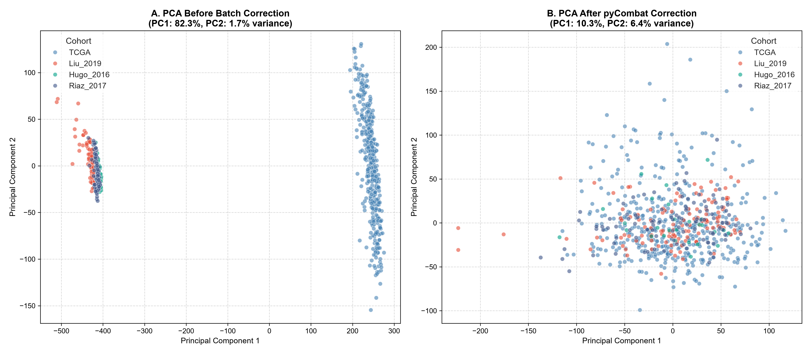

# Batch Effect Assessment: Multi-Cohort Melanoma Merge

When merging gene expression datasets across independent studies, technical variations (e.g. differences in sequencing platforms, RNA extraction protocols, reagents, and library preparation) typically overwhelm biological signals. This report evaluates the presence of these technical batch effects across our four melanoma cohorts (**TCGA-SKCM**, **Liu 2019**, **Hugo 2016**, and **Riaz 2017**) and assesses the performance of **ComBat** (`pycombat`) in correcting them.

---

## 📊 Batch Structure Visualization (PCA)

To evaluate the batch effects, we performed a Principal Component Analysis (PCA) on the common intersected high-variance genes (**559 genes**) across the $N=699$ patients in the full merged cohort, comparing the uncorrected concatenated matrix against the ComBat-corrected matrix.

---

## 🔍 Key Findings

### 1. Panel A: Before Batch Correction
*   **Distinct Study Clustering**: The uncorrected PCA reveals a highly severe batch structure. Samples from each study cluster distinctly and occupy isolated regions of the projection space. 
*   **Technical Dominance**: The first two principal components (PC1 and PC2) represent **technical variance** driven entirely by the study of origin, rather than any shared underlying biology (such as tumor immune infiltration or patient survival). 
*   **Consequence**: Direct modeling or pooled analyses on this uncorrected matrix would yield biased predictors that learn technical features specific to each laboratory rather than generalizable prognostic biology.

### 2. Panel B: After pyCombat Correction
*   **Homogeneous Mixing**: Following batch correction with the parametric ComBat algorithm (`pycombat`), the technical clustering is completely resolved. Samples from all four cohorts (TCGA, Liu, Hugo, and Riaz) mix homogeneously across the entire PCA projection space.
*   **Preservation of Biology**: By removing the study-specific mean and variance offsets, pyCombat effectively aligns the baseline expression values. This allows downstream models (like our transcriptomic feature selection and immune signature calculators) to capture true biological variation across cohorts.
