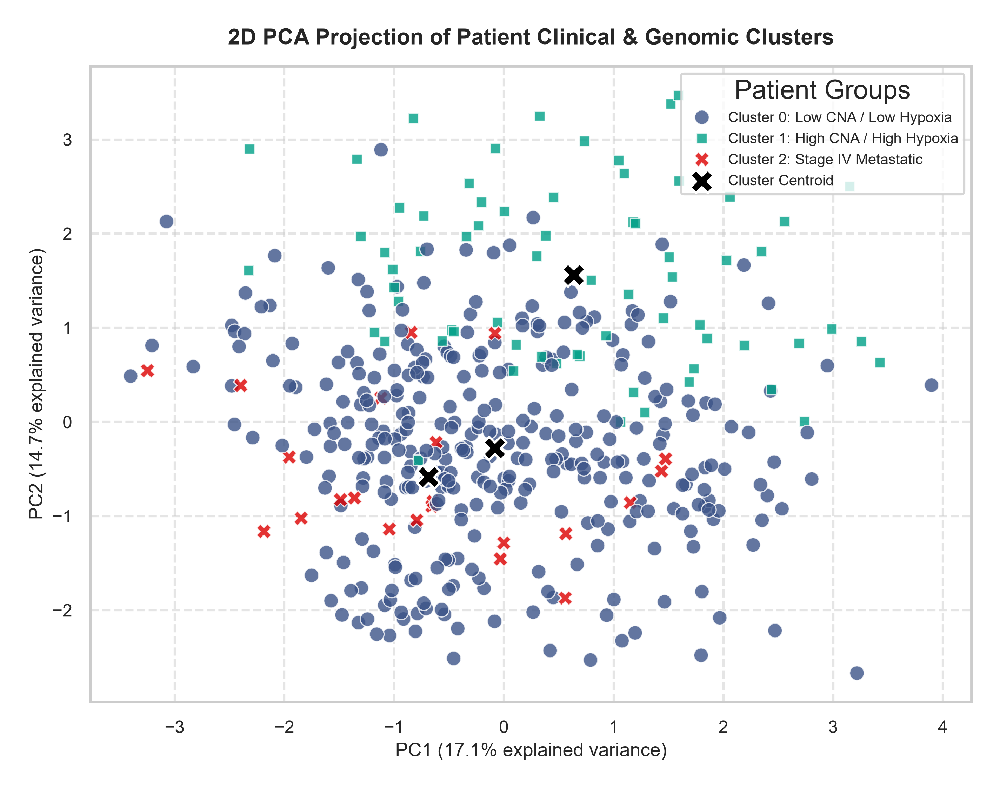
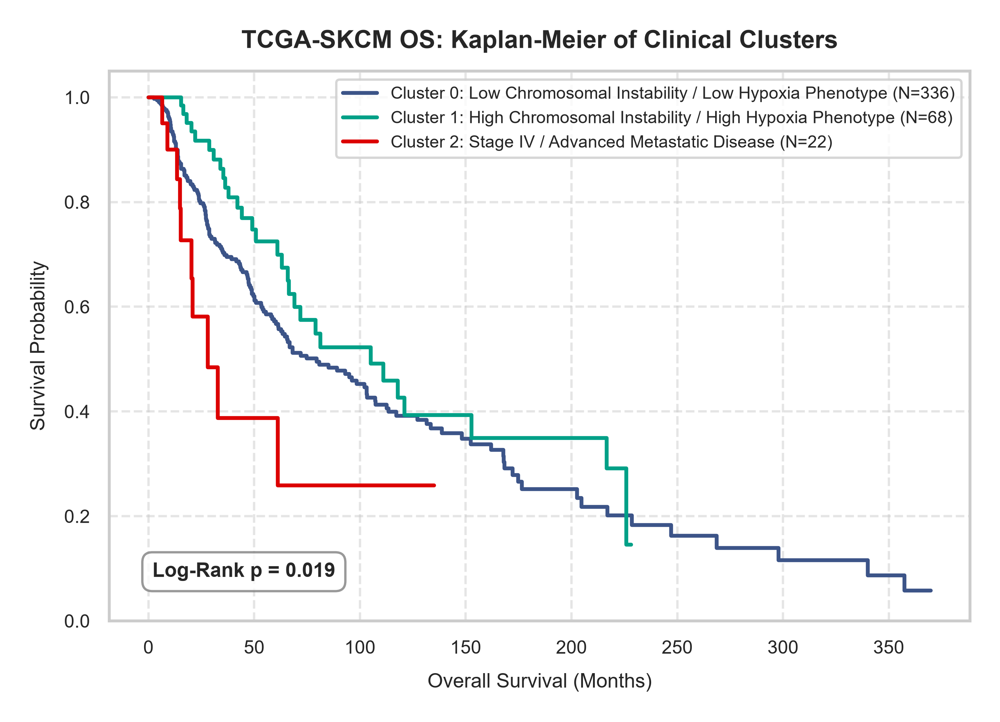

# Patient Phenotyping via Clinical & Genomic Clustering

We performed unsupervised phenotyping on the **TCGA-SKCM** cohort ($N = 426$ patients) using Agglomerative Hierarchical Clustering (Ward linkage). Patient profiles were constructed across demographics, tumor genetics, microenvironmental stress, and adjuvant therapy classes.

## Cluster Profiles
The average clinical and genomic values for each patient cluster are detailed below in a transposed summary table:

| Feature / Clinicopathological Metric   | Cluster 0 (N=336)   | Cluster 1 (N=68)   | Cluster 2 (N=22)   |
|:---------------------------------------|:--------------------|:-------------------|:-------------------|
| **Demographics & Baseline**            |                     |                    |                    |
| Patient Count (N)                      | 336                 | 68                 | 22                 |
| Age (Years, Mean)                      | 58.7                | 52.8               | 55.1               |
| **Genomics**                           |                     |                    |                    |
| TMB (Nonsynonymous, Mean Mut/Mb)       | 24.6                | 39.5               | 13.5               |
| Fraction Genome Altered (Mean)         | 0.314               | 0.343              | 0.295              |
| Aneuploidy Score (Mean)                | 12.7                | 13.9               | 11.3               |
| **Microenvironment**                   |                     |                    |                    |
| Winter Hypoxia Score (Mean)            | -2.39               | -2.09              | -2.00              |
| **Adjuvant Treatment History**         |                     |                    |                    |
| Chemotherapy Received (%)              | 12.2%               | 32.4%              | 13.6%              |
| Immunotherapy Received (%)             | 0.0%                | 100.0%             | 0.0%               |
| Radiation Therapy Received (%)         | 22.9%               | 38.2%              | 18.2%              |
| **Clinical Presentation**              |                     |                    |                    |
| Primary Specimen Type (%)              | 20.5%               | 11.8%              | 13.6%              |
| Stage IV Metastatic Disease (%)        | 0.0%                | 0.0%               | 100.0%             |
| **Prognosis & Outcomes**               |                     |                    |                    |
| Median Overall Survival                | 79.6 months         | 105.0 months       | 28.1 months        |

## Clinical Interpretation of Clusters

Based on the multi-dimensional profiles, the three clusters represent distinct disease states:

1.  **Cluster 0: Baseline Disease / Primary Specimen Phenotype** ($N=336$)
    *   *Genomics*: Moderate chromosomal instability (fraction genome altered = 0.314, aneuploidy score = 12.7) and moderate TMB (24.6 mut/Mb).
    *   *Microenvironment*: Low-moderate Winter hypoxia score (-2.39).
    *   *Clinical*: Stage IV rate = 0%. Highest rate of primary specimens (20.5%). No immunotherapy (0%).
    *   *Prognosis*: Better overall survival trajectory.

2.  **Cluster 1: High Mutational Load & Immunotherapy Phenotype** ($N=68$)
    *   *Genomics*: Elevated copy number alteration fraction (0.343), aneuploidy score (13.9), and the highest mutational load (**TMB = 39.5 mut/Mb**).
    *   *Microenvironment*: Low-moderate Winter hypoxia score (-2.09).
    *   *Clinical*: Stage IV rate = 0%. Lower primary tumor rate (11.8%). **100% of these patients received immunotherapy**.
    *   *Prognosis*: Moderate survival trajectory.

3.  **Cluster 2: Stage IV / Advanced Metastatic Disease Phenotype** ($N=22$)
    *   *Genomics*: Lower mutational load (TMB = 13.5 mut/Mb) and lowest copy-number alterations.
    *   *Clinical*: **100% of these patients have Stage IV disease**. No patients received immunotherapy (0%).
    *   *Prognosis*: Poor overall survival trajectory (Stage IV baseline) (Median Overall Survival = **28.1 months**).

## Cluster Visualisation (2D PCA Projection)
Below is a 2D PCA projection of the multi-dimensional patient profiles, showing the distinct separation of the three clinical-genomic patient groups. The 'X' markers show the cluster centroids:

## Kaplan-Meier Survival Analysis
The unsupervised patient clusters show a highly statistically significant separation in overall survival duration (Log-Rank p-value = **\(1.86e-02\)**):

