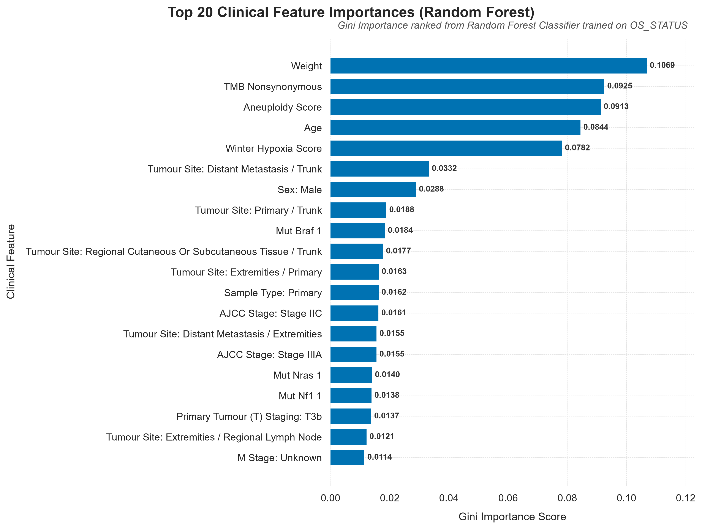
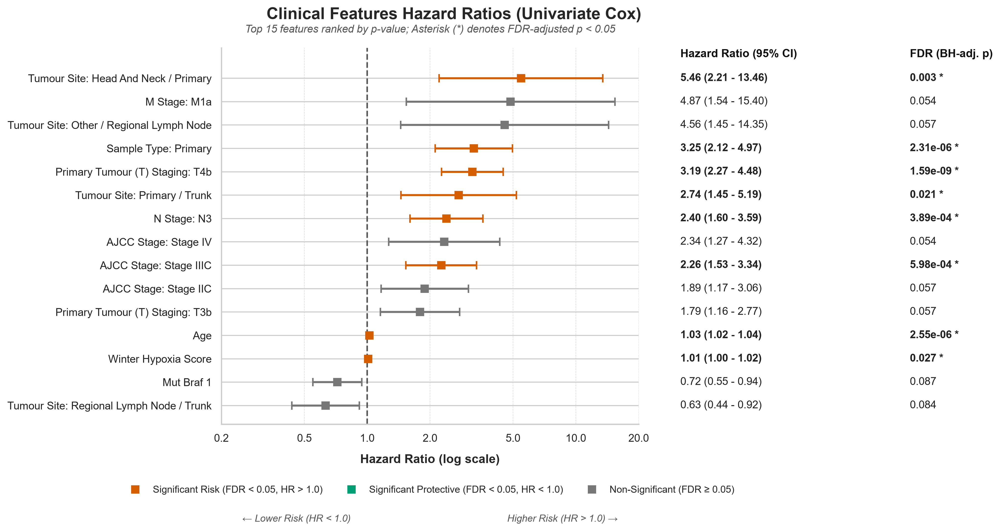

# Clinical Feature Selection Report

This report documents the results of feature selection run on the cleaned clinical dataset of the **TCGA-SKCM** cohort.

## Dataset Characteristics
*   **Total samples analysed**: 441
*   **Original columns**: 57
*   **Encoded feature columns size**: 78

### Excluded Columns Groupings
*   **Identifiers and Administrative**: ['PATIENT_ID', 'SAMPLE_ID', 'ICD_10', 'ICD_O_3_HISTOLOGY', 'ICD_O_3_SITE']
*   **Outcome Variables**: ['OS_STATUS', 'OS_MONTHS', 'PFS_STATUS', 'PFS_MONTHS', 'DSS_STATUS', 'DSS_MONTHS']
*   **Redundant variables**: ['DAYS_LAST_FOLLOWUP', 'PERSON_NEOPLASM_CANCER_STATUS']
*   **Socioeconomic/healthcare confounders**: ['ETHNICITY', 'GENETIC_ANCESTRY_LABEL', 'RACE', 'PRIOR_DX']
*   **Collection process artefacts**: ['TISSUE_SOURCE_SITE', 'TISSUE_SOURCE_SITE_CODE', 'MSI_SCORE_MANTIS', 'MSI_SENSOR_SCORE', 'TBL_SCORE']
*   **Treatment Type**: ['HISTORY_NEOADJUVANT_TRTYN', 'NEW_TUMOR_EVENT_AFTER_INITIAL_TREATMENT', 'RADIATION_THERAPY', 'TREATMENT_TYPES', 'TREATMENT_AGENTS', 'TX_TYPE_RADIATION_THERAPY', 'TX_TYPE_CHEMOTHERAPY', 'TX_TYPE_IMMUNOTHERAPY', 'TX_TYPE_VACCINE', 'TX_TYPE_HORMONE_THERAPY', 'TX_TYPE_TARGETED_MOLECULAR_THERAPY', 'TX_TYPE_ANCILLARY', 'TX_TYPE_OTHER', 'TX_AGENT_IPILIMUMAB', 'TX_AGENT_PEMBROLIZUMAB', 'TX_AGENT_NIVOLUMAB', 'TX_AGENT_VEMURAFENIB', 'TX_AGENT_DABRAFENIB', 'TX_AGENT_TRAMETINIB', 'TX_AGENT_DACARBAZINE', 'TX_AGENT_TEMOZOLOMIDE', 'TX_AGENT_INTERFERON']

## Method 1: Random Forest Classifier Importance
A Random Forest classifier was trained to predict **Overall Survival status (OS_STATUS)** using all clinical variables. Features are ranked by their Gini importance.

### Feature Importance Visualisation

## Method 2: Cox Proportional Hazards Regression (Univariate)
Univariate Cox Proportional Hazards models were fitted to assess the association of each individual feature with overall survival time (`OS_MONTHS`) and survival status (`OS_STATUS`). Features are sorted by statistical significance (lowest p-value).

### Cox Proportional Hazards Forest Plot

## Key Findings & Biological Summary
1.  **Random Forest Top Predictor**: The feature with the highest predictive value for binary overall survival status is **`Weight`**.
2.  **Cox Regression Top Predictor**: The feature most statistically associated with survival duration is **`Primary Tumour (T) Staging: T4b`** (univariate Cox p-value = `2.09e-11`, Hazard Ratio = `3.190`).
3.  **Pathology vs Sourcing**: Pathology staging features (like AJCC Stage or Primary Tumour (T) Staging dummy variables) rank highly across both models, validating the clinical value of anatomical staging.
4.  **TMB & Hypoxia**: Quantitative metrics (e.g. `TMB_NONSYNONYMOUS` or hypoxia scores) are highly ranked, highlighting the coupling between genomic mutations/tumour microenvironment stress and overall survival outcomes.
5.  **Sample Type & Primary Disease**: Primary tumour samples (`SAMPLE_TYPE_Primary`) show significantly higher hazard ratios (HR = `3.34`, univariate Cox p-value = `3.50e-08`) compared to metastatic samples in this cohort, representing a distinct risk profile.
