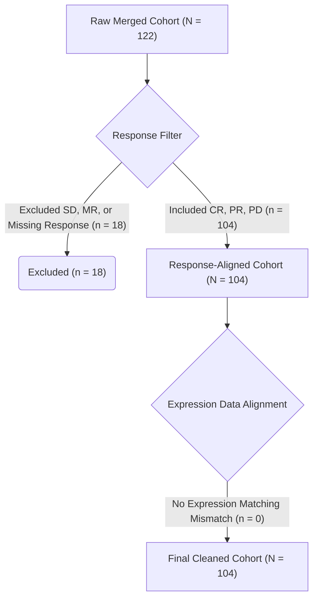
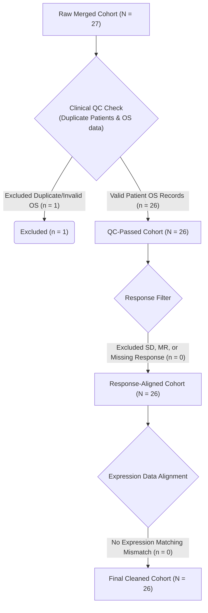
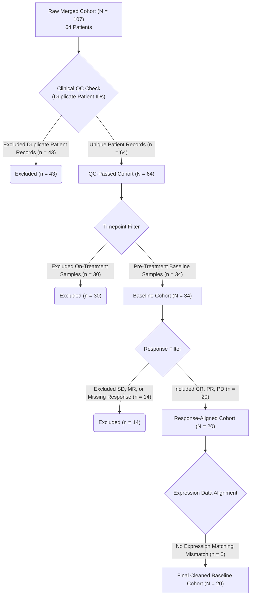
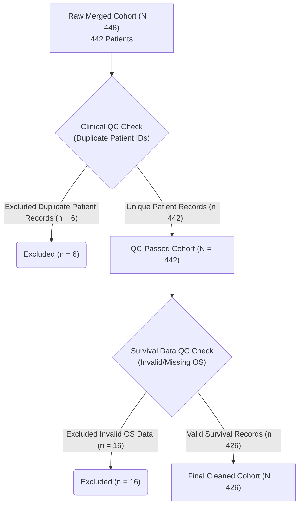

# Clinical Characteristics of Data Cohorts

This report provides a comparative summary of the patient demographic and clinicopathological features across the four cohorts analyzed in this study:
*   **TCGA-SKCM**: Baseline reference cohort with adjuvant systemic treatment annotations.
*   **Liu 2019**: Advanced melanoma trial of patients treated with anti-PD-1 monotherapy.
*   **Hugo 2016**: Anti-PD-1 clinical trial cohort.
*   **Riaz 2017**: Anti-PD-1 clinical trial cohort (nivolumab-treated).

## Summary Table

| Characteristic               | TCGA-SKCM    | Liu 2019     | Hugo 2016   | Riaz 2017   |
|:-----------------------------|:-------------|:-------------|:------------|:------------|
| Total cohort                 | 426          | 104          | 26          | 20          |
| Treatment received           |              |              |             |             |
| - Immunotherapy              | 68 (16.0%)   | 104 (100.0%) | 26 (100.0%) | 20 (100.0%) |
| - Chemotherapy               | 66 (15.5%)   | 0 (0.0%)     | 0 (0.0%)    | 0 (0.0%)    |
| - Targeted Therapy           | 12 (2.8%)    | 0 (0.0%)     | 12 (46.2%)  | 0 (0.0%)    |
| - Radiation Therapy          | 107 (25.1%)  | 0 (0.0%)     | 0 (0.0%)    | 0 (0.0%)    |
| Response Rate (RECIST CR/PR) | N/A          | 48 (46.2%)   | 13 (50.0%)  | 5 (25.0%)   |
| Age (Years, Mean ± SD)       | 57.5 ± 15.7  | N/A          | 59.3 ± 15.1 | 56.1 ± 11.0 |
| Gender (Male)                | 264 (62.0%)  | 61 (58.7%)   | 18 (69.2%)  | 9 (45.0%)   |
| Specimen Type (Primary)      | 77 (18.1%)   | 0 (0.0%)     | 0 (0.0%)    | 0 (0.0%)    |
| Survival Data Follow-up      | 426 (100.0%) | 104 (100.0%) | 26 (100.0%) | 20 (100.0%) |

## Key Observations
1.  **Cohort Size**: The TCGA-SKCM cohort is by far the largest ($N=426$), providing a strong baseline for mapping genetic and clinical features associated with overall survival. The clinical trial cohorts are smaller ($N=20$ to $N=104$), reflecting the typical sizes of single-agent immunotherapy clinical studies.
2.  **Survival Data**: High-quality overall survival follow-up is available for all four cohorts: **TCGA-SKCM** (100%), **Liu 2019** (100%), **Hugo 2016** (100%), and **Riaz 2017** (100%). This enables overall survival characterization across cohorts.
3.  **Treatment Context**: TCGA-SKCM contains baseline genomic profiling accompanied by detailed adjuvant systemic treatment histories (including chemotherapy, immunotherapy, targeted molecular therapies, and radiation therapy). In contrast, the clinical trial cohorts represent patients enrolled in specific active anti-PD-1 interventional trials where pre-treatment biopsies were matched to subsequent checkpoint inhibitor response.
4.  **Specimen Sites**: While TCGA-SKCM contains a mix of primary cutaneous melanomas (18.1%) and regional/distant metastases (81.9%), the clinical trial cohorts consist almost entirely of pre-treatment resections of metastatic lesions.

---

## Overall Survival Curves (KM Plots)

The unstratified Kaplan-Meier overall survival curves for each cohort are shown in the 2x2 grid below. The median overall survival is annotated for each cohort where reached.

---

## Patient Selection (CONSORT Flowcharts)

The flowcharts below document the cohort attrition and selection process from raw downloads to final cleaned datasets:

### Liu 2019 Attrition Flowchart

### Hugo 2016 Attrition Flowchart

### Riaz 2017 Attrition Flowchart

### TCGA-SKCM Attrition Flowchart
