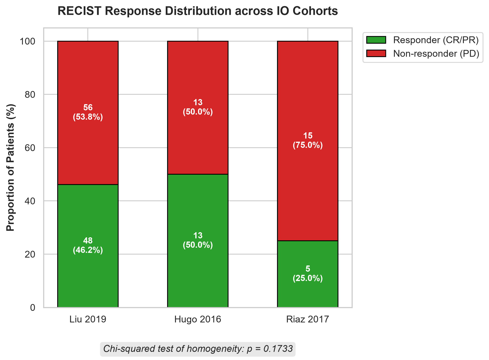
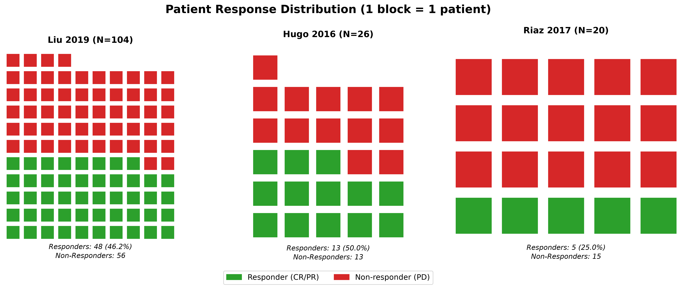
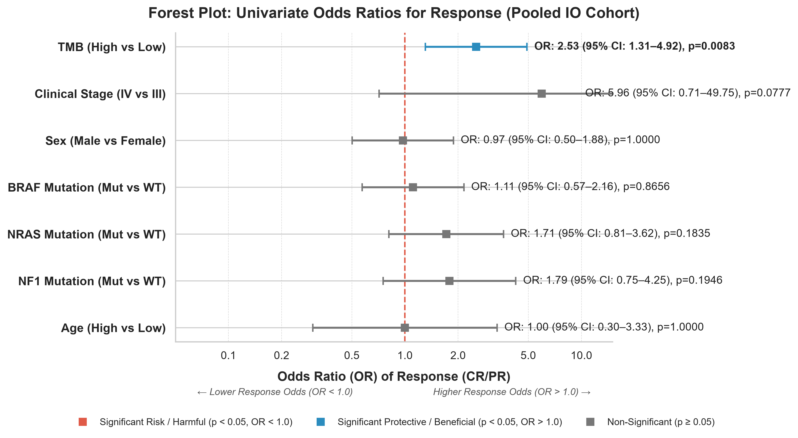
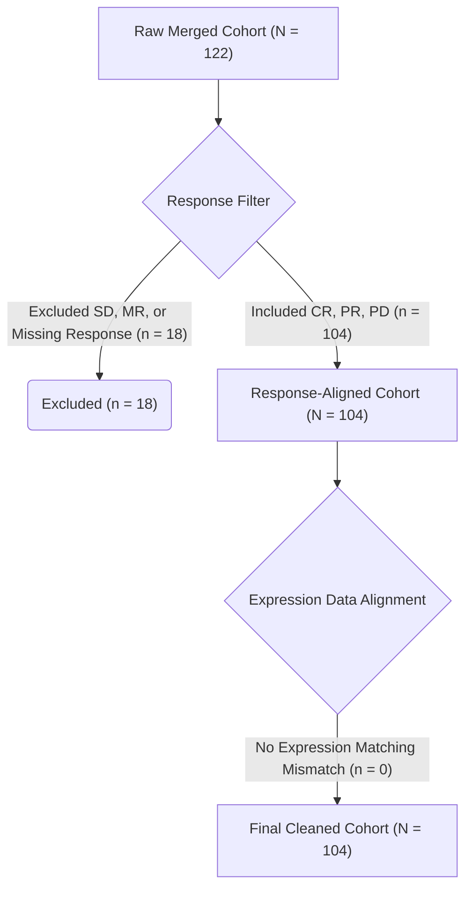
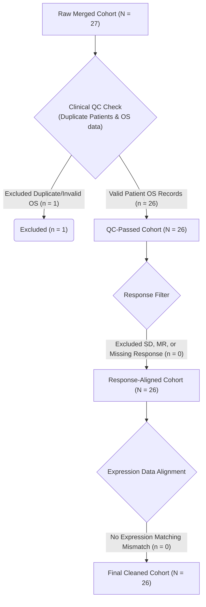
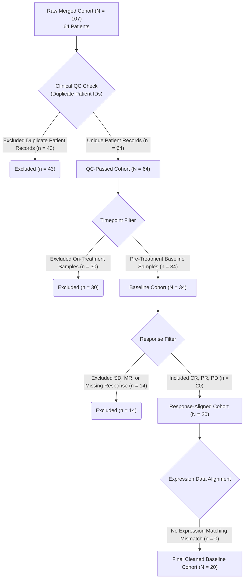
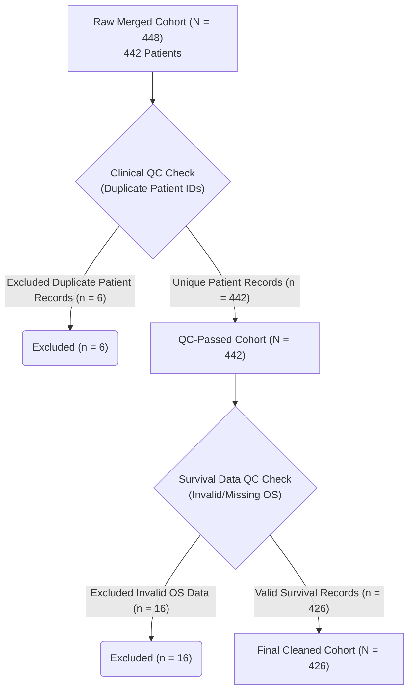

# Clinical Characteristics of Data Cohorts

This report provides a comparative summary of the patient demographic and clinicopathological features across the four cohorts analyzed in this study:
*   **TCGA-SKCM**: Baseline reference cohort with adjuvant systemic treatment annotations.
*   **Liu 2019**: Advanced melanoma trial of patients treated with anti-PD-1 monotherapy.
*   **Hugo 2016**: Anti-PD-1 clinical trial cohort.
*   **Riaz 2017**: Anti-PD-1 clinical trial cohort (nivolumab-treated).

## Table 1: Baseline Patient and Disease Characteristics

| Characteristic | Liu 2019 | Hugo 2016 | Riaz 2017 | TCGA-SKCM |
|:---|:---|:---|:---|:---|
| **N** | 104 | 26 | 20 | 426 |
| | | | | |
| **Demographics** | | | | |
| Age, median (IQR) | N/A | 60.5 (53.5–67.5) | 53.0 (48.2–61.0)^a^ | 58.0 (47.0–70.0) |
| Sex — Male | 61 (58.7%) | 18 (69.2%) | 9 (45.0%)^b^ | 264 (62.0%) |
| Sex — Female | 43 (41.3%) | 8 (30.8%) | 9 (45.0%)^b^ | 162 (38.0%) |
| Race — White | N/A | N/A | 18 (90.0%) | 408 (95.8%) |
| | | | | |
| **Disease Stage** | | | | |
| Stage III | 6 (5.8%) | 1 (3.8%) | 1 (5.0%)^c^ | 166 (39.0%)^d^ |
| Stage IV | 98 (94.2%) | 25 (96.2%) | 14 (70.0%)^c^ | 22 (5.2%)^d^ |
| Stage I/II | — | — | — | 194 (45.5%)^d^ |
| | | | | |
| **Specimen** | | | | |
| Metastatic site | 98 (94.2%)^e^ | 26 (100%) | 20 (100%) | 349 (81.9%) |
| Primary site | — | — | — | 77 (18.1%) |
| | | | | |
| **Treatment** | | | | |
| ICI agent — Pembrolizumab | 57 (54.8%) | 26 (100%) | — | N/A^f^ |
| ICI agent — Nivolumab | 47 (45.2%) | — | 20 (100%) | N/A^f^ |
| Prior anti-CTLA-4 | 40 (38.5%) | N/A | 9 (45.0%) | N/A^f^ |
| | | | | |
| **RECIST Response** | | | | |
| Responder (CR/PR) | 48 (46.2%) | 13 (50.0%) | 5 (25.0%) | N/A |
| Non-responder (PD) | 56 (53.8%) | 13 (50.0%) | 15 (75.0%) | N/A |
| | | | | |
| **Survival Outcomes** | | | | |
| Median OS, months (95% CI) | 22.4 (14.2–NR) | 32.2 (11.1–NR) | 17.8 (5.5–27.5) | 79.0 (64.4–103.2) |
| OS events, n (%) | 54 (51.9%) | 12 (46.2%) | 14 (70.0%) | 211 (49.5%) |
| Median follow-up, months | 17.0 | 14.4 | 13.4 | 41.6 |
| Median PFS, months (95% CI) | 3.3 (2.9–7.9) | N/A | N/A | 36.3 (29.9–43.8)^g^ |
| PFS events, n (%) | 74 (71.2%) | N/A | N/A | 297 (70.5%)^g^ |

^a^ Age available for 18/20 patients. ^b^ Sex available for 18/20 patients. ^c^ Stage available for 15/20 patients. ^d^ TCGA uses AJCC pathologic stage; stages I–IIIA grouped as I/II, stages IIIB–IIIC grouped as III. ^e^ Specimen type available for 98/104 patients. ^f^ TCGA-SKCM is not an ICI trial cohort; treatment history (immunotherapy, chemotherapy, radiation, targeted therapy) is from adjuvant/post-diagnosis records. ^g^ PFS in TCGA-SKCM refers to progression-free interval, not treatment-specific PFS. NR = not reached.

## Key Observations

1.  **Cohort Size and Context**: The TCGA-SKCM cohort is the largest ($N=426$) and serves as a genomic reference population with detailed adjuvant treatment histories. The three IO cohorts ($N=20$–$104$) are anti-PD-1 clinical trial cohorts where pre-treatment biopsies are matched to subsequent RECIST response.
2.  **Response Rates**: Response rates vary substantially: 46.2% (Liu), 50.0% (Hugo), and 25.0% (Riaz). The lower rate in Riaz is consistent with a higher proportion of ipilimumab-pretreated patients (45.0%) and reflects the more refractory population enrolled in the CA209-038 study.
3.  **Survival**: Median OS ranges from 17.8 months (Riaz) to 79.0 months (TCGA-SKCM). The longer TCGA survival reflects a mixed-stage, non-trial population with longer follow-up (median 41.6 months). Median OS was not reached in Liu or Hugo, consistent with the survival benefit of anti-PD-1 therapy in responding patients.
4.  **Missing Data**: Age is unavailable for the Liu 2019 cohort. Sex, age, and stage are each missing for 2–5 patients in the Riaz cohort. LDH, ECOG performance status, and PD-L1 expression — standard clinical predictors in ICI trials — are not available in any of the cBioPortal downloads and represent a limitation of this dataset.
5.  **Specimen Sites**: While TCGA-SKCM contains a mix of primary cutaneous melanomas (18.1%) and metastases (81.9%), the IO cohorts consist almost entirely of metastatic biopsies, consistent with advanced-stage trial enrolment.

---

## RECIST Response Distribution

The RECIST response distribution (Responder: CR/PR vs. Non-Responder: PD) across the three immunotherapy-treated cohorts (Liu, Hugo, and Riaz) is shown below. A Chi-squared test of homogeneity was performed to assess whether response rates differ significantly across the trials.

<table>
  <tr>
    <td width="50%">
      
<b>Stacked Bar Chart (Proportions)</b>

      
    </td>
    <td width="50%">
      
<b>Waffle Chart (Patient Counts)</b>

      
    </td>
  </tr>
</table>

### Statistical Summary
*   **Liu 2019**: Response rate of 46.2% ($n=48$ Responders, $n=56$ Non-Responders, $N=104$)
*   **Hugo 2016**: Response rate of 50.0% ($n=13$ Responders, $n=13$ Non-Responders, $N=26$)
*   **Riaz 2017**: Response rate of 25.0% ($n=5$ Responders, $n=15$ Non-Responders, $N=20$)
*   **Homogeneity Test**: The difference in response rates across the cohorts is not statistically significant (Chi-squared $p = 0.1733$), justifying their combination for joint or multi-cohort machine learning analysis. However, the lower response rate in the Riaz cohort should be noted as a potential source of heterogeneity.

---

## Overall Survival Curves (KM Plots)

The unstratified Kaplan-Meier overall survival curves for each cohort are shown in the 2x2 grid below. The median overall survival is annotated for each cohort where reached.

---

## Overall Survival by Response Status (KM Plots)

To validate the clinical relevance of the response classifications, Overall Survival (OS) was stratified by RECIST response status (Responder: CR/PR vs. Non-responder: PD) for the three clinical trial cohorts. 

### Key Findings
*   **Liu 2019**: Highly statistically significant survival separation ($p < 0.0001$). Responders demonstrate a dramatically extended OS, while non-responders have a median OS of approximately 10 months.
*   **Hugo 2016**: Significant survival advantage for responders ($p = 0.0001$). Responders show long-term survival, whereas non-responders experience rapid decline (median survival around 11 months).
*   **Riaz 2017**: Significant survival benefit for responders ($p = 0.0053$). Responders exhibit prolonged OS despite the relatively small cohort size and advanced treatment history (45% prior CTLA-4).
*   **Conclusion**: Clinical response to immunotherapy is a robust surrogate endpoint for overall survival in metastatic melanoma. Patients who achieve complete or partial response (CR/PR) experience a massive, durable survival benefit compared to those with progressive disease (PD).

---

## Univariate Associations with Response (Forest Plot)

To evaluate whether individual features predict response to anti-PD-1 therapy, univariate Odds Ratios (OR) and 95% Confidence Intervals (CI) were calculated for the pooled immunotherapy trial cohort ($N=150$). Continuous variables (TMB and Age) were dichotomized based on their cohort-specific medians (TMB median = 10.68 mut/Mb; Age median = 60.5 years).

### Key Takeaways
1.  **TMB is a Strong and Significant Predictor**: Patients with high TMB are **2.53 times more likely to respond** to anti-PD-1 immunotherapy compared to those with low TMB. This association is highly statistically significant ($p = 0.0083$) and represents the strongest univariate predictor in our clinical dataset.
2.  **Anatomical Stage Trend**: Clinical Stage IV was associated with an OR of 5.96 relative to Stage III, but this did not cross the threshold of statistical significance ($p = 0.0777$), due to a very wide confidence interval reflecting a small number of Stage III patients in the trial cohorts ($n=8$, with only $1$ responder).
3.  **Driver Mutations Lack Predictive Power**: While *NRAS* (OR = 1.71) and *NF1* (OR = 1.79) mutated tumors trend toward slightly higher response odds, neither is statistically significant. *BRAF* mutations (OR = 1.11, $p = 0.8656$) have virtually no association with response, confirming that driver mutation status does not determine clinical benefit from anti-PD-1 checkpoint inhibitors.
4.  **Demographics Have No Effect**: Age and Sex are completely unassociated with response (OR $\approx$ 1.00), demonstrating that demographics do not influence immunotherapy success in this population.

---

## Patient Selection (CONSORT Flowcharts)

The flowcharts below document the cohort attrition and selection process from raw downloads to final cleaned datasets:

### Liu 2019 Attrition Flowchart

### Hugo 2016 Attrition Flowchart

### Riaz 2017 Attrition Flowchart

### TCGA-SKCM Attrition Flowchart
