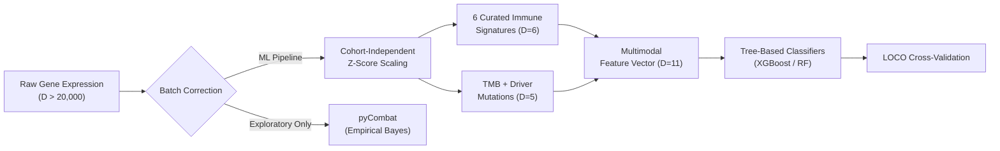

# Executive Summary: Melanoma Immunotherapy Response Predictor

## Objective

Predict binary immunotherapy response (CR/PR vs. PD) in cutaneous melanoma patients treated with anti-PD-1 checkpoint inhibitors, using a multimodal feature set derived from clinical, genomic, and transcriptomic data across three independent clinical trial cohorts and one large-scale reference dataset.

---

## 1. Cohort Summary

### _Table 1: Study cohorts and their roles. Response rate differences across the three trial cohorts are not statistically significant ($\chi^2\ p = 0.0886$), justifying their pooling for joint analysis._

| Cohort        | N   | Treatment                 | Response Rate       | Role in Pipeline                          |
|:------------- |:--- |:------------------------- |:------------------- |:----------------------------------------- |
| **Liu 2019**  | 122 | Pembrolizumab / Nivolumab | 46.2%               | Training / LOCO test fold                 |
| **Hugo 2016** | 27  | Pembrolizumab             | 51.9%               | Training / LOCO test fold                 |
| **Riaz 2017** | 107  | Nivolumab                 | 31.2%               | Training / LOCO test fold                 |
| **TCGA-SKCM** | 443 | Mixed (non-ICI reference) | N/A (survival only) | Signature derivation / clinical subtyping |

---

## 2. Overall Survival & Response Stratification

### Unstratified Overall Survival Across Cohorts

> [!NOTE]
> **Baseline Overall Survival Trajectories**:
> The unstratified Kaplan-Meier overall survival curves above illustrate baseline survival timelines across all four cohorts. **TCGA-SKCM** ($N = 443$) demonstrates the longest median follow-up duration (41.6 months), whereas clinical trial cohorts reflect advanced stage IV melanoma populations undergoing active checkpoint blockade therapy.

### Overall Survival Stratified by Immunotherapy Response

> [!IMPORTANT]
> **Prognostic Impact of RECIST Response**:
> Stratifying overall survival by objective RECIST response status (**Responder** [CR/PR] vs **Non-responder** [PD]) confirms that clinical response to anti-PD-1 therapy is a extraordinarily strong surrogate endpoint for long-term overall survival:
> * **Liu 2019 ($N = 122$)**: Log-rank $p < 0.0001$. Non-responders exhibit steep early mortality (median OS ~10.5 months), whereas >70% of responders remain alive beyond 50 months of follow-up.
> * **Hugo 2016 ($N = 27$)**: Log-rank $p < 0.0001$. Responders show sustained survival extension over non-responders.
> * **Riaz 2017 ($N = 107$)**: Log-rank $p < 0.0001$. Profound separation confirming durable survival benefit among anti-PD-1 responders.

---

## 3. Co-Mutation & Clinical Landscape

> [!NOTE]
> **Integrated Multi-Cohort Somatic Landscape ($N = 256$)**:
> The co-mutation landscape (oncoplot) above aligns individual patient somatic mutation profiles in core melanoma driver and resistance genes (rows) with patient-level clinical annotations (Tumour Mutational Burden, RECIST Response, Cohort source, and Sex).
>
> * **MAPK Driver Mutual Exclusivity**: High mutual exclusivity is observed between primary drivers `BRAF` (43.1%) and `NRAS` (24.6%), representing distinct, non-overlapping mechanisms of RAS-RAF-MEK-ERK activation.
> * **Driver Subtype Response Equivalence**: Responders (green) and non-responders (vermillion) are evenly distributed across `BRAF`, `NRAS`, `NRAS`, and Triple-WT subtypes, visually demonstrating that driver mutation status alone does not dictate response to anti-PD-1 therapy.
> * **Targeted Resistance Genes**: Baseline mutations in primary resistance machinery (*B2M*, *JAK1*, *JAK2*) are rare (<5%) in pre-treatment biopsies, indicating that genetic disruption of antigen presentation and interferon signaling is predominantly an acquired rather than primary resistance mechanism.

---

## 4. Batch Effect Evaluation & Correction

> [!IMPORTANT]  
> **Imperative for Batch Effect Evaluation & Correction**:  
> Panel A demonstrates why raw transcriptomic datasets from different clinical trials cannot simply be merged without prior batch effect evaluation and correction. In the uncorrected principal component space (PC1: 22.9%, PC2: 13.2%), samples cluster strictly by study cohort of origin (TCGA-SKCM vs. Liu 2019, Hugo 2016, Riaz 2017) rather than biological phenotype or clinical response status. These technical batch effects stem from systemic differences in sequencing platforms, library preparation protocols, and capture kits. Training predictive models directly on uncorrected multi-cohort data causes classifiers to learn study-specific technical noise, leading to catastrophic failure when evaluated on independent patient cohorts.  
>  
> Panel B confirms that cohort-independent Z-score standardisation successfully removes these baseline technical offsets (PC1: 15.4%, PC2: 7.2%), intermixing the cohorts in reduced-dimensional space while preserving genuine biological variance required for cross-cohort response prediction.

---

## 5. Key Findings

### 1. Biological Constraint is Essential for Cross-Study Generalisation

The single most important finding of this pipeline is that **biologically curated features generalise across cohorts, while unconstrained data-driven features do not.**

Unconstrained univariate feature selection (`SelectKBest`) occasionally produced higher raw AUC values in individual LOCO folds, but the genes it selected were biologically irrelevant: neuronal markers (`TFAP2B`, `CNTNAP5`, `GRIA4`), metabolic enzymes (`CYP4F11`), and developmental transcription factors (`PAX6`). These gene sets were completely unstable across folds and showed **zero overlap** with the Top 20 prognostic genes from the independent TCGA-SKCM survival analysis, which are exclusively protective immune markers (GBP family GTPases, chemokines, NK/T-cell receptors).

By contrast, the 6 curated immune signatures (IFN-$\gamma$, TIS, CYT, IMPRES, CD8 T-cell, TCGA 20-gene OS score) are grounded in known anti-tumour immune biology and remain stable regardless of which cohort is held out.

### 2. TMB and Immune Signatures are Orthogonal Biomarkers

Tumour Mutational Burden and transcriptomic immune signatures are essentially uncorrelated (Spearman $r \approx -0.09$ to $0.16$). A tumour can be high-TMB but immunologically cold, or low-TMB but inflamed. This validates the multimodal model design: combining both feature types captures independent biological axes of treatment response.

### 3. Tree-Based Models Outperform Linear Models on Multimodal Features

#### _Table 2: Model performance under pooled cross-validation and strict Leave-One-Cohort-Out (LOCO) validation. Tree-based models benefit from multimodal feature integration; linear models degrade with additional features._

| Model               | Pooled 5-Fold CV AUC | Best LOCO AUC (Cohort) |
|:------------------- |:-------------------- |:---------------------- |
| **XGBoost** | **0.724 ± 0.089** | 0.618 (Riaz 2017) |
| **Random Forest** | **0.710 ± 0.94** | 0.678 (Riaz 2017) |
| **SVM** | — | **0.717** (Riaz 2017) |
| **Logistic Regression** | 0.615 | 0.609 (Liu 2019) |
| **Elastic Net** | — | 0.616 (Liu 2019) |

> [!important] Performance Gap Between Pooled CV and LOCO  
> Pooled 5-fold CV estimates (~0.70–0.72 AUC) substantially overestimate out-of-cohort performance. Strict LOCO validation, where an entire cohort is held out, yields AUCs in the 0.55–0.72 range, reflecting the true difficulty of cross-study generalisation with small clinical trial datasets ($N \approx 27$–$122$).

### 4. Hugo 2016 is an Unreliable Validation Fold

Hugo 2016 ($N = 27$) is consistently the most difficult held-out cohort, with all model AUCs $\leq 0.434$ in LOCO. This is a statistical power artefact: with only 13 non-responders and 14 responders, any model evaluation is dominated by sampling noise. Results on Hugo should be interpreted with extreme caution.

### 5. TCGA Survival Signature Transfers Modestly to Response Prediction

The custom 20-gene overall survival signature derived from TCGA-SKCM ($N = 443$) strongly stratifies baseline survival (Log-Rank $p = 4.89 \times 10^{-8}$), but its transfer to immunotherapy response prediction via direct Cox risk-score projection is modest (AUC = 0.55–0.65). This confirms that overall survival and treatment response, while related, are partially distinct biological endpoints.

---

## 6. Pipeline Architecture Decisions

### _Table 3: Key pipeline architecture decisions and their justifications._

| Decision | Choice | Rationale |
|:---|:---|:---|
| **Batch correction** | Cohort-independent Z-score scaling | Prevents cross-validation data leakage (ComBat requires access to all cohorts simultaneously) |
| **Transcriptomic features** | 6 curated immune signatures | Biologically interpretable, stable across folds, grounded in known ICI biology |
| **Genomic features** | TMB + 3 driver mutations (BRAF, NRAS, NF1) | Orthogonal to transcriptomic signatures; TMB is predictive of response but not prognostic of baseline survival |
| **Feature selection** | Curated signatures over SelectKBest | Data-driven selection captures cohort-specific noise, not transferable immune biology |
| **Validation strategy** | Report both pooled CV and LOCO | LOCO is the primary evidence layer; pooled CV provides complementary upper-bound estimates |

---

## 7. Known Limitations

1. **Cross-study generalisation remains modest**: LOCO AUCs are typically 0.55–0.68, reflecting fundamental challenges in small-cohort melanoma immunotherapy prediction.
2. **Missing clinical predictors**: LDH, ECOG performance status, and PD-L1 IHC scores are unavailable in the cBioPortal downloads but are standard clinical predictors in ICI trials.
