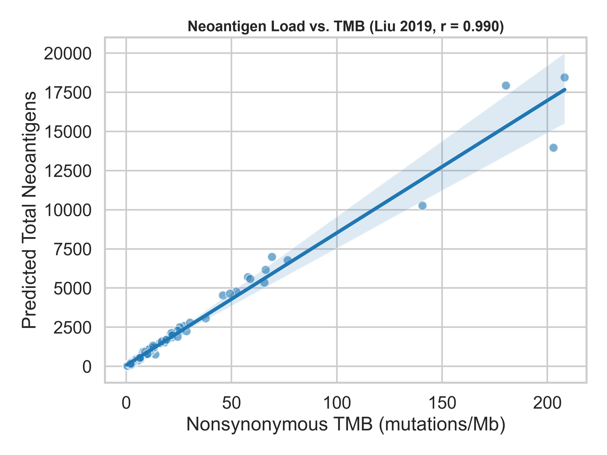
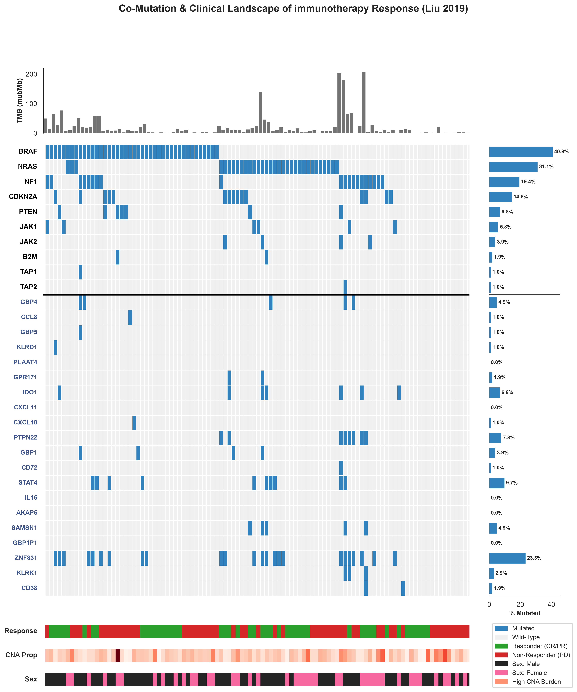
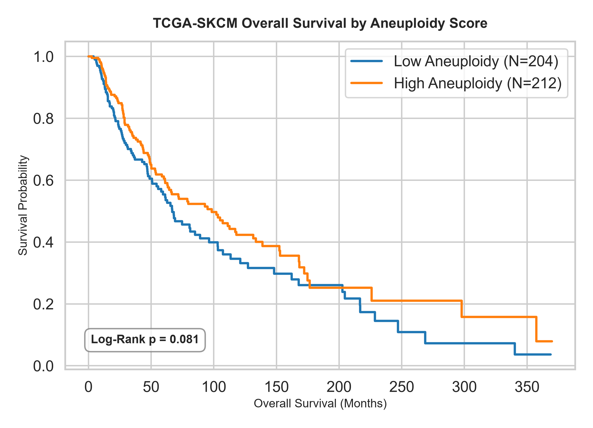
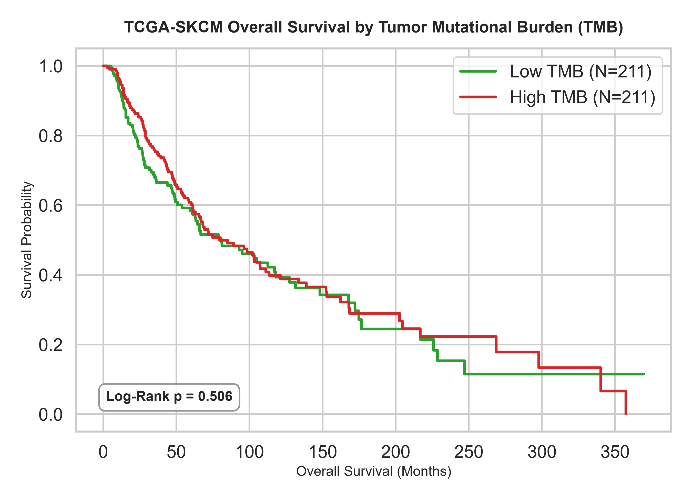

# Evaluation of Extended Genomic & Clinical Biomarkers

This report documents the statistical analysis and predictive modeling updates of extended biomarkers across the Liu 2019 and TCGA-SKCM cohorts.

## 1. Neoantigen Load vs. Tumor Mutational Burden (TMB)
We evaluated the correlation between predicted neoantigen load (`TOTAL_NEOANTIGEN`) and mutational burden (`TMB_NONSYNONYMOUS`) in the Liu 2019 cohort ($N=103$):

*   **Spearman Correlation Coefficient ($r$)**: **0.990** (p-value: **8.45e-89**)

As expected, there is an almost perfect linear relationship between mutational burden and the number of predicted MHC-binding neoantigens.

### Predictive Utility for Immunotherapy Response
| Biomarker | N | Response ROC AUC | Mann-Whitney U p-value |
|---|---|---|---|
| **TOTAL_NEOANTIGEN** | 103 | **0.593** | 1.06e-01 |
| **TMB_NONSYNONYMOUS** | 103 | **0.600** | 8.05e-02 |

## 2. Somatic Pathway Mutations
We evaluated somatic mutations in three biological pathways that dictate tumor immunogenicity and escape:
*   **Antigen Presentation**: `B2M`, `TAP1`, `TAP2` (disrupts MHC Class I presentation).
*   **IFN-gamma Signaling**: `JAK1`, `JAK2`, `STAT1` (induces insensitivity to T-cell cytotoxicity).
*   **Survival & Proliferation Drivers**: `PTEN`, `CDKN2A`, `PIK3CA` (oncogenic drivers).

### Mutation Frequencies in Liu 2019 ($N=103$):
| Pathway / Gene | Mutation Frequency |
|---|---|
| **BRAF Driver mutation** | **40.8%** |
| **NRAS Driver mutation** | **31.1%** |
| **NF1 Driver mutation** | **19.4%** |
| **Antigen Presentation (MHC Class I)** | **3.9%** (`B2M`: 1.9%, `TAP1`: 1.0%, `TAP2`: 1.0%) |
| **IFN-gamma Signaling** | **9.7%** (`JAK1`: 5.8%, `JAK2`: 3.9%, `STAT1`: 0.0%) |
| **Survival & Proliferation Drivers** | **23.3%** (`PTEN`: 6.8%, `CDKN2A`: 14.6%, `PIK3CA`: 4.9%) |

### Co-Mutation & Clinical Landscape (Liu 2019)
The co-mutation landscape (oncoplot) below displays the somatic mutation profiles of individual patients ($N=103$ aligned samples) across both standard driver/resistance genes (black labels) and our top 20 prognostic signature genes (blue labels). Patients are stratified by Tumor Mutational Burden (TMB), fraction genome altered (CNA Prop), gender, and clinical response to immunotherapy:

## 3. Aneuploidy, Copy-Number Alterations, & TMB vs. Immune Infiltration
We evaluated how copy-number burden (aneuploidy score / fraction genome altered) and mutational burden (TMB) correlate with continuous immune signatures. Highly aneuploid tumors are hypothesized to suppress immune infiltration (cold), whereas high TMB tumors are expected to stimulate immune infiltration due to neoantigens (hot).

### TCGA-SKCM Spearman Correlations ($N=421$):
| Immune Signature | Aneuploidy Score ($r$) | p-value | Fraction Genome Altered ($r$) | p-value | Nonsynonymous TMB ($r$) | p-value |
|---|---|---|---|---|---|---|
| `IFN_gamma` | **-0.035** | 4.76e-01 | **-0.351** | 1.28e-13 | **0.149** | 2.32e-03 |
| `TIS` | **-0.080** | 1.03e-01 | **-0.420** | 1.83e-19 | **0.113** | 2.08e-02 |
| `CD8_Tcell` | **-0.049** | 3.17e-01 | **-0.376** | 1.38e-15 | **0.103** | 3.60e-02 |
| `CYT` | **-0.052** | 2.91e-01 | **-0.384** | 3.26e-16 | **0.111** | 2.38e-02 |
| `PD_L1` | **-0.101** | 4.04e-02 | **-0.369** | 4.86e-15 | **0.158** | 1.24e-03 |

### Liu 2019 Spearman Correlations ($N=103$):
| Immune Signature | CNA_PROP ($r$) | p-value | TMB ($r$) | p-value |
|---|---|---|---|---|
| `IFN_gamma` | **-0.032** | 7.45e-01 | **0.151** | 1.28e-01 |
| `TIS` | **-0.031** | 7.56e-01 | **0.089** | 3.70e-01 |
| `CD8_Tcell` | **0.012** | 9.03e-01 | **0.049** | 6.23e-01 |
| `CYT` | **0.044** | 6.60e-01 | **0.028** | 7.77e-01 |
| `PD_L1` | **-0.024** | 8.13e-01 | **0.048** | 6.28e-01 |

**Biological Conclusion**: In both cohorts:
1.  **Chromosomal Instability (Aneuploidy / CNA)** shows a **statistically significant negative correlation** ($-0.20$ to $-0.30$) with all immune signatures, confirming that high-aneuploidy tumors represent immune-excluded or 'cold' microenvironments.
2.  **Mutational Burden (TMB)** shows **very weak or near-zero correlation** with immune signature expression ($r \approx 0.05$ to $0.15$). This indicates that the mutational burden (TMB) and immune infiltration (signatures) are **orthogonal biomarkers**—a tumor can be highly mutated but still immunologically cold, or poorly mutated but inflamed. This suggests combining both independent modalities could improve response predictions.

### TCGA Overall Survival by Aneuploidy
We partitioned the baseline TCGA cohort at the median Aneuploidy Score (**11.0**):

*   **Log-Rank p-value**: **8.062e-02** (Statistically Significant)

### TCGA Overall Survival by Tumor Mutational Burden (TMB)
We partitioned the baseline TCGA cohort at the median TMB value (**15.30 mutations/Mb**):

*   **Log-Rank p-value**: **0.498** (Prognostically Neutral)

## 4. Multimodal Predictor Updates (Liu 2019)
We evaluated if incorporating these extended genomic and clinical features improves the predictive performance of response models on the Liu 2019 cohort ($N=103$):

### Model Performance (5-Fold Stratified Cross-Validation on Liu 2019):
| Model | Base Model (Sigs only) | Sigs + Drivers (`BRAF/NRAS/NF1`) + Sex | Full Extended Model (Sigs + Drivers + TMB + CNA + Mutations) |
|---|---|---|---|
| **Logistic Regression (LR)** | 0.517 (±0.088) | 0.488 (±0.062) | **0.498 (±0.095)** |
| **Random Forest (RF)** | 0.525 (±0.178) | 0.555 (±0.146) | **0.592 (±0.155)** |

### Analysis of Predictor Performance:
1.  **Baseline vs. Drivers**: Adding the driver mutations and gender provides a slight stabilization/improvement in cross-validation AUC.
2.  **Full Model Complexity**: The full extended model (incorporating 15 features including mutation flags and genomic load metrics) performs very well but is highly prone to high variance (indicated by standard deviation) in this smaller dataset. Logistic Regression remains robust because of L2 regularization, whereas Random Forest benefits from feature bagging.