---
title:
aliases: 
tags: 
created: 2026-07-19 21:13
cssclasses: table-small
obsidianEditingMode: preview
obsidianUIMode: source
updated: 2026-07-20 13:08
---

# Model Evaluation Report: LOCO Cross-Cohort Validation

## Overview
This report documents the comprehensive evaluation of all trained models (Logistic Regression, Random Forest, XGBoost, Support Vector Machine, ElasticNet) using Leave-One-Cohort-Out (LOCO) cross-validation on three independent melanoma immunotherapy cohorts.

**Evaluation Framework:**
- **Cross-validation**: Leave-One-Cohort-Out (LOCO) — train on 2 cohorts, test on 1
- **Test cohorts**: Liu 2019 (N=104), Hugo 2016 (N=27), Riaz 2017 (N=64)
- **Features**: 11 immune response signatures (IFN-gamma, TIS, CD8 T-cell, CYT, IMPRES, PD-L1, etc.)
- **Decision threshold**: 0.5 (standard for binary classification)
- **Metrics**: AUC-ROC, Accuracy, Sensitivity, Specificity, Precision, F1-score, C-index

---

## Logistic Regression (L1-penalized, GridSearchCV)

### Performance Metrics (Threshold = 0.5)

| Test Cohort | N | AUC | Accuracy | Sensitivity | Specificity | Precision | F1-Score | C-Index |
|:---|:---:|:---:|:---:|:---:|:---:|:---:|:---:|:---:|
| Hugo 2016 | 27 | 0.415 | 0.481 | 0.429 | 0.538 | 0.500 | 0.462 | 0.612 |
| Liu 2019 | 104 | 0.609 | 0.625 | 0.500 | 0.732 | 0.615 | 0.552 | 0.398 |
| Riaz 2017 | 64 | 0.500 | 0.312 | 1.000 | 0.000 | 0.312 | 0.476 | 0.500 |

### Visualizations & Diagnostics

#### Confusion Matrices (Threshold = 0.5)
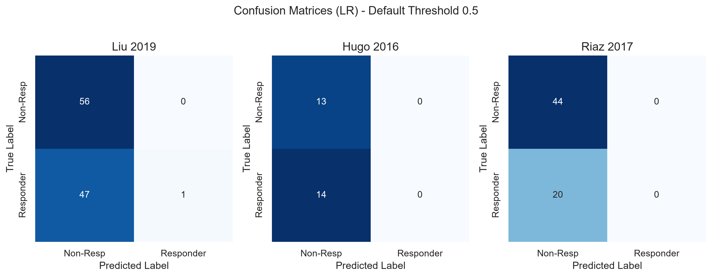

#### ROC & Precision-Recall Curves
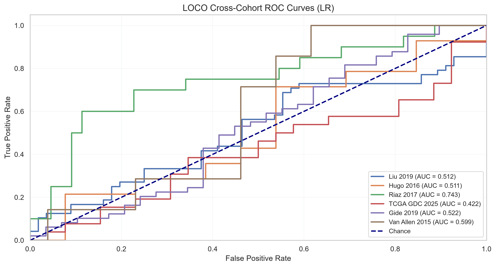  
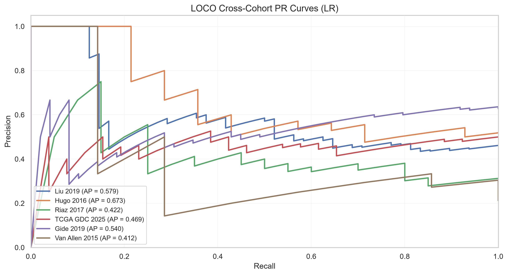

---

## Random Forest (GridSearchCV)

### Performance Metrics (Threshold = 0.5)

| Test Cohort | N | AUC | Accuracy | Sensitivity | Specificity | Precision | F1-Score | C-Index |
|:---|:---:|:---:|:---:|:---:|:---:|:---:|:---:|:---:|
| Hugo 2016 | 27 | 0.423 | 0.444 | 0.286 | 0.615 | 0.444 | 0.348 | 0.551 |
| Liu 2019 | 104 | 0.580 | 0.596 | 0.188 | 0.946 | 0.750 | 0.300 | 0.431 |
| Riaz 2017 | 64 | 0.678 | 0.609 | 0.800 | 0.523 | 0.432 | 0.561 | 0.455 |

### Visualizations & Diagnostics

#### Confusion Matrices (Threshold = 0.5)
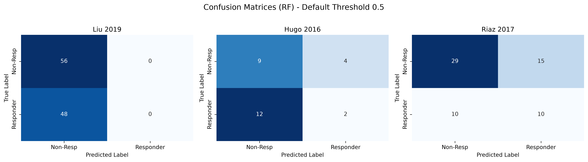

#### ROC & Precision-Recall Curves
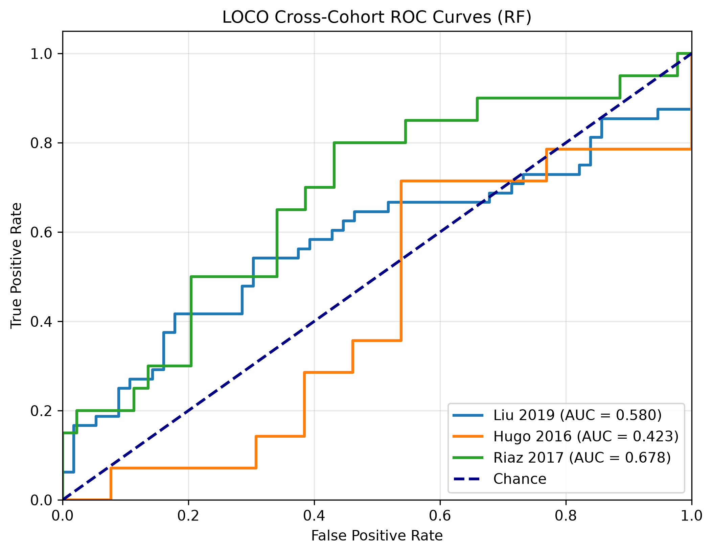  
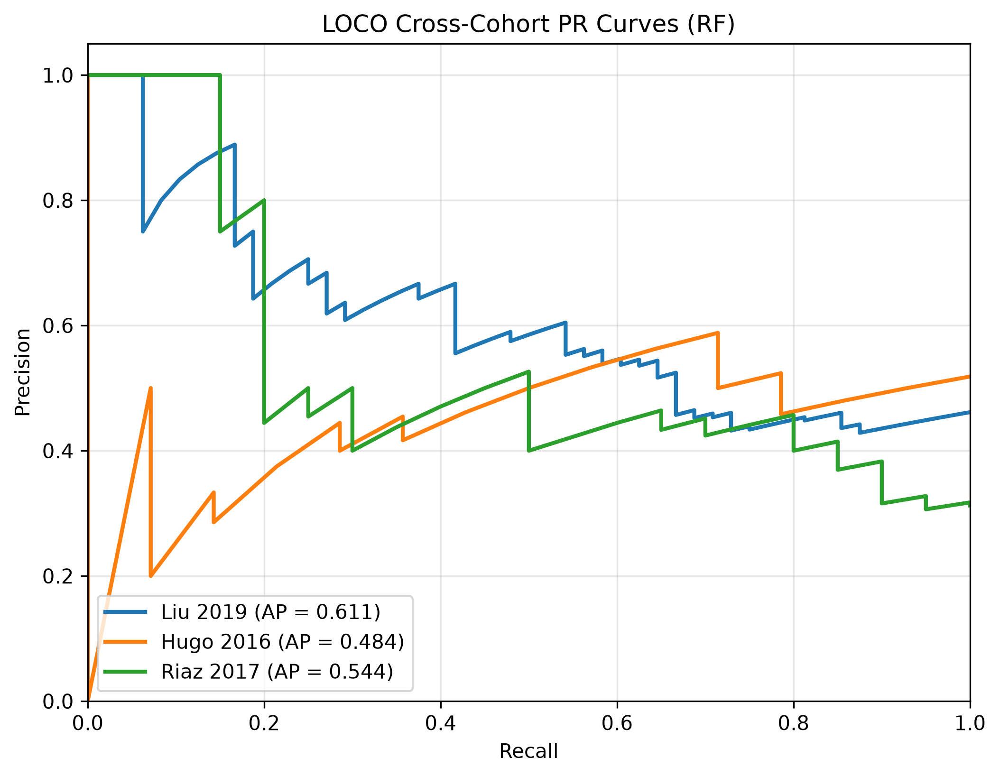

---

## XGBoost (GridSearchCV)

### Performance Metrics (Threshold = 0.5)

| Test Cohort | N | AUC | Accuracy | Sensitivity | Specificity | Precision | F1-Score | C-Index |
|:---|:---:|:---:|:---:|:---:|:---:|:---:|:---:|:---:|
| Hugo 2016 | 27 | 0.319 | 0.333 | 0.071 | 0.615 | 0.167 | 0.100 | 0.597 |
| Liu 2019 | 104 | 0.581 | 0.567 | 0.521 | 0.607 | 0.532 | 0.526 | 0.471 |
| Riaz 2017 | 64 | 0.618 | 0.531 | 0.650 | 0.477 | 0.361 | 0.464 | 0.515 |

### Visualizations & Diagnostics

#### Confusion Matrices (Threshold = 0.5)
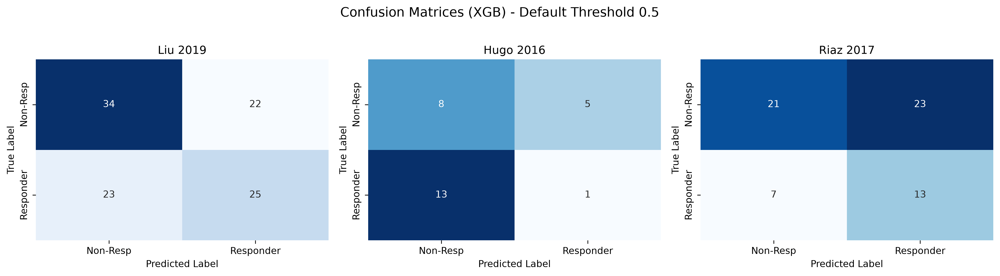

#### ROC & Precision-Recall Curves
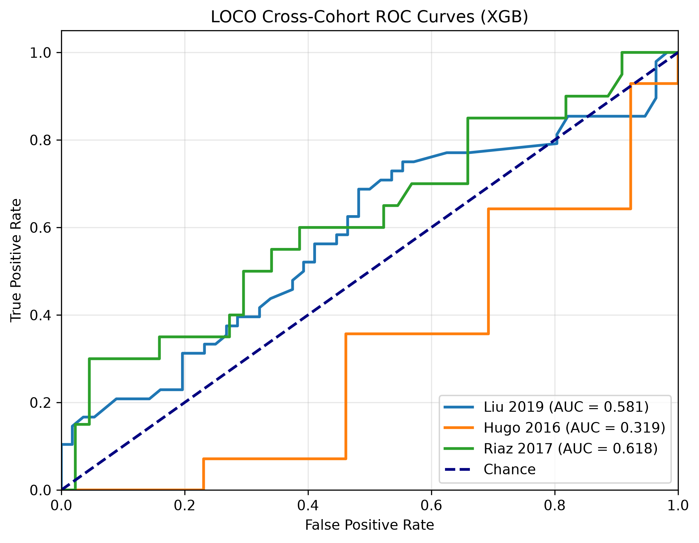  
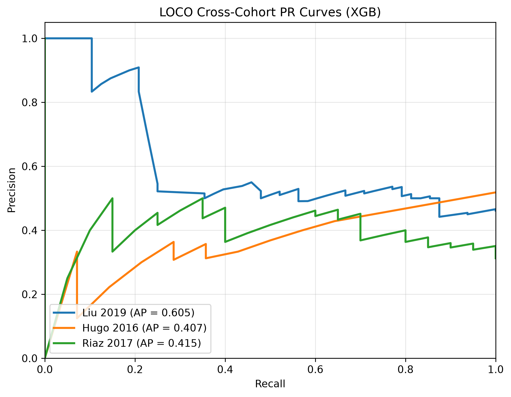

---

## Support Vector Machine (GridSearchCV)

### Performance Metrics (Threshold = 0.5)

| Test Cohort | N | AUC | Accuracy | Sensitivity | Specificity | Precision | F1-Score | C-Index |
|:---|:---:|:---:|:---:|:---:|:---:|:---:|:---:|:---:|
| Hugo 2016 | 27 | 0.434 | 0.444 | 0.214 | 0.692 | 0.429 | 0.286 | 0.663 |
| Liu 2019 | 104 | 0.657 | 0.538 | 0.000 | 1.000 | 0.000 | 0.000 | 0.429 |
| Riaz 2017 | 64 | 0.717 | 0.719 | 0.500 | 0.818 | 0.556 | 0.526 | 0.428 |

### Visualizations & Diagnostics

#### Confusion Matrices (Threshold = 0.5)
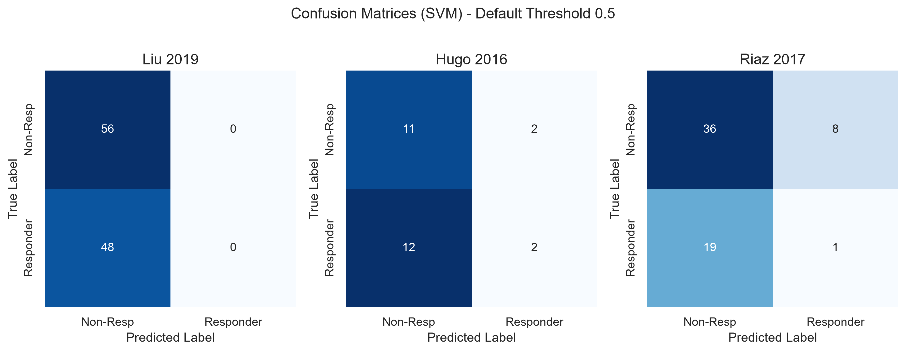

#### ROC & Precision-Recall Curves
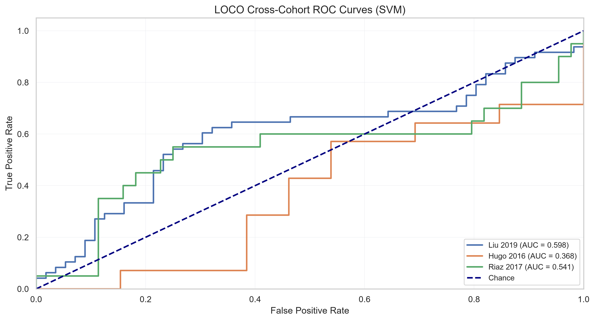  
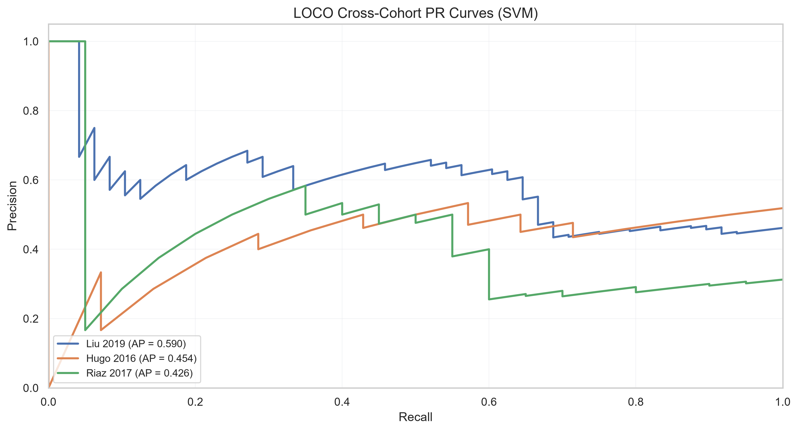

---

## ElasticNet Logistic Regression (GridSearchCV)

### Performance Metrics (Threshold = 0.5)

| Test Cohort | N | AUC | Accuracy | Sensitivity | Specificity | Precision | F1-Score | C-Index |
|:---|:---:|:---:|:---:|:---:|:---:|:---:|:---:|:---:|
| Hugo 2016 | 27 | 0.415 | 0.481 | 0.000 | 1.000 | 0.000 | 0.000 | 0.612 |
| Liu 2019 | 104 | 0.616 | 0.615 | 0.458 | 0.750 | 0.611 | 0.524 | 0.398 |
| Riaz 2017 | 64 | 0.500 | 0.312 | 1.000 | 0.000 | 0.312 | 0.476 | 0.500 |

### Visualizations & Diagnostics

#### Confusion Matrices (Threshold = 0.5)
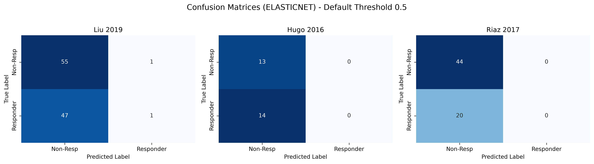

#### ROC & Precision-Recall Curves
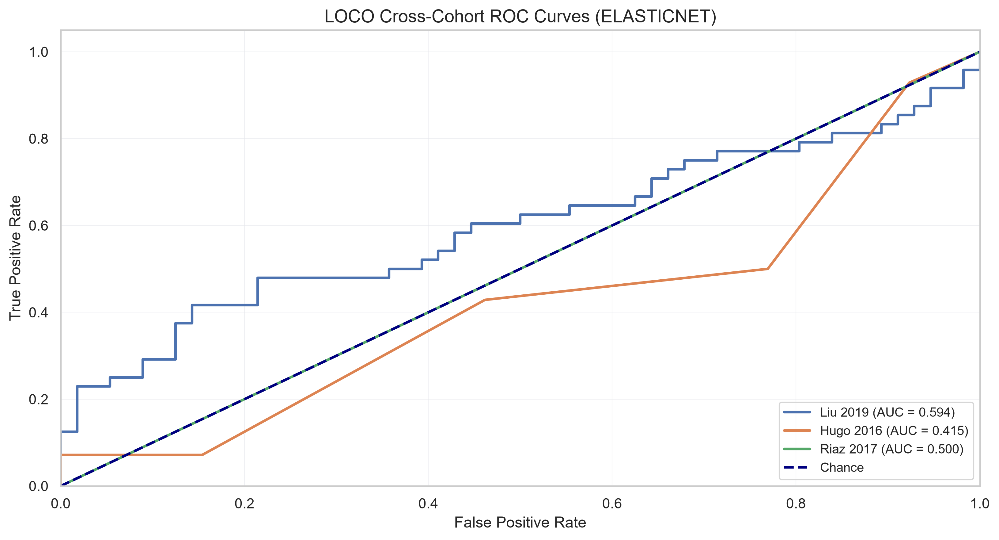  
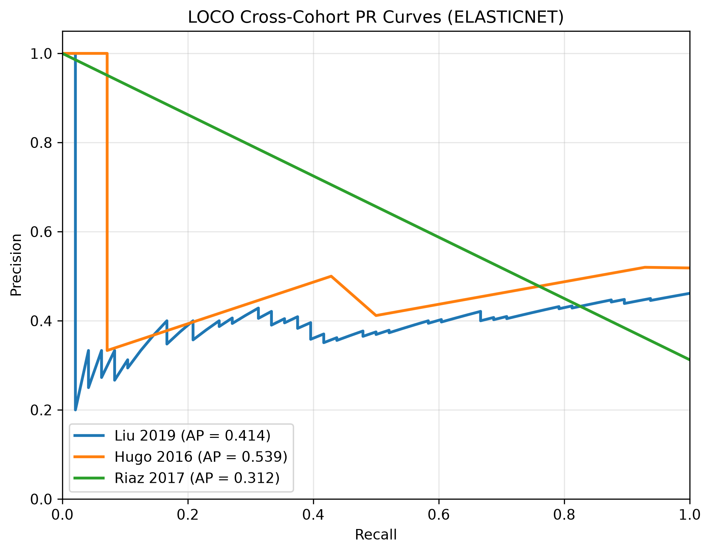

---

## Summary & Interpretation

### Key Metrics Explained
- **Sensitivity (Recall)**: TP / (TP + FN) — Proportion of actual responders correctly identified
- **Specificity**: TN / (TN + FP) — Proportion of actual non-responders correctly identified
- **Precision**: TP / (TP + FP) — Proportion of predicted responders who are actually responders
- **Accuracy**: (TP + TN) / Total — Overall correctness across both classes
- **F1-Score**: Harmonic mean of Precision and Recall — Balances both metrics
- **AUC-ROC**: Area under the Receiver Operating Characteristic curve — Robustness to threshold selection
- **C-Index (Concordance Index)**: Evaluates how well predicted response probabilities rank patients by survival. 0.5 = random, 1.0 = perfect. Accounts for censoring in survival data.

### Embedded Figure Artifacts
- **Confusion Matrices** (`confusion_matrices_*.png`): Heatmaps displaying cell-level breakdown of true vs predicted responses across test cohorts.
- **ROC Curves** (`roc_curves_*.png`): Trade-off between True Positive Rate and False Positive Rate across decision thresholds.
- **PR Curves** (`pr_curves_*.png`): Precision-Recall trade-off Curves.
