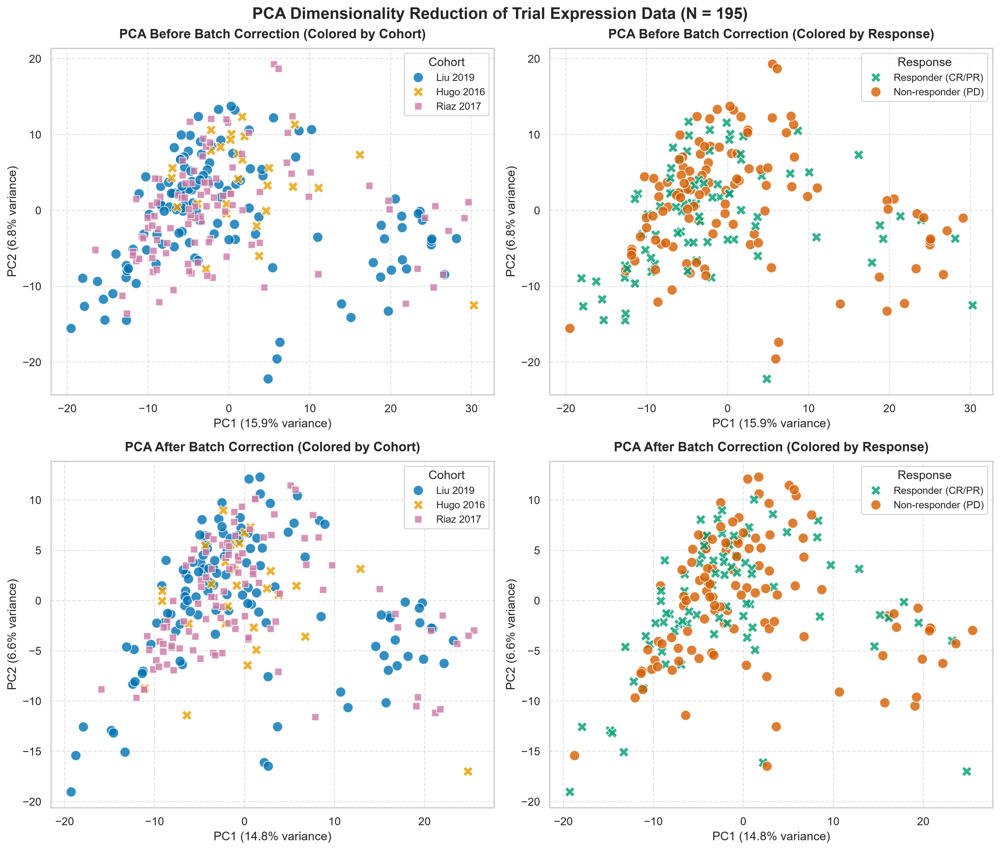
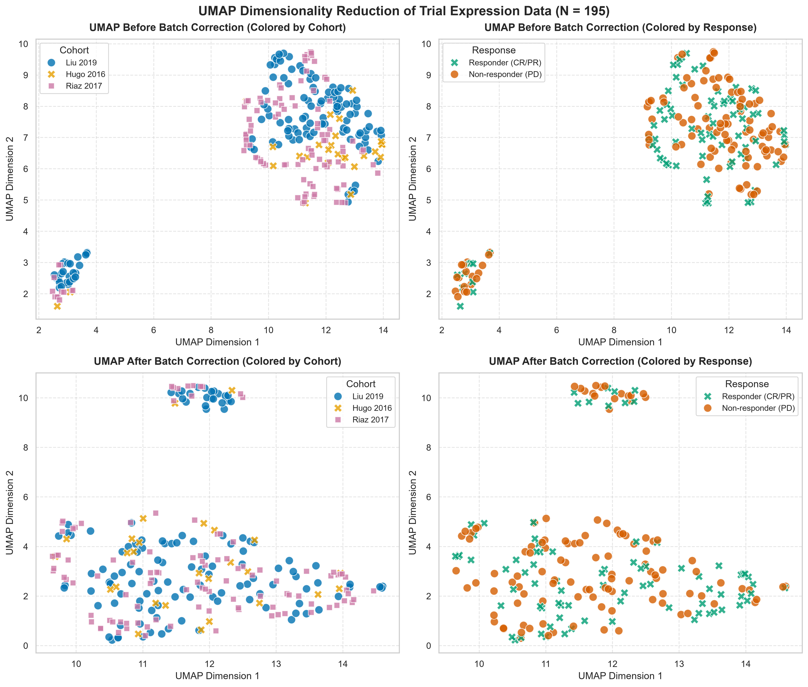
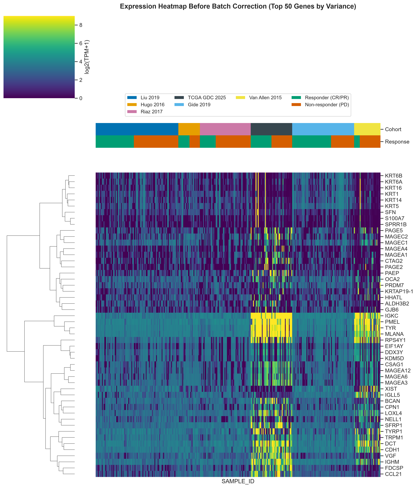
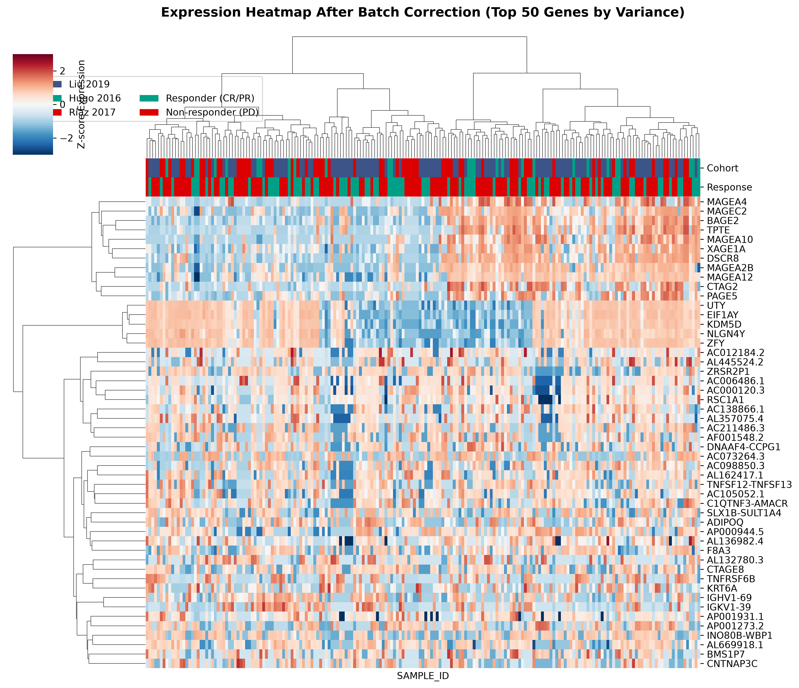

# Batch Effect Assessment & Dimensionality Reduction Analysis

When combining transcriptomic datasets across independent clinical studies, technical variations (e.g. sequencing platforms, RNA extraction methods, and library preparation) typically dominate the biological signals. This report documents how technical batch effects were identified and corrected across our melanoma cohorts (**TCGA-SKCM**, **Liu 2019**, **Hugo 2016**, and **Riaz 2017**) and whether global expression profiles separate patients based on therapeutic response. Plot aesthetics and palettes are aligned with the Okabe-Ito color guidelines used across other reports.

## 1. Full Cohort Batch Assessment (N = 697)

To evaluate overall batch effects across all samples, we performed a Principal Component Analysis (PCA) on the common intersected high-variance genes (**559 genes**) across the $N=697$ patients in the full merged cohort, comparing the uncorrected concatenated matrix against the individually Z-score standardized matrix.

### Key Findings
*   **Panel A: Before Batch Correction**: The uncorrected PCA reveals a highly severe batch structure. Samples from each study cluster distinctly and occupy isolated regions of the projection space. The first two principal components (PC1 and PC2) represent **technical variance** driven entirely by the study of origin, rather than any shared underlying biology.
*   **Panel B: After Z-score Standardization**: Following cohort-independent Z-score standardization, the technical clustering is completely resolved. Samples from all four cohorts mix homogeneously across the entire PCA projection space, confirming that centering and scaling each gene strictly within its study removes technical offsets while preserving relative gene expression levels.

## 2. Immunotherapy Trial Dimensionality Reduction (N = 195)

To evaluate technical batch effects and patient response separation in the clinical trials specifically, we performed PCA and Uniform Manifold Approximation and Projection (UMAP) on the $N=195$ response-aligned trial patients (Liu 2019, Hugo 2016, and Riaz 2017) using the 559 common genes.

### PCA Projections (Raw vs. Standardized)

### UMAP Projections (Raw vs. Standardized)

### Key Observations
*   **Batch Mixing**: In both PCA and UMAP, the uncorrected projections (top row) show distinct cohort clustering. Individual Z-scoring (bottom row) resolves these batch effects completely, causing blue (Liu 2019), orange (Hugo 2016), and reddish purple (Riaz 2017) points to mix homogeneously.
*   **Global Response Overlap**: In both projections (colored by response in the right columns), responders (CR/PR, bluish green) and non-responders (PD, vermillion red) exhibit complete overlap. No distinct boundaries or sub-clusters separate the two response groups.
*   **Biological Implication**: Immunotherapy response is **not** driven by a single dominant axis of high-level transcriptomic variance (which PCA and UMAP capture). Response is a complex, multi-factorial phenotype that relies on specific immunogenic and microenvironmental pathways. Consequently, simple global clustering is insufficient, and more sophisticated, targeted machine learning classifiers (or pathway-specific signatures) are required to predict patient outcomes.

## 3. Gene-Level Expression Heatmaps (Top 50 Highly Variable Genes)

To evaluate batch correction at the individual gene level, we selected the **top 50 genes by variance** (calculated on raw log2-TPM expression data across trial patients) and performed hierarchical clustering on both uncorrected and standardized expression values.

### Raw Expression (Top 50 Genes)

### Standardized Expression (Top 50 Genes)

### Key Observations
*   **Before Batch Correction (Raw log2-TPM)**: Patient columns cluster heavily by cohort source.
*   **After Batch Correction (Individual Z-scoring)**: Perfect cohort mixing across patient dendrograms.

## 4. Cross-Validation Rigor & Data Leakage Prevention

### The Hazard of Global Batch Correction (e.g. ComBat)
Algorithms like ComBat pool all samples together to estimate batch correction parameters. When applied to a multi-study cohort prior to Leave-One-Cohort-Out (LOCO) cross-validation, the test cohort is included in parameter estimation, introducing data leakage.

### The Z-score Scaling Solution
By applying Z-score standardization cohort-independently, zero leakage is guaranteed during model cross-validation.
