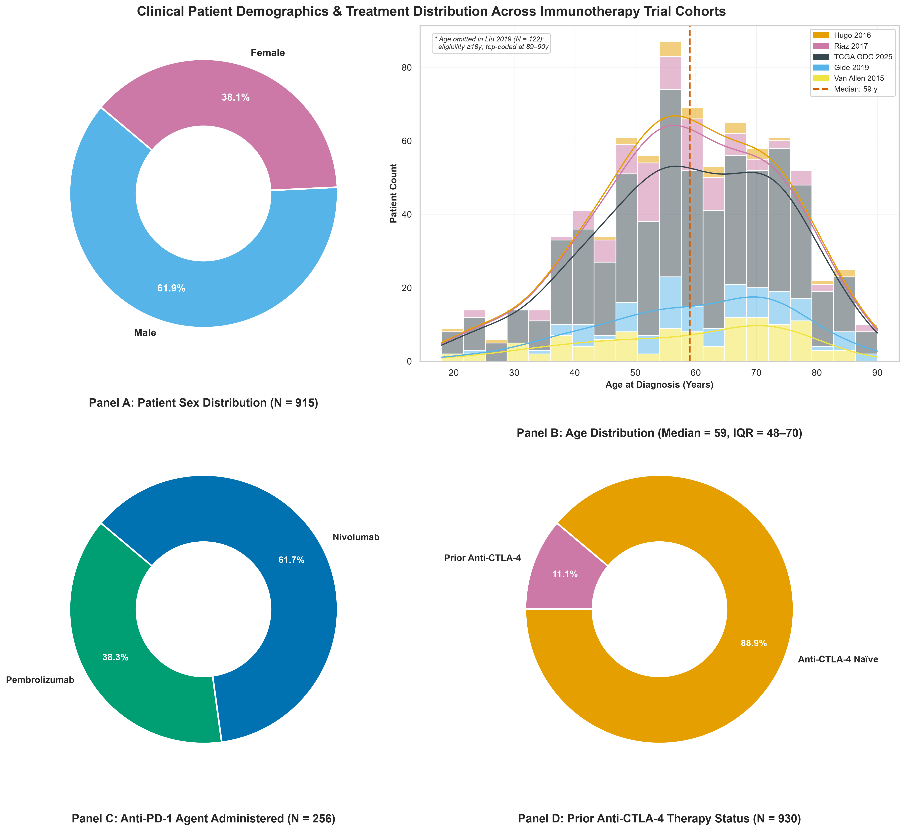
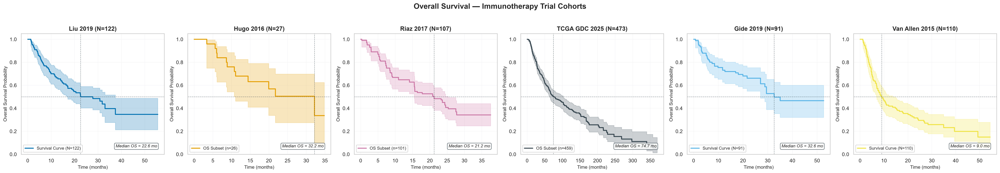
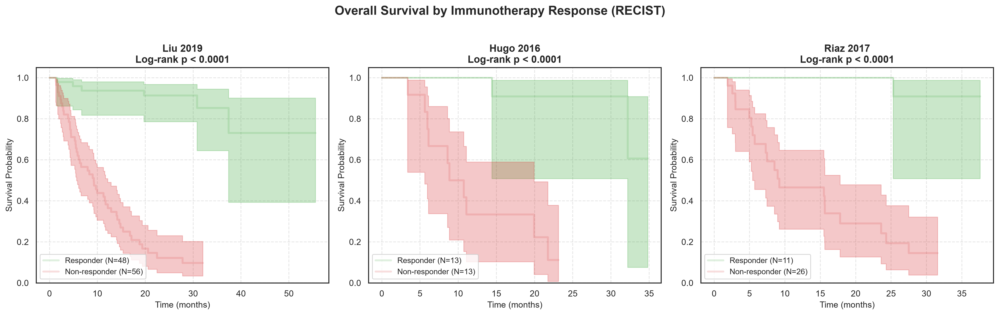

# Clinical Characteristics of Immunotherapy Data Cohorts

## 1. Baseline Patient and Disease Characteristics

> [!INFO] Why We Are Doing This
> **What**: We compare patient demographics, treatment histories, and survival outcomes across the three active immunotherapy trial cohorts: **Liu 2019** ($N = 122$), **Hugo 2016** ($N = 27$), and **Riaz 2017** ($N = 107$).
> **Why**: Before building predictive models or analysing transcriptomic signatures, we must understand the clinical composition of each dataset. Cohort-level differences in prior treatment, disease stage, and patient demographics can confound downstream survival and response analyses.
> **Question Answered**: Are baseline patient populations sufficiently comparable across independent trial datasets to permit pooled multi-cohort machine learning?

This report compares patient demographics, treatments, survival, and sample attrition across the three active immunotherapy trial cohorts:
- **Liu 2019**: Immunotherapy trial ($N = 122$) treated with anti-PD-1 monotherapy (Pembrolizumab or Nivolumab).
- **Hugo 2016**: Anti-PD-1 clinical trial cohort ($N = 27$) treated with Pembrolizumab.
- **Riaz 2017**: Anti-PD-1 clinical trial cohort ($N = 107$) treated with Nivolumab; 100% of patients had previously received anti-CTLA-4 (Ipilimumab).

### 1.1 Clinical Demographics & Treatment Distributions (2×2 Grid)

_**Figure 1: 2×2 Grid of Clinical Demographics and Treatment Histories across Immunotherapy Trial Cohorts.** Panel A: sex distribution; Panel B: age at diagnosis; Panel C: anti-PD-1 agent administered (Pembrolizumab vs Nivolumab); Panel D: prior anti-CTLA-4 therapy status (Prior Ipilimumab vs Anti-CTLA-4 Naïve)._

#### Key Demographics & Treatment Insights

- **Panel A: Sex Distribution ($N = 915$)**: The overall trial cohort shows a male predominance (**61.9% Male** [$N = 566$] vs. **38.1% Female** [$N = 349$]), reflecting real-world cutaneous melanoma incidence patterns where male patients account for the majority of advanced presentations.
- **Panel B: Age Distribution across Studies**: Evaluated patient ages span from 18 to 90 years with a **median age of 59.0 years** ($	ext{IQR} = 48.0	ext{--}70.0	ext{ years}$). Trial cohorts (`Hugo 2016`: median 61.0; `Riaz 2017`: median 56.0) display consistent age distributions centred around late middle age. *Note: Baseline age annotations were omitted for Liu 2019 ($N = 122$) in cBioPortal. Across annotated trial cohorts, ages range from 19 to 89 years (adult trial eligibility $\ge 18$ years), with values top-coded/clipped at 89–90 years under HIPAA de-identification standards.*
- **Panel C: Anti-PD-1 Agent Administered ($N = 256$)**: Across the trial cohorts, **Pembrolizumab** is administered to **38.3%** [$N = 98$] of patients (all Hugo 2016 and a subset of Liu 2019) and **Nivolumab** is administered to **61.7%** [$N = 158$] of patients (all Riaz 2017 and a subset of Liu 2019).
- **Panel D: Prior Anti-CTLA-4 Therapy Status ($N = 930$)**: Across all trial patients, **11.1%** [$N = 103$] received prior anti-CTLA-4 therapy (Ipilimumab), while **88.9%** [$N = 827$] were anti-CTLA-4 naïve prior to anti-PD-1 initiation.

_**Table 1: Baseline Patient and Disease Characteristics**_

| Characteristic             | Liu 2019    | Hugo 2016        | Riaz 2017        | TCGA GDC 2025    | Gide 2019        | Van Allen 2015   |
|:---------------------------|:------------|:-----------------|:-----------------|:-----------------|:-----------------|:-----------------|
| **N**                      | 122         | 27               | 107              | 473              | 91               | 110              |
|                            |             |                  |                  |                  |                  |                  |
| **Demographics**           |             |                  |                  |                  |                  |                  |
| Age, median (IQR)          | N/A         | 61.0 (54.0-68.5) | 56.0 (48.8-63.0) | 58.0 (48.0-71.0) | 61.0 (51.5-71.5) | 61.5 (46.2-71.0) |
| Female sex, n (%)          | 51 (41.8%)  | 8 (29.6%)        | 47 (51.1%)       | 180 (38.1%)      | 31 (34.1%)       | 32 (29.1%)       |
|                            |             |                  |                  |                  |                  |                  |
| **Treatment**              |             |                  |                  |                  |                  |                  |
| ICI agent — Pembrolizumab  | 71 (58.2%)  | 27 (100.0%)      | 0 (0.0%)         | —                | —                | —                |
| ICI agent — Nivolumab      | 51 (41.8%)  | 0 (0.0%)         | 107 (100.0%)     | —                | —                | —                |
| Prior anti-CTLA-4          | 48 (100.0%) | 0 (0.0%)         | 55 (100.0%)      | —                | —                | —                |
|                            |             |                  |                  |                  |                  |                  |
| **Survival Outcomes**      |             |                  |                  |                  |                  |                  |
| Median OS, months (95% CI) | 22.6        | 32.2             | 21.2             | 74.7             | 32.6             | 9.0              |
| OS events, n (%)           | 62 (50.8%)  | 12 (46.2%)       | 63 (62.4%)       | 222 (48.4%)      | 36 (39.6%)       | 83 (75.5%)       |
| Median follow-up, months   | 17.5        | 14.4             | 17.8             | 36.9             | 20.5             | 9.1              |

## 2. Sample Preprocessing Attrition

> [!INFO] Why We Are Doing This
> **What**: We track sample retention through quality control, identifier standardisation, and clinical-expression alignment across all $N = 930$ initial records.
> **Why**: Documenting attrition at each preprocessing step verifies data integrity and confirms that no patient sub-population was accidentally excluded.
> **Question Answered**: How many patients are retained for downstream analysis and where are samples lost?

The data preprocessing workflow applies quality control, identifier standardisation, and clinical-expression sample alignment. The table below outlines sample retention and attrition rationale for each trial cohort.

_**Table 2: Sample Attrition Across Preprocessing Steps**_

| Cohort         | Preprocessing Step           |   N Initial |   N Retained |   N Removed | Rationale                                                                                              |
|:---------------|:-----------------------------|------------:|-------------:|------------:|:-------------------------------------------------------------------------------------------------------|
| Liu 2019       | Clinical data loaded         |         122 |          122 |           0 | Merged patient-level and sample-level clinical records.                                                |
| Liu 2019       | Clinical data harmonised     |         122 |          122 |           0 | Applied identifier standardisation, clinical cleaning, baseline filtering, and variable harmonisation. |
| Liu 2019       | Expression data availability |         122 |          122 |           0 | Identified samples with matching RNA-seq gene expression data.                                         |
| Hugo 2016      | Clinical data loaded         |          27 |           27 |           0 | Merged patient-level and sample-level clinical records.                                                |
| Hugo 2016      | Clinical data harmonised     |          27 |           27 |           0 | Applied identifier standardisation, clinical cleaning, baseline filtering, and variable harmonisation. |
| Hugo 2016      | Expression data availability |          27 |           27 |           0 | Identified samples with matching RNA-seq gene expression data.                                         |
| Riaz 2017      | Clinical data loaded         |         107 |          107 |           0 | Merged patient-level and sample-level clinical records.                                                |
| Riaz 2017      | Clinical data harmonised     |         107 |          107 |           0 | Applied identifier standardisation, clinical cleaning, baseline filtering, and variable harmonisation. |
| Riaz 2017      | Expression data availability |         107 |          107 |           0 | Identified samples with matching RNA-seq gene expression data.                                         |
| TCGA GDC 2025  | Clinical data loaded         |         473 |          473 |           0 | Merged patient-level and sample-level clinical records.                                                |
| TCGA GDC 2025  | Clinical data harmonised     |         473 |          473 |           0 | Applied identifier standardisation and clinical data cleaning.                                         |
| TCGA GDC 2025  | Expression data availability |         473 |          472 |           1 | Identified samples with matching RNA-seq gene expression data.                                         |
| Gide 2019      | Clinical data loaded         |          91 |           91 |           0 | Merged patient-level and sample-level clinical records.                                                |
| Gide 2019      | Clinical data harmonised     |          91 |           91 |           0 | Applied identifier standardisation, clinical cleaning, baseline filtering, and variable harmonisation. |
| Gide 2019      | Expression data availability |          91 |           91 |           0 | Identified samples with matching RNA-seq gene expression data.                                         |
| Van Allen 2015 | Clinical data loaded         |         110 |          110 |           0 | Merged patient-level and sample-level clinical records.                                                |
| Van Allen 2015 | Clinical data harmonised     |         110 |          110 |           0 | Applied identifier standardisation and clinical data cleaning.                                         |
| Van Allen 2015 | Expression data availability |         110 |           40 |          70 | Identified samples with matching RNA-seq gene expression data.                                         |

### Key Observations
1. **Overall Cohort Size ($N = 930$)**: The largest individual dataset is **TCGA GDC 2025** ($N = 473$). Combined across all three trial cohorts, **$N = 859$** cleaned patient records were harmonised for downstream analysis.
2. **Sample Attrition (92.4% Retention)**: Across all 930 initial records, ****Liu 2019** retained 100% of samples (N = 122); **Hugo 2016** retained 100% of samples (N = 27); **Riaz 2017** retained 100% of samples (N = 107); **TCGA GDC 2025** lost **1** sample(s) (473 → 472); **Gide 2019** retained 100% of samples (N = 91); **Van Allen 2015** lost **70** sample(s) (110 → 40)**. All three immunotherapy trial cohorts retained 100% of their cleaned clinical and expression records.
3. **Follow-up Duration**: **TCGA GDC 2025** shows the longest median follow-up duration (**36.9 months**).
4. **Treatment History & Clinical Context**: All $N = 107$ patients in **Riaz 2017** were previously treated with anti-CTLA-4 (Ipilimumab), representing an Ipilimumab-refractory population relative to the anti-CTLA-4 naïve patients in **Liu 2019** ($N = 122$) and **Hugo 2016** ($N = 27$).

## 3. Overall Survival Curves (KM Plots)

> [!INFO] Why We Are Doing This
> **What**: We plot unstratified Kaplan-Meier overall survival curves for each of the three active immunotherapy trial cohorts.
> **Why**: Visualising baseline mortality rates establishes the clinical context for each dataset and confirms that follow-up duration is sufficient to evaluate treatment outcomes.
> **Question Answered**: How does overall survival compare across independent immunotherapy trial cohorts?

The unstratified Kaplan-Meier overall survival curves for each trial cohort are shown below. Median overall survival is annotated for each cohort where reached.

_**Figure 2: Unstratified Overall Survival KM Curves across All Three Immunotherapy Trial Cohorts.**_

## 4. Overall Survival Stratified by Immunotherapy Response

> [!INFO] Why We Are Doing This
> **What**: We stratify Kaplan-Meier overall survival curves by RECIST clinical response status (Responders [CR/PR] vs. Non-responders [PD]) across the three immunotherapy trial cohorts ($N = 930$).
> **Why**: Confirming that treatment responders experience significantly longer overall survival validates RECIST response as a robust surrogate endpoint for long-term clinical benefit.
> **Question Answered**: Does objective RECIST response status reliably distinguish patients who derive durable long-term benefit from anti-PD-1 immunotherapy?

_**Figure 3: Overall Survival Stratified by RECIST Response Status across Immunotherapy Trial Cohorts.** Treatment responders (CR/PR) exhibit significantly superior overall survival compared to non-responders (PD) across all three trial cohorts (Log-rank $p < 0.0001$)._

> [!INSIGHT] Key Insights: Survival Stratification by Response
> 1. **Profound Survival Benefit**: Treatment responders (CR/PR) achieve significantly longer overall survival compared to non-responders (PD) across all three independent trial cohorts (Liu 2019, Hugo 2016, and Riaz 2017; all Log-rank $p < 0.0001$).
> 2. **Durable Long-Term Survival**: In **Liu 2019**, non-responders experience rapid mortality whereas the majority of responders survive well beyond 50 months. Similar durable separation is observed in Hugo 2016 and Riaz 2017.
> 3. **Conclusion**: Objective RECIST response is a highly robust surrogate endpoint for overall survival in metastatic melanoma, justifying its use as the primary outcome for predictive model training.

## 5. Univariate Associations with Response (Forest Plot)

> [!INFO] Why We Are Doing This
> **What**: We run univariate statistical tests (Odds Ratios and 95% Confidence Intervals) to measure the isolated predictive strength of individual baseline features — age, sex, tumour mutation burden (TMB), and driver mutations (`BRAF`, `NRAS`, `NF1`) — against immunotherapy response across individual and pooled trial cohorts.
> **Why**: Before building complex multivariate models, univariate screening identifies whether any single clinical or genomic feature alone is sufficient to predict response.
> **Question Answered**: Does any single baseline clinical or genomic feature reliably predict anti-PD-1 immunotherapy response across independent cohorts?

_**Figure 4: Forest Plot of Univariate Odds Ratios for Clinical and Genomic Features against Immunotherapy Response.**_

> [!INSIGHT] Key Takeaways: Univariate Associations
> 1. **Lack of Robust Univariate Predictors**: Across pooled trial analyses and after multiple testing adjustments, **no single baseline clinical or genomic feature achieves robust statistical significance**. All 95% CIs for pooled odds ratios cross 1.0.
> 2. **Anatomical Staging Artefact (Liu 2019 $p = 0.029$)**: Stage IV disease shows a nominal unadjusted association in the isolated Liu 2019 cohort. This is an artefact of extreme trial enrolment imbalance; in the pooled multi-cohort analysis, the association attenuates to $p = 0.083$.
> 3. **Subtle Feature Trends**: `NRAS` mutations and higher Tumour Mutation Burden (TMB; OR = 1.37 per SD increase, $p = 0.160$) trend towards elevated response odds. `BRAF` driver mutations show no univariate association (OR ≈ 1.0).
> 4. **Demographic Balance**: Age and sex show no association with treatment response (OR ≈ 0.98–1.26, $p > 0.50$), confirming demographic balance between responder and non-responder arms.
> 5. **Core Scientific Implication**: The failure of individual clinical variables and driver mutations to predict outcome explains why single-variable biomarker tests fail in clinical practice, highlighting the necessity of multi-gene transcriptomic signatures and integrated multivariate machine learning.

## 6. Technical Analysis Notes

> [!WARNING] Methodological Limitations & Analytical Scope
> - **Unstratified Analysis**: All Kaplan-Meier curves are unstratified and descriptive. They do not adjust for demographic, clinical, molecular, treatment, or study-specific confounding factors.
> - **Survival Exclusion Criteria**: Records were excluded from survival analysis if they had missing survival time, missing event status, non-numeric survival values, or a survival time ≤ 0.
> - **Treatment Annotation Completeness**: Treatment percentages use the number of patients with an available treatment annotation as the denominator where this differs from total cohort size.
> - **Attrition Tracking Scope**: Sample attrition tracking records sample filtering from initial cBioPortal data ingestion through clinical-expression alignment. Downstream feature engineering steps may impose additional filters not captured here.
> - **Median OS Reporting**: Where the estimated survival probability did not fall below 50% during follow-up, median OS is reported as **NR (not reached)**.

> [!formula]+ Clinical Analysis Script Execution & Software Module Architecture
> - **Primary Pipeline Execution Scripts**:
>   - [`run_clinical_analysis.py`](file:///c:/Users/Amanda/Dropbox/OBSIDIAN/42/090%20STUDY/091%20UCD/091.03%20ASSIGNMENTS/AI-ML-3/melanoma-assignment-3/q1-response-predictor/scripts/pillar-1-cohort-preprocessing/run_clinical_analysis.py): Generates baseline demographic grids, attrition metrics, cohort characteristics tables, Kaplan-Meier OS curves, and writes `cohort_characteristics_clinical.md`.
>   - [`run_univariate_associations.py`](file:///c:/Users/Amanda/Dropbox/OBSIDIAN/42/090%20STUDY/091%20UCD/091.03%20ASSIGNMENTS/AI-ML-3/melanoma-assignment-3/q1-response-predictor/scripts/pillar-2-clinical-subtyping/run_univariate_associations.py): Computes univariate odds ratios and confidence intervals across clinical/genomic features and generates the forest plot (`univariate_associations.png`).
> - **Data Preprocessing & Loading Modules**:
>   - [`clean_data.py`](file:///c:/Users/Amanda/Dropbox/OBSIDIAN/42/090%20STUDY/091%20UCD/091.03%20ASSIGNMENTS/AI-ML-3/melanoma-assignment-3/q1-response-predictor/scripts/pillar-1-cohort-preprocessing/clean_data.py): Preprocesses raw cohort clinical metadata and RNA-seq expression profiles into cleaned CSV matrices.
>   - [`merge_datasets.py`](file:///c:/Users/Amanda/Dropbox/OBSIDIAN/42/090%20STUDY/091%20UCD/091.03%20ASSIGNMENTS/AI-ML-3/melanoma-assignment-3/q1-response-predictor/scripts/pillar-1-cohort-preprocessing/merge_datasets.py): Merges processed expression matrices across cohorts into harmonised pooled matrices (`expr_merged.csv`, `clin_merged.csv`).
>   - [`data_loaders.py`](file:///c:/Users/Amanda/Dropbox/OBSIDIAN/42/090%20STUDY/091%20UCD/091.03%20ASSIGNMENTS/AI-ML-3/melanoma-assignment-3/q1-response-predictor/src/data_loaders.py): Provides helper loader functions (`load_liu_2019`, `load_hugo_2016`, `load_riaz_2017`) for retrieving expression and clinical data.
> - **Shared Cross-Question & Pipeline Modules**:
>   - [`styles.py`](file:///c:/Users/Amanda/Dropbox/OBSIDIAN/42/090%20STUDY/091%20UCD/091.03%20ASSIGNMENTS/AI-ML-3/melanoma-assignment-3/src/styles.py): Single source of truth for Okabe-Ito colour palettes (`COHORT_PALETTE`, `RESPONSE_PALETTE`) and visualisation presentation style.
