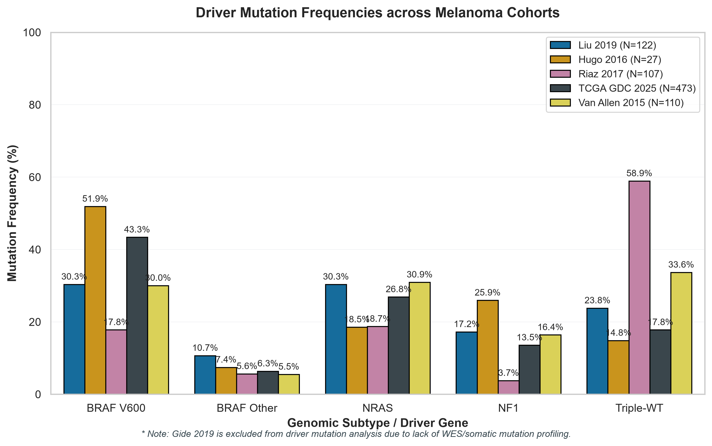
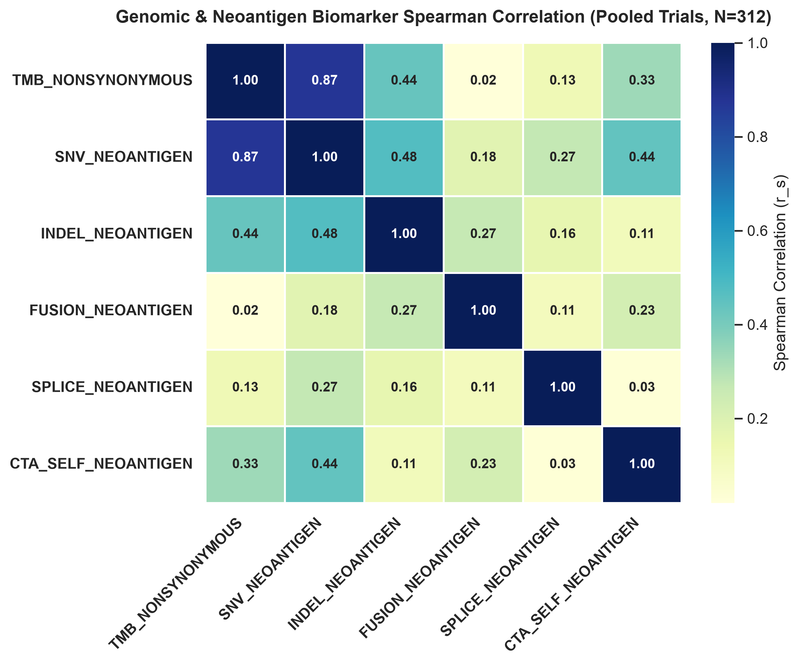
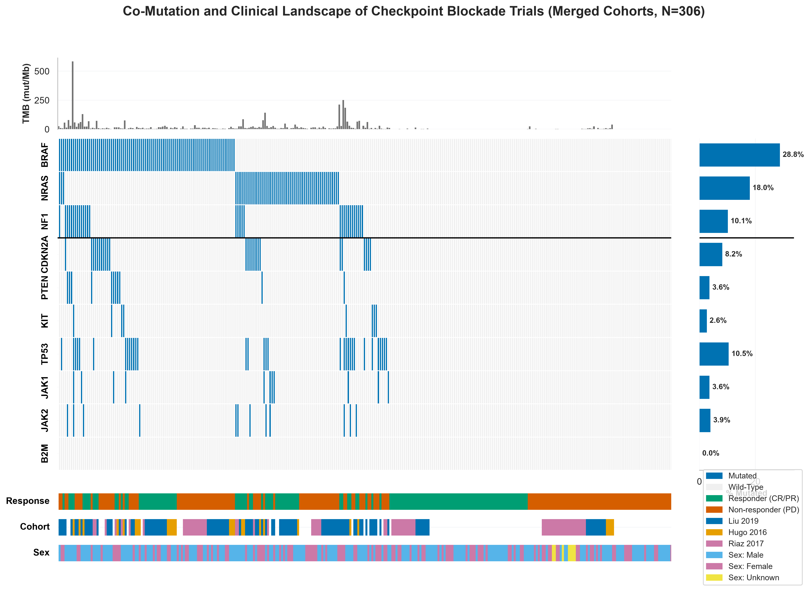

# Genomic Characteristics of Data Cohorts

## 1. Mutation Landscape Comparison

> [!INFO] Why We Are Doing This
>
> - **What**: We compare somatic mutation frequencies of key cutaneous melanoma driver gene subtypes
> (`BRAF V600`, `BRAF Other`, `NRAS`, `NF1`, and Triple-WT) and core immune pathways across active ICI trial cohorts.
> - **Why**: To confirm that our clinical trial cohorts accurately reflect real-world melanoma
> epidemiology and to evaluate whether pre-treatment mutations in antigen presentation
> (`B2M`, `TAP1`, `TAP2`) or IFN-$\gamma$ signalling (`JAK1`, `JAK2`, `STAT1`) drive primary
> immunotherapy resistance.
> - **Questions**: Are clinical trial cohorts representative of baseline melanoma genomics,
> and do patients harbour pre-existing mutations in immune evasion pathways prior to therapy?

This report presents a comparative analysis of the genomic features across active ICI trial cohorts:
- **Liu 2019** ($N = 122$) — Anti-PD-1 (pembrolizumab / nivolumab).
- **Hugo 2016** ($N = 27$) — Anti-PD-1 (pembrolizumab).
- **Riaz 2017** ($N = 107$) — Anti-PD-1 (nivolumab).
- **TCGA GDC 2025** ($N = 473$) — Heterogeneous IT-treated cohort (ipilimumab, vaccines, interferon +/- chemotherapy).
- **Gide 2019** ($N = 91$) — Anti-PD-1 +/- anti-CTLA-4 (pembrolizumab / nivolumab +/- ipilimumab).
- **Van Allen 2015** ($N = 110$) — Anti-CTLA-4 (ipilimumab).

### 1.1 Driver Mutation Frequencies

_**Figure 1: Driver Mutation Frequencies across ICI Trial Cohorts.** Frequencies of `BRAF V600`,
`BRAF Other`, `NRAS`, `NF1`, and Triple-WT genotypes across Liu 2019, Hugo 2016, Riaz 2017, TCGA GDC 2025, Van Allen 2015._ 

*Note: Gide 2019 ($N=91$) is excluded from driver mutation frequency comparisons due to lack of WES/somatic mutation profiling (RNA-seq gene expression only).*

> [!INSIGHT] Key Insights: Mutation Landscape
>
> 1. **Consistent Driver Mutation Profiles Across ICI Trial Cohorts**: Driver mutation frequencies
> are broadly consistent across active trial cohorts with WES somatic mutation profiling (**Liu 2019** (`BRAF V600`: **30.3%**, `BRAF Other`: **10.7%**, `NRAS`: **30.3%**, `NF1`: **17.2%**, Triple-WT: **23.8%**); **Hugo 2016** (`BRAF V600`: **51.9%**, `BRAF Other`: **7.4%**, `NRAS`: **18.5%**, `NF1`: **25.9%**, Triple-WT: **14.8%**); **Riaz 2017** (`BRAF V600`: **17.8%**, `BRAF Other`: **5.6%**, `NRAS`: **18.7%**, `NF1`: **3.7%**, Triple-WT: **58.9%**); **TCGA GDC 2025** (`BRAF V600`: **43.3%**, `BRAF Other`: **6.3%**, `NRAS`: **26.8%**, `NF1`: **13.5%**, Triple-WT: **17.8%**); **Van Allen 2015** (`BRAF V600`: **30.0%**, `BRAF Other`: **5.5%**, `NRAS`: **30.9%**, `NF1`: **16.4%**, Triple-WT: **33.6%**)).
> 2. **MAPK Driver Mutual Exclusivity**: Driver mutations act through independent growth
> pathways: tumours with `BRAF V600` mutations almost never harbour co-occurring `NRAS` mutations,
> validating established melanoma oncogenic principles.
> 3. **Immune Evasion Mutations Are Rare Before Therapy**: Pre-treatment non-synonymous mutations
> in antigen presentation (`B2M`, `TAP1`, `TAP2`) and interferon signalling (`JAK1`, `JAK2`)
> occur at minimal frequencies prior to checkpoint blockade. Genetic disruption of antigen
> presentation is primarily an **acquired resistance mechanism** that emerges under selection
> pressure during therapy rather than a common baseline cause of primary treatment failure.

## 2. Tumour Mutational Burden (TMB) & Neoantigen Load

> [!INFO] Why We Are Doing This
>
> - **What**: We analyse the distribution of Tumour Mutational Burden (TMB) across immunotherapy
> response arms (Responders [CR/PR] vs. Non-responders [PD]; $N = 377$ response-annotated patients across 5 cohorts)
> and evaluate the correlation between TMB and predicted total neoantigen load ($N = 222$).
> - **Why**: Somatic mutations generate novel peptide antigens (neoantigens) that trigger T-cell
> recognition. We test whether TMB correlates with treatment response and whether total TMB can
> serve as a surrogate marker for predicted neoantigen burden.
> - **Questions**: Do treatment responders exhibit higher baseline TMB than non-responders,
> and is total TMB collinear with predicted neoantigen count?

Tumour Mutational Burden (TMB) and predicted Neoantigen Load are key genomic measures of tumour
immunogenicity. Below, we present the TMB distribution by response ($N = 377$) alongside the correlation
scatter plot illustrating Neoantigen Collinearity with TMB in pooled trial cohorts ($N = 222$).

_**Figure 3: Pre-treatment TMB Distributions by Response Status ($N = 377$) and Neoantigen Collinearity ($N = 222$).**_

> [!INSIGHT] Key Insights: TMB & Neoantigen Collinearity
>
> 1. **Responders Exhibit Higher Baseline TMB**: Across 5 active immunotherapy cohorts ($N = 377$ response-annotated patients),
> patients who achieved objective response to immunotherapy (CR/PR) exhibited higher
> pre-treatment TMB levels than non-responders (PD).
> 2. **Strong Linear Collinearity ($r_s = 0.764$)**: Total nonsynonymous TMB and
> predicted total neoantigen load ($N = 222$) demonstrate a strong positive Spearman correlation
> ($r_s = 0.764$, $p < 0.0001$). Tumours harbouring higher mutational burden generate
> proportionally more predicted neoantigens.
> 3. **Redundancy for Machine Learning**: Because total TMB and neoantigen load measure the same
> underlying mutational axis, predictive models should not include both features simultaneously
> without regularization to prevent collinearity and coefficient instability.

## 3. Continuous Biomarker Correlation

> [!INFO] Why We Are Doing This
>
> - **What**: We compute Spearman rank correlations between continuous genomic features (TMB,
> neoantigen subtypes) and transcriptomic immune signatures across pooled trial cohorts
> ($N = 312$).
> - **Why**: To identify feature redundancy before model training and evaluate whether genomic
> mutational burden and transcriptomic immune infiltration capture independent biological axes.
> - **Questions**: Are TMB and neoantigen subtypes redundant, and do mutational burden
> and transcriptomic immune infiltration represent orthogonal biological biomarkers?

### 3.1 Biomarker Correlation in Pooled Trials

A Spearman rank correlation matrix mapping the relationships between continuous genomic features
(somatic mutation and neoantigen subtypes) across the **Pooled Trials** cohort
($N = 312$) is presented below.

_**Figure 4: Genomic & Neoantigen Biomarker Spearman Correlation Matrix (Pooled Trials,
$N = 312$).**_

### 3.2 Genomic Burden vs. Immune Infiltration

To evaluate how tumour genomic features affect the microenvironment, we evaluated how mutational
burden (**TMB**, evaluated in pooled trials, $N = 312$) correlates
with continuous transcriptomic immune signatures.

_**Figure 5: Correlation between Genomic Burden Metrics and Transcriptomic Immune Signatures ($N = 312$).**_

> [!INSIGHT] Key Insights: Biomarker Correlation & Orthogonality
>
> 1. **High Collinearity between TMB & SNV Neoantigens ($r_s = 0.87$)**: Total TMB
> and single-nucleotide variant (SNV) neoantigens display an extremely strong correlation
> ($r_s = 0.87$). Including both in unregularized predictive models introduces severe
> multicollinearity.
> 2. **Distinct Neoantigen Subtypes**: Indel neoantigens ($r_s = 0.44$ with TMB)
> and cancer-testis self-antigens ($r_s = 0.33$ with TMB) show weaker correlations,
> capturing distinct immunogenic signals beyond total SNV count.
> 3. **TMB & Immune Infiltration Are Orthogonal Biomarkers**: TMB shows near-zero correlation
> ($r \approx -0.09\text{--}0.16$) with transcriptomic immune signatures
> (such as IFN-$\gamma$ or TIS). A tumour can be highly mutated (high TMB) yet
> immunologically "cold" (uninflamed), or low-TMB yet "hot" (highly inflamed). This proves
> that TMB and immune inflammation capture **two independent biological axes**, confirming
> that predictive models should combine both modalities.

## 4. Co-Mutation Landscape (Oncoplot)

> [!INFO] Why We Are Doing This
>
> - **What**: We construct a multi-track co-mutation oncoplot across $N = 473$ trial
> patients with binary response labels (CR/PR vs. PD; excluding $N = 457$ Stable Disease
> patients), mapping somatic mutations in driver and resistance genes alongside patient TMB,
> response status, study cohort, and sex.
> - **Why**: To visualise patient-level co-occurrence, mutual exclusivity, and driver mutation
> distributions across response categories simultaneously.
> - **Questions**: Are `BRAF` and `NRAS` driver mutations strictly mutually exclusive in
> trial patients, and are treatment responders enriched in specific driver genotypes?

The complete co-mutation (oncoplot) landscape for patients with binary response labels across all
three clinical trial cohorts ($N = 473$; excluding $N = 457$ Stable
Disease patients without a binary response classification) is presented below.

_**Figure 5: Co-Mutation Landscape across Clinical Trial Cohorts ($N = 473$).**
Rows represent driver and resistance genes; columns represent individual patient samples with
clinical annotation tracks._

> [!INSIGHT] Key Insights: Co-Mutation Landscape
>
> 1. **MAPK Driver Mutual Exclusivity**: `BRAF` and `NRAS` mutations exhibit near-complete mutual
> exclusivity across individual patients, validating that `BRAF` and `NRAS` mutations represent
> alternative, non-overlapping mechanisms for activating the RAS-RAF-MEK-ERK pathway.
> 2. **`NF1` Mutational Overlap**: Unlike `BRAF` and `NRAS`, mutations in `NF1` show co-occurrence
> with both drivers. Many `NF1` mutations represent passenger events secondary to high UV-induced
> mutational burden.
> 3. **Targeted Resistance Profile**: Core genes in antigen presentation (`B2M`) and interferon
> signalling (`JAK1`, `JAK2`) display low baseline mutation rates, confirming that genetic loss
> of antigen presentation is predominantly an acquired resistance mechanism.
> 4. **No Driver Subtype Response Bias**: Treatment responders (CR/PR) are distributed evenly
> across all driver genotypes (`BRAF`, `NRAS`, `NF1`, and Triple-WT), confirming visually that
> driver mutation status alone cannot predict anti-PD-1 clinical outcome.

## 5. Technical Analysis Notes

> [!WARNING] Methodological Limitations & Analytical Scope
>
> - **Pre-Treatment Sampling Scope**: Somatic mutation profiles reflect pre-treatment tumor
> biopsies. Genetic alterations acquired during therapy or under drug selection pressure are
> not captured in baseline sequencing.
> - **Binary Response Filtering**: Oncoplot co-mutation visualization and response-stratified TMB
> analyses focus on patients with definitive RECIST response classifications (CR/PR vs. PD),
> excluding Stable Disease.

---

> [!formula]+ Genomic Characterisation Script Execution & Software Module Architecture
>
> - [`run_genomic_characterisation.py`](../../scripts/pillar-1-cohort-preprocessing/run_genomic_characterisation.py): Performs cross-cohort genomic analyses including driver mutation frequency comparison (`BRAF V600`, `BRAF Other`, `NRAS`, `NF1`, Triple-WT), TMB distribution benchmarking, neoantigen correlation analysis, and outputs `cohort_characteristics_genomic.md`.
> - [`clean_data.py`](../../scripts/pillar-1-cohort-preprocessing/clean_data.py): Preprocesses raw cohort clinical metadata, mutation calls, and RNA-seq expression profiles into cleaned CSV matrices.
> - [`merge_datasets.py`](../../scripts/pillar-1-cohort-preprocessing/merge_datasets.py): Merges processed expression and mutation matrices across cohorts into harmonised pooled datasets (`merged_genomic.csv`, `clin_merged.csv`).
> - [`run_pipeline.py`](../../scripts/run_pipeline.py): Master Q1 pipeline orchestrator executing downstream modeling and evaluation.
> - [`styles.py`](../../../src/styles.py): Single source of truth for Okabe-Ito colour palettes (`COHORT_PALETTE`, `DRIVER_PALETTE`, `RESPONSE_PALETTE`) and visualization presentation style.

