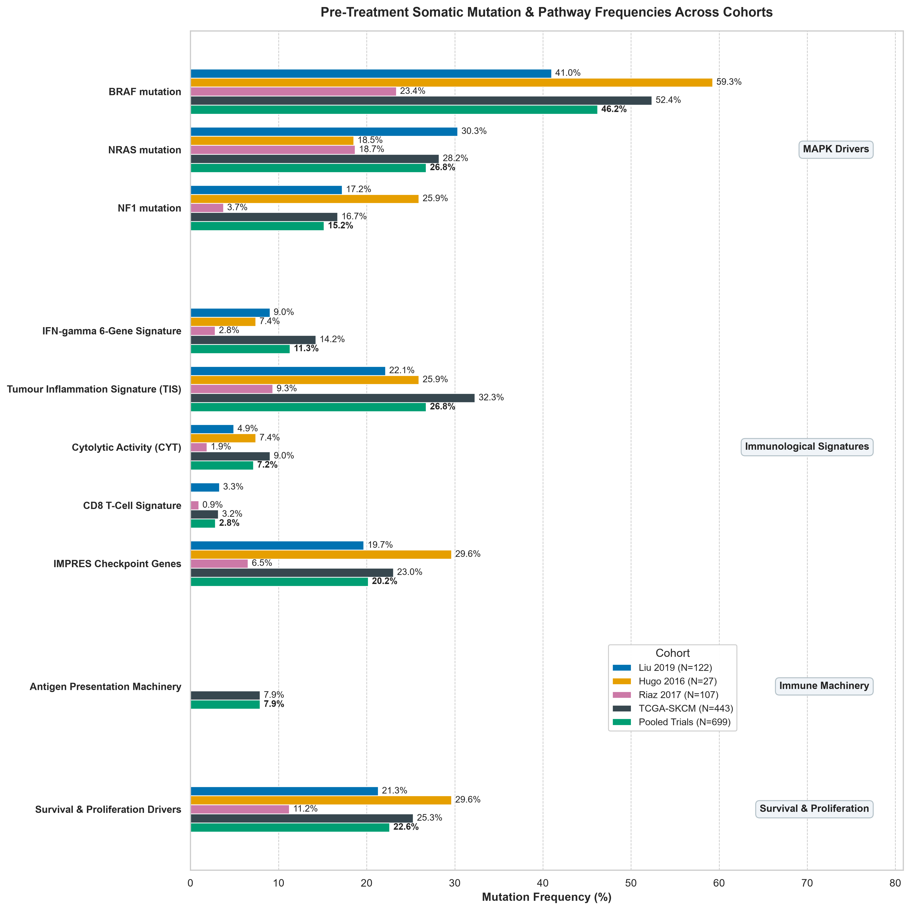
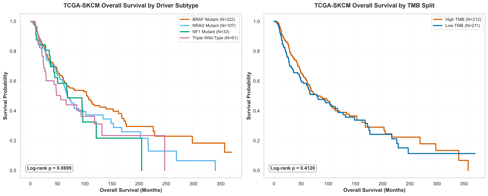

# Genomic Characteristics of Data Cohorts

## 1. Mutation Landscape Comparison

> [!INFO] Why We Are Doing This
> **What**: We compare somatic mutation frequencies of key cutaneous melanoma driver genes (`BRAF`, `NRAS`, `NF1`, and Triple-WT) and core immune pathways across all four study cohorts: **TCGA-SKCM** ($N = 428$), **Liu 2019** ($N = 122$), **Hugo 2016** ($N = 27$), and **Riaz 2017** ($N = 107$).
> **Why**: To confirm that our clinical trial cohorts accurately reflect real-world melanoma epidemiology and to evaluate whether pre-treatment mutations in antigen presentation (`B2M`, `TAP1`, `TAP2`) or IFN-$\gamma$ signalling (`JAK1`, `JAK2`, `STAT1`) drive primary immunotherapy resistance.
> **Question Answered**: Are clinical trial cohorts representative of baseline melanoma genomics, and do patients harbour pre-existing mutations in immune evasion pathways prior to therapy?

This report presents a comparative analysis of the genomic features across the four melanoma study cohorts:
- **TCGA-SKCM**: Baseline genomic reference population ($N = 428$).
- **Liu 2019**: Anti-PD-1 clinical trial cohort ($N = 122$).
- **Hugo 2016**: Anti-PD-1 clinical trial cohort ($N = 27$).
- **Riaz 2017**: Anti-PD-1 clinical trial cohort ($N = 107$).

### 1.1 Driver Mutation Frequencies

_**Figure 1: Driver Mutation Frequencies across Melanoma Cohorts.** Frequencies of `BRAF`, `NRAS`, `NF1`, and Triple-WT genotypes across individual trial cohorts and TCGA-SKCM reference._

### 1.2 Extended Pathway Somatic Mutation Frequencies

To further characterse tumour immunogenicity and mechanisms of resistance, we evaluated pre-treatment somatic mutation frequencies across core biological pathways:
- **Antigen Presentation Machinery**: `B2M`, `TAP1`, `TAP2` (loss causes HLA class I downregulation).
- **IFN-$\gamma$ Signalling**: `JAK1`, `JAK2`, `STAT1` (induces insensitivity to T-cell cytotoxicity).
- **Immune Checkpoints**: `CD274`, `CTLA4`, `IDO1` (modulators of immune evasion).
- **Cytolytic Machinery**: `GZMA`, `PRF1` (effectors of cytotoxic lymphocyte killing).
- **Survival & Proliferation Drivers**: `PTEN`, `CDKN2A`, `PIK3CA` (oncogenic drivers).

_**Figure 2: Pre-Treatment Somatic Mutation & Pathway Frequencies across Cohorts.**_

> [!INSIGHT] Key Insights: Mutation Landscape
> 1. **Alignment with Real-World Melanoma Genetics**: The reference **TCGA-SKCM** cohort ($N = 428$) closely matches expected cutaneous melanoma driver distribution (`BRAF`: **52.1%**, `NRAS`: **28.0%**, `NF1`: **17.1%**, Triple-WT: **15.2%**).
> 2. **Representative Clinical Trial Cohorts**: All trial cohorts align closely with TCGA baseline frequencies. **Liu 2019** ($N = 122$) displays representative driver mutation rates (`BRAF`: **41.0%**, `NRAS`: **30.3%**, `NF1`: **17.2%**). **Riaz 2017** ($N = 107$) also mirrors expected distribution (`BRAF`: **23.4%**, `NRAS`: **18.7%**, `NF1`: **3.7%**, Triple-WT: **58.9%**).
> 3. **MAPK Driver Mutual Exclusivity**: Driver mutations act through independent growth pathways: tumours with `BRAF` mutations almost never harbour co-occurring `NRAS` mutations, validating established melanoma oncogenic principles.
> 4. **Immune Evasion Mutations Are Rare Before Therapy**: Pre-treatment non-synonymous mutations in antigen presentation (`B2M`, `TAP1`, `TAP2`) and interferon signalling (`JAK1`, `JAK2`) occur at minimal frequencies prior to checkpoint blockade. Genetic disruption of antigen presentation is primarily an **acquired resistance mechanism** that emerges under selection pressure during therapy rather than a common baseline cause of primary treatment failure.

## 2. Tumour Mutational Burden (TMB) & Neoantigen Load

> [!INFO] Why We Are Doing This
> **What**: We analyse the distribution of Tumour Mutational Burden (TMB) across immunotherapy response arms (Responders [CR/PR] vs. Non-responders [PD]) and evaluate the correlation between TMB and predicted total neoantigen load across pooled trial cohorts ($N = 256$).
> **Why**: Somatic mutations generate novel peptide antigens (neoantigens) that trigger T-cell recognition. We test whether TMB correlates with treatment response and whether total TMB can serve as a surrogate marker for predicted neoantigen burden.
> **Question Answered**: Do treatment responders exhibit higher baseline TMB than non-responders, and is total TMB collinear with predicted neoantigen count?

Tumour Mutational Burden (TMB) and predicted Neoantigen Load are key genomic measures of tumour immunogenicity. Below, we present the TMB distribution by response alongside the correlation scatter plot illustrating Neoantigen Collinearity with TMB in the pooled trial cohorts ($N = 256$).

_**Figure 3: Pre-treatment TMB Distributions by Response Status and Neoantigen Collinearity in Pooled Trial Cohorts ($N = 256$).**_

> [!INSIGHT] Key Insights: TMB & Neoantigen Collinearity
> 1. **Responders Exhibit Higher Baseline TMB**: Across all three clinical trial cohorts, patients who achieved objective response to anti-PD-1 therapy (CR/PR) exhibited higher pre-treatment TMB levels than non-responders (PD).
> 2. **Strong Linear Collinearity ($r_s = 0.764$)**: Total nonsynonymous TMB and predicted total neoantigen load demonstrate a strong positive Spearman correlation ($r_s = 0.764$, $p < 0.0001$). Tumours harbouring higher mutational burden generate proportionally more predicted neoantigens.
> 3. **Redundancy for Machine Learning**: Because total TMB and neoantigen load measure the same underlying mutational axis, predictive models should not include both features simultaneously without regularization to prevent collinearity and coefficient instability.

## 3. Continuous Biomarker Correlation

> [!INFO] Why We Are Doing This
> **What**: We compute Spearman rank correlations between continuous genomic features (TMB, neoantigen subtypes, aneuploidy score) and transcriptomic immune signatures across trial ($N = 256$) and reference ($N = 428$) cohorts.
> **Why**: To identify feature redundancy before model training and evaluate whether genomic mutational burden and transcriptomic immune infiltration capture independent biological axes.
> **Question Answered**: Are TMB and neoantigen subtypes redundant, and do mutational burden and transcriptomic immune infiltration represent orthogonal biological biomarkers?

### 3.1 Biomarker Correlation in Pooled Trials

A Spearman rank correlation matrix mapping the relationships between continuous genomic features (somatic mutation and neoantigen subtypes) across the **Pooled Trials** cohort ($N = 256$) is presented below.

_**Figure 4: Genomic & Neoantigen Biomarker Spearman Correlation Matrix (Pooled Trials, $N = 256$).**_

### 3.2 Genomic Burden vs. Immune Infiltration

To evaluate how tumour genomic features affect the microenvironment, we evaluated how copy-number burden (**Aneuploidy Score**, available in TCGA-SKCM, $N = 428$) and mutational burden (**TMB**, evaluated in TCGA-SKCM and pooled trials, $N = 256$) correlate with continuous transcriptomic immune signatures.

_**Figure 5: Correlation between Genomic Burden Metrics and Transcriptomic Immune Signatures.**_

> [!INSIGHT] Key Insights: Biomarker Correlation & Orthogonality
> 1. **High Collinearity between TMB & SNV Neoantigens ($r_s = 0.87$)**: Total TMB and single-nucleotide variant (SNV) neoantigens display an extremely strong correlation ($r_s = 0.87$). Including both in unregularized predictive models introduces severe multicollinearity.
> 2. **Distinct Neoantigen Subtypes**: Indel neoantigens ($r_s = 0.44$ with TMB) and cancer-testis self-antigens ($r_s = 0.33$ with TMB) show weaker correlations, capturing distinct immunogenic signals beyond total SNV count.
> 3. **TMB & Immune Infiltration Are Orthogonal Biomarkers**: TMB shows near-zero correlation ($r pprox -0.09	ext{--}0.16$) with transcriptomic immune signatures (such as IFN-$\gamma$ or TIS). A tumour can be highly mutated (high TMB) yet immunologically "cold" (uninflamed), or low-TMB yet "hot" (highly inflamed). This proves that TMB and immune inflammation capture **two independent biological axes**, confirming that predictive models should combine both modalities.
> 4. **Aneuploidy Score Is a Weak Indicator**: Chromosomal instability (Aneuploidy Score, TCGA-SKCM) shows weak negative correlations ($r pprox -0.05	ext{--}-0.11$) with immune signatures, demonstrating that it is a poor standalone predictor of immune exclusion in melanoma.

## 4. TCGA Survival Stratification by Genomic Features

> [!INFO] Why We Are Doing This
> **What**: We stratify Kaplan-Meier overall survival in the reference **TCGA-SKCM** cohort ($N = 423$) by driver mutation subtype (`BRAF`, `NRAS`, `NF1`), TMB median split, and chromosomal Aneuploidy Score ($N = 417$).
> **Why**: To determine whether baseline genomic mutations and copy-number alterations act as general prognostic survival markers in untreated/standard-of-care melanoma.
> **Question Answered**: Do driver mutations, TMB, or aneuploidy score predict baseline overall survival in general melanoma populations?

Overall Survival (OS) in the reference **TCGA-SKCM** survival cohort ($N = 423$) is stratified below. Figure 6 shows stratification by driver mutation subtype and TMB status ($N = 423$). Figure 7 shows overall survival stratified by chromosomal instability (Aneuploidy Score median split, $N = 417$).

_**Figure 6: TCGA-SKCM Overall Survival Stratified by Driver Mutation Subtype (Left) and TMB Median Split (Right).**_

_**Figure 7: TCGA-SKCM Overall Survival Stratified by Aneuploidy Score Median Split ($N = 417$).**_

> [!INSIGHT] Key Insights: Prognostic Value of Genomic Features
> 1. **Driver Mutations Do Not Predict Baseline Survival (Log-rank $p = 0.0899$)**: Overall survival in standard melanoma patients does not differ significantly between `BRAF`, `NRAS`, `NF1` mutant, and Triple-WT genotypes. Driver mutations guide targeted therapy selection but do not dictate baseline patient survival under standard care.
> 2. **TMB Is Predictive, Not Prognostic (Log-rank $p = 0.4120$)**: Stratifying TCGA overall survival by TMB using a median split reveals no prognostic survival separation. While TMB predicts response specifically under immune checkpoint blockade, it has no general prognostic survival benefit in unselected populations.
> 3. **Aneuploidy Score Trend (Log-rank $p = 0.0837$)**: Partitioning TCGA patients by median Aneuploidy Score shows a weak prognostic trend where high aneuploidy trends towards reduced overall survival.

## 5. Co-Mutation Landscape (Oncoplot)

> [!INFO] Why We Are Doing This
> **What**: We construct a multi-track co-mutation oncoplot across $N = 195$ trial patients with binary response labels (CR/PR vs. PD; excluding $N = 61$ Stable Disease patients), mapping somatic mutations in driver and resistance genes alongside patient TMB, response status, study cohort, and sex.
> **Why**: To visualise patient-level co-occurrence, mutual exclusivity, and driver mutation distributions across response categories simultaneously.
> **Question Answered**: Are `BRAF` and `NRAS` driver mutations strictly mutually exclusive in trial patients, and are treatment responders enriched in specific driver genotypes?

The complete co-mutation (oncoplot) landscape for patients with binary response labels across all three clinical trial cohorts ($N = 195$; excluding $N = 61$ Stable Disease patients without a binary response classification) is presented below.

_**Figure 8: Co-Mutation Landscape across Clinical Trial Cohorts ($N = 195$).** Rows represent driver and resistance genes; columns represent individual patient samples with clinical annotation tracks._

> [!INSIGHT] Key Insights: Co-Mutation Landscape
> 1. **MAPK Driver Mutual Exclusivity**: `BRAF` and `NRAS` mutations exhibit near-complete mutual exclusivity across individual patients, validating that `BRAF` and `NRAS` mutations represent alternative, non-overlapping mechanisms for activating the RAS-RAF-MEK-ERK pathway.
> 2. **`NF1` Mutational Overlap**: Unlike `BRAF` and `NRAS`, mutations in `NF1` show co-occurrence with both drivers. Many `NF1` mutations represent passenger events secondary to high UV-induced mutational burden.
> 3. **Targeted Resistance Profile**: Core genes in antigen presentation (`B2M`) and interferon signalling (`JAK1`, `JAK2`) display low baseline mutation rates, confirming that genetic loss of antigen presentation is predominantly an acquired resistance mechanism.
> 4. **No Driver Subtype Response Bias**: Treatment responders (CR/PR) are distributed evenly across all driver genotypes (`BRAF`, `NRAS`, `NF1`, and Triple-WT), confirming visually that driver mutation status alone cannot predict anti-PD-1 clinical outcome.

## 6. Technical Analysis Notes

> [!WARNING] Methodological Limitations & Analytical Scope
> - **Unstratified Survival Analysis**: All Kaplan-Meier survival curves in TCGA-SKCM are unstratified and descriptive. They do not adjust for demographic, clinical, stage, or treatment confounding factors.
> - **Pre-Treatment Sampling Scope**: Somatic mutation profiles reflect pre-treatment tumor biopsies. Genetic alterations acquired during therapy or under drug selection pressure are not captured in baseline sequencing.
> - **Aneuploidy Score Availability**: Chromosomal Aneuploidy Score was measured via SNP arrays/WGS in TCGA-SKCM ($N = 417$), but is unavailable in the three clinical trial cohorts due to targeted/exome sequencing protocols.
> - **Binary Response Filtering**: Oncoplot co-mutation visualization and response-stratified TMB analyses focus on patients with definitive RECIST response classifications (CR/PR vs. PD; $N = 195$), excluding Stable Disease ($N = 61$).
