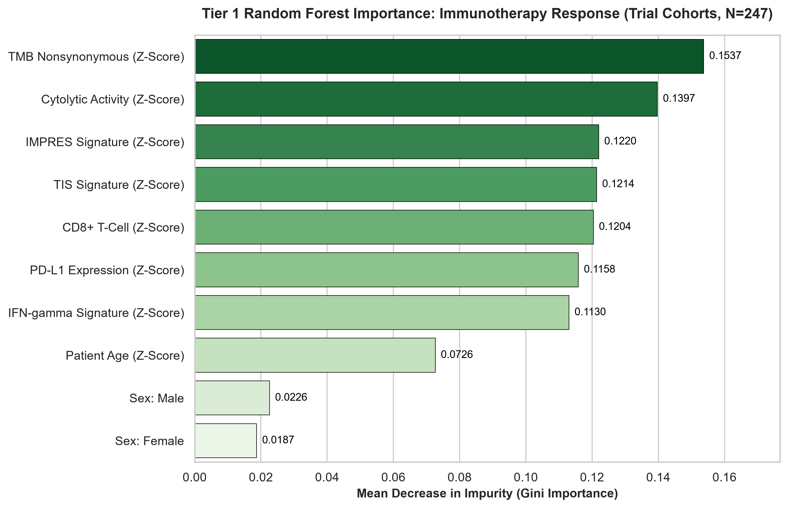
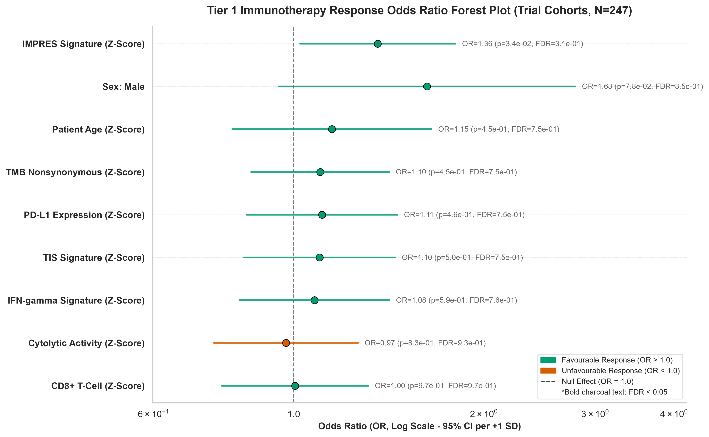
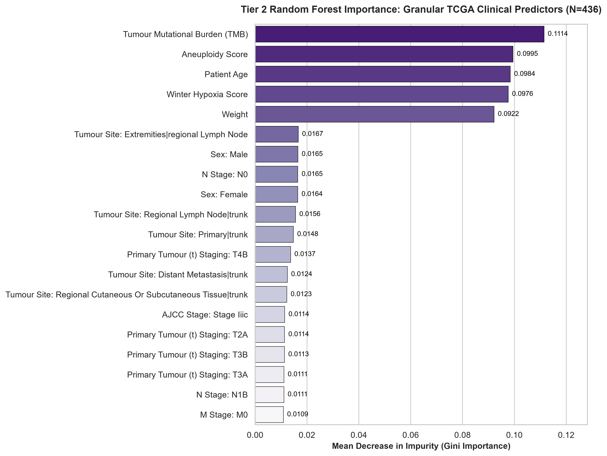
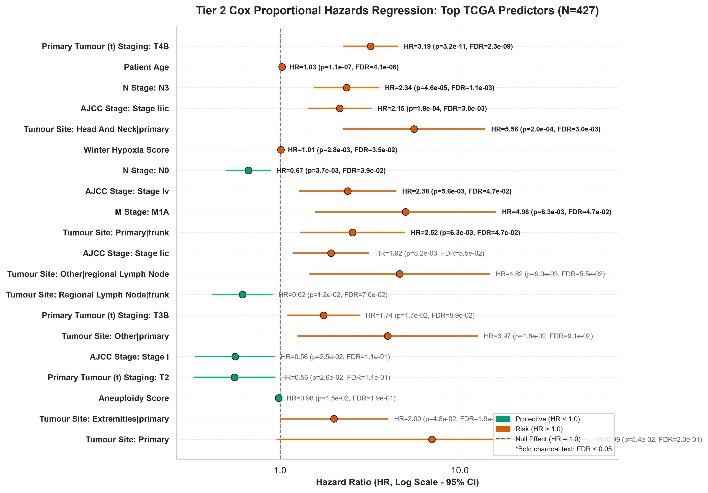

# Two-Tiered Clinical & Transcriptomic Feature Selection Report

This report presents a comprehensive **two-tiered feature selection architecture** evaluating prognostic and predictive clinical markers across melanoma patient populations:

* **Tier 1 (Multi-Cohort Consensus, $N = 699$)**: Evaluates 10 harmonized cross-cohort features (6 transcriptomic immune signatures, $\text{TMB}$, age, sex) pooled across all four study cohorts (**TCGA-SKCM**, **Liu 2019**, **Hugo 2016**, **Riaz 2017**).
* **Tier 2 (Granular TCGA Pathological Staging, $N = 443$)**: Evaluates 77 detailed clinical, pathological TNM staging, anatomical site, aneuploidy, and hypoxia attributes specifically within the **TCGA-SKCM** reference cohort.

## 1. Tier 1: Multi-Cohort Feature Selection (N=699)

* **Total Merged Sample Size**: 699 patients across 4 cohorts
* **Overall Survival Evaluation Cohort**: 686 patients
* **Cox Survival Evaluation Cohort**: 676 patients
* **Anti-PD-1 Response Evaluation Cohort**: 247 trial patients
* **FDR-Significant Survival Predictors (FDR < 0.05)**: 7 features

### 1.1. Random Forest Importance for Overall Survival (N=686)
Random Forest feature importance (500 estimators) trained on the $N = 686$ overall survival cohort:

### 1.2. Univariate Cox Proportional Hazards Regression (N=676)
Univariate Cox Proportional Hazards models fitted across $N = 676$ patients with complete survival duration data:

### 1.3. Random Forest Importance for Anti-PD-1 Immunotherapy Response (N=247)
Random Forest feature importance predicting objective response (CR/PR vs PD) across the $N = 247$ trial cohort:

### 1.4. Univariate Forest Plot for Anti-PD-1 Immunotherapy Response (N=247)
Univariate Logistic Regression Odds Ratio (OR) forest plot predicting objective anti-PD-1 response across the $N = 247$ trial cohort:

## 2. Tier 2: Granular TCGA Pathological & Clinical Staging (N=443)

* **TCGA Total Cohort Sample Size**: 443 patients
* **TCGA OS Classification Cohort**: 436 patients
* **TCGA Cox Survival Evaluation Cohort**: 427 patients
* **Encoded Dummy Features**: 77 dummy variables
* **FDR-Significant Pathological Predictors (FDR < 0.05)**: 10 features

### 2.1. Random Forest Importance for Granular TCGA Clinical Attributes (N=436)
Top 20 Random Forest clinical predictors trained on $N = 436$ TCGA patients with non-null survival status:

### 2.2. Univariate Cox Proportional Hazards Regression for TCGA Attributes (N=427)
Top 20 Univariate Cox hazard ratios evaluated across $N = 427$ TCGA patients with complete survival duration data:

## 3. Key Analytical & Biological Summary

1. **Tier 1 Top Survival Biomarker**: **`IFN-gamma Signature (Z-Score)`** is the single strongest protective statistical predictor across all 4 cohorts (Hazard Ratio = **0.73**, univariate p-value = **5.61e-09**, FDR = **5.05e-08**).
2. **Tier 1 Top Immunotherapy Marker**: **`TMB Nonsynonymous (Z-Score)`** is the top predictive feature for objective anti-PD-1 response across trial cohorts (Gini Importance = **0.1537**).
3. **Tier 2 Top Pathological Staging Marker**: **`Primary Tumour (t) Staging: T4B`** is the strongest clinical predictor of survival in TCGA (Hazard Ratio = **3.19**, p-value = **3.17e-11**, FDR = **2.35e-09**).
4. **Biological Alignment**: Microenvironmental T-cell inflammation signatures ($\\text{IFN-}\gamma$, TIS, CYT, CD8, IMPRES) consistently confer significant mortality risk reduction ($\\text{HR} < 1.0$, $p < 0.01$) across both multi-cohort and single-cohort models.
