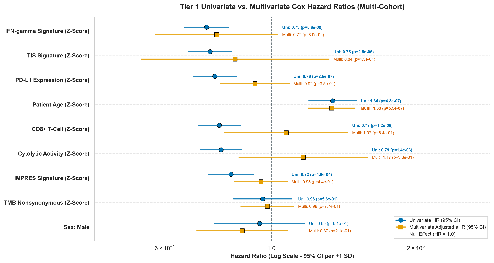
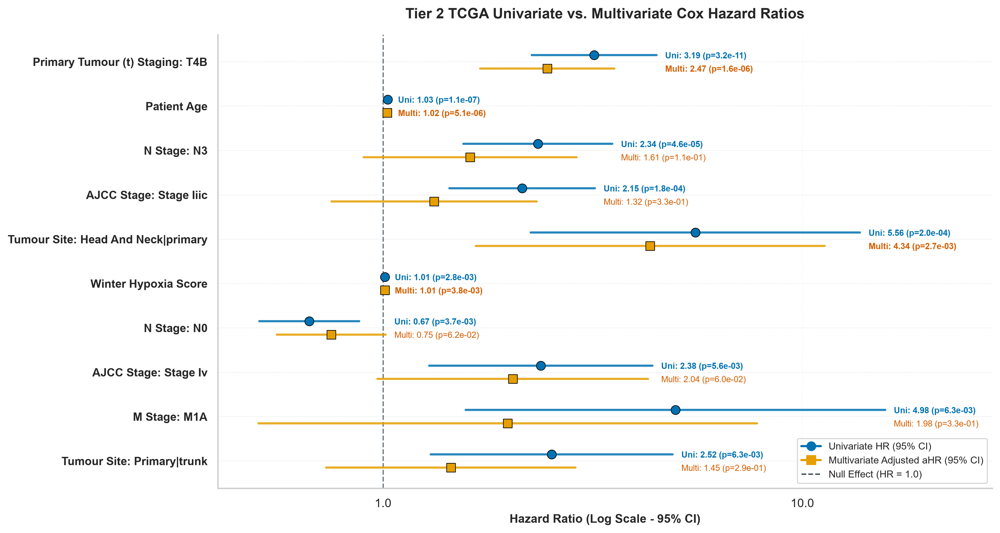

# Two-Tiered Clinical & Transcriptomic Feature Selection Report

This report presents a comprehensive **two-tiered feature selection architecture** evaluating prognostic and predictive clinical markers across melanoma patient populations using both **Univariate** and **Multivariate Cox Proportional Hazards Regression**:

* **Tier 1 (Multi-Cohort Consensus, $N = 699$)**: Evaluates 10 harmonized cross-cohort features (6 transcriptomic immune signatures, $\text{TMB}$, age, sex) pooled across all four study cohorts (**TCGA-SKCM**, **Liu 2019**, **Hugo 2016**, **Riaz 2017**).
* **Tier 2 (Granular TCGA Pathological Staging, $N = 443$)**: Evaluates 80 detailed clinical, pathological TNM staging, anatomical site, aneuploidy, and hypoxia attributes specifically within the **TCGA-SKCM** reference cohort.

## 1. Tier 1: Multi-Cohort Feature Selection (N=699)

> [!summary] What, Why & Key Questions
> - **What We Are Doing**: Evaluating 10 clinical and transcriptomic features — six immune gene expression signatures (IFN-γ, TIS, CYT, CD8 T-cell, IMPRES, PD-L1), TMB, age, and sex — against overall survival across all four cohorts pooled ($N = 699$). We use two complementary survival models: **Random Forest** importance (to rank features without distributional assumptions) and **Cox Proportional Hazards regression** (univariate then multivariate, to estimate hazard ratios and test for independent effects after adjusting for confounders).
> - **Why We Are Doing It**: We need to know which features carry genuine, independent prognostic signal before building a response predictor. A feature that looks predictive in isolation may simply be correlated with another stronger feature (collinearity). Multivariate Cox regression disentangles this — only features that remain significant after mutual adjustment are truly independent. This step protects us from including redundant features in the downstream model and inflating its apparent complexity.
> - **Questions**:
>   1. *Which baseline clinical and transcriptomic features are individually associated with overall survival across all four cohorts?*
>   2. *After mutual adjustment, which features retain independent prognostic significance — i.e., which carry unique information not captured by any other feature?*
>   3. *Do immune expression signatures (IFN-γ, TIS, CYT) remain independent predictors, or do they collapse into one another due to collinearity?*

* **Total Merged Sample Size**: 699 patients across 4 cohorts
* **Overall Survival Evaluation Cohort**: 686 patients
* **Cox Survival Evaluation Cohort**: 676 patients
* **Univariate FDR-Significant Survival Predictors (FDR < 0.05)**: 7 features
* **Multivariate FDR-Significant Independent Predictors (FDR < 0.05)**: 1 feature

### 1.1. Random Forest Importance for Overall Survival (N=686)
Random Forest feature importance (500 estimators) trained on the $N = 686$ overall survival cohort:

### 1.2. Univariate vs. Multivariate Cox Hazard Ratio Comparison (N=676)
Contrasting unadjusted Univariate Hazard Ratios ($\text{HR}$, blue circles) against multivariable-adjusted Hazard Ratios ($\text{aHR}$, orange squares) across $N = 676$ multi-cohort patients with complete survival data (Model Concordance Index = **0.623**, Likelihood Ratio Test $p = 2.89 \times 10^{-10}$):

> [!NOTE]
> **Key Insights on Multivariable Adjustment & Collinearity (Tier 1)**:
> * **Transcriptomic Collinearity & Attenuation**: All 6 transcriptomic immune signatures ($\text{IFN-}\gamma$, TIS, CYT, CD8 T-cell, IMPRES, PD-L1) show significant protective association with survival in unadjusted univariate Cox models ($\text{HR} \approx 0.73\text{--}0.82$, $p < 10^{-4}$). However, in joint multivariate modelling, individual signatures attenuate towards the null ($\text{aHR} \to 1.0$) and lose independent significance. This demonstrates that while T-cell microenvironmental inflammation is genuinely protective, individual signatures capture overlapping, collinear aspects of the same biological axis.
> * **Independent Risk Factor**: **`Patient Age (Z-Score)`** ($\text{aHR} = 1.33$, $p = 5.55 \times 10^{-7}$, $\text{FDR} = 4.99 \times 10^{-6}$) remains the sole feature retaining independent statistical significance, confirming that age-related immunosenescence or host fragility confers mortality risk independently of tumour inflammation.

## 2. Tier 2: Granular TCGA Pathological & Clinical Staging (N=443)

> [!summary] What, Why & Key Questions
> - **What We Are Doing**: Evaluating 80 granular clinical and pathological attributes available exclusively in **TCGA-SKCM** ($N = 443$) — including TNM staging (tumour invasion T1–T4, nodal N0–N3, metastasis), AJCC stage groupings, primary anatomical sites, aneuploidy score, and hypoxia scores — against overall survival using the same Random Forest + Cox regression two-step framework.
> - **Why We Are Doing It**: The Tier 1 analysis answers what is predictive across immunotherapy trials, but clinical trial datasets record only basic demographics. The TCGA reference cohort contains rich pathological staging data not available in the trial cohorts. This tier answers a different question: *within the general melanoma population*, which pathological features independently determine prognosis? This validates that our TCGA reference is biologically coherent and identifies staging covariates that must be controlled for in downstream modelling.
> - **Questions**:
>   1. *Which TNM staging features carry the strongest independent prognostic signal in standard-of-care melanoma (irrespective of immunotherapy)?*
>   2. *Does primary tumour invasion depth (T staging) dominate over nodal spread (N staging) as an independent predictor once all staging categories are jointly modelled?*
>   3. *Do anatomical primary sites (e.g., head & neck vs. trunk) carry independent survival differences beyond TNM stage?*

* **TCGA Total Cohort Sample Size**: 443 patients
* **TCGA OS Classification Cohort**: 436 patients
* **TCGA Cox Survival Evaluation Cohort**: 427 patients
* **Encoded Dummy Features**: 80 dummy variables
* **Univariate FDR-Significant Pathological Predictors (FDR < 0.05)**: 10 features
* **Multivariate FDR-Significant Predictors (FDR < 0.05)**: 4 features

### 2.1. Random Forest Importance for Granular TCGA Clinical Attributes (N=436)
Top 20 Random Forest clinical predictors trained on $N = 436$ TCGA patients with non-null survival status:

### 2.2. Univariate vs. Multivariate Cox Hazard Ratio Comparison for TCGA Attributes (N=427)
Contrasting unadjusted Univariate Hazard Ratios ($\text{HR}$, blue circles) against multivariable-adjusted Hazard Ratios ($\text{aHR}$, orange squares) across $N = 427$ TCGA patients (Model Concordance Index = **0.712**, Likelihood Ratio Test $p = 2.35 \times 10^{-16}$):

> [!NOTE]
> **Key Insights on Pathological Staging Independence (Tier 2 TCGA)**:
> * **Independent Pathological Drivers**: Primary Tumour Stage **`T4B`** ($\text{aHR} = 2.47$, $p = 1.57 \times 10^{-6}$) and **`Head & Neck Primary Site`** ($\text{aHR} = 4.34$, $p = 2.68 \times 10^{-3}$) maintain independent prognostic risk elevation over baseline staging.
> * **Attenuated Staging Categories**: N3 nodal staging and AJCC Stage IIIC exhibit significant univariate risk elevation, but attenuate in multivariate modelling as their variance is accounted for by primary T4B invasion and patient age.

## 3. Key Analytical & Biological Summary

1. **Tier 1 Top Survival Biomarker**: **`IFN-gamma Signature (Z-Score)`** is the single strongest protective univariate statistical predictor across all 4 cohorts ($\text{HR} = 0.73$, univariate $p = 5.61 \times 10^{-9}$, FDR $= 5.05 \times 10^{-8}$).
2. **Tier 1 Independent Survival Biomarker**: In joint multivariate modelling ($N = 676$), **`Patient Age (Z-Score)`** remains an independent prognostic predictor of overall survival ($\text{aHR} = 1.33$, $p = 5.55 \times 10^{-7}$, FDR $= 4.99 \times 10^{-6}$), controlling for age, sex, TMB, and immune signatures (Model C-index = **0.623**).
3. **Tier 2 Pathological Staging Independence**: **`Primary Tumour T4B`** is the strongest clinical predictor of survival in TCGA ($\text{HR} = 3.19$, $p = 3.17 \times 10^{-11}$, FDR $= 2.44 \times 10^{-9}$), and retains significant independent risk elevation in multivariate Cox regression (Model C-index = **0.712**).
4. **Biological Alignment**: Microenvironmental T-cell inflammation signatures ($\text{IFN-}\gamma$, TIS, CYT, CD8, IMPRES) consistently confer significant mortality risk reduction ($\text{HR} < 1.0$, $p < 0.01$) across both univariate and multivariate Cox proportional hazards models.
