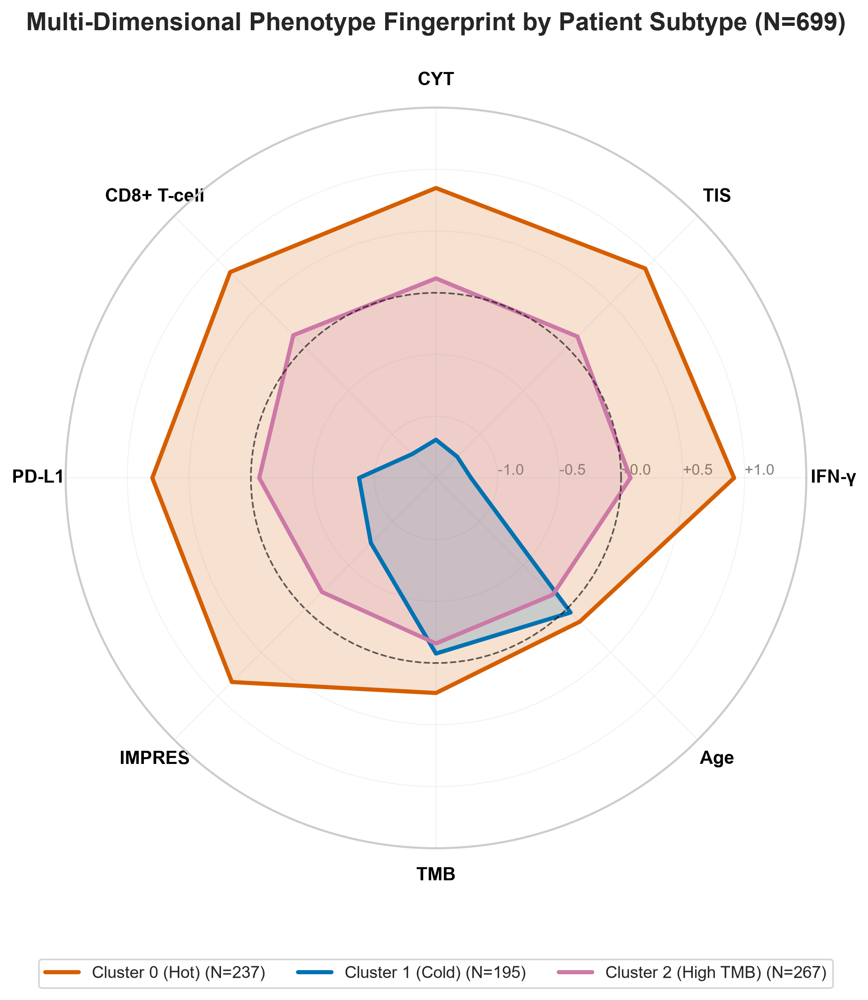

# Patient Phenotyping via Full-Dataset Immunological & Genomic Clustering

> [!INFO] What, Why & Key Questions — Overview
> - **What We Are Doing**: Applying unsupervised Agglomerative Hierarchical Clustering (Ward linkage) to the **entire combined dataset** ($N = 699$ patients across TCGA-SKCM, Liu 2019, Hugo 2016, and Riaz 2017) using six immune expression signatures, TMB, and patient age — all Z-score standardised *within each cohort* before pooling to remove study-platform offsets.
> - **Why We Are Doing It**: Before building a supervised response predictor, we need to know whether biologically meaningful patient subgroups exist in the data at all. If patients naturally cluster into distinct immune phenotypes — "hot" vs. "cold" tumours — then those phenotypes should predict both survival and immunotherapy response. Discovering these groups unsupervised (without using any response labels) provides unbiased biological validation.
> - **Questions**:
>   1. *Do distinct immunological subtypes emerge from the data without supervision?*
>   2. *Do those subtypes differ significantly in overall survival — confirming they capture genuine biology?*
>   3. *Do immunotherapy responders concentrate in the "hot" immune subtype, validating the clusters as clinically meaningful?*

## 1. Subtype Profiles

> [!INFO] What, Why & Key Questions — Subtype Fingerprints
> - **What We Are Doing**: Characterising the three discovered patient subtypes using two visualisations — a polar radar chart showing the multi-dimensional signature fingerprint of each subtype, and an annotated heatmap showing per-patient Z-scores with response rate and survival overlaid.
> - **Why We Are Doing It**: A radar chart reveals the *shape* of each subtype's immune profile at a glance (which signatures are high or low). The heatmap reveals the *within-cluster heterogeneity* — how tightly patients cluster together — and overlays clinical outcome tracks to verify biological coherence.
> - **Questions**:
>   1. *Are the subtypes cleanly separated across all signatures simultaneously, or does separation rely on only one or two markers?*
>   2. *Does the response rate track visibly with the immune intensity track in the heatmap?*

### 1.1. Multi-Dimensional Phenotype Fingerprint (Radar Profile)

The polar radar chart displays the standardised Z-score profiles across transcriptomic immune signatures, mutational burden, and patient age for each subtype:

### 1.2. Annotated Subtype Feature Heatmap & Clinical Tracks

The heatmap details the Z-score signature matrix for each patient cluster, annotated with immunotherapy response rates (CR/PR %) and median overall survival (OS):

## 2. Biological Interpretation of Patient Subtypes

The unsupervised clustering isolates three distinct patient phenotypes:

1. **🔥 Cluster 0: Immunologically Hot** ($N = 237$)
    - *Immune Signatures*: Highest T-cell inflammation across all markers (IFN-$\gamma$ = 8.17, TIS = 7.56, CYT = 6.92, CD8 = 6.95).
    - *Therapeutic Benefit*: Highest immunotherapy response rate (**38/86 = 44.2%** in trial patients).
    - *Prognosis*: Best overall survival (Median OS = 🟢 **103.2 months**).

2. **❄️ Cluster 1: Immunologically Cold** ($N = 195$)
    - *Immune Signatures*: Attenuated T-cell inflammation across all markers (IFN-$\gamma$ = 5.44, TIS = 5.01, CYT = 3.87, CD8 = 3.29).
    - *Therapeutic Benefit*: Lowest response rate to anti-PD-1 therapy (**15/49 = 30.6%** in trial patients).
    - *Prognosis*: Worst overall survival (Median OS = 🔴 **39.3 months**).

3. **🧬 Cluster 2: High-TMB / Hypermutated** ($N = 267$)
    - *Genomics*: Highest tumour mutational burden (**TMB = 16.1 mut/Mb**) with only moderate immune infiltration.
    - *Immune Signatures*: Intermediate T-cell inflammation (IFN-$\gamma$ = 6.48, TIS = 6.11).
    - *Prognosis*: Intermediate survival (Median OS = 🟠 **48.9 months**) — demonstrating that high TMB alone, without a hot immune microenvironment, does not confer the same survival benefit.

## 3. Subtype Visualisation (2D PCA Projection)

> [!INFO] What, Why & Key Questions — PCA Projection
> - **What We Are Doing**: Projecting all $N = 699$ patients onto the first two principal components (PCA) of the feature space to visualise how well the three clusters separate in a lower-dimensional view.
> - **Why We Are Doing It**: A clean 2D separation confirms that the clustering reflects a genuine multi-dimensional structure in the data, not an artefact of the Ward linkage algorithm.
> - **Questions**: *Are clusters geometrically separated in PCA space, or do they overlap substantially?*

## 4. Immunotherapy Response & Overall Survival Validation

> [!INFO] What, Why & Key Questions — Clinical Outcome Validation
> - **What We Are Doing**: Testing whether the unsupervised cluster labels — derived without using any response information — nevertheless stratify immunotherapy response rates (in the $N = 247$ trial patients with binary labels) and overall survival (in the full $N = 699$ dataset).
> - **Why We Are Doing It**: This is the critical validation step. If clusters discovered purely from expression patterns correlate with clinical outcomes, it confirms the biology is real and the subtypes are clinically actionable.
> - **Questions**:
>   1. *Do immunotherapy responders concentrate significantly in the Hot cluster (Chi-Square test)?*
>   2. *Is the survival separation across subtypes statistically significant (Log-Rank test)?*

**Therapeutic Response Rate (Trial Cohorts, $N = 247$ with binary labels)**:

> [!INSIGHT] Chi-Square Response Rate Evaluation
> The Chi-Square test across cluster response rates yields $p = 0.023$ — **statistically significant**. 
> Immunotherapy responders are significantly enriched in the Hot cluster (38/86 = 44.2%) compared to the Cold cluster (15/49 = 30.6%).

**Overall Survival (Full Dataset, $N = 699$)**:

The survival separation across patient subtypes is highly statistically significant (Log-Rank $p = 4.56 \times 10^{-6}$), confirming that the immune phenotypes capture genuine prognostic biology:

> [!INSIGHT] Key Insights: Unsupervised Subtyping Summary
> - **Unsupervised biology is real**: Three distinct immune phenotypes emerge from the data without using any response labels, and they separate significantly by overall survival ($p = 4.56 \times 10^{-6}$).
> - **Immune inflammation, not TMB alone, drives prognosis**: The High-TMB cluster (Cluster 2) shows only intermediate survival despite its high mutational burden — confirming that TMB and immune infiltration act as orthogonal axes.
> - **Response rate stratifies significantly**: Immunotherapy responders are significantly enriched in the Hot cluster (38/86 = 44.2%) vs. Cold cluster (15/49 = 30.6%) ($p = 0.023$), validating the clinical utility of unsupervised microenvironmental phenotyping.

## 5. Methodological Limitations & Future Directions

> [!WARNING] Analytical Scope & Limitations
> - **Cohort Composition Heterogeneity**: The $N = 699$ pooled dataset merges non-small cell TCGA reference samples ($N = 443$) with anti-PD-1 trial cohorts ($N = 256$). Cohort-wise Z-score standardization mitigates platform offsets, but baseline clinical heterogeneity remains.
> - **Trial Cohort Sample Size**: Only $N = 247$ trial patients have documented binary anti-PD-1 response labels. While the response stratification achieves significance ($p = 0.023$), expanding trial sample sizes will improve per-cluster subgroup precision.
> - **Arbitrary Cluster K Choice**: K=3 was selected based on biological interpretability (Hot, Cold, High-TMB). Alternative clustering algorithms (e.g. GMM, HDBSCAN) or higher K values may resolve finer microenvironmental sub-states.
> - **Z-Score Normalization Dependence**: Cluster boundaries depend on within-cohort standardization; applying this subtyping scheme to a single new patient requires reference cohort normalization params.