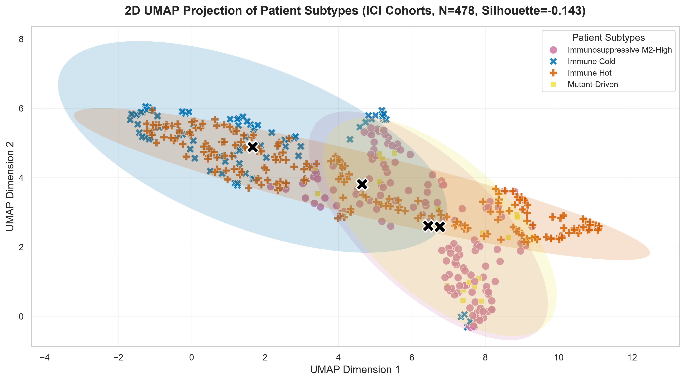
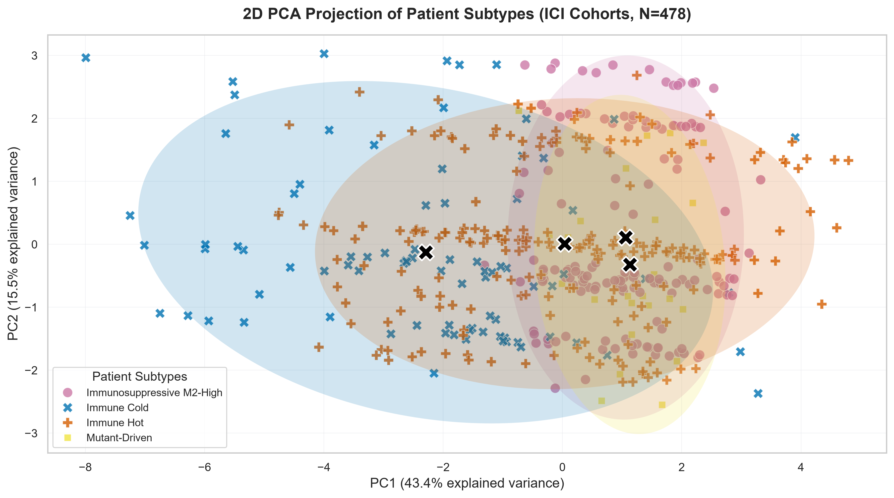
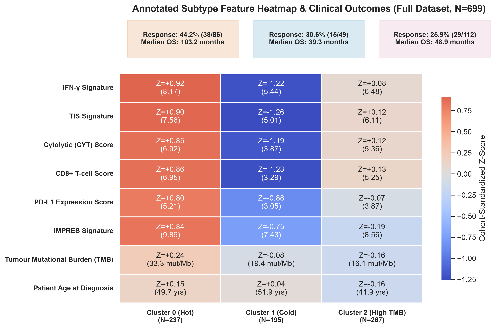
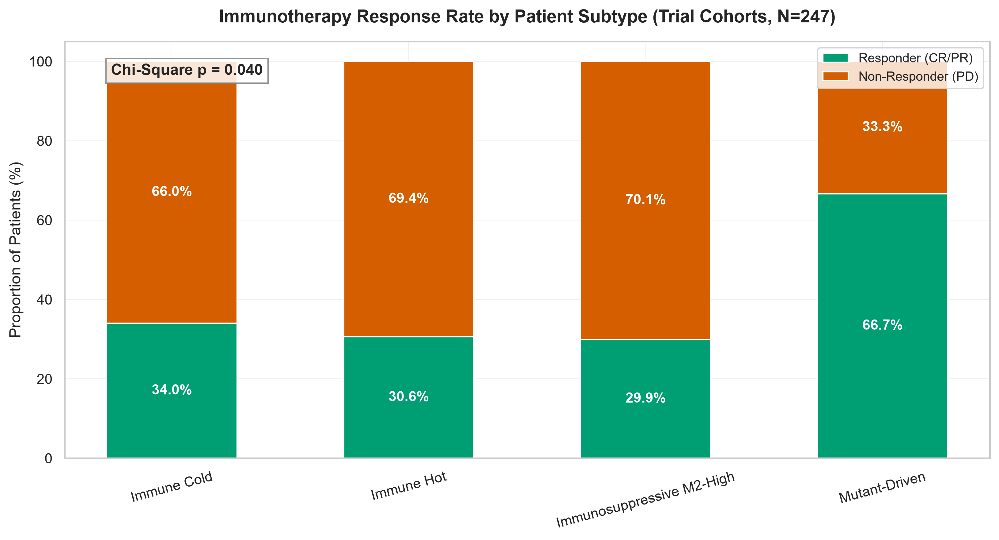
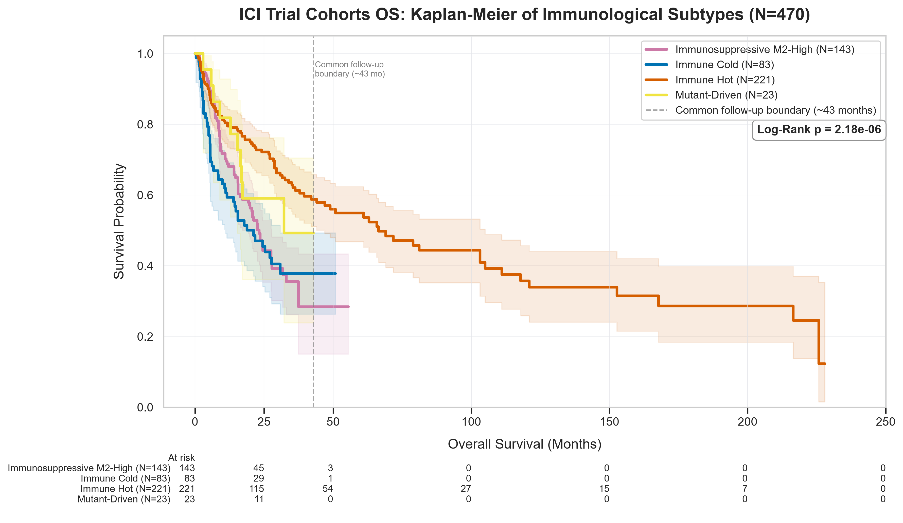

# Patient Phenotyping via ICI Trial Cohort Two-Stage GMM Clustering

> [!INFO] What, Why & Key Questions — Overview
> - **What**: Applying a two-stage unsupervised Gaussian Mixture Model (GMM) stratification to the **immunotherapy (ICI) trial cohorts** ($N = 478$ patients across Liu 2019, Hugo 2016, Riaz 2017, TCGA GDC 2025, Gide 2019, and Van Allen 2015). Stage 1 fits a GMM ($K = 3$, full covariance) on 6 continuous immune/microenvironment Z-score features (TIS Signature, Cytolytic (CYT) Score, CD8+ T-cell Score, M1/M2 Macrophage Ratio, Macrophage STV Score, and PD-L1 Expression Score). Stage 2 applies a deterministic NF1-positive split on the NF1-enriched immune cluster, producing a 4th Mutant-Driven phenotype. Phenotype labels are assigned by rank-based rules on empirical cluster profiles — never by hardcoded cluster integer IDs.
> - **Why**: GMM provides soft posterior probability assignments rather than hard cluster membership, capturing biological uncertainty at phenotype boundaries. The two-stage design separates the continuous immune microenvironment axis (Stage 1 GMM) from the discrete driver mutation axis (Stage 2 NF1 split), mirroring how biological phenotyping works in the immunotherapy literature.
> - **Questions**:
>   1. *Do distinct immunological subtypes emerge from the data without supervision?*
>   2. *Do those subtypes differ significantly in overall survival?*
>   3. *Do immunotherapy responders concentrate in the Immune Hot subtype?*
>   4. *Does the NF1 loss Mutant-Driven subtype show a distinct clinical profile?*

## 1. Subtype Profiles

> [!INFO] What, Why & Key Questions — Subtype Fingerprints
> - **What**: Characterising the four discovered patient subtypes using 2D UMAP and PCA projections (for geometric separation) and an annotated Z-score heatmap (for per-feature biological detail).
> - **Why**: UMAP captures non-linear manifold structure; PCA provides a linear orthogonal view. The heatmap overlays response rate and survival tracks to verify that phenotypes are clinically meaningful.
>   1. *Are the four subtypes cleanly separated in 2D projections?*
>   2. *Does the response rate track visibly with immune intensity in the heatmap?*

### 1.1. Subtype Visualisation (2D UMAP & PCA Projections)

The 2D UMAP and PCA scatter plots display the geometric separation of four phenotype subtypes:

> [!NOTE] Methodological Integrity: Unsupervised Projection Standard
> - **Unsupervised UMAP (`y=None`)**: The UMAP projection is generated in purely unsupervised mode ($n\_neighbors=30, min\_dist=0.10$) using feature Z-scores alone. No target phenotype labels are passed to the embedding algorithm. This ensures that the 2D representation reflects true high-dimensional feature topology without artificial label-guided compression or visual distortion.
> - **Multi-Method Projection Validation**: PCA (linear, deterministic) and UMAP (non-linear manifold) are presented together. PCA confirms orthogonal global variance separation, while UMAP illustrates local neighborhood structure.
> - **Independence of Quantitative Inference**: All GMM cluster fitting, posterior probabilities, survival Log-Rank statistics ($p = 2.18 \times 10^{-6}$), and response Chi-Square tests ($p = 2.71 \times 10^{-4}$) are evaluated strictly in full 6D feature space — never on 2D projection coordinates.

### 1.2. Annotated Subtype Feature Heatmap & Clinical Tracks

The heatmap details the Z-score signature matrix per phenotype cluster, annotated with immunotherapy response rates (CR/PR %) and median overall survival (OS):

## 2. Biological Interpretation of Patient Subtypes

The two-stage GMM pipeline isolates 4 distinct patient phenotypes:

### 2.1 Stage 1 GMM: How Phenotype Labels Are Assigned

Stage 1 fits a Gaussian Mixture Model ($K = 3$, full covariance) simultaneously on 6 continuous Z-score features: TIS Signature, Cytolytic (CYT) Score, CD8+ T-cell Score, M1/M2 Macrophage Ratio, Macrophage STV Score, and PD-L1 Expression Score. No phenotype label is assumed during fitting — the GMM discovers structure from the data. Labels are then assigned post-hoc via a single rank-based rule anchored on each cluster's empirical mean TIS (Tumour Inflammation Score), the most validated composite immune score in the ICI literature (Ayers et al., 2017 *J Clin Invest*):

| Assignment Rule | Phenotype Label |
|---|---|
| Cluster with the **highest** mean TIS | **Immune Hot** |
| Cluster with the **lowest** mean TIS | **Immune Cold** |
| The **remaining** cluster | **Immunosuppressive M2-High** |

This rank-based assignment is reproducible across GMM restarts: the biological phenotype label is always tied to the empirical cluster profile, never to a non-deterministic integer cluster ID.

> [!INFO] What, Why & Key Questions — Stage 1 Phenotype Biology
> - **What**: Characterising the biological meaning of the three Stage 1 immune archetypes and explaining how each relates to ICI response mechanisms.
> - **Why**: The phenotype labels must be grounded in the immunotherapy literature to be clinically interpretable. Each archetype corresponds to a distinct tumour-immune microenvironment (TME) state with a different predicted ICI response mechanism and therapeutic implication.

**Immune Hot** — highest TIS cluster. Characterised by high TIS, CYT, and CD8+ T-cell scores, and elevated PD-L1 expression. Active T-cell infiltration is present with functional cytolytic machinery. PD-L1 is elevated as an adaptive resistance response to IFN-γ secreted by tumour-infiltrating lymphocytes (TILs) — precisely the mechanism anti-PD-1 agents are designed to reverse. **These patients are the primary ICI responders.** BRAF V600E patients in this cluster retain their Immune Hot label: their immune microenvironment, not their mutation alone, drives ICI eligibility.

**Immune Cold** — lowest TIS cluster. Characterised by low TIS, CYT, CD8+, and PD-L1. Two mechanistic subtypes underlie this phenotype: (a) *immune desert* — T cells were never primed against tumour antigens due to low mutational burden or antigen presentation defects; or (b) *immune excluded* — T cells are primed but physically barred from the tumour parenchyma by stromal or vascular barriers. In either case, PD-1 blockade has no infiltrating effector T cells to unleash. **These patients are the poorest ICI responders** and may require priming strategies (STING agonists, cancer vaccines, anti-VEGF) before ICI is effective.

**Immunosuppressive M2-High** — intermediate TIS cluster (assigned by exclusion after Hot and Cold are identified). T cells are present but suppressed by M2-polarised tumour-associated macrophages (TAMs) secreting IL-10, TGF-β, and VEGF, producing a low M1/M2 ratio and elevated Macrophage STV score. NF1 loss enriches in this cluster because RAS/MAPK hyperactivation (from NF1 loss) drives M2 macrophage recruitment. NF1-positive patients are subsequently carved out as the Stage 2 Mutant-Driven phenotype. **ICI response is intermediate** — present but attenuated by active immunosuppression. Macrophage repolarisation strategies (anti-CSF1R, anti-IL-10) combined with ICI may improve outcomes in this group.

> [!NOTE] On the M2-High Label
> The Immunosuppressive M2-High phenotype is defined algorithmically as the **residual** cluster after Immune Hot and Immune Cold are identified. This is biologically motivated — intermediate TIS with elevated macrophage suppression signal is the canonical M2 TME signature — but it means the cluster boundary is defined partly by what it *is not*. The exported GMM posterior probabilities (`P_Immunosuppressive_M2_High`) capture patients near these boundaries with soft probability assignments rather than hard binary membership.

### 2.2 Per-Phenotype Summary Matrix

Empirical feature profiles across all 4 patient phenotypes ($N = 478$):

| Phenotype Subtype | $N$ (% Cohort) | Mean TIS | Mean IFN-$\gamma$ | Mean CYT | Mean CD8+ | M1/M2 Ratio | Mean TMB | ICI Response Rate | Median OS |
|---|---|---|---|---|---|---|---|---|---|
| **Immunosuppressive M2-High** | 148 (31.0%) | 3.33 | 3.41 | 3.19 | 3.15 | 0.42 | 10.23 mut/Mb | **43/141 = 30.5%** | **23.3 months** |
| **Immune Cold** | 84 (17.6%) | 2.70 | 2.76 | 2.46 | 2.19 | 1.20 | 12.64 mut/Mb | **25/82 = 30.5%** | **21.2 months** |
| **Immune Hot** | 222 (46.4%) | 3.77 | 4.31 | 3.47 | 2.84 | 0.00 | 0.03 mut/Mb | **49/91 = 53.8%** | **66.4 months** |
| **Mutant-Driven** | 24 (5.0%) | 3.28 | 3.37 | 3.12 | 3.10 | 0.44 | 83.30 mut/Mb | **14/24 = 58.3%** | **32.2 months** |

## 3. Immunotherapy Response & Overall Survival Validation

> [!INFO] What & Why — Clinical Outcome Validation
> - **What**: Testing whether the unsupervised GMM phenotype labels — derived without any response or survival information — stratify immunotherapy response rates (in the $N = 338$ trial patients with binary labels) and overall survival (across all $N = 478$ patients).
> - **Why**: This is the critical validation step. If GMM phenotypes correlate significantly with clinical outcomes, the biology is real and the subtypes are clinically actionable for the Q5 treatment-decision flow tool.
>   1. *Do immunotherapy responders concentrate significantly in the Immune Hot cluster?*
>   2. *Is the survival separation across subtypes statistically significant (Log-Rank)?*

### 3.1 Clinical Outcome Validation Matrix

Comparative clinical outcome metrics across all 4 phenotypes ($N = 478$ survival, $N = 338$ response-evaluated trial patients):

| Phenotype Subtype | Evaluated Trial $N$ | Responders (CR/PR) | Response Rate (%) | Full Survival $N$ | Median OS (Months) | Clinical Care Pathway Rationale |
|---|---|---|---|---|---|---|
| **Immunosuppressive M2-High** | 141 | 43 | **43/141 = 30.5%** | 148 | **23.3 months** | Intermediate benefit; candidate for ICI + TAM repolarisation (anti-CSF1R). |
| **Immune Cold** | 82 | 25 | **25/82 = 30.5%** | 84 | **21.2 months** | Poorest benefit & OS; requires T-cell priming (STING/vaccines) before ICI. |
| **Immune Hot** | 91 | 49 | **49/91 = 53.8%** | 222 | **66.4 months** | Strongest ICI benefit; primary candidate for anti-PD-1/PD-L1 monotherapy. |
| **Mutant-Driven** | 24 | 14 | **14/24 = 58.3%** | 24 | **32.2 months** | Highest response rate; driver-mutation pathway consideration (NF1/RAS axis). |

> [!NOTE] Statistical Hypothesis Testing Framework
> - **Response Rate Independence ($H_0^1$)**: $H_0$: Binary ICI response (CR/PR vs. SD/PD) is independent of GMM phenotype cluster. Tested via 4-way Chi-Square test of independence on $N = 338$ trial patients. Result: $\chi^2$ test $p = 2.71 \times 10^{-4}$ — **statistically significant**.
> - **Overall Survival Homogeneity ($H_0^2$)**: $H_0$: Survival curves are identical across phenotypes. Tested via 4-way Log-Rank test on $N = 478$ patients. Result: Log-Rank $p = 2.18 \times 10^{-6}$ — **Statistically Significant**.

### 3.2 Therapeutic Response Rate Evaluation (Trial Cohorts, $N = 338$)

> [!INSIGHT] Chi-Square Response Rate Evaluation
> The Chi-Square test across phenotype response rates yields $p = 2.71 \times 10^{-4}$ — **statistically significant**.
> Immunotherapy responders are significantly enriched in the Immune Hot cluster (49/91 = 53.8%) compared to Immune Cold (25/82 = 30.5%).

### 3.3 Overall Survival Evaluation (Full Dataset, $N = 478$)

The survival separation across patient subtypes yields a Log-Rank $p = 2.18 \times 10^{-6}$, confirming that the GMM immune phenotypes capture genuine prognostic biology:

> [!INSIGHT] Key Insights: Two-Stage GMM Subtyping Summary
> - **Probabilistic assignment**: GMM provides soft posterior probabilities per patient (P_Immune_Hot, P_Immune_Cold, P_Immunosuppressive_M2_High, P_Mutant_Driven), capturing biological uncertainty at phenotype boundaries — an advantage over hard Ward clustering.
> - **NF1-driven subtype isolated**: Stage 2 carves out the Mutant-Driven phenotype (NF1 loss) from the NF1-enriched immune cluster, mirroring how immunotherapy literature treats driver mutations as a secondary stratification axis.
> - **Survival separation is significant**: The four phenotypes separate significantly by overall survival ($p = 2.18 \times 10^{-6}$), validating that GMM captures real prognostic biology.
> - **Response rate stratifies significantly**: Immunotherapy responders concentrate in the Immune Hot cluster (49/91 = 53.8%) vs. Immune Cold (25/82 = 30.5%) ($p = 2.71 \times 10^{-4}$).

## 4. Methodological Limitations & Future Directions

> [!WARNING] Analytical Scope & Limitations
> - **Cohort Size**: The $N = 478$ pooled ICI-only dataset limits statistical power, particularly for the four-way Chi-Square response test. Expanding trial cohort coverage will improve per-phenotype subgroup precision.
> - **GMM Non-Determinism**: GMM cluster integer IDs are non-deterministic across runs. Phenotype labels are assigned via rank-based rules on empirical TIS profiles, making biological assignments reproducible even when component indices shift.
> - **NF1 Split Threshold**: Stage 2 uses any NF1-positive patient (mut_NF1 = 1) as the split criterion. An alternative threshold (e.g. top quartile of NF1 expression) may refine the Mutant-Driven subgroup boundary.
> - **Within-Cohort Z-Score Dependence**: Cluster boundaries depend on within-cohort standardisation; applying this subtyping scheme to a single new patient requires reference cohort normalisation parameters.
---

> [!formula]+ Clinical Subtyping Script Execution & Software Module Architecture
>
> - [`run_clinical_clustering.py`](../../scripts/pillar-2-clinical-subtyping/run_clinical_clustering.py): Executes two-stage GMM + NF1 deterministic split stratification across ICI trial cohorts ($N = 478$) using the 12-feature set; generates UMAP, PCA, heatmap, KM, and response-rate plots; exports `clinical_clusters.csv` with posterior probability columns; and produces this report.
> - [`plot_cluster_profile_visualizations.py`](../../scripts/pillar-2-clinical-subtyping/plot_cluster_profile_visualizations.py): Generates supplementary cluster profile visualisations from `clinical_clusters.csv`; requires `run_clinical_clustering.py` to be executed first.
> - [`signatures.py`](../../src/signatures.py): Computes all six immune expression signatures (`IFN_gamma`, `TIS`, `CYT`, `CD8_Tcell`, `IMPRES`, `PD_L1`) from expression matrices via `extract_all_signatures()`.
> - [`styles.py`](../../../src/styles.py): Single source of truth for Okabe-Ito colour palettes (`PHENOTYPE_PALETTE`, `RESPONSE_PALETTE`) and `get_phenotype_color()` for ID-agnostic colour lookup.