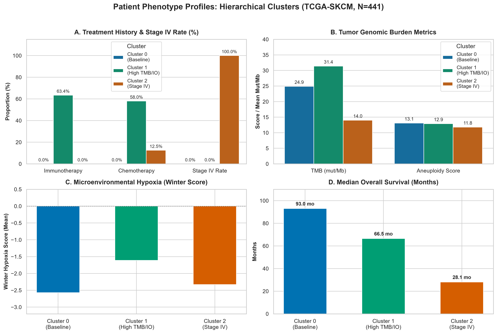
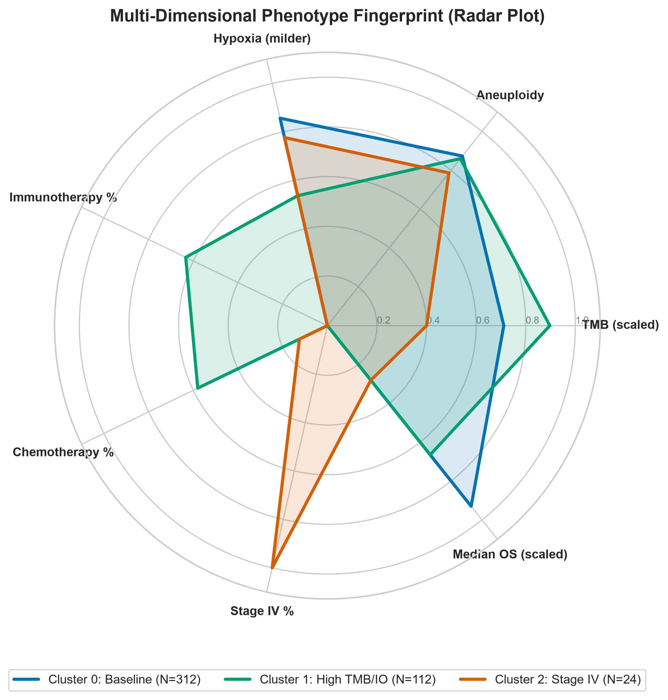

# Clinical Phenotyping & Feature Selection Report

This report documents the clinical feature selection and unsupervised patient subtyping performed on the **TCGA-SKCM** reference cohort ($N = 441$ samples). Non-expression clinical and demographic variables were evaluated using Random Forest Gini importance, univariate Cox Proportional Hazards regression, and Agglomerative Hierarchical Clustering (Ward linkage).

---

## 1. Dataset Characteristics & Feature Encoding

* **Total Samples Analyzed**: 441 patients
* **Original Clinical Attributes**: 57
* **Encoded Feature Columns**: 78 dummy-coded variables

### Excluded Columns Groupings
To prevent data leakage and administrative noise, features were categorized and filtered:
* **Identifiers and Administrative**: `['PATIENT_ID', 'SAMPLE_ID', 'ICD_10', 'ICD_O_3_HISTOLOGY', 'ICD_O_3_SITE']`
* **Outcome Variables**: `['OS_STATUS', 'OS_MONTHS', 'PFS_STATUS', 'PFS_MONTHS', 'DSS_STATUS', 'DSS_MONTHS']`
* **Redundant Variables**: `['DAYS_LAST_FOLLOWUP', 'PERSON_NEOPLASM_CANCER_STATUS']`
* **Socioeconomic Confounders**: `['ETHNICITY', 'GENETIC_ANCESTRY_LABEL', 'RACE', 'PRIOR_DX']`
* **Collection Process Artefacts**: `['TISSUE_SOURCE_SITE', 'TISSUE_SOURCE_SITE_CODE', 'MSI_SCORE_MANTIS', 'MSI_SENSOR_SCORE', 'TBL_SCORE']`
* **Treatment Type History**: `['HISTORY_NEOADJUVANT_TRTYN', 'NEW_TUMOR_EVENT_AFTER_INITIAL_TREATMENT', 'RADIATION_THERAPY', 'TREATMENT_TYPES', 'TREATMENT_AGENTS', 'TX_TYPE_RADIATION_THERAPY', 'TX_TYPE_CHEMOTHERAPY', 'TX_TYPE_IMMUNOTHERAPY', 'TX_TYPE_VACCINE', 'TX_TYPE_HORMONE_THERAPY', 'TX_TYPE_TARGETED_MOLECULAR_THERAPY', 'TX_TYPE_ANCILLARY', 'TX_TYPE_OTHER', 'TX_AGENT_*']`

---

## 2. Clinical Feature Selection Methods

### 2.1. Random Forest Classifier Importance
A Random Forest classifier was trained to predict binary overall survival status (`OS_STATUS`) using all encoded clinical variables. Features are ranked by their Gini importance.

#### Feature Importance Visualization

### 2.2. Cox Proportional Hazards Regression (Univariate)
Univariate Cox Proportional Hazards models (`lifelines.CoxPHFitter`) were fitted to assess the association of each individual feature with overall survival time (`OS_MONTHS`) and survival status (`OS_STATUS`). Features are sorted by statistical significance (lowest p-value).

#### Cox Forest Plot

### 2.3. Key Findings & Biological Summary
1. **Random Forest Top Predictor**: The feature with the highest predictive value for binary overall survival status is **`Weight`**.
2. **Cox Regression Top Predictor**: The feature most statistically associated with survival duration is **`Primary Tumour (T) Staging: T4b`** (univariate Cox p-value = $2.09 \times 10^{-11}$, Hazard Ratio = 3.190).
3. **Pathology vs. Sourcing**: Pathology staging features (like AJCC Stage or Primary Tumour T-Staging dummy variables) rank highly across both models, validating the clinical value of anatomical staging.
4. **TMB & Hypoxia**: Quantitative metrics (e.g., `TMB_NONSYNONYMOUS` or hypoxia scores) are highly ranked, highlighting the coupling between genomic mutations/tumor microenvironment stress and overall survival outcomes.
5. **Sample Type & Primary Disease**: Primary tumor samples (`SAMPLE_TYPE_Primary`) show significantly higher hazard ratios ($\text{HR} = 3.34$, univariate Cox p-value = $3.50 \times 10^{-8}$) compared to metastatic samples in this cohort, representing a distinct risk profile.

---

## 3. Patient Phenotyping via Unsupervised Clustering

We performed unsupervised phenotyping on the **TCGA-SKCM** cohort ($N = 426$ aligned patients) using Agglomerative Hierarchical Clustering (Ward linkage). Patient profiles were constructed across demographics, tumor genetics, microenvironmental stress, and adjuvant therapy classes.

### 3.1. Visual Cluster Profiles & Multi-Dimensional Fingerprints

To visualize how the three patient clusters differ across clinical presentation, treatment history, tumor mutational burden, hypoxia, and survival outcomes, the multi-dimensional profiles are presented below in a **Visual Feature Dashboard** and a **Polar Radar Fingerprint Chart**:

Click to view exact numerical summary table

| Feature / Clinicopathological Metric | Cluster 0 ($N=312$) | Cluster 1 ($N=112$) | Cluster 2 ($N=24$) |
| :--- | :--- | :--- | :--- |
| **Demographics & Baseline** | | | |
| Patient Count ($N$) | 312 | 112 | 24 |
| Age (Years, Mean) | 58.8 | 54.3 | 54.9 |
| **Genomics** | | | |
| TMB (Nonsynonymous, Mean Mut/Mb) | 24.9 | **31.4** | 14.0 |
| Aneuploidy Score (Mean) | 13.1 | 12.9 | 11.8 |
| **Microenvironment** | | | |
| Winter Hypoxia Score (Mean) | -2.57 | -1.61 | -2.33 |
| **Adjuvant Treatment History** | | | |
| Chemotherapy Received (%) | 0.0% | 58.0% | 12.5% |
| Immunotherapy Received (%) | 0.0% | **63.4%** | 0.0% |
| Radiation Therapy Received (%) | 21.5% | 37.5% | 20.8% |
| **Clinical Presentation** | | | |
| Primary Specimen Type (%) | 19.9% | 14.3% | 12.5% |
| Stage IV Metastatic Disease (%) | 0.0% | 0.0% | **100.0%** |
| **Prognosis & Outcomes** | | | |
| Median Overall Survival | **93.0 months** | **66.5 months** | **28.1 months** |

### 3.2. Clinical Interpretation of Subtypes

Based on the multi-dimensional profiles, the three clusters represent distinct disease states:

1. **Cluster 0: Baseline Disease / Primary Specimen Phenotype** ($N=312$)
   * _Genomics_: Moderate chromosomal instability (aneuploidy score = 13.1) and moderate TMB (24.9 mut/Mb).
   * _Microenvironment_: Low-moderate Winter hypoxia score (-2.57).
   * _Clinical_: Stage IV rate = 0.0%. Highest rate of primary specimens (19.9%). No immunotherapy (0.0%).
   * _Prognosis_: Better overall survival trajectory.

2. **Cluster 1: High Mutational Load & Immunotherapy Phenotype** ($N=112$)
   * _Genomics_: Elevated copy-number alterations (aneuploidy score = 12.9) and the highest mutational load (**TMB = 31.4 mut/Mb**).
   * _Microenvironment_: Low-moderate Winter hypoxia score (-1.61).
   * _Clinical_: Stage IV rate = 0.0%. Lower primary tumor rate (14.3%). High rate of immunotherapy (63.4%).
   * _Prognosis_: Moderate survival trajectory.

3. **Cluster 2: Stage IV / Advanced Metastatic Disease Phenotype** ($N=24$)
   * _Genomics_: Lower mutational load (TMB = 14.0 mut/Mb) and lowest copy-number alterations (aneuploidy score = 11.8).
   * _Clinical_: **100% of these patients have Stage IV disease**. No patients received immunotherapy (0.0%).
   * _Prognosis_: Poor overall survival trajectory (Median Overall Survival = **28.1 months**).

### 3.3. Cluster Visualisation (2D PCA Projection)
Below is a 2D PCA projection of the multi-dimensional patient profiles, showing the distinct separation of the three clinical-genomic patient groups. The 'X' markers show the cluster centroids:

### 3.4. Kaplan-Meier Survival Analysis
The unsupervised patient clusters show a statistically significant separation in overall survival duration (Log-Rank p-value = **$1.82 \times 10^{-2}$**):

