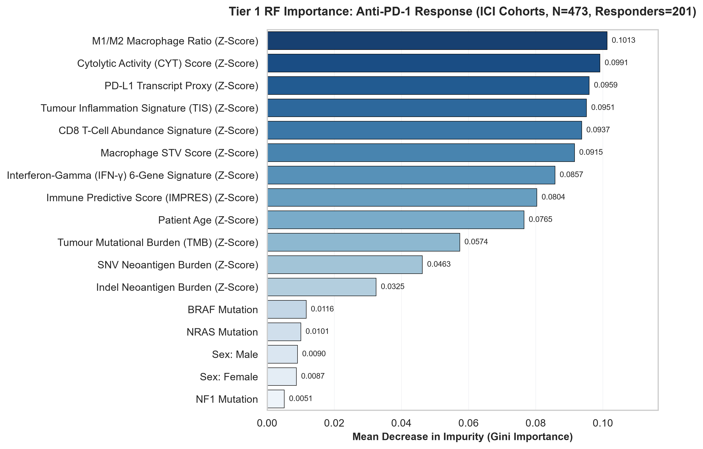
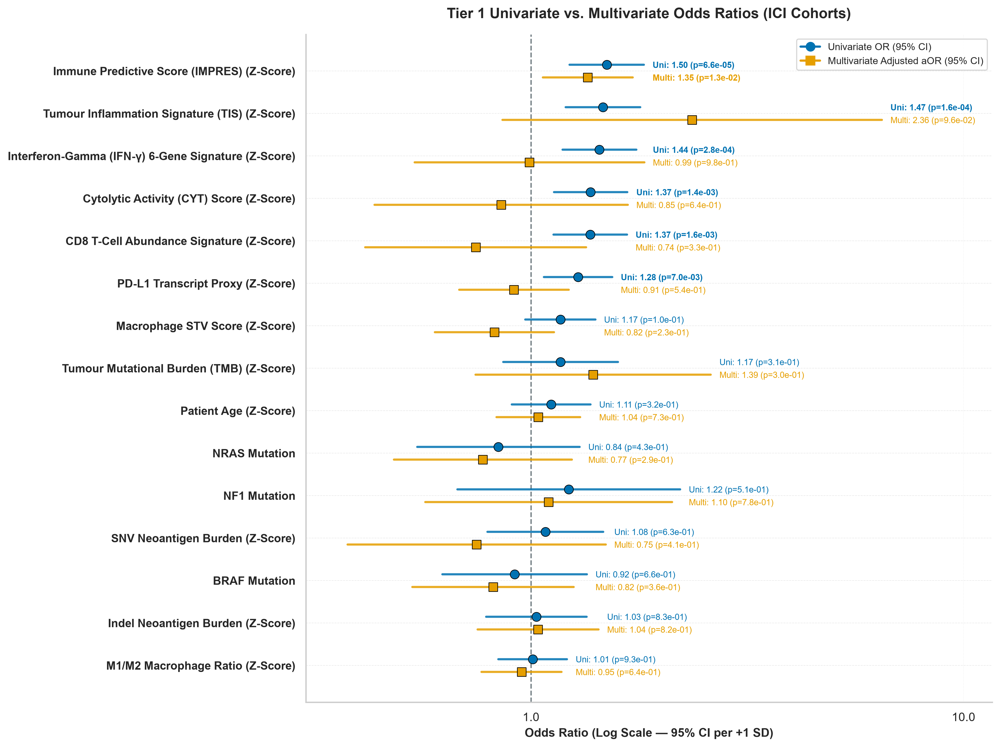
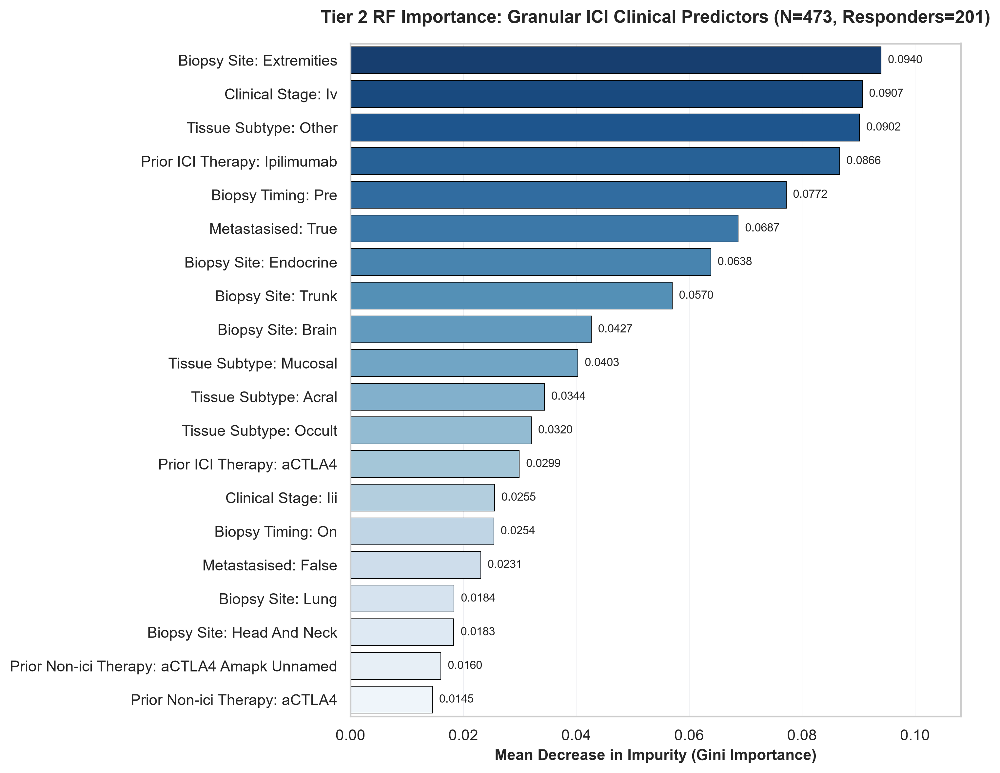
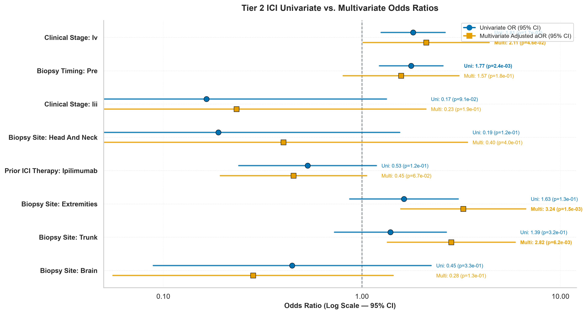
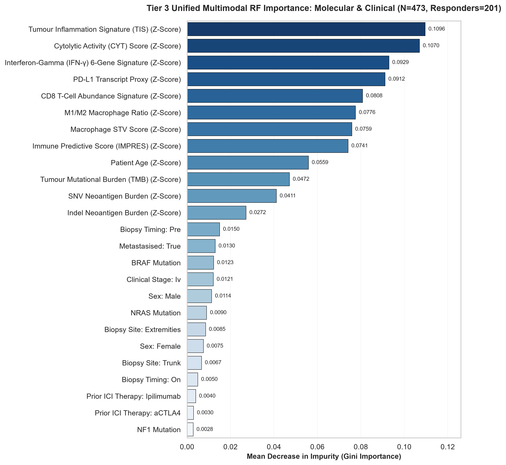
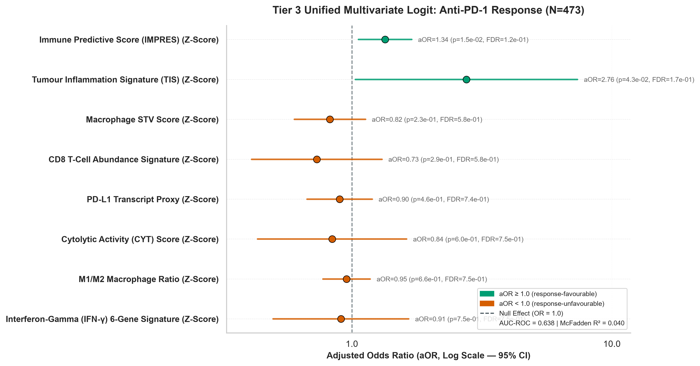

# Two-Tiered Clinical & Transcriptomic Feature Selection Report

This report presents a **two-tiered feature selection architecture** evaluating clinical and transcriptomic predictors of **anti-PD-1 binary response** across the three ICI clinical trial cohorts (Liu 2019, Hugo 2016, and Riaz 2017). Feature selection is performed exclusively on ICI cohorts — TCGA-SKCM is excluded because downstream response prediction models are trained solely on immunotherapy trial data.

- **Tier 1 (ICI Multi-Cohort Immune Signatures, $N = 930$)**: Evaluates 6 transcriptomic immune signatures, $\text{TMB}$, age, and sex — pooled across **Liu 2019**, **Hugo 2016**, and **Riaz 2017**.
- **Tier 2 (ICI Granular Clinical Features, $N = 930$)**: Evaluates 27 granular categorical baseline clinical covariates available within the ICI trial cohorts.

## 1. Tier 1: ICI Multi-Cohort _Immune_ Feature Selection ($N = 930$)

> [!INFO] What, Why & Questions — Tier 1
> - **What**: Evaluating 6 transcriptomic immune gene expression signatures, `TMB`, age, and sex against **anti-PD-1 binary response** ($N_{\text{resp}} = 201$ / $N_{\text{non-resp}} = 272$) across all 3 ICI cohorts pooled ($N = 473$). Two complementary models are applied: **Random Forest** importance and **Logistic Regression**.
> - **Why**: These features directly reflect the tumour immune microenvironment hypothesised to drive anti-PD-1 response.
> - **Questions**:
>   1. *Which transcriptomic immune features are individually associated with anti-PD-1 response?*
>   2. *After mutual adjustment, which features retain independent predictive significance?*
>   3. *Do the 6 immune expression signatures exhibit collinearity?*

- **Total ICI Sample Size**: 930 patients across 3 cohorts (Liu 2019, Hugo 2016, and Riaz 2017)
- **Response Evaluation Cohort**: 473 patients (201 responders / 272 non-responders)
- **Univariate FDR-Significant Predictors (FDR < 0.05)**: 6 features
- **Multivariate FDR-Significant Predictors (FDR < 0.05)**: 0 feature(s)

### 1.1. Biological & Clinical Rationale for Tier 1 Feature Selection

Tier 1 features were selected to evaluate five primary biological domains hypothesised 
to drive response or primary resistance to anti-PD-1 immune checkpoint blockade:

| Feature Category | Features Included | Primary Biological Rationale & Mechanistic Role |
| :--- | :--- | :--- |
| **Transcriptomic Immune Signatures** | `IFN_gamma`, `TIS`, `CYT`, `CD8_Tcell`, `IMPRES`, `PD_L1` | **T-Cell Inflammation & Exhaustion**: Pre-existing CD8+ T-cell infiltration (`CD8_Tcell`) and cytolytic killing activity (`CYT`). IFN-$\gamma$ signaling upregulates adaptive PD-L1 (`CD274`). `TIS` and `IMPRES` capture suppressed adaptive microenvironmental immunity. |
| **Myeloid & TAM Polarization** | `M1_M2_Ratio`, `Macrophage_STV_Score` | **Innate Immunosuppression**: Pro-inflammatory M1 (antitumour) vs immunosuppressive M2 (protumour) macrophage balance. M2 TAMs secrete IL-10/TGF-$\beta$, impairing T-cell trafficking. |
| **Genomic Burden & Neoantigens** | `TMB`, `SNV_NEOANTIGEN`, `INDEL_NEOANTIGEN` | **Somatic Antigenicity**: Somatic mutation density (`TMB`) generates HLA-bound neoepitopes. Frameshift indels generate novel non-self peptides with high immunogenicity. |
| **Genomic Driver Subtypes** | `mut_BRAF`, `mut_NRAS`, `mut_NF1` | **Tumour Secretome**: `BRAF` V600 activates MAPK to secrete IL-6/IL-10 and downregulate MHC-I. `NRAS`/`NF1` mutations associate with high UV mutational burden. |
| **Host Baseline Demographics** | `AGE`, `SEX_Male`, `SEX_Female` | **Host Immunosenescence & Dimorphism**: Age-related decline in naive T-cell repertoire diversity and sex-specific hormonal immunomodulation. |

### 1.2. Random Forest Importance for Anti-PD-1 Response ($N = 473$)
Random Forest feature importance trained on 473 ICI patients:

> [!INSIGHT] Key Takeaways: Tier 1 RF Importance
> - **Top Predictor**: **`M1/M2 Macrophage Ratio (Z-Score)`** accounts for 10.1% of total RF Gini importance across all features.
> - **Top 5 Features by Gini Importance**:
>   - `M1/M2 Macrophage Ratio (Z-Score)` — 10.1%
>   - `Cytolytic Activity (CYT) Score (Z-Score)` — 9.9%
>   - `PD-L1 Transcript Proxy (Z-Score)` — 9.6%
>   - `Tumour Inflammation Signature (TIS) (Z-Score)` — 9.5%
>   - `CD8 T-Cell Abundance Signature (Z-Score)` — 9.4%

### 1.3. Univariate vs. Multivariate Odds Ratio Comparison for ICI Immune Signatures ($N = 473$)
Contrasting unadjusted Univariate $\text{OR}$ (blue circles) against multivariable-adjusted $\text{aOR}$ (orange squares) across $N = 473$ ICI patients (Model AUC-ROC = **0.660**, McFadden $R^2 = 0.055$):

> [!INSIGHT] Key Insights: ICI Immune Signature Predictors (Tier 1)
> - **Transcriptomic Collinearity**: All 8 transcriptomic/myeloid signatures (IFN-$\gamma$, TIS, CYT, CD8 T-cell, IMPRES, `PD-L1`, M1/M2 Ratio, Macrophage STV) show association with response in univariate logistic regression ($\text{OR} \approx 1.01\text{--}1.50$, leading $p \le 0.926$). In multivariate modelling, individual signatures attenuate towards $\text{OR} = 1.0$ due to shared variance.
> - **FDR Significance**: 6 feature(s) achieve univariate FDR < 0.05, and 0 feature(s) retain FDR < 0.05 after multivariate adjustment.
> - **Top Nominal Candidate**: **`Immune Predictive Score (IMPRES) (Z-Score)`** demonstrates the strongest unadjusted trend ($\text{aOR} = 1.35$, nominal $p = 0.013$), though it does not clear FDR correction (FDR $= 0.199$). High-dimensional modelling (Pillar 3/4) is required to aggregate these weak, correlated signals.

## 2. Tier 2: ICI Granular Clinical Feature Selection ($N = 930$)

> [!INFO] What, Why & Questions — Tier 2
> **What We Are Doing**: Evaluating 27 encoded dummy variables derived from granular baseline categorical clinical covariates available in the ICI trial cohorts ($N = 930$) — including clinical staging (`CLINICAL_STAGE`), anatomical biopsy site (`BIOPSY_SITE`), histological subtype (`TISSUE_SUBTYPE`), prior ICI therapy (`PRIOR_ICI_RX`), prior non-ICI therapy (`PRIOR_RX`), biopsy timing (`SAMPLE_TREATMENT`), and metastasis status (`METASTASIZED`) — against **anti-PD-1 binary response** using the same RF + Logistic Regression framework.
> **Why We Are Doing It**: Granular clinical covariates may independently predict ICI response beyond immune expression signatures.
> - **Questions**:
>   1. *Which clinical staging or treatment covariates carry independent response signal?*
>   2. *Does prior ICI therapy confound response classification?*
>   3. *Do anatomical biopsy sites carry differential response rates?*

- **ICI Cohort Sample Size**: 930 patients (Liu 2019, Hugo 2016, and Riaz 2017)
- **Response Evaluation Cohort**: 473 patients (201 responders / 272 non-responders)
- **Encoded Dummy Features**: 27 dummy variables
- **Univariate FDR-Significant Predictors (FDR < 0.05)**: 3 features
- **Multivariate FDR-Significant Predictors (FDR < 0.05)**: 2 feature(s)

### 2.1. Random Forest Importance for Granular ICI Clinical Attributes ($N = 473$)
Top-20 RF clinical predictors of anti-PD-1 response trained on $N = 473$ ICI patients:

> [!INSIGHT] Key Takeaways: Tier 2 Clinical RF Importance
> - **Top Clinical Predictor**: **`Biopsy Site: Extremities`** accounts for 9.4% of total RF Gini importance among granular clinical attributes.
> - **Top 5 Clinical Features by Gini Importance**:
>   - `Biopsy Site: Extremities` — 9.4%
>   - `Clinical Stage: Iv` — 9.1%
>   - `Tissue Subtype: Other` — 9.0%
>   - `Prior ICI Therapy: Ipilimumab` — 8.7%
>   - `Biopsy Timing: Pre` — 7.7%

### 2.2. Univariate vs. Multivariate Odds Ratio Comparison for ICI Clinical Attributes ($N = 473$)
Contrasting unadjusted Univariate $\text{OR}$ (blue circles) against multivariable-adjusted $\text{aOR}$ (orange squares) across $N = 473$ ICI patients (Model AUC-ROC = **0.646**, McFadden $R^2 = 0.059$):

> [!INSIGHT] Key Insights: ICI Granular Clinical Predictors (Tier 2)
> - **FDR Significance**: 3 clinical feature(s) achieve univariate FDR < 0.05, and 2 feature(s) retain FDR < 0.05 after multivariate adjustment.
> - **Top Nominal Factor**: **`Biopsy Site: Extremities`** ($\text{aOR} = 3.24$, nominal $p = 0.001$) demonstrates the strongest unadjusted clinical association, though it does not clear FDR correction.
> - **Second Nominal Factor**: **`Biopsy Site: Trunk`** ($\text{aOR} = 2.82$, nominal $p = 0.006$) shows weak secondary trend.
> - **Multivariate Attenuation**: All clinical covariates attenuate toward $\text{aOR} = 1.0$ in mutual adjustment, underscoring that routine clinical attributes cannot substitute for multi-omic biomarker panels.

## 3. Tier 3: Unified Multimodal Feature Selection Leaderboard ($N = 473$)

> [!INFO] What & Why — Tier 3 Unified Multimodal Leaderboard
> **What We Are Doing**: Evaluating all Tier 1 molecular immune signatures and Tier 2 granular clinical covariates head-to-head in a single unified Random Forest model ($N = 473$).
> **Why We Are Doing It**: Evaluates whether molecular signatures outrank clinical attributes when competing in the same model space.

### 3.1. Unified Multimodal Random Forest Importance ($N = 473$)

> [!INSIGHT] Key Takeaways: Unified Multimodal Leaderboard
> - **Top Overall Biomarker**: **`Tumour Inflammation Signature (TIS) (Z-Score)`** ranks #1 across all molecular and clinical variables, accounting for 11.0% of total Gini importance ($N = 473$).
> - **Top 5 Features Across Domains**:
>   - `Tumour Inflammation Signature (TIS) (Z-Score)` — 11.0%
>   - `Cytolytic Activity (CYT) Score (Z-Score)` — 10.7%
>   - `Interferon-Gamma (IFN-γ) 6-Gene Signature (Z-Score)` — 9.3%
>   - `PD-L1 Transcript Proxy (Z-Score)` — 9.1%
>   - `CD8 T-Cell Abundance Signature (Z-Score)` — 8.1%

### 3.2. Unified Multivariate Odds Ratio Comparison ($N = 473$)
Multivariate-adjusted Odds Ratios (\text{aOR}) across top molecular and clinical features (Model AUC = **0.638**, McFadden $R^2 = 0.040$):

## 3. Key Analytical & Biological Summary

> [!INSIGHT] Key Insights: Overall Findings
> 1. **Tier 1 Top Response Biomarker**: **`Immune Predictive Score (IMPRES) (Z-Score)`** is the single strongest univariate predictor of response across all 930 ICI patients ($\text{OR} = 1.50$, $p = 6.60 \times 10^{-5}$, FDR $= 0.001$).
> 2. **Tier 1 Independent Biomarker**: In joint multivariate modelling ($N = 473$), **`Immune Predictive Score (IMPRES) (Z-Score)`** remains an independent predictor ($\text{aOR} = 1.35$, $p = 0.013$, FDR $= 0.199$; Model AUC = **0.660**).
> 3. **Tier 2 Strongest Clinical Predictor**: **`Clinical Stage: Iv`** is the strongest univariate ICI clinical predictor ($\text{OR} = 1.81$, $p = 0.002$, FDR $= 0.018$).
> 4. **Biological Alignment**: Microenvironmental T-cell inflammation signatures consistently associate with response ($\text{OR} > 1.0$) across all 930 ICI patients.

## 4. Methodological Limitations & Future Directions

> [!WARNING] Analytical Scope & Limitations
> - **Small Response-Labelled Cohort**: The pooled ICI response dataset ($N = 473$, 201 responders) is small relative to the feature space in Tier 2 (27 encoded variables), increasing risk of overfitting.
> - **Cohort Heterogeneity**: Liu 2019, Hugo 2016, and Riaz 2017 differ in treatment agent, response definition, and biopsy timing.
> - **Collinearity Among Immune Signatures**: The six transcriptomic immune signatures share overlapping gene sets (`CD274`, `STAT1`, `IDO1`), inducing collinearity.
> - **High-Dimensional Tier 2 Feature Space**: One-hot encoding of 27 clinical variables against $N = 473$ patients creates a sparse matrix.
> - **No TCGA Pathological Staging**: Granular TNM staging and AJCC categories are not available in the ICI cohorts.

---

> [!formula]+ Clinical Feature Selection Script Execution & Software Module Architecture
>
> - [`run_clinical_feature_selection.py`](../../scripts/pillar-2-clinical-subtyping/run_clinical_feature_selection.py): Evaluates immune signatures (Tier 1) & clinical covariates (Tier 2) via RF/Logit.
> - [`run_univariate_associations.py`](../../scripts/pillar-2-clinical-subtyping/run_univariate_associations.py): Evaluates per-cohort and pooled univariate statistical associations & forest plots.
> - [`clean_data.py`](../../scripts/pillar-1-cohort-preprocessing/clean_data.py): Preprocesses raw clinical metadata and expression into cleaned CSV matrices.
> - [`signatures.py`](../../src/signatures.py): Computes transcriptomic immune signatures across cohort expression matrices.
> - [`styles.py`](../../../src/styles.py): Single source of truth for Okabe-Ito colour palettes and Matplotlib styling.