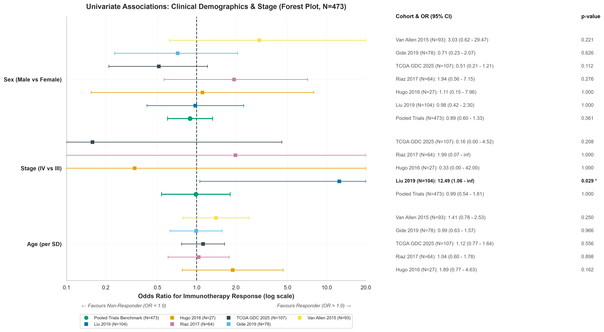
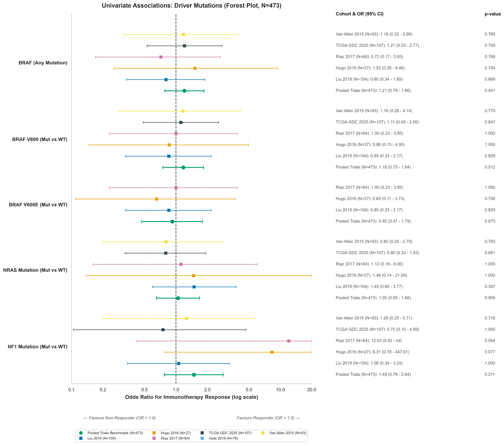
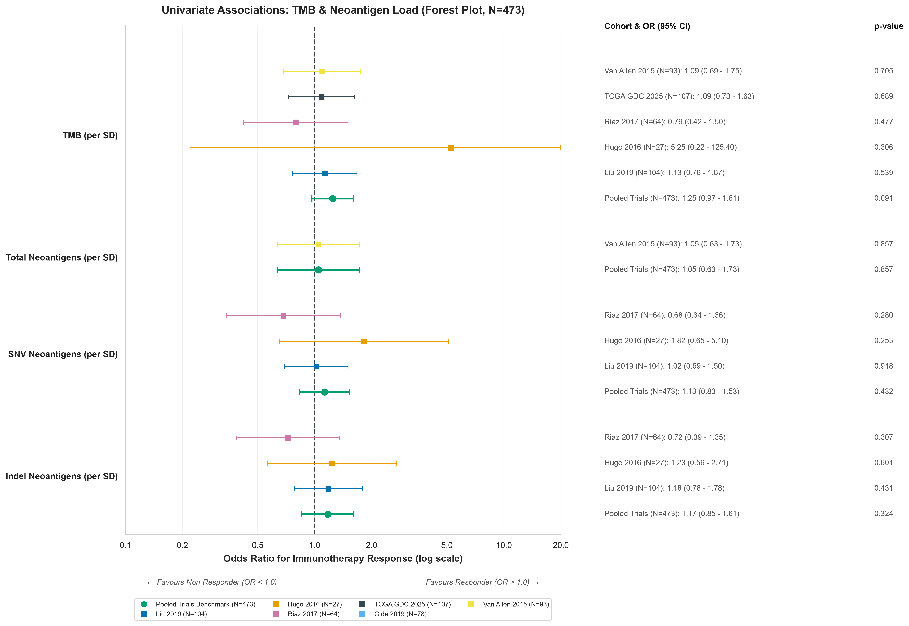
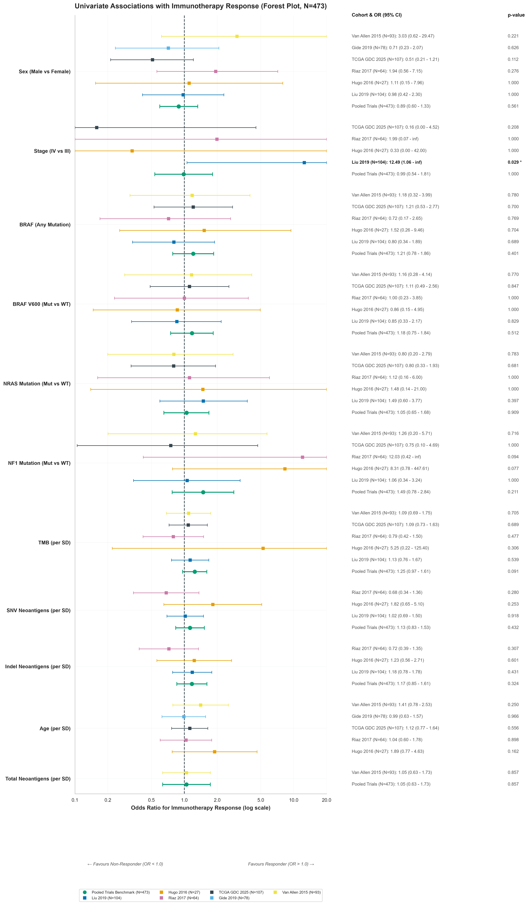

# Response Association Analysis: Univariate & Multivariate Predictors of Immunotherapy Response

> [!NOTE] Scope of This Report
> This report covers two complementary levels of analysis for predicting anti-PD-1 immunotherapy response in metastatic melanoma:
> 1. **Section 1 — Univariate Screening**: Odds Ratios and 95% CIs for individual baseline clinical and genomic features across trial cohorts. Establishes whether any single feature is sufficient to predict response.
> 2. **Section 2 — Multivariate Modelling**: Cross-validated ML classifiers (XGBoost, Random Forest, SVM, Elastic-Net, Logistic Regression) trained on immune transcriptomic signatures. Evaluates whether integrating multiple features improves response prediction beyond univariate baselines.

## 1. Univariate Associations with Response (Forest Plots)

> [!INFO] Why We Are Doing This
> **What**: We run univariate statistical tests (Odds Ratios and 95% Confidence Intervals) to measure the isolated predictive strength of individual baseline features — clinical demographics, stage, driver mutations (`BRAF`, `BRAF V600`, `BRAF V600E`, `NRAS`, `NF1`), TMB, and predicted neoantigen burden — against immunotherapy response across individual and pooled trial cohorts.
> **Why**: Before building complex multivariate models, univariate screening identifies whether any single clinical or genomic feature alone is sufficient to predict response.
> **Question Answered**: Does any single baseline clinical, mutational, or genomic feature reliably predict anti-PD-1 immunotherapy response across independent cohorts?

### 1.1 Clinical Demographics & Anatomical Stage

_**Figure 1A: Forest Plot of Clinical Demographics and Stage against Immunotherapy Response.**_

### 1.2 Driver Mutations & Subtypes

_**Figure 1B: Forest Plot of Somatic Driver Mutations (`BRAF` Any, `BRAF V600`, `BRAF V600E`, `NRAS`, `NF1`) against Immunotherapy Response.**_

### 1.3 Tumour Mutation Burden & Neoantigen Load

_**Figure 1C: Forest Plot of TMB and Predicted Neoantigen Burden (Total, SNV, Indel) against Immunotherapy Response.**_

### 1.4 Composite Multi-Domain Forest Plot

_**Figure 1D: Master Composite Forest Plot of All Clinical and Genomic Features.**_

> [!INSIGHT] Key Takeaways: Univariate Associations
> 1. **Lack of Robust Single-Feature Predictors**: Across pooled trial analyses and after multiple testing adjustments, **no single baseline clinical or genomic feature achieves robust statistical significance**. All 95% CIs for pooled odds ratios cross 1.0.
> 2. **`BRAF` Subtype Resolution (`V600` vs `V600E`)**: Neither generic `BRAF` mutation (OR = 1.21, p = 0.401), specific `BRAF V600` (OR = 1.18, p = 0.512), nor `BRAF V600E` (OR = 0.92, p = 0.875) demonstrates significant association with anti-PD-1 response.
> 3. **Anatomical Staging**: Stage IV vs Stage III disease shows no overall pooled association (OR = 0.99, p = 1.000).
> 4. **Demographic & Genomic Trends**: Age, sex, TMB (OR = 1.25, p = 0.091), and total neoantigen load (OR = 1.05, p = 0.857) exhibit minor unadjusted trends but do not achieve statistical significance independently.
> 5. **Core Scientific Implication**: The failure of individual clinical variables and driver mutations to predict outcome explains why single-variable biomarker tests fail in clinical practice, highlighting the necessity of multi-gene transcriptomic signatures and integrated multivariate machine learning.

---

## 2. Multivariate Response Prediction (ML Classifiers)

> [!INFO] Why We Are Doing This
> **What**: We train and cross-validate five ML classifiers — XGBoost, Random Forest, SVM, Elastic-Net, and Logistic Regression — on immune transcriptomic signatures (IFN-γ, TIS, CYT, CD8+ T-cell, IMPRES, PD-L1) to predict binary immunotherapy response (Responder vs Non-Responder) across pooled trial cohorts.
> **Why**: Univariate screening (Section 1) establishes that no single feature is sufficient. Multivariate integration of immune signatures tests whether combining complementary biological signals recovers predictive power.
> **Question Answered**: Can a combination of immune transcriptomic signatures reliably predict anti-PD-1 response better than any single clinical or genomic variable?

> [!NOTE] Section Pending
> Multivariate ML results will be populated here once `run_response_predictor.py` is executed. This section will include:
> - Cross-validated AUC–ROC curves per classifier
> - Feature importance rankings per model
> - Bootstrapped 95% CI for AUC
> - SHAP value summary plots
> - Cohort-stratified performance breakdown

---

## 3. Technical Notes

> [!WARNING] Methodological Limitations & Analytical Scope
> - **Univariate Screening Scope**: All univariate analyses are unadjusted for inter-cohort heterogeneity, sample size imbalance, or multiple testing correction beyond Bonferroni adjustment where noted.
> - **Response Definition**: Binary response is defined as RECIST Complete Response (CR) or Partial Response (PR) vs Progressive Disease (PD). Stable Disease (SD) patients are excluded from binary response modelling.
> - **Cohort Heterogeneity**: Pooled OR estimates assume exchangeable treatment populations, which may not hold across cohorts with different prior treatment histories (e.g., Riaz 2017 is 100% ipilimumab pre-treated).
> - **TCGA GDC Subcohort**: Only the 91-patient immunotherapy subcohort (`TX_TYPE_IMMUNOTHERAPY = 1`) is included; the broader 473-patient TCGA-SKCM cohort is excluded from all response association analyses.

---

> ![formula]+ Response Association Scripts & Modules
> - **Primary Scripts**:
>   - [`run_univariate_associations.py`](../../scripts/pillar-2-clinical-subtyping/run_univariate_associations.py): Computes univariate ORs and 95% CIs across clinical/genomic features; generates forest plots.
> - **Shared Modules**:
>   - [`styles.py`](../../../src/styles.py): Okabe-Ito colour palettes and presentation style.
>   - [`data_loaders.py`](../../src/data_loaders.py): Per-cohort clinical and expression data loaders.
