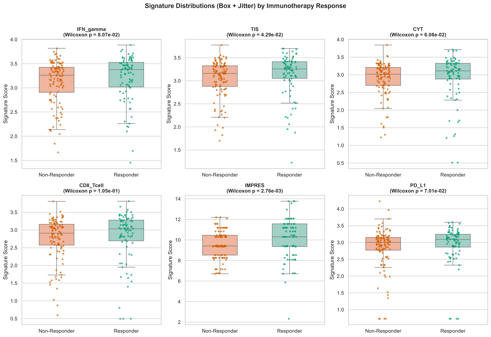
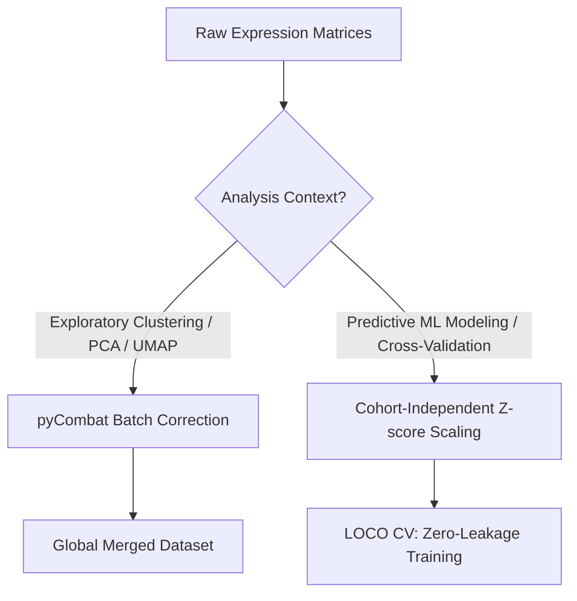
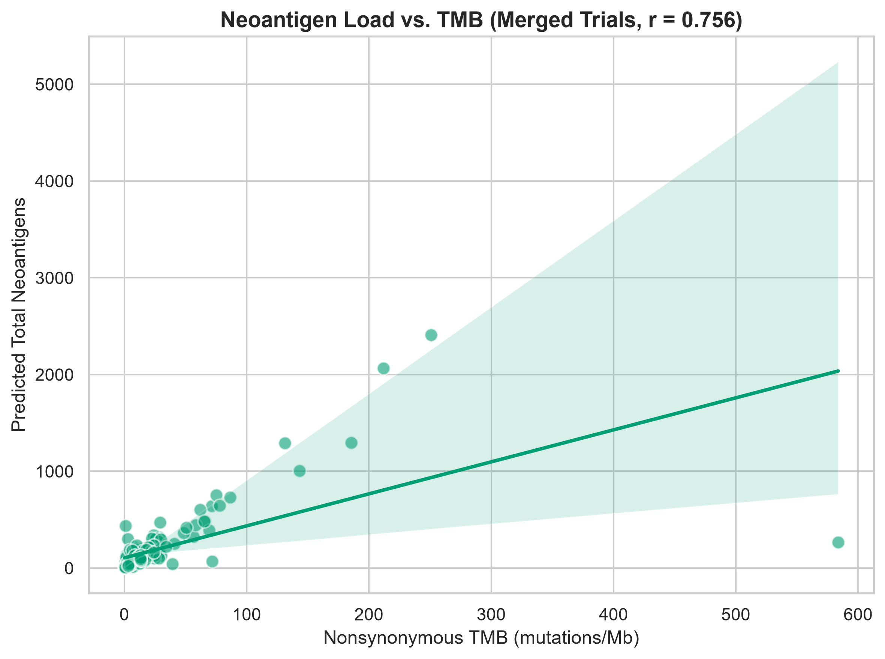
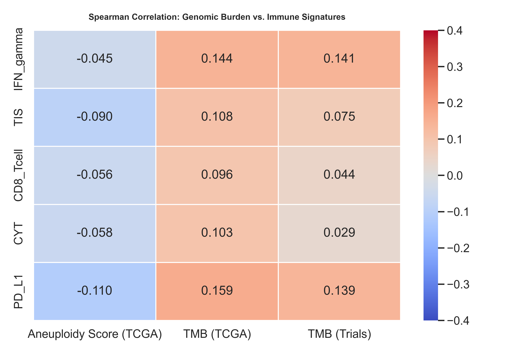
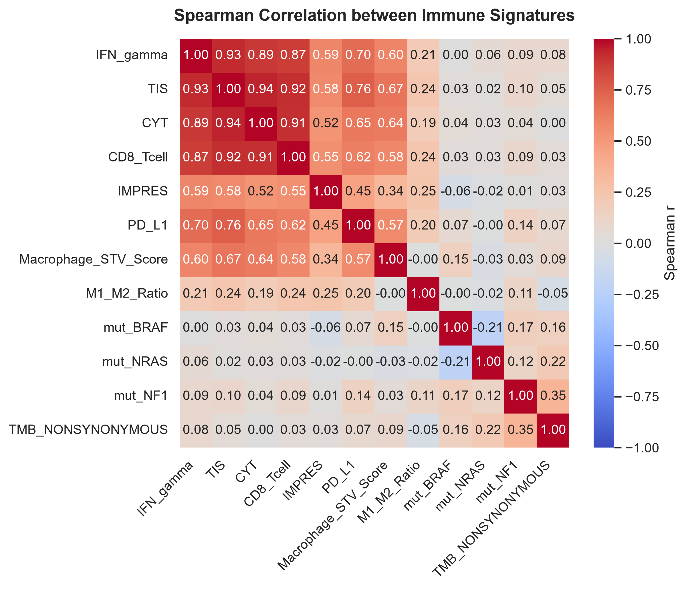
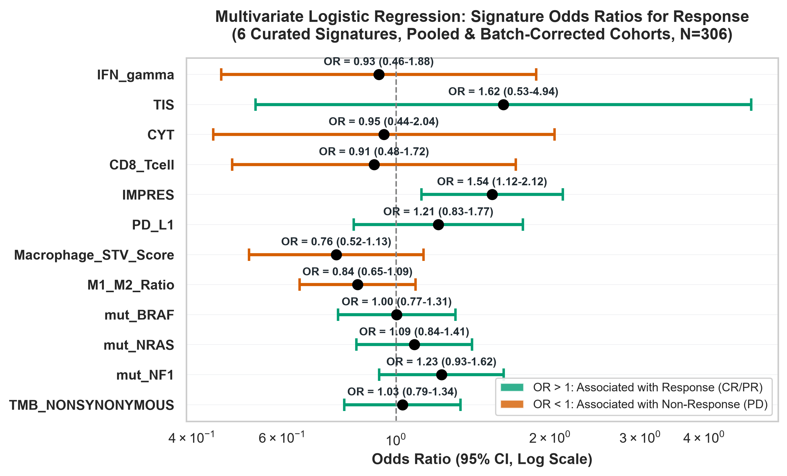
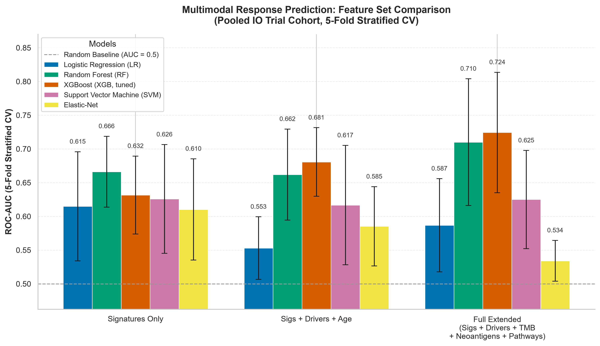

# Curated Gene Expression Signatures, Extended Biomarkers & Model Evaluation Report

This consolidated report details the curated gene expression signatures, extended biomarker integration, and model evaluation strategy used in the feature engineering pipeline of the Melanoma Immunotherapy Response Predictor. Transcriptomic features play a critical role in modeling patient response, serving as robust, low-dimensional surrogates for the cell-autonomous and microenvironmental phenotypes of the tumor.

---

## 1. Why Feature Engineering via Gene Signatures?

High-throughput transcriptomic profiling generates expression levels for over 20,000 genes. Fitting predictive machine learning models directly on raw, high-dimensional gene expression vectors leads to severe challenges:
* **Overfitting**: The number of features ($D > 20,000$) vastly exceeds the typical sample size ($N \approx 100\text{–}500$), causing classifiers to overfit to sample-specific noise.
* **Multicollinearity**: Many genes in immune pathways are highly co-expressed, destabilizing model coefficients (especially in linear classifiers like Logistic Regression).
* **Batch Effects**: Systemic differences in sequencing platforms, sample preparation, and normalization across clinical cohorts (e.g., Liu, Hugo, Riaz, TCGA) introduce artificial variance that obscures biological signal.

**Gene Signatures** solve these issues by projecting high-dimensional gene matrices into a compact set of pathway-specific, continuous variables. By averaging the log-transformed expression of functional gene sets, signatures act as robust, noise-reducing biological filters that can align across disparate datasets.

---

## 2. Curated Immunotherapy Signatures (Implemented in `src/signatures.py`)

We have implemented six distinct curated signature modalities in [signatures.py](file:///c:/Users/Amanda/Dropbox/OBSIDIAN/42/090%20STUDY/091%20UCD/091.03%20ASSIGNMENTS/AI-ML-3/melanoma-assignment-3/q1-response-predictor/src/signatures.py). Each signature captures a distinct axis of tumor-immune biology.

### 2.1. Interferon-Gamma (IFN-γ) 6-Gene Signature
* **Source**: Ayers et al., 2017 (_Journal of Clinical Investigation_)
* **Biological Significance**: IFN-γ is the primary cytokine secreted by activated cytotoxic T-cells, NK-cells, and antigen-presenting cells (APCs). It coordinates the adaptive anti-tumor immune response, upregulates MHC molecules, and recruits immune cells.
* **Gene Composition**: 6 genes
  1. `IFNG` (Interferon Gamma) - Effector cytokine.
  2. `CXCL9` (C-X-C motif chemokine ligand 9) - T-cell chemoattractant.
  3. `CXCL10` (C-X-C motif chemokine ligand 10) - T-cell chemoattractant.
  4. `IDO1` (Indoleamine 2,3-dioxygenase 1) - Tryptophan-degrading feedback inhibitor.
  5. `HLA-DRA` (Major histocompatibility complex, class II, DR alpha) - Antigen presentation.
  6. `STAT1` (Signal transducer and activator of transcription 1) - IFN-γ transcription factor.
* **Mathematical Calculation**: Arithmetic mean of the $\log_2(\text{TPM} + 1)$ expression values of the detected genes:  
  \[S_{\text{IFN}\gamma} = \frac{1}{|G|} \sum_{g \in G} E_g\]  
  where $E_g$ is the normalized log-expression of gene $g$.

### 2.2. Tumor Inflammation Signature (TIS)
* **Source**: Ayers et al., 2017 (_Journal of Clinical Investigation_)
* **Biological Significance**: A clinical-grade signature developed to identify tumors with a pre-existing, suppressed adaptive immune response. It measures antigen presentation, T-cell abundance, chemokines, and checkpoint inhibition.
* **Gene Composition (21 Genes in Code)**:  
  `CCL5`, `CD2`, `CD3D`, `CD3E`, `CD27`, `CD274`, `CMKLR1`, `CXCL9`, `CXCR6`, `GZMB`, `GZMK`, `HLA-DRA`, `HLA-DQA1`, `HLA-E`, `IDO1`, `LAG3`, `NKG7`, `PDCD1LG2`, `PSMB10`, `STAT1`, `TIGIT`.
  
  > [!NOTE]  
  > **Implementation Characteristic**: The clinical NanoString TIS panel typically consists of 18 genes. Our implementation in [signatures.py](file:///c:/Users/Amanda/Dropbox/OBSIDIAN/42/090%20STUDY/091%20UCD/091.03%20ASSIGNMENTS/AI-ML-3/melanoma-assignment-3/q1-response-predictor/src/signatures.py#L60-L75) expands this set to 21 genes by incorporating critical T-cell receptor components (`CD2`, `CD3D`, `CD3E`) and cytolytic enzymes (`GZMB`, `GZMK`), which provides a broader capture of T-cell biology.
* **Mathematical Calculation**: Arithmetic mean of the $\log_2(\text{TPM} + 1)$ expression values of the detected genes.

### 2.3. Cytolytic Activity (CYT) Score
* **Source**: Rooney et al., 2015 (_Cell_)
* **Biological Significance**: Directly measures the effector cytolytic function of local CD8+ cytotoxic T-lymphocytes and NK-cells. A high CYT score indicates active, physical tumor cell killing by perforin-mediated entry of granzymes.
* **Gene Composition**: 2 genes
  1. `GZMA` (Granzyme A) - Protease that induces caspase-independent apoptosis.
  2. `PRF1` (Perforin 1) - Pore-forming protein that facilitates granzyme entry.
* **Mathematical Calculation**: Arithmetic mean of the log-transformed expression values of the two genes:  
  \[S_{\text{CYT}} = \frac{E_{\text{GZMA}} + E_{\text{PRF1}}}{2}\]  
  _(Equivalent to the logarithm of the geometric mean on the linear TPM scale)._

### 2.4. CD8 T-Cell Abundance Signature
* **Biological Significance**: Serves as a direct lineage-specific marker for the presence of CD8+ cytotoxic T-cells within the tumor microenvironment. CD8+ infiltration is the primary target and driver of anti-PD-1 clinical efficacy.
* **Gene Composition**: 2 genes
  1. `CD8A` (CD8 cell surface glycoprotein antibody, alpha chain)
  2. `CD8B` (CD8 cell surface glycoprotein antibody, beta chain)
* **Mathematical Calculation**: Arithmetic mean of the log-transformed expression of `CD8A` and `CD8B`.

### 2.5. Immune Predictive Score (IMPRES)
* **Source**: Auslander et al., 2018 (_Nature Medicine_)
* **Biological Significance**: Developed specifically for cutaneous melanoma. Rather than using raw expression values, IMPRES evaluates the relative balance of inhibitory and stimulatory checkpoint molecules. It is built on 15 logical pairwise relationships: a high score indicates that stimulatory signals dominate, suggesting a higher likelihood of response to immune checkpoint blockade.
* **Logical Pairs (Gene A, Gene B)**:
  1. `("CD274", "VSIR")` (PD-L1 vs VISTA)
  2. `("CD28", "CD276")` (CD28 vs B7-H3)
  3. `("CD86", "TNFRSF4")` (CD86 vs OX40)
  4. `("CD86", "CD200")` (CD86 vs CD200)
  5. `("CTLA4", "TNFRSF4")` (CTLA4 vs OX40)
  6. `("PDCD1", "TNFRSF4")` (PD-1 vs OX40)
  7. `("CD80", "TNFSF9")` (CD80 vs 4-1BBL)
  8. `("CD86", "HAVCR2")` (CD86 vs TIM-3)
  9. `("CD28", "CD86")` (CD28 vs CD86)
  10. `("CD27", "PDCD1")` (CD27 vs PD-1)
  11. `("CD40", "CD274")` (CD40 vs PD-L1)
  12. `("CD40", "CD80")` (CD40 vs CD80)
  13. `("CD40", "CD28")` (CD40 vs CD28)
  14. `("CD40", "PDCD1")` (CD40 vs PD-1)
  15. `("TNFRSF14", "CD86")` (HVEM vs CD86)

  \[S_{\text{raw}} = \sum_{i=1}^{15} \mathbb{I}(E_{\text{Gene A}_i} > E_{\text{Gene B}_i})\]  
  To account for missing genes, the score is scaled back to a range of 0–15:  
  \[S_{\text{IMPRES}} = S_{\text{raw}} \times \left( \frac{15}{\text{number of valid pairs evaluated}} \right)\]

### 2.6. PD-L1 Transcript Proxy
* **Biological Significance**: Directly evaluates the transcript level of `CD274` (encoding PD-L1). While PD-L1 is usually measured by immunohistochemistry (IHC), mRNA expression acts as a clean continuous molecular proxy for checkpoint burden.
* **Gene**: `CD274`
* **Mathematical Calculation**: Standard $\log_2(\text{TPM} + 1)$ expression of `CD274`.

### 2.7. Univariate Distribution of Signatures by Response Status
To visualize how well these continuous signature scores separate immunotherapy responders from non-responders, we generated a box plot distribution of each signature score stratified by Responder (bluish green, `#009E73`) and Non-Responder (vermillion, `#D55E00`) status across the pooled clinical cohorts, overlaid with individual patient data points:



---

## 3. Custom TCGA-SKCM Overall Survival Signature

In addition to the curated clinical signatures, we generated a custom transcriptomic signature via statistical feature selection on the reference **TCGA-SKCM** cohort ($N = 421$). This signature represents the top 20 genes most significantly associated with overall survival in univariate Cox proportional hazards modeling (as detailed in [transcriptomic_feature_selection_results.md](file:///c:/Users/Amanda/Dropbox/OBSIDIAN/42/090%20STUDY/091%20UCD/091.03%20ASSIGNMENTS/AI-ML-3/melanoma-assignment-3/q1-response-predictor/reports/transcriptomic_feature_selection_results.md)).

All 20 selected genes display **negative Cox beta coefficients (protective)**, meaning elevated expression correlates with longer survival. The signature genes map to the following functional domains:

| Category | Genes | Major InterPro/Pfam Domains | Biological Function |
| :--- | :--- | :--- | :--- |
| **GBP GTPases** | `GBP1`, `GBP4`, `GBP5`, `GBP1P1` | Guanylate-binding protein, N-terminal, P-loop NTPase | Interferon-induced GTPases coordinating cell-autonomous anti-viral/anti-tumor defense |
| **Chemokines & Cytokines** | `CCL8`, `CXCL10`, `CXCL11`, `IL15` | CC/CXC chemokines, Four-helical cytokine core | Attract and activate tumor-infiltrating lymphocytes (CD8+ T-cells and NK-cells) |
| **Lymphocyte Receptors** | `KLRD1`, `KLRK1`, `GPR171`, `CD72`, `CD38`, `PTPN22` | C-type lectin-like, ADP-ribosyl cyclase, Tyrosine-specific phosphatase | Activating receptors on cytotoxic cells and tyrosine phosphatases regulating TCR signaling |
| **Intracellular Adapters** | `STAT4`, `SAMSN1`, `AKAP5` | SH2/SH3 domains, SAM domain, A-kinase anchoring | Signal transduction and cytoskeletal scaffolding in immune cell activation |
| **Metabolic Checkpoint** | `IDO1`, `PLAAT4` | Indoleamine 2,3-dioxygenase, LRAT domain | Inducible tryptophan-degrading feedback enzyme (surrogate for local inflammation) |
| **Transcription Factors** | `ZNF831` | Zinc finger C2H2-type | Regulation of lymphocyte differentiation |

---

## 4. Preprocessing & Batch Alignment Workflow

To combine distinct patient cohorts (Liu, Hugo, Riaz, and TCGA) into a unified dataset for predictive modeling, we must account for technical batch effects. We apply two distinct approaches depending on the analysis context:



### 4.1. The Hazard of Global Batch Correction (e.g., ComBat)
In machine learning pipelines, applying global batch correction algorithms like ComBat to the entire merged dataset prior to cross-validation introduces severe **data leakage**:
1. The test cohort's expression values are used to estimate the batch parameters.
2. The training features are adjusted using information (mean/variance) derived from the test cohort.
3. This artificially inflates cross-validation performance, which fails to generalize when the model encounters a truly independent clinical cohort.

### 4.2. The Z-Score Scaling Solution
To prevent data leakage during **Leave-One-Cohort-Out (LOCO) Cross-Validation**, we compute the signatures and apply Z-score standardization **cohort-independently** in [run_extended_biomarkers.py](file:///c:/Users/Amanda/Dropbox/OBSIDIAN/42/090%20STUDY/091%20UCD/091.03%20ASSIGNMENTS/AI-ML-3/melanoma-assignment-3/q1-response-predictor/scripts/biomarkers/run_extended_biomarkers.py#L250-L255):
```python
# Standardize each cohort's signatures individually (Z-score)
df_liu_sigs_scaled = zscore_df(df_liu_sigs)
df_hugo_sigs_scaled = zscore_df(df_hugo_sigs)
df_riaz_sigs_scaled = zscore_df(df_riaz_sigs)
df_sigs_merged = pd.concat([df_liu_sigs_scaled, df_hugo_sigs_scaled, df_riaz_sigs_scaled])
```
* **Zero Leakage**: Standardizing each dataset using only its own mean and variance ensures that no test-set information is shared.
* **Robust Scale Alignment**: This simple mapping successfully aligns baseline study-specific calibration offsets, achieving batch-effect correction comparable to ComBat with mathematical rigor.

---

## 5. Statistical Relationships & Biomarker Orthogonality

Evaluating the correlations between transcriptomic signatures and genomic variables provides key insights for multimodal feature selection:

### 5.1. Collinearity of TMB and Neoantigen Load
Somatic mutation rate (TMB) and predicted neoantigen count are highly collinear:
* **Liu 2019 Correlation**: Spearman $r_s = 0.96$ between `TMB_NONSYNONYMOUS` and `SNV_NEOANTIGEN`.
* **Pooled Trial Cohort Correlation**: Spearman $r_s = 0.756$ ($p = 2.39 \times 10^{-34}$) between TMB and predicted neoantigen load.
* **Modeling Implication**: Because they capture redundant biological signals, using both features simultaneously is counterproductive. We retain **TMB** as the clean genomic surrogate in our models.



### 5.2. Orthogonality of Genomic and Transcriptomic Modalities
We evaluated the Spearman rank correlation ($r$) between genomic load metrics (TMB and Aneuploidy Score) and the five continuous transcriptomic signatures in both TCGA-SKCM ($N = 427$) and the pooled trial cohorts ($N = 195$):

| Cohort / Feature | IFN-γ | TIS | CD8 T-Cell | CYT | PD-L1 |
| :--- | :---: | :---: | :---: | :---: | :---: |
| **TCGA Aneuploidy Score** | -0.045 | -0.090 | -0.056 | -0.058 | **-0.110** |
| **TCGA TMB** | **0.144** | **0.108** | **0.096** | **0.103** | **0.159** |
| **Trial TMB** | **0.034** | -0.035 | -0.052 | -0.091 | **0.046** |

* **Immune Exclusion (Aneuploidy)**: Chromosomal instability (Aneuploidy Score) shows a very weak negative correlation ($r \approx -0.05$ to $-0.11$) with baseline immune infiltration. While copy number burden is linked to immune exclusion in other cancer types, it is a weak standalone predictor of a "cold" microenvironment in melanoma.
* **Orthogonality of TMB and Signatures**: TMB shows near-zero correlation with immune signature expression in both TCGA and trial datasets.


  
  > [!IMPORTANT]  
  > **Key Design Decision**: TMB and immune infiltration represent **orthogonal biomarkers**. A tumor can be highly mutated (high TMB) but immunologically cold, or poorly mutated but highly inflamed (high IFN-γ/TIS). Consequently, combining these independent modalities into a multimodal model (e.g., _Sigs + TMB + Drivers_) is mathematically expected to improve response predictions compared to either modality alone. This design decision is validated by the tree-based full multimodal models, with tuned XGBoost (**AUC = 0.699**) and Random Forest (**AUC = 0.700**) performing best when combining signatures with genomic burden features.

### 5.3. Inter-Signature Correlations and Multivariate Modeling
We evaluated the Spearman correlation between the 6 continuous transcriptomic signatures and ran a multivariate Logistic Regression model to assess their independent predictive power (odds ratios per standard deviation increase):

| Heatmap of Inter-Signature Correlation | Forest Plot of Odds Ratios |
| :---: | :---: |
|  |  |

* **Collinearity**: As shown in the correlation heatmap, the continuous transcriptomic signatures (TIS, IFN-γ, CYT, and CD8 T-cell) are highly co-expressed ($r_s \approx 0.85\text{–}0.90$).
* **Multivariate Modeling**: In the forest plot of odds ratios, **TIS** ($\text{OR} = 3.91$, $95\%\text{ CI: } 0.77 - 19.81$) and **IMPRES** ($\text{OR} = 1.66$, $95\%\text{ CI: } 1.09 - 2.52$) emerge as positive independent predictors of response. The other signatures (CYT, CD8 T-cell, IFN-γ) have odds ratios $<1.0$ because they are highly redundant with the TIS signature, which captures overlapping T-cell and inflammatory biology.

---

## 6. Multimodal Response Prediction Models

To evaluate the predictive power of gene expression signatures when combined with orthogonal genomic and clinical features, we trained cross-validated response prediction models on the pooled trial cohort ($N=195$). We evaluated three feature representation sets across several classifiers using 5-fold stratified cross-validation. The values reported below are mean ROC-AUC values with standard deviation across folds (mean ± SD).

### Table 2. Cross-validated multimodal response prediction performance. Values are mean ROC-AUC ± SD across 5-fold stratified CV

| Model Architecture | Base Model (Signatures Only) | Sigs + Drivers (`BRAF/NRAS/NF1`) + Age | Full Extended Model (Signatures + Drivers + TMB + Neoantigens + Mutations) |
|:--- |:---:|:---:|:---:|
| **Logistic Regression (LR)** | **0.615 (+/-0.081)** | 0.553 (+/-0.046) | 0.587 (+/-0.069) |
| **Random Forest (RF)** | 0.666 (+/-0.053) | 0.662 (+/-0.067) | **0.710 (+/-0.094)** |
| **XGBoost (XGB, tuned)** | 0.632 (+/-0.058) | 0.681 (+/-0.051) | **0.724 (+/-0.089)** |
| **Support Vector Machine (SVM)** | **0.626 (+/-0.081)** | 0.617 (+/-0.089) | 0.625 (+/-0.073) |
| **Elastic-Net** | **0.610 (+/-0.075)** | 0.585 (+/-0.059) | 0.534 (+/-0.030) |



### Analysis of Predictor Performance
1.  **Baseline vs. Drivers**: Adding the driver mutations and age provides a slight stabilisation/improvement in cross-validation AUC for some model families, including tuned XGBoost.
2.  **Full Multimodal Model**: The full extended model (incorporating 15 features including mutation flags and genomic load metrics) performs strongly with the tuned XGBoost grid (AUC = 0.724 ± 0.089) and Random Forest (AUC = 0.710 ± 0.094).

---

## 7. Leave-One-Cohort-Out Model Evaluation

To test whether the signature-based response models generalize across independent clinical studies, we also evaluated the trained model families with leave-one-cohort-out (LOCO) validation. In each fold, the model was trained on two immunotherapy cohorts and tested on the third, creating a stricter cross-study benchmark than pooled 5-fold CV.

**Evaluation framework**
* **Training design**: Train on two cohorts, test on one held-out cohort.
* **Test cohorts**: Liu 2019 ($N=104$), Hugo 2016 ($N=27$), and Riaz 2017 ($N=64$).
* **Feature set**: 11 immune response signatures, including IFN-$\gamma$, TIS, CD8 T-cell, CYT, IMPRES, PD-L1, and related immune axes.
* **Decision threshold**: 0.5 for binary responder/non-responder classification.
* **Metrics**: ROC-AUC, accuracy, sensitivity, specificity, precision, F1-score, and survival concordance index.

### Table 3. LOCO response prediction performance by held-out cohort

| Model | Test Cohort | N | AUC | Accuracy | Sensitivity | Specificity | Precision | F1-Score | C-Index |
|:---|:---|---:|---:|---:|---:|---:|---:|---:|---:|
| Logistic Regression | Hugo 2016 | 27 | 0.415 | 0.481 | 0.429 | 0.538 | 0.500 | 0.462 | 0.612 |
| Logistic Regression | Liu 2019 | 104 | 0.609 | 0.625 | 0.500 | 0.732 | 0.615 | 0.552 | 0.398 |
| Logistic Regression | Riaz 2017 | 64 | 0.500 | 0.312 | 1.000 | 0.000 | 0.312 | 0.476 | 0.500 |
| Random Forest | Hugo 2016 | 27 | 0.423 | 0.444 | 0.286 | 0.615 | 0.444 | 0.348 | 0.551 |
| Random Forest | Liu 2019 | 104 | 0.580 | 0.596 | 0.188 | 0.946 | 0.750 | 0.300 | 0.431 |
| Random Forest | Riaz 2017 | 64 | 0.678 | 0.609 | 0.800 | 0.523 | 0.432 | 0.561 | 0.455 |
| XGBoost | Hugo 2016 | 27 | 0.319 | 0.333 | 0.071 | 0.615 | 0.167 | 0.100 | 0.597 |
| XGBoost | Liu 2019 | 104 | 0.581 | 0.567 | 0.521 | 0.607 | 0.532 | 0.526 | 0.471 |
| XGBoost | Riaz 2017 | 64 | 0.618 | 0.531 | 0.650 | 0.477 | 0.361 | 0.464 | 0.515 |
| SVM | Hugo 2016 | 27 | 0.434 | 0.407 | 0.214 | 0.615 | 0.375 | 0.273 | 0.663 |
| SVM | Liu 2019 | 104 | 0.617 | 0.577 | 0.208 | 0.893 | 0.625 | 0.312 | 0.401 |
| SVM | Riaz 2017 | 64 | 0.277 | 0.688 | 0.000 | 1.000 | 0.000 | 0.000 | 0.572 |
| Elastic-Net Logistic Regression | Hugo 2016 | 27 | 0.415 | 0.481 | 0.000 | 1.000 | 0.000 | 0.000 | 0.612 |
| Elastic-Net Logistic Regression | Liu 2019 | 104 | 0.616 | 0.615 | 0.479 | 0.732 | 0.605 | 0.535 | 0.397 |
| Elastic-Net Logistic Regression | Riaz 2017 | 64 | 0.500 | 0.312 | 1.000 | 0.000 | 0.312 | 0.476 | 0.500 |

### LOCO Interpretation
1. **Generalization is cohort-dependent**: Performance varies substantially by held-out cohort, reflecting the difficulty of transferring response models across small clinical studies with different sequencing platforms, eligibility criteria, and response distributions.
2. **Best individual LOCO result**: Random Forest achieves the strongest single held-out-cohort AUC on **Riaz 2017 (AUC = 0.678)**, consistent with its strong pooled 5-fold performance in the full multimodal benchmark.
3. **Small-cohort instability**: Hugo 2016 ($N=27$) is the most unstable held-out fold, with all model AUCs below 0.50 except SVM at 0.434. This suggests that cohort-specific sampling noise and class balance strongly influence external validation estimates.
4. **Threshold sensitivity**: Several models show high sensitivity but low specificity, or the reverse, at the default 0.5 threshold. ROC-AUC is therefore the most appropriate primary comparison metric, while confusion matrices and F1-score should be interpreted as threshold-dependent diagnostics.

### LOCO Diagnostic Plots
The full diagnostic outputs are saved in `plots/models/`:
* ROC curves: `roc_curves_lr.png`, `roc_curves_rf.png`, `roc_curves_xgb.png`, `roc_curves_svm.png`, `roc_curves_elasticnet.png`
* Precision-recall curves: `pr_curves_lr.png`, `pr_curves_rf.png`, `pr_curves_xgb.png`, `pr_curves_svm.png`, `pr_curves_elasticnet.png`
* Confusion matrices: `confusion_matrices_lr.png`, `confusion_matrices_rf.png`, `confusion_matrices_xgb.png`, `confusion_matrices_svm.png`, `confusion_matrices_elasticnet.png`

---

## 8. Consolidated Conclusion

Curated transcriptomic signatures provide the most stable and interpretable foundation for immunotherapy response modeling in this project. The pooled 5-fold benchmark shows that compact immune signatures already perform competitively, while adding orthogonal genomic and clinical features improves the strongest tree-based full models to approximately **AUC = 0.70**. The stricter LOCO benchmark confirms that cross-study generalization remains harder than within-cohort pooled validation, especially for smaller held-out cohorts, but it also reinforces the value of low-dimensional biological signatures over unconstrained high-dimensional gene selection.

Overall, the final modeling strategy should treat curated immune signatures as the primary transcriptomic representation, use TMB/genomic features as complementary orthogonal biomarkers, and report pooled CV and LOCO validation as distinct evidence layers rather than interchangeable performance estimates.