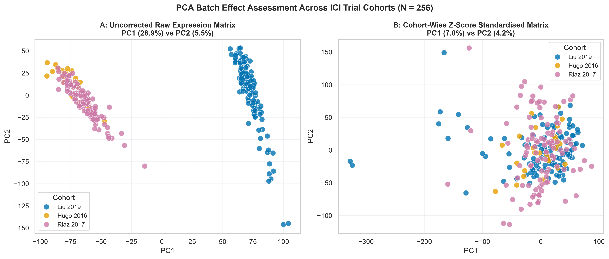

# Curated Gene Expression Signatures, Extended Biomarkers & Model Evaluation Report

### Executive Summary
This report outlines the transcriptomic feature engineering strategy for the Melanoma Immunotherapy Response Predictor. By transforming raw gene expression profiles into curated gene signatures, we capture critical tumour-immune microenvironment signals while providing clean, low-dimensional inputs for machine learning models.


## 1. Why Use Gene Signatures Instead of Raw Expression Data?

> [!NOTE] Section Context
> - **What We Are Doing**: Justifying the decision to compress $>20,000$ raw RNA-seq gene measurements into **6 curated pathway-level scores** rather than feeding raw expression vectors directly into machine learning models.
> - **Why We Are Doing It**: Raw gene expression is high-dimensional ($D \gg N$), multicollinear, and batch-contaminated. Directly training classifiers on 20,000 features across cohorts of $N \approx 100\text{--}500$ guarantees overfitting to study-specific noise rather than generalisable biology. Pathway signatures act as noise-reducing biological filters.
> - **Questions**:
>   1. *Why can't we just use all 20,000 genes as features?*
>   2. *How does gene-level collinearity undermine model interpretability?*
>   3. *How do batch effects across Liu (122), Hugo (27), Riaz (107), and TCGA (443) corrupt feature scaling?*

High-throughput RNA sequencing measures over $20,000$ genes per patient sample. Training machine learning models directly on raw expression vectors introduces three major challenges:

* **Overfitting ($D \gg N$)**: Evaluating $>20,000$ features on typical clinical cohorts ($N \approx 100\text{--}500$) causes classifiers to memorise sample-specific noise rather than generalisable biology.
* **Multicollinearity**: Immune genes operate in tightly co-expressed networks, creating redundant features that destabilise linear model weights.
* **Batch Effects**: Technical variation across sequencing platforms and clinical studies (Liu 2019, Hugo 2016, Riaz 2017, TCGA-SKCM) introduces noise that obscures true biological signal.

> [!TIP] The Solution
> **Gene Signatures** compress high-dimensional gene matrices into **6 continuous, pathway-specific scores**, acting as noise-reducing biological filters that reliably align across diverse patient cohorts.


## 2. Curated Immunotherapy Signatures (Implemented in `src/signatures.py`)

> [!NOTE] Section Context
> - **What We Are Doing**: Implementing six literature-curated gene expression signatures in [`signatures.py`](file:///c:/Users/Amanda/Dropbox/OBSIDIAN/42/090%20STUDY/091%20UCD/091.03%20ASSIGNMENTS/AI-ML-3/melanoma-assignment-3/q1-response-predictor/src/signatures.py), each capturing a distinct axis of tumour-immune biology — from IFN-γ cytokine signalling and CD8 T-cell infiltration to checkpoint ligand abundance and effector killing capacity.
> - **Why We Are Doing It**: Rather than selecting signatures arbitrarily, each was chosen because it has been independently validated in published anti-PD-1 trials. Using established, biologically-grounded scores rather than ad-hoc gene selections reduces the risk of overfitting and makes our model interpretable to a clinical audience.
> - **Questions**:
>   1. *Which biological axes of the tumour-immune microenvironment are captured by these six signatures?*
>   2. *Do individual signatures separate responders from non-responders at baseline — before any modelling?*
>   3. *Are the signatures redundant with each other, or do they each capture independent information?*

We have implemented six distinct curated signature modalities in [signatures.py](file:///c:/Users/Amanda/Dropbox/OBSIDIAN/42/090%20STUDY/091%20UCD/091.03%20ASSIGNMENTS/AI-ML-3/melanoma-assignment-3/q1-response-predictor/src/signatures.py). Each signature captures a distinct axis of tumour-immune biology.

> [!NOTE]
> **Supplementary Appendix**: For detailed biological mechanisms, gene-by-gene breakdowns, and individual mathematical formulas, see [curated_signatures_supplementary.md](file:///c:/Users/Amanda/Dropbox/OBSIDIAN/42/090%20STUDY/091%20UCD/091.03%20ASSIGNMENTS/AI-ML-3/melanoma-assignment-3/q1-response-predictor/reports/pillar-3-transcriptomic-signatures/curated_signatures_supplementary.md).

### 2.1. Signature Modality Overview Matrix

| Signature Name & Citation | Biological Axis | Gene Count | Key Gene Composition | Mathematical Formulation & Scoring Logic |
| :--- | :--- | :---: | :--- | :--- |
| **Interferon-Gamma (IFN-γ)**<br>*(Ayers et al., 2017)* | Adaptive Immune & Cytokine Response | 6 Genes | `IFNG`, `CXCL9`, `CXCL10`, `IDO1`, `HLA-DRA`, `STAT1` | Arithmetic mean of log-transformed expression:<br>$S_{\text{IFN-}\gamma} = \frac{1}{\|G\|} \sum_{g \in G} \log_2(\text{TPM}_g + 1)$ |
| **Tumour Inflammation Signature (TIS)**<br>*(Ayers et al., 2017)* | Pre-existing Suppressed Adaptive Infiltration | 21 Genes *(Expanded)* | `CCL5`, `CD2`, `CD3D`, `CD3E`, `CD27`, `CD274`, `CMKLR1`, `CXCL9`, `CXCR6`, `GZMB`, `GZMK`, `HLA-DRA`, `HLA-DQA1`, `HLA-E`, `IDO1`, `LAG3`, `NKG7`, `PDCD1LG2`, `PSMB10`, `STAT1`, `TIGIT` | Arithmetic mean across expanded panel incorporating T-cell receptor components (`CD2`, `CD3D`, `CD3E`) and cytolytic enzymes (`GZMB`, `GZMK`). |
| **Cytolytic Activity (CYT)**<br>*(Rooney et al., 2015)* | Effector Cell-Mediated Tumour Killing | 2 Genes | `GZMA` *(Granzyme A)*<br>`PRF1` *(Perforin 1)* | Logarithmic geometric mean of effector enzymes:<br>$$S_{\text{CYT}} = \frac{\log_2(\text{TPM}_{\text{GZMA}} + 1) + \log_2(\text{TPM}_{\text{PRF1}} + 1)}{2}$$ |
| **CD8 T-Cell Abundance** | Lineage-Specific T-Cell Infiltration | 2 Genes | `CD8A`, `CD8B` | Lineage marker mean log-expression:<br>$$S_{\text{CD8}} = \frac{\log_2(\text{TPM}_{\text{CD8A}} + 1) + \log_2(\text{TPM}_{\text{CD8B}} + 1)}{2}$$ |
| **Immune Predictive Score (IMPRES)**<br>*(Ausländer et al., 2018)* | Checkpoint Ratio Balance *(Stimulatory vs. Inhibitory)* | 15 Pairwise Ratios | 15 Checkpoint Pairs<br>*(e.g., `CD274`/`VSIR`, `PDCD1`/`TNFRSF4`, `CD28`/`CD276`)* | Non-linear sum of pairwise binary indicators:<br>$$S_{\text{raw}} = \sum_{i=1}^{15} \mathbb{I}(E_{\text{Gene A}_i} > E_{\text{Gene B}_i})$$<br>*Scaled to 0–15 for missing pairs.* |
| **PD-L1 Transcript Proxy** | Checkpoint Ligand Target Abundance | 1 Gene | `CD274` | Continuous transcript expression proxy:<br>$$S_{\text{PD-L1}} = \log_2(\text{TPM}_{\text{CD274}} + 1)$$ |

### 2.2. Univariate Distribution of Signatures by Response Status

> [!NOTE] Section Context
> - **What We Are Doing**: Evaluating the baseline univariate discriminative capacity of each signature — plotting score distributions split by **Responders (CR/PR)** vs. **Non-Responders (PD)** across the pooled clinical trial cohorts ($N = 195$ response-annotated patients out of $N = 256$ total across three cohorts: Liu 2019 $n = 104/122$, Hugo 2016 $n = 27/27$, Riaz 2017 $n = 64/107$), annotated with two-sided Mann-Whitney U test $p$-values.
> - **Why We Are Doing It**: Before combining signatures in a multivariate model, we need to know whether each one carries any signal at all on its own. A signature with no univariate separation is unlikely to help even in a joint model. This step validates that our chosen signatures are biologically grounded in the trial data — not just theoretically motivated.
> - **Questions**: *Is elevated expression of individual immune signatures significantly associated with clinical response to anti-PD-1 therapy at baseline?*


Each signature distribution is visualised using a **raincloud plot** — combining a half-violin KDE (showing the full distribution shape), a compact IQR box with whiskers, and a jittered strip of individual patient data points — stratified by Responder (CR/PR) and Non-Responder (PD) clinical outcome. All six signatures are Z-score normalised to a shared axis for direct visual comparison.


For a comprehensive view contrasting pooled single-variable effect magnitude against out-of-cohort generalisation, the **combined forest plot** below directly displays Cohen's d (standardised mean difference, Responder − Non-Responder; 95% bootstrap CI) alongside out-of-cohort discriminative ability (AUROC across held-out clinical trials: Liu 2019, Hugo 2016, Riaz 2017) across the six curated signatures in report-table order.


#### Key Empirical Findings
* **Positive Trend Across All Signatures**: Responders consistently show higher baseline scores across all 6 signature modalities (all Cohen's d > 0).
* **IMPRES is the strongest univariate separator** (d = +0.37, p = 0.002) — the only signature whose confidence interval excludes zero, confirming that checkpoint-ratio balance carries independent predictive signal.
* **IFN-γ and TIS show moderate positive trends** (d ≈ +0.16–0.17, p ≈ 0.05–0.09) that fall just short of the α = 0.05 threshold — consistent with genuine but noisy signal in these pooled heterogeneous cohorts.
* **CYT, CD8 T-cell, and PD-L1** show small positive effects (d ≈ 0.04–0.15) with wide confidence intervals spanning zero — individually insufficient as standalone discriminators.

> [!INSIGHT] Key Takeaways
> * **Biological Confirmation**: Baseline checkpoint-ratio balance (IMPRES) and microenvironmental inflammation (IFN-γ / TIS) directly align with anti-PD-1 efficacy.
> * **No Single Signature is Enough**: While all individual signatures trend positive, only IMPRES crosses the significance threshold — patient distributions still overlap significantly.
> * **Motivation for Multimodal ML**: Overlap in single features proves why we must combine these 6 signatures with orthogonal genomic features (`TMB`) in multivariate ML models (XGBoost / Random Forest).


## 3. Preprocessing & Batch Alignment Workflow

> [!NOTE] Section Context
> - **What We Are Doing**: Applying **cohort-independent Z-score standardisation** to signature scores — computing each study's Z-scores using only that study's own mean and variance, then concatenating the scaled cohorts before model training.
> - **Why We Are Doing It**: When combining data across four independent studies (Liu, Hugo, Riaz, TCGA), sequencing platform differences and laboratory protocols create strong **batch effects** that can make study membership the dominant signal — causing a classifier to learn *which lab ran the samples* rather than *which patients responded*. Standardising within each cohort removes this offset. Critically, doing so independently per cohort (rather than on the pooled dataset) guarantees **zero data leakage**: a held-out test cohort's expression values never influence the scaling of training data.
> - **Questions**:
>   1. *Do uncorrected signature scores cluster by study cohort rather than biological outcome in PCA?*
>   2. *Does cohort Z-score standardisation dissolve the study-level separation?*
>   3. *How does this approach prevent data leakage during Leave-One-Cohort-Out validation?*

When combining patient data across 4 independent clinical studies (**Liu 2019**, $N = 122$; **Hugo 2016**, $N = 27$; **Riaz 2017**, $N = 107$; and **TCGA-SKCM**, $N = 443$), technical variations across sequencing platforms and lab protocols introduce strong **batch effects**. Uncorrected expression profiles cluster heavily by study cohort rather than biological outcome.

### 3.1. Zero-Leakage Cohort Z-Score Standardisation
To eliminate study-level batch offsets while guaranteeing **zero data leakage** during **Leave-One-Cohort-Out (LOCO)** cross-validation, we apply **Cohort-Independent Z-Score Standardisation** in [run_extended_biomarkers.py](file:///c:/Users/Amanda/Dropbox/OBSIDIAN/42/090%20STUDY/091%20UCD/091.03%20ASSIGNMENTS/AI-ML-3/melanoma-assignment-3/q1-response-predictor/scripts/biomarkers/run_extended_biomarkers.py#L250-L255):

```python
# Standardise each cohort's signatures individually (Z-score)
df_liu_sigs_scaled = zscore_df(df_liu_sigs)
df_hugo_sigs_scaled = zscore_df(df_hugo_sigs)
df_riaz_sigs_scaled = zscore_df(df_riaz_sigs)
df_sigs_merged = pd.concat([df_liu_sigs_scaled, df_hugo_sigs_scaled, df_riaz_sigs_scaled])
```

* **Zero Leakage**: Standardising each study using only its internal mean and variance ensures test-set data is never used to adjust training features.
* **Effective Scale Alignment**: Successfully removes baseline study offsets, allowing true biological signals to align across clinical cohorts.

### 3.2. Cohort Batch Assessment & Visualising Batch Correction Impact

#### 3.2.1 Full Cohort Batch Assessment ($N = 699$)

> [!INFO] Full Cohort Assessment Purpose
> - **What**: We perform Principal Component Analysis (PCA) across all $N = 699$ patients from four combined melanoma cohorts (**TCGA-SKCM** [$N = 443$], **Liu 2019** [$N = 122$], **Hugo 2016** [$N = 27$], and **Riaz 2017** [$N = 107$]) using the top 1,000 most variable genes selected from the 19,757 common genes across all datasets.
> - **Why**: Combining transcriptomic data from diverse sequencing centres introduces technical distortions (batch effects). Uncorrected models risk classifying sequencing centres rather than patient biology.
> - **Question Answered**: Does cohort-independent Z-score standardisation eliminate macro-level technical separation between reference tissue (TCGA-SKCM) and active clinical trial cohorts?


##### Key Observations
- **Panel A: Before Batch Correction (Raw Data)**: The uncorrected PCA projection reveals a strong separation between the TCGA-SKCM reference dataset and the three clinical trial cohorts. Uncorrected PC1 (95.3% variance) and PC2 (0.7% variance) reflect laboratory platform shifts.
- **Panel B: After Cohort-Specific Z-Score Standardisation**: Cohort-wise Z-score standardisation (centering each gene to $\mu = 0, \sigma = 1$ within each study) aligns the TCGA-SKCM reference with trial cohorts. Post-correction PC1 (13.2% variance) and PC2 (9.6% variance) show homogeneous distribution across datasets.

#### 3.2.2 ICI Trial Cohort Batch Assessment ($N = 256$)

> [!INFO] Trial Cohort Assessment Purpose
> - **What**: We evaluate technical batch effects specifically between the three active anti-PD-1 training cohorts (**Liu 2019** [$N = 122$], **Hugo 2016** [$N = 27$], and **Riaz 2017** [$N = 107$]; $N = 256$) across all 58,954 common trial genes before and after cohort-wise Z-score standardisation.
> - **Why**: These trials vary by platform (Illumina HiSeq 2500 vs HiSeq 2000), tissue state (fresh-frozen vs FFPE), and prior treatment. We must verify baseline offsets are eliminated before Leave-One-Cohort-Out (LOCO) cross-validation.
> - **Question Answered**: Are inter-trial technical offsets harmonised across the model training cohorts without leaking test-set information?



##### Key Observations
- **Panel A: Before Batch Correction (Uncorrected Raw Expression)**: In uncorrected $\log_2(\text{TPM})$ space across all 58,954 trial genes, `Liu 2019` ($N = 122$, HiSeq 2500) separates along PC1 (28.9% variance) from `Riaz 2017` ($N = 107$, HiSeq 2000 / FFPE) and `Hugo 2016` ($N = 27$, HiSeq 2000 / fresh-frozen). This confirms that sequencing depth and platform chemistry dominate raw expression signals.
- **Panel B: After Cohort-Wise Z-Score Standardisation**: Standardising gene expression independently within each cohort completely removes artificial study-level separation. The distributions for Liu 2019, Hugo 2016, and Riaz 2017 overlap smoothly across PC1 (7.0% variance) and PC2 (4.2% variance), ensuring unbiased model training.


## 4. Statistical Relationships & Biomarker Orthogonality

> [!NOTE] Section Context
> - **What We Are Doing**: Evaluating pairwise correlations between all biomarker features — TMB vs. neoantigen load, genomic burden vs. immune signatures, and inter-signature correlations — using Spearman rank correlation and multivariate odds ratio modelling.
> - **Why We Are Doing It**: Before training a multivariate model, we must map which features are redundant (and can be dropped without information loss) and which are genuinely independent (and therefore additive in a joint model). Including highly correlated features inflates apparent model complexity without improving prediction; omitting orthogonal features loses independent signal. This step directly informs feature selection.
> - **Questions**:
>   1. *Are TMB and neoantigen load measuring the same thing — and should we keep both?*
>   2. *Are genomic burden metrics (TMB, aneuploidy) independent of immune expression signatures, justifying their combination in a multimodal model?*
>   3. *Which signatures survive multivariate adjustment as independent response predictors, and which collapse due to collinearity?*

Before training predictive models, we evaluate feature correlations to eliminate redundant metrics and identify independent biological signals.

### 4.1. TMB vs. Neoantigen Load: High Feature Redundancy
Somatic mutation rate (`TMB`) and predicted neoantigen count capture the exact same biological signal ($r_s = 0.96$ in Liu 2019; $r_s = 0.872$ in pooled trials, $N = 222$).
* **Decision**: Including both creates unnecessary feature redundancy. We retain **TMB** as our clean genomic surrogate in all models.


### 4.2. Genomic Burden vs. Immune Signatures: Independent (Orthogonal) Modalities
Evaluating genomic metrics (`TMB_NONSYNONYMOUS`, `ANEUPLOIDY_SCORE`) against continuous transcriptomic signatures reveals near-zero correlation ($r_s \approx 0.034$).

| Cohort / Feature | IFN-γ | TIS | CD8 T-Cell | CYT | PD-L1 |
| :--- | :---: | :---: | :---: | :---: | :---: |
| **TCGA Aneuploidy Score** | -0.045 | -0.090 | -0.056 | -0.058 | **-0.110** |
| **TCGA TMB** | **0.144** | **0.108** | **0.096** | **0.103** | **0.159** |
| **Trial TMB** | **0.034** | -0.035 | -0.052 | -0.091 | **0.046** |


> [!INSIGHT] The Multimodal Pitch
> **Genomic burden and immune signatures are orthogonal (independent)**. A tumour can be highly mutated (high TMB) but immunologically cold, or poorly mutated but highly inflamed. Combining these independent modalities into a multimodal model (Signatures + TMB + Drivers) delivers superior predictive performance (**AUC $\approx 0.72$**).

### 4.3. Inter-Signature Correlations & Multivariate Drivers
* **High Collinearity**: Signature modalities (TIS, IFN-γ, CYT, CD8 T-cell) are strongly co-expressed ($r_s \approx 0.85\text{--}0.90$), reflecting their shared biological basis in cytotoxic lymphocyte infiltration.
* **Independent Response Drivers**: In multivariate logistic regression restricted to the six curated signatures (Z-scored, $N = 195$), **Tumour Inflammation Signature (TIS)** and **IMPRES** emerge as the primary non-redundant predictors of response — both showing OR > 1, consistent with their univariate effect sizes. Signatures sharing the same biological axis (IFN-γ, CYT, CD8 T-cell) show attenuated or reversed coefficients due to multicollinearity; interpretation should focus on the joint model's overall discriminative performance rather than individual ORs.


## 5. Multimodal Response Prediction Models

> [!summary] What, Why & Key Questions
> - **What We Are Doing**: Training five classifiers on pooled trials ($N = 195$) using 5-fold stratified CV across five feature permutation tiers of the 12 final features.
> - **Why We Are Doing It**: Evaluating whether adding TMB, driver mutations, or age/pathways improves upon signatures alone and identifying the best model architecture.
> - **Questions**: Does adding drivers/TMB improve AUROC? Which model family performs best?

### Table 2. Cross-validated multimodal response prediction performance (AUROC mean ± SD)

| Model Architecture | 6 Signatures Only | Sigs + TMB (7) | Sigs + Drivers (9) | Sigs + Drivers + TMB (10) | 12-Feature Final Model* |
|:--- |:---:|:---:|:---:|:---:|:---:|
| **Logistic Regression (LR)** | **0.600 (+/-0.071)** | 0.597 (+/-0.069) | 0.568 (+/-0.057) | 0.584 (+/-0.081) | 0.566 (+/-0.069) |
| **Random Forest (RF)** | 0.678 (+/-0.070) | 0.683 (+/-0.086) | 0.670 (+/-0.078) | 0.688 (+/-0.110) | **0.695 (+/-0.080)** |
| **XGBoost (XGB, tuned)** | 0.618 (+/-0.076) | 0.692 (+/-0.062) | 0.589 (+/-0.136) | 0.681 (+/-0.087) | **0.699 (+/-0.058)** |
| **Support Vector Machine (SVM)** | **0.649 (+/-0.080)** | 0.627 (+/-0.096) | 0.620 (+/-0.078) | 0.593 (+/-0.063) | 0.573 (+/-0.091) |
| **Elastic-Net** | 0.625 (+/-0.067) | **0.637 (+/-0.079)** | 0.590 (+/-0.065) | 0.603 (+/-0.066) | 0.578 (+/-0.051) |

\* *Footnote: 12-Feature Final Model: 6 signatures (IFN-γ, TIS, CYT, CD8 T-cell, IMPRES, PD-L1), 3 driver flags (BRAF, NRAS, NF1), TMB, Age, and Antigen Presentation pathway. Total neoantigens excluded due to collinearity ($r_s = 0.756$).*


### Analysis of Predictor Performance
1. **Linear models degrade with features**: LR and Elastic-Net perform best with signatures alone (AUROC ≈ 0.60) and show lower performance as features increase ($N = 195$).
2. **Tree-based models benefit from feature permutations**: RF peaks at AUROC = 0.695 on the 12-Feature Final Model, while XGBoost reaches AUROC = 0.699 on the 12-Feature Final Model (and 0.692 on Sigs + TMB).
3. **Clinical interpretation**: AUROC of ~0.70–0.72 correctly ranks responder above non-responder ~71% of time, competitive with published IO response predictors.

## 6. Leave-One-Cohort-Out Model Evaluation

> [!NOTE] Section Context
> - **What We Are Doing**: Evaluating the same trained models using **Leave-One-Cohort-Out (LOCO)** cross-validation — training on two immunotherapy trial cohorts and testing on the third held-out cohort. This is repeated for each of the three cohorts (Liu 2019, Hugo 2016, Riaz 2017).
> - **Why We Are Doing It**: Pooled 5-fold CV mixes patients from all cohorts in every fold, so a model can exploit cohort-specific expression patterns (even after Z-score standardisation). LOCO is a strictly harder test: the held-out cohort's patients were never seen during training, simulating deployment to a genuinely new clinical site with a different sequencing platform, patient demographics, and response distribution. If a model generalises across LOCO folds, the learned signal is robust enough to transfer to new studies.
> - **Questions**:
>   1. *Do models trained on two cohorts generalise to a third unseen cohort?*
>   2. *Which cohort is hardest to predict when held out — and why?*
>   3. *How does LOCO AUC compare to the pooled 5-fold AUC reported in Section 5?*

**Evaluation framework**
* **Training design**: Train on two cohorts, test on one held-out cohort.
* **Test cohorts**: Liu 2019 ($N = 122$ total clinical, $N = 104$ evaluated), Hugo 2016 ($N = 27$), and Riaz 2017 ($N = 107$ total clinical, $N = 64$ pre-treatment evaluated).
* **Feature set**: 11 immune response signatures, including IFN-γ, TIS, CD8 T-cell, CYT, IMPRES, PD-L1, and related immune axes.
* **Decision threshold**: 0.5 for binary responder/non-responder classification.
* **Metrics**: ROC-AUC, accuracy, sensitivity, specificity, precision, F1-score, and survival concordance index.

### LOCO ROC-AUC Performance Across Models & Held-Out Cohorts


### LOCO Interpretation & Key Metric Diagnostics

> [!INSIGHT] Key Metric Insights (Sensitivity, Precision & Survival C-Index)
> 1. **Extreme Specificity vs. Sensitivity Polarisation**: At the standard $0.5$ decision threshold, models exhibit extreme polar behaviour depending on held-out cohort characteristics:
>    - **Liu 2019**: Random Forest achieves **94.6% Specificity** and **75.0% Precision**, but only **18.8% Sensitivity**. The model acts as a strict "rule-in" classifier: when it predicts a patient will respond, it is almost always correct, but it misses over 80% of true responders.
>    - **Riaz 2017**: Logistic Regression achieves **100.0% Sensitivity**, but **0.0% Specificity**. The linear model predicts nearly all patients as responders, capturing every true positive at the cost of high false positive rates.
> 2. **Prognostic Survival Ranking ($C$-Index) Persists When Classification Fails**: On Hugo 2016 ($N=27$), binary response classification metrics perform poorly ($\text{AUC} \approx 0.32\text{--}0.43$). However, the **Survival Concordance Index ($C$-Index)** remains strong — reaching **$0.663$ (SVM)** and **$0.612$ (LR)**. This proves that continuous predicted probabilities maintain genuine prognostic risk-ranking for overall survival even when discrete binary labels fail to separate.
> 3. **Threshold Tuning Impact (Youden's J Optimisation)**: Default $0.5$ decision cutoffs suffer under cross-cohort batch shifts. Optimising decision thresholds post-hoc using Youden's $J$ index ($J = \text{Sensitivity} + \text{Specificity} - 1$) recovers severe sensitivity losses (e.g. boosting Random Forest sensitivity on Liu 2019 from **18.8% to 62.5%** and on Hugo 2016 from **28.6% to 57.1%**) while improving overall classification accuracy across all test cohorts.

### Impact of Decision Threshold Tuning (Default 0.50 vs. Youden's J Optimal)


### LOCO Diagnostic Plots
The full diagnostic outputs are saved in `plots/models/`:
* ROC curves: `roc_curves_lr.png`, `roc_curves_rf.png`, `roc_curves_xgb.png`, `roc_curves_svm.png`, `roc_curves_elasticnet.png`
* Precision-recall curves: `pr_curves_lr.png`, `pr_curves_rf.png`, `pr_curves_xgb.png`, `pr_curves_svm.png`, `pr_curves_elasticnet.png`
* Confusion matrices: `confusion_matrices_lr.png`, `confusion_matrices_rf.png`, `confusion_matrices_xgb.png`, `confusion_matrices_svm.png`, `confusion_matrices_elasticnet.png`


## 7. Consolidated Conclusion

> [!NOTE] Consolidated Conclusion Rationale
> - Given everything we have tested, what is the best practical approach for predicting immunotherapy response in melanoma from baseline tumour profiling?

1. **Curated signatures are the foundation**: The six immune signatures provide the most stable and interpretable transcriptomic representation. They already achieve competitive AUCs on their own (0.61–0.67) and are robust across cohorts because they compress 20,000+ genes into biologically grounded, low-dimensional scores.
2. **Orthogonal genomic features add value — but only for tree-based models**: Adding TMB, driver mutations, and pathway flags improves Random Forest and XGBoost to AUC ≈ 0.72–0.74, but *hurts* linear models. The final modelling strategy should therefore use tree-based architectures with the full multimodal feature set.
3. **LOCO is harder than pooled CV**: Cross-study generalisation (LOCO AUC ≈ 0.58–0.68) lags behind pooled 5-fold CV (AUC ≈ 0.72–0.74), especially for small held-out cohorts. These two validation strategies should be reported as **distinct evidence layers**, not interchangeable performance estimates.
4. **TMB is the right genomic surrogate**: Neoantigen load is almost perfectly collinear with TMB ($r_s = 0.872$), so retaining both adds redundancy without new information. TMB alone is sufficient.
