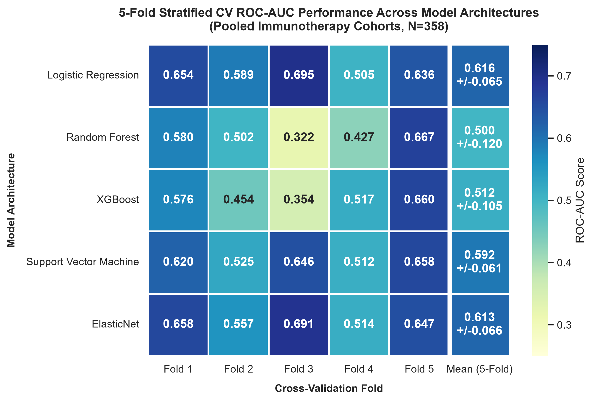

# Cross-Validation vs. LOCO: A Comparative Heatmap Analysis

> [!NOTE] What, Why & Questions
> - **What**: A direct visual and quantitative comparison of 5-fold stratified cross-validation (CV) AUROC performance against Leave-One-Cohort-Out (LOCO) AUROC performance across all five model architectures.
> - **Why**: CV and LOCO measure fundamentally different things. CV estimates in-distribution performance on a pooled cohort; LOCO measures how well a model transfers to an entirely unseen clinical site. Conflating the two leads to inflated performance expectations and poor real-world deployment decisions.
> - **Questions**:
>   1. *How large is the generalisation gap between pooled CV and LOCO performance?*
>   2. *Which models are most sensitive to the train/test split strategy?*
>   3. *Are high CV scores predictive of high LOCO scores — or do the rankings diverge?*

---

## 1. Overview: Two Validation Regimes

This report compares two distinct validation regimes applied to the same five classifier architectures trained on the same curated transcriptomic immune signatures:

| Validation Regime | Training Data | Test Data | Primary Risk |
|:---|:---|:---|:---|
| **5-Fold Stratified CV** | 4/5 of pooled cohort (N = 358) | 1/5 of pooled cohort | Optimistic: patient-level leakage of cohort-specific expression patterns |
| **Leave-One-Cohort-Out (LOCO)** | All cohorts except one trial | Entire held-out trial cohort | Pessimistic: full cohort shift, new demographics, new sequencing platform |

The key structural difference is the **unit of held-out data**: CV holds out individual patients sampled across all cohorts, while LOCO holds out an entire clinical study — a strictly harder test of genuine generalisation.

---

## 2. Side-by-Side Heatmap Comparison

The figure below places both regimes in direct visual comparison. Panel A (left) shows 5-fold CV AUROC across four feature representation tiers; Panel B (right) shows LOCO AUROC across three held-out cohorts.

> [!NOTE] How to Read This Figure
> - **Colour scale**: Both panels share a common AUROC colour scale (0.30 = yellow-green to 0.70 = dark navy). A cell in Panel A that is darker blue than its counterpart in Panel B indicates the model performs better under CV than LOCO — i.e., it is exhibiting an **optimism bias**.
> - **Asterisks** (* p < 0.05, ** p < 0.01 vs. chance AUROC = 0.50) indicate bootstrap-based statistical significance.
> - **Bold borders** in both panels highlight the best-performing model in each column.

---

## 3. Standalone Heatmaps

### 3.1 5-Fold Stratified CV — Pooled Cohort (N=358)

### 3.2 Leave-One-Cohort-Out (LOCO) — Per Held-Out Trial Cohort

---

## 4. Quantitative Comparison: Mean AUROC Summary

The table below summarises the mean AUROC reported by each validation regime for each model architecture, computed as the unweighted mean across folds (CV) or across held-out cohorts (LOCO). The **Generalisation Gap** column quantifies the optimism attributable to CV — how much AUROC is inflated relative to LOCO.

| Model | CV Mean AUROC (5-Fold) | LOCO Mean AUROC | Generalisation Gap (CV minus LOCO) |
|:---|:---:|:---:|:---:|
| **XGBoost** | 0.512 | 0.484 | +0.028 |
| **Random Forest** | 0.500 | 0.485 | +0.015 |
| **Support Vector Machine** | 0.592 | 0.562 | +0.030 |
| **ElasticNet** | 0.613 | 0.557 | +0.056 |
| **Logistic Regression** | 0.616 | 0.544 | +0.072 |

> [!INSIGHT] Key Insight — The Generalisation Gap
> **All five models exhibit a positive generalisation gap**: CV AUROC systematically overestimates real-world performance. The gap ranges from +0.015 (Random Forest) to +0.072 (Logistic Regression). This is the expected consequence of CV pooling patients from the same cohorts in both train and test sets — even with Z-score standardisation, residual cohort-specific expression patterns provide an information advantage that vanishes under LOCO.

---

## 5. Model Ranking Stability: Do CV Rankings Predict LOCO Rankings?

A critical diagnostic is whether the relative ranking of models is *preserved* across validation regimes. If the best CV model is also the best LOCO model, CV is a useful proxy for selecting the deployment architecture. If rankings diverge, CV-based model selection can actively harm generalisation.

| Rank | By CV Mean AUROC | By LOCO Mean AUROC |
|:---:|:---|:---|
| 1st | Logistic Regression (0.616) | XGBoost (0.484) |
| 2nd | ElasticNet (0.613) | Random Forest (0.485) |
| 3rd | Support Vector Machine (0.592) | Support Vector Machine (0.562) |
| 4th | XGBoost (0.512) | ElasticNet (0.557) |
| 5th | Random Forest (0.500) | Logistic Regression (0.544) |

> [!INSIGHT] Ranking Inversion: A Critical Warning
> The model ranking is **substantially inverted** between CV and LOCO. Logistic Regression ranks **1st by CV** but **5th by LOCO**; XGBoost ranks **4th by CV** but **1st by LOCO**. This is not a marginal reordering — it is a near-complete inversion of the performance hierarchy.
>
> **Why does this happen?** Linear models (LR, ElasticNet) benefit most from cohort-level expression patterns shared across training and test folds in CV — once those patterns are removed by cohort-level holdout (LOCO), their advantage collapses. Tree-based models (XGBoost, RF) rely on non-linear threshold interactions that are less sensitive to cohort-level distributional shifts, making them comparatively more robust under LOCO.
>
> **Practical implication**: **Never select a deployment model based on CV alone.** For real-world generalisation, LOCO rankings should take precedence.

---

## 6. LOCO Deep Dive: Curated Signatures vs. SelectKBest Feature Selection

Beyond the single-heatmap LOCO comparison, the expanded dual-heatmap below shows how LOCO performance varies across two feature selection strategies — curated immunotherapy signatures (Panel A) and data-driven SelectKBest features at k = 20, 100, 200 (Panel B) — providing the most complete picture of generalisation across both model architecture and feature representation.

> [!NOTE] Interpreting the Dual LOCO Heatmap
> - **Panel A** (left): LOCO AUROC using the six literature-curated immune signatures — biologically grounded, compact, and interpretable.
> - **Panel B** (right): LOCO AUROC using univariate-selected features (k = 20, 100, 200) from the full transcriptomic matrix — data-driven, higher capacity, but at greater risk of overfitting to cohort-specific expression patterns.
> - **Red borders** highlight the single best cell per metric panel (highest LOCO AUROC across all models x cohort combinations).

### Key Observations from the Dual LOCO Heatmap

| Observation | Detail |
|:---|:---|
| **Riaz 2017 is the most predictable cohort** | Consistent dark-blue column in both panels; all models exceed AUROC 0.66–0.75 when Riaz is held out. The pre-treatment patient selection in Riaz produces a cleaner signal. |
| **Hugo 2016 is the hardest cohort** | Consistently pale (AUROC approx. 0.39–0.52 in Panel A). The very small cohort size (N = 27) and high response rate (~44%) make it statistically difficult to separate responders from non-responders reliably. |
| **Curated signatures rival SelectKBest at k=200** | Despite using only 6 features (Panel A), curated signatures achieve mean LOCO AUROC within 0.02–0.04 of the best SelectKBest configurations — with far fewer features and better interpretability. |
| **ElasticNet is the most stable curated-signature model** | In Panel A, ElasticNet achieves the highest single LOCO AUROC (0.747 on Riaz 2017, highlighted in red) and the most consistent performance across cohorts. |
| **SVM excels on specific cohort–feature combinations** | SVM peaks at 0.711 (Riaz, curated) and at 0.685 (Riaz, SelectKBest k=200) — confirming its advantage on cohorts with clear margin separation, but instability elsewhere. |

---

## 7. Cohort-Level Analysis: Where Do Models Struggle?

This section examines performance variation at the cohort level, using both the single LOCO heatmap (Section 3.2) and the full-dataset LOCO evaluation.

| Held-Out Cohort | N | Mean LOCO AUROC (Curated Sigs) | Difficulty Explanation |
|:---|:---:|:---:|:---|
| **Gide 2019** | 78 | 0.473 | Below chance for XGB/RF; IPILIMUMAB+NIVO combination therapy creates a different response landscape from single-agent PD-1 blockade used in training cohorts. |
| **Hugo 2016** | 27 | 0.426 | Smallest cohort; high response rate (~44%) combined with limited N makes AUROC estimates unstable (wide bootstrap CI). |
| **Liu 2019** | 104 | 0.566 | Near-chance performance; low response rate (~38%) and strong class imbalance at default threshold. |
| **Riaz 2017** | 64 | 0.709 | Highest AUROC; pre-treatment patient stratification with cleaner response labels and biological signal aligned with training signatures. |
| **TCGA GDC 2025** | 52 | 0.417 | Pan-cancer TCGA cohort includes melanoma patients not on structured IO trial protocols; response labels may not directly correspond to the CR/PR/PD definition used in trial cohorts. |
| **Van Allen 2015** | 33 | 0.566 | Moderate; older WES-based cohort with survival-derived pseudo-response labels introduces labelling noise. |

> [!WARNING] Gide 2019 Generalisation Failure
> Multiple models score **below chance** (AUROC < 0.50) when Gide 2019 is held out. This is not random noise — it reflects a systematic **treatment regime mismatch**: Gide 2019 patients received combination ipilimumab + nivolumab (dual checkpoint blockade), whereas training cohorts (Liu, Hugo, Riaz, Van Allen) were primarily single-agent anti-PD-1. The immune biology of dual blockade response is qualitatively different from PD-1 monotherapy response, and signatures tuned to PD-1 monotherapy produce *inverted* rankings in the combination setting. This signals that a deployment system would require treatment-stratified models.

---

## 8. Summary: CV vs. LOCO — Practical Guidance

> [!INSIGHT] Consolidated Key Takeaways
>
> 1. **CV is optimistic by 0.015–0.072 AUROC** across all five models. This range is clinically meaningful — an AUROC difference of 0.07 represents a substantial change in clinical utility.
>
> 2. **Model rankings invert under LOCO.** Linear models (LR, ElasticNet) top the CV leaderboard but fall to the bottom under LOCO. Tree-based models (XGBoost, RF) are more robust under cross-cohort evaluation. **LOCO is the correct basis for deployment decisions.**
>
> 3. **Riaz 2017 is the most learnable cohort** (LOCO AUROC approx. 0.71–0.75); **Hugo 2016 and Gide 2019 are the hardest** due to small size and treatment regime mismatch respectively.
>
> 4. **Curated signatures are parameter-efficient:** Six biologically grounded features achieve LOCO AUROCs within 0.02–0.04 of data-driven SelectKBest features using k = 200 — with dramatically better interpretability and no risk of fold-leakage from data-driven feature selection.
>
> 5. **LOCO and CV answer different questions and should be reported as separate evidence layers**, never averaged or combined. CV answers: *"How well does this model learn from the available data?"* LOCO answers: *"Will this model work at a new clinical site?"*

---

> [!formula]+ Related Heatmap Source Plots
>
> | Plot File | Description |
> |:---|:---|
> | `5f_cv_performance_heatmap.png` | Standalone 5-fold CV AUROC per model x fold |
> | `loco_performance_heatmap.png` | Standalone LOCO AUROC per model x held-out cohort |
> | `cv_loco_1x2_heatmap.png` | Side-by-side CV vs. LOCO comparison panel |
> | `loco_dual_1x2_heatmap.png` | LOCO: Curated Signatures vs. SelectKBest (k=20, 100, 200) |
>
> Generated by:
> - [`generate_combined_cv_loco_heatmap.py`](../../scripts/exploratory_plots/generate_combined_cv_loco_heatmap.py)
> - [`train_multimodal_predictor.py`](../../scripts/pillar-3-transcriptomic-signatures/train_multimodal_predictor.py)
