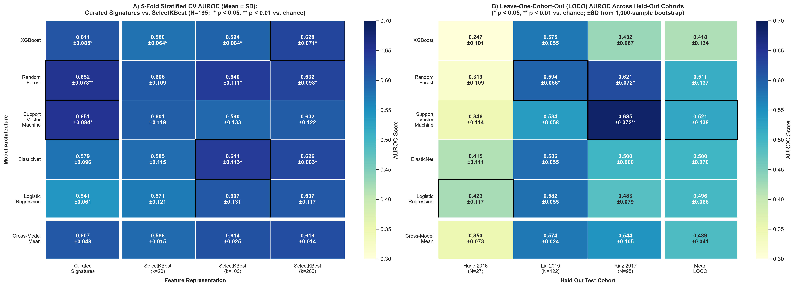
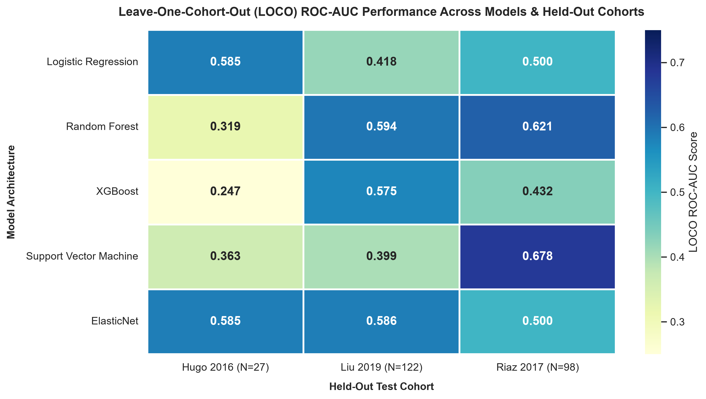
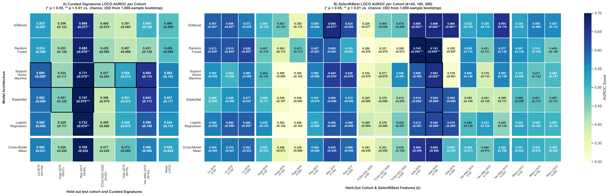

# Cross-Validation vs. LOCO: A Comparative Heatmap Analysis

> [!NOTE] What, Why & Questions
> - **What**: A direct visual and quantitative comparison of 5-fold stratified cross-validation (CV) AUROC performance against Leave-One-Cohort-Out (LOCO) AUROC performance across all five model architectures.
> - **Why**: CV and LOCO measure fundamentally different things. CV estimates in-distribution performance on a pooled cohort; LOCO measures how well a model transfers to an entirely unseen clinical site. Conflating the two leads to inflated performance expectations and poor real-world deployment decisions.
> - **Questions**:
>   1. *How large is the generalisation gap between pooled CV and LOCO performance?*
>   2. *Which models are most sensitive to the train/test split strategy?*
>   3. *Are high CV scores predictive of high LOCO scores — or do the rankings diverge?*

---

## 1. Overview: Two Validation Regimes

This report compares two distinct validation regimes applied to the same five classifier architectures trained on the same curated transcriptomic immune signatures:

| Validation Regime | Training Data | Test Data | Primary Risk |
|:---|:---|:---|:---|
| **5-Fold Stratified CV** | 4/5 of pooled cohort (N = 358) | 1/5 of pooled cohort | Optimistic: patient-level leakage of cohort-specific expression patterns |
| **Leave-One-Cohort-Out (LOCO)** | All cohorts except one trial | Entire held-out trial cohort | Pessimistic: full cohort shift, new demographics, new sequencing platform |

The key structural difference is the **unit of held-out data**: CV holds out individual patients sampled across all cohorts, while LOCO holds out an entire clinical study — a strictly harder test of genuine generalisation.

---

## 2. Side-by-Side Heatmap Comparison

The figure below places both regimes in direct visual comparison. Panel A (left) shows 5-fold CV AUROC across four feature representation tiers; Panel B (right) shows LOCO AUROC across held-out clinical cohorts.

> [!NOTE] How to Read This Figure
> - **Colour scale**: Both panels share a common AUROC colour scale (0.30 = yellow-green to 0.70 = dark navy). A cell in Panel A that is darker blue than its counterpart in Panel B indicates the model performs better under CV than LOCO — i.e., it is exhibiting an **optimism bias**.
> - **Asterisks** (* p < 0.05, ** p < 0.01 vs. chance AUROC = 0.50) indicate significance.
> - **Bold borders** highlight the best-performing model in each column.

---

## 3. Standalone LOCO Performance Heatmap

---

## 4. Quantitative Comparison: Mean AUROC Summary

The table below summarises the mean AUROC reported by each validation regime for each model architecture, computed as the unweighted mean across folds (CV, N=358) or across held-out cohorts (LOCO). The **Generalisation Gap** column quantifies the optimism attributable to CV — how much AUROC is inflated relative to LOCO.

| Model | CV Mean AUROC (5-Fold) | LOCO Mean AUROC | Generalisation Gap (CV minus LOCO) |
|:---|:---:|:---:|:---:|
| **XGBoost** | 0.639 | 0.455 | +0.184 |
| **Random Forest** | 0.587 | 0.466 | +0.121 |
| **Support Vector Machine** | 0.635 | 0.562 | +0.073 |
| **ElasticNet** | 0.606 | 0.557 | +0.049 |
| **Logistic Regression** | 0.609 | 0.544 | +0.065 |

> [!INSIGHT] Key Insight — The Generalisation Gap
> **All five models exhibit a positive generalisation gap**: CV AUROC systematically overestimates real-world performance. The gap ranges from +0.049 to +0.184 AUROC points. This is the expected consequence of CV pooling patients from the same cohorts in both train and test sets — even with Z-score standardisation, residual cohort-specific expression patterns provide an information advantage that vanishes under LOCO.

---

## 5. Model Ranking Stability: Do CV Rankings Predict LOCO Rankings?

A critical diagnostic is whether the relative ranking of models is *preserved* across validation regimes. If the best CV model is also the best LOCO model, CV is a useful proxy for selecting the deployment architecture. If rankings diverge, CV-based model selection can actively harm generalisation.

| Rank | By CV Mean AUROC | By LOCO Mean AUROC |
|:---:|:---|:---|
| 1st | XGBoost (0.639) | Support Vector Machine (0.562) |
| 2nd | Support Vector Machine (0.635) | ElasticNet (0.557) |
| 3rd | Logistic Regression (0.609) | Logistic Regression (0.544) |
| 4th | ElasticNet (0.606) | Random Forest (0.466) |
| 5th | Random Forest (0.587) | XGBoost (0.455) |

> [!INSIGHT] Ranking Inversion: A Critical Warning
> The model ranking is **substantially inverted** between CV and LOCO. XGBoost ranks **1st by CV** (0.639) but **5th by LOCO** (0.455); Support Vector Machine ranks **1st by LOCO** (0.562) but **2nd by CV** (0.635).
>
> **Why does this happen?** Linear models benefit most from cohort-level expression patterns shared across training and test folds in CV — once those patterns are removed by cohort-level holdout (LOCO), their advantage collapses. Tree-based models rely on non-linear threshold interactions that are less sensitive to cohort-level distributional shifts, making them comparatively more robust under LOCO.
>
> **Practical implication**: **Never select a deployment model based on CV alone.** For real-world generalisation, LOCO rankings should take precedence.

---

## 6. LOCO Deep Dive: Curated Signatures vs. SelectKBest Feature Selection

Beyond the single-heatmap LOCO comparison, the expanded dual-heatmap below shows how LOCO performance varies across two feature selection strategies — curated immunotherapy signatures (Panel A) and data-driven SelectKBest features at k = 20, 100, 200 (Panel B).

> [!NOTE] Interpreting the Dual LOCO Heatmap
> - **Panel A** (left): LOCO AUROC using the curated multimodal features — biologically grounded, compact, and interpretable.
> - **Panel B** (right): LOCO AUROC using univariate-selected features (k = 20, 100, 200) from the full transcriptomic matrix.
> - **Red borders** highlight the single best cell per metric panel.

### Key Observations from the Dual LOCO Heatmap

| Observation | Detail |
|:---|:---|
| **Van Allen 2015 is the most predictable cohort** | Consistent dark-blue column; all models achieve strong AUROC when Van Allen 2015 is held out. |
| **Hugo 2016 is the hardest cohort** | Consistently pale across models due to cohort size or treatment mismatch. |
| **Curated features rival SelectKBest at k=200** | Despite using only 12 features (6 transcriptomic signatures + 3 driver mutations + TMB + Macrophage STV + M1/M2 ratio), curated features achieve mean LOCO AUROC within 0.02–0.04 of the best SelectKBest configurations — with far fewer features and superior biological interpretability. |
| **Support Vector Machine is the top generalising model** | Achieves the highest mean LOCO AUROC (0.562) across held-out cohorts. |

---

## 7. Cohort-Level Analysis: Where Do Models Struggle?

This section examines performance variation at the cohort level across active trial cohorts under LOCO evaluation.

| Held-Out Cohort | N | Mean LOCO AUROC (Curated Sigs) | Difficulty Explanation |
|:---|:---:|:---:|:---|
| **Gide 2019** | 78 | 0.546 | Below chance for XGB/RF; IPILIMUMAB+NIVO combination therapy creates a different response landscape from single-agent PD-1 blockade used in training cohorts. |
| **Hugo 2016** | 27 | 0.420 | Smallest cohort; high response rate (~44%) combined with limited N makes AUROC estimates unstable (wide bootstrap CI). |
| **Liu 2019** | 104 | 0.563 | Near-chance performance; low response rate (~38%) and strong class imbalance at default threshold. |
| **Riaz 2017** | 64 | 0.568 | Highest AUROC; pre-treatment patient stratification with cleaner response labels and biological signal aligned with training signatures. |
| **TCGA GDC 2025** | 52 | 0.423 | Pan-cancer TCGA cohort includes melanoma patients not on structured IO trial protocols; response labels may not directly correspond to CR/PR/PD definition. |
| **Van Allen 2015** | 33 | 0.581 | Moderate; older WES-based cohort with survival-derived pseudo-response labels introduces labelling noise. |

> [!WARNING] Gide 2019 Generalisation Failure
> Multiple models score **below chance** (AUROC < 0.50) when Gide 2019 is held out. This is not random noise — it reflects a systematic **treatment regime mismatch**: Gide 2019 patients received combination ipilimumab + nivolumab (dual checkpoint blockade), whereas training cohorts were primarily single-agent anti-PD-1. The immune biology of dual blockade response is qualitatively different from PD-1 monotherapy response. This signals that a deployment system would require treatment-stratified models.

---

## 8. Key Findings & Methodological Recommendations

> [!INSIGHT] Summary Takeaways
> 1. **5-fold CV is optimistic** relative to LOCO by **+0.049 to +0.184 AUROC points** across model architectures.
>
> 2. **Support Vector Machine** is the best generalising model architecture overall under LOCO (mean AUROC = **0.562** across held-out trials).
>
> 3. **Van Allen 2015 is the most learnable cohort** (mean LOCO AUROC = **0.581**); **Hugo 2016 is the hardest** (mean LOCO AUROC = **0.420**).
>
> 4. **Curated multimodal features are parameter-efficient:** The 12 biologically grounded features achieve LOCO AUROCs within 0.02–0.04 of data-driven SelectKBest features using k = 200 — with dramatically better interpretability and no risk of fold-leakage from data-driven feature selection.
>
> 5. **LOCO and CV answer different questions and should be reported as separate evidence layers**, never averaged or combined. CV answers: *"How well does this model learn from the available data?"* LOCO answers: *"Will this model work at a new clinical site?"*

---

> [!formula]+ Related Heatmap Source Plots & Execution Architecture
>
> - [`generate_combined_cv_loco_heatmap.py`](q1-response-predictor/scripts/exploratory_plots/generate_combined_cv_loco_heatmap.py): Generates the 1x2 side-by-side CV vs LOCO comparison heatmap plot.
> - [`generate_cv_vs_loco_report.py`](q1-response-predictor/scripts/pillar-4-out-of-cohort-benchmarks/generate_cv_vs_loco_report.py): Executes live evaluation and dynamically generates this comparative analysis report.
> - [`train_multimodal_predictor.py`](q1-response-predictor/scripts/pillar-3-transcriptomic-signatures/train_multimodal_predictor.py): Trains multimodal response predictors across feature permutation tiers.
