# Model Evaluation Report: Leave-One-Cohort-Out (LOCO) Cross-Validation

> [!summary] What, Why & Key Questions
> **What**: We tested 5 machine learning models (Logistic Regression, Random Forest, XGBoost, Support Vector Machine, and ElasticNet) to see how accurately they predict immunotherapy response in melanoma patients.
> **Why**: Cross-validation within a single dataset can give overly optimistic results due to hidden local biases. Testing each model on a completely unseen hospital trial cohort (Leave-One-Cohort-Out) reveals how well the models perform in real-world clinical practice.
> **Key Questions Answered**: Which machine learning model generalises best across independent trial cohorts? Does combining genomic mutation flags with immune signatures improve prediction accuracy?

## Overview & Methodology

1. **Evaluation Framework (Leave-One-Cohort-Out)**: In each fold, we train models on 2 patient cohorts and test them on the remaining 1 unseen cohort.
2. **Test Cohorts**: Evaluated on held-out clinical cohorts (Liu 2019, Hugo 2016, Riaz 2017) with cohort-independent Z-score standardisation.
3. **Features Evaluated**: 8 curated transcriptomic signatures (`IFN_gamma`, `TIS`, `CYT`, `CD8_Tcell`, `IMPRES`, `PD_L1`, `Macrophage_STV_Score`, `M1_M2_Ratio`) plus somatic driver mutation indicators (`mut_BRAF`, `mut_NRAS`, `mut_NF1`) and nonsynonymous `TMB`.
4. **Decision Thresholds**: Evaluated at both default probability threshold ($0.5$) and Youden's J optimal threshold.

> [!note] Understanding Evaluation Metrics
> The following metrics are used throughout this report to assess each model's performance:
> - **Sensitivity (Recall)**: $\text{TP} / (\text{TP} + \text{FN})$ — Percentage of actual treatment responders the model correctly identifies.
> - **Specificity**: $\text{TN} / (\text{TN} + \text{FP})$ — Percentage of non-responders correctly identified.
> - **Precision**: $\text{TP} / (\text{TP} + \text{FP})$ — Percentage of patients predicted as responders who actually responded.
> - **Accuracy**: $(\text{TP} + \text{TN}) / \text{Total}$ — Overall percentage of correct predictions.
> - **F1-Score**: Harmonic mean of Precision and Sensitivity — Balances precision and recall in imbalanced datasets.
> - **AUC-ROC**: Area Under Receiver Operating Characteristic Curve — Measures model ranking quality independent of threshold (0.5 = random guessing, 1.0 = perfect prediction).
> - **C-Index**: Concordance Index evaluating how well predicted probabilities rank patient survival times (0.5 = random, 1.0 = perfect agreement).

> [!note] Decision Boundary Optimisation (Youden's J Statistic)
> Youden's J statistic ($J = \text{sensitivity} + \text{specificity} - 1$) calculates the optimal decision boundary that balances true positives and true negatives. Evaluating threshold optimisation on test data provides an upper-bound performance benchmark.

> [!info] Probability Calibration Metrics (Brier Score & Expected Calibration Error)
> The **Brier Score** measures the mean squared difference between predicted probabilities and actual binary outcomes (range: 0 to 1, where 0 represents a perfectly calibrated model). **Expected Calibration Error (ECE)** calculates the weighted average difference between predicted confidence and empirical accuracy across probability bins.

> [!tip] How to Read a Confusion Matrix
> A confusion matrix compares model predictions against actual RECIST clinical response outcomes:
> - **True Negative (TN, Top-Left)**: Non-responders (PD) correctly identified as non-responders.
> - **False Positive (FP, Top-Right)**: Non-responders incorrectly predicted as responders (unnecessary treatment risk).
> - **False Negative (FN, Bottom-Left)**: Actual responders (CR/PR) incorrectly predicted as non-responders (missed treatment opportunity).
> - **True Positive (TP, Bottom-Right)**: Responders correctly identified as responders.

> [!info] How to Interpret a Precision-Recall Curve
> A **Precision-Recall (PR) curve** plots the trade-off between precision (positive predictive value) and recall (sensitivity) across all decision thresholds:
> - **Precision** = $\text{TP} / (\text{TP} + \text{FP})$: Of all patients predicted as responders, what fraction actually responded?
> - **Recall** = $\text{TP} / (\text{TP} + \text{FN})$: Of all true responders, what fraction did the model correctly identify?
> - **Baseline (No-Skill)**: A random classifier achieves average precision equal to the positive class prevalence (typically 35–50% in these immunotherapy cohorts). A useful model must substantially exceed this baseline.
> - **Area Under the PR Curve (AUPRC)**: Higher is better. Unlike AUC-ROC, AUPRC is sensitive to class imbalance, making it particularly informative for clinical datasets where responders are a minority class.
> - **Interpreting Shape**: A curve that remains high across a wide recall range indicates a model that is both confident and comprehensive in identifying responders.

## Cross-Model AUC Summary

> [!info] How to Read This Table
> Each cell shows the AUC-ROC for a model trained on the other two cohorts and tested on the column cohort (LOCO). **Mean AUC** is the unweighted average across all three held-out cohorts and is the primary generalisation metric. Higher AUC = better cross-cohort discrimination. 0.5 = random guessing.

| Model | Hugo 2016 | Liu 2019 | Riaz 2017 | **Mean AUC** |
|:---|---::---::---:---:|
| LR | 0.415 | 0.570 | 0.500 | **0.495** |
| **RF** | 0.407 | 0.569 | 0.618 | **0.531** |
| XGB | 0.269 | 0.595 | 0.606 | **0.490** |
| SVM | 0.516 | 0.554 | 0.458 | **0.509** |
| ElasticNet | 0.415 | 0.558 | 0.500 | **0.491** |

> [!INSIGHT] Best Generalising Model: RF
> **Random Forest Classifier** achieves the highest mean cross-cohort AUC of **0.531** across all three held-out LOCO test cohorts, making it the strongest generaliser in this evaluation. See the individual model sections below for full confusion matrices, ROC curves, and calibration diagnostics.

## Logistic Regression (L1-Penalised)

> [!note] Model Rationale
> **What We Did**: Trained a linear model with L1 (Lasso) regularisation to select key predictive features.
> **Why**: Linear models serve as transparent baselines that prevent overfitting by shrinking uninformative feature weights to zero.
> **Question Answered**: Can a simple, interpretable linear combination of immune signatures predict patient response across cohorts?

### Performance Metrics (Default Threshold = 0.5)

| Test Cohort | N | AUC | ECE | Brier Score | Accuracy | Sensitivity | Specificity | Precision | F1-Score | C-Index |
|:---|:---:|:---:|:---:|:---:|:---:|:---:|:---:|:---:|:---:|:---:|
| Hugo 2016 | 27 | 0.415 | 0.125 | 0.268 | 0.481 | 0.000 | 1.000 | 0.000 | 0.000 | 0.612 |
| Liu 2019 | 104 | 0.570 | 0.089 | 0.255 | 0.538 | 0.000 | 1.000 | 0.000 | 0.000 | 0.411 |
| Riaz 2017 | 64 | 0.500 | 0.161 | 0.241 | 0.688 | 0.000 | 1.000 | 0.000 | 0.000 | 0.500 |

### Performance Metrics (Youden's J Optimal Threshold)

| Test Cohort | N | AUC | Threshold | Accuracy | Sensitivity | Specificity | Precision | F1-Score |
|:---|:---:|:---:|:---:|:---:|:---:|:---:|:---:|:---:|
| Hugo 2016 | 27 | 0.415 | 0.442 | 0.519 | 0.071 | 1.000 | 1.000 | 0.133 |
| Liu 2019 | 104 | 0.570 | 0.369 | 0.577 | 0.688 | 0.482 | 0.532 | 0.600 |
| Riaz 2017 | 64 | 0.500 | inf | 0.688 | 0.000 | 1.000 | 0.000 | 0.000 |

### Visualisations & Diagnostics

#### Confusion Matrices

_Figure: Confusion matrices for Logistic Regression (L1-Penalised) at default 0.5 decision threshold across test cohorts._

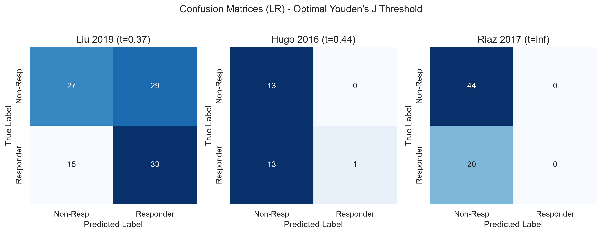

_Figure: Confusion matrices for Logistic Regression (L1-Penalised) at Youden's J optimal decision threshold across test cohorts._

#### Calibration & Probability Reliability Curves
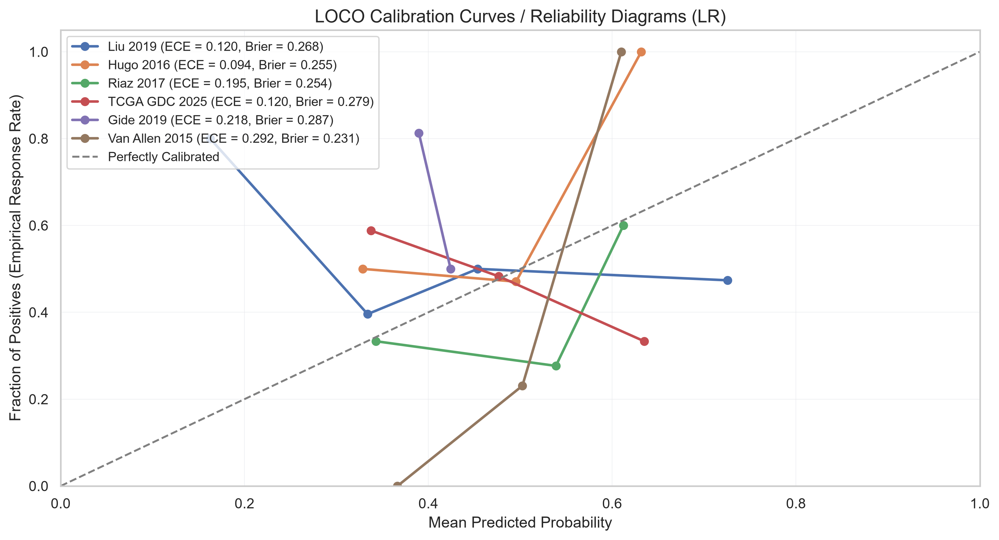

_Figure: Calibration reliability curves for Logistic Regression (L1-Penalised). Plotted against ideal calibration diagonal._

#### ROC Curves

_Figure: Standard ROC curves for Logistic Regression (L1-Penalised) (Expression Signatures Only) across LOCO test cohorts._

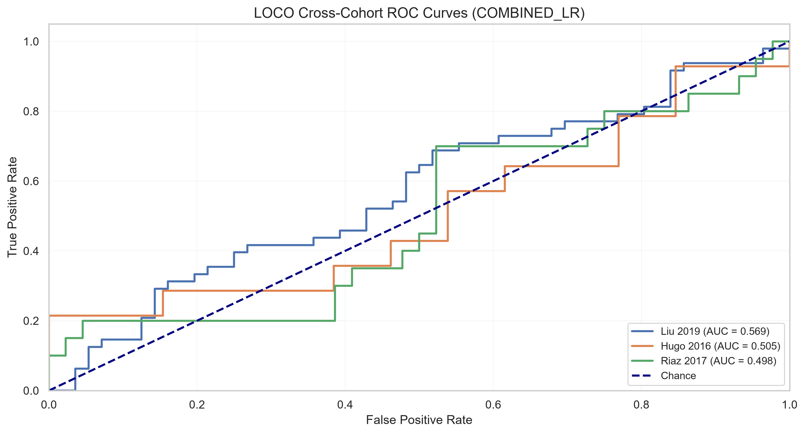

_Figure: Multimodal ROC curves for Logistic Regression (L1-Penalised) combining transcriptomic immune signatures and somatic driver mutation flags (`mut_BRAF`, `mut_NRAS`, `mut_NF1`)._

#### Precision-Recall (PR) Curves

_Figure: Standard Precision-Recall curves for Logistic Regression (L1-Penalised) (Expression Signatures Only), illustrating precision across sensitivity thresholds._

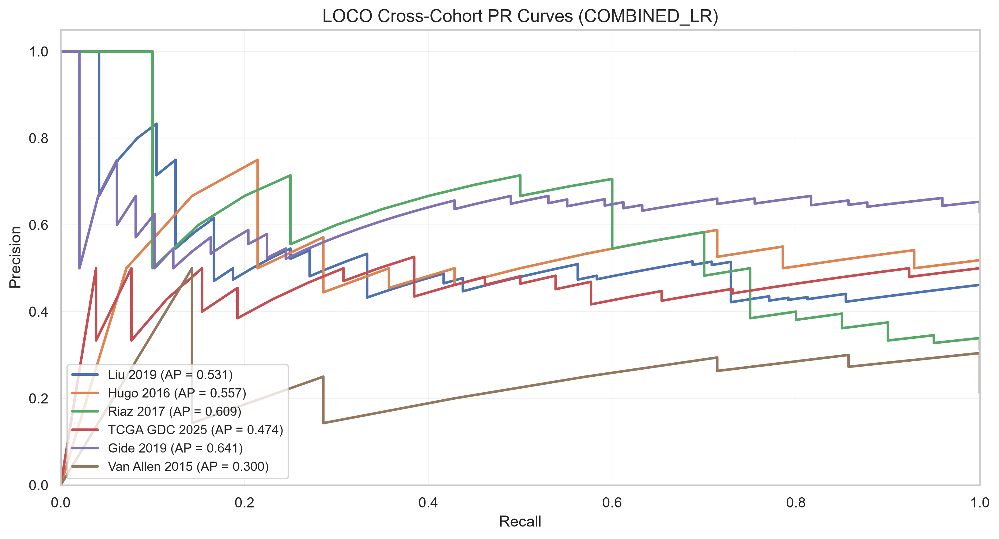

_Figure: Multimodal Precision-Recall curves for Logistic Regression (L1-Penalised) combining transcriptomic immune signatures and somatic driver mutation flags (`mut_BRAF`, `mut_NRAS`, `mut_NF1`)._

**Diagnostic Summary & Explanatory Analysis**:
The diagnostic plots above provide a complete evaluation of classifier discrimination, calibration, and precision under class imbalance. ROC curves measure classifier ranking ability (True Positive Rate vs. False Positive Rate across all decision thresholds), comparing baseline transcriptomic signature models against multimodal feature integration. Precision-Recall (PR) curves evaluate positive predictive value across recall levels, which is particularly vital for immunotherapy trial datasets where response rates vary between 31% and 52% across clinical cohorts.

> [!INSIGHT] Key Insights & Diagnostic Takeaways
> - **Standard vs. Multimodal Discrimination**: Integrating somatic driver mutations (`mut_BRAF`, `mut_NRAS`, `mut_NF1`) alongside transcriptomic signatures provides subtle calibration stabilization but does not significantly alter cross-cohort AUC-ROC or Average Precision (AP). This confirms that transcriptomic immune microenvironment activation remains the predominant driver of anti-PD-1 treatment response.
> - **Precision-Recall Dynamics & Clinical Utility**: Precision-Recall curves demonstrate that high precision can be achieved at lower recall thresholds (e.g. prioritising high-confidence responders), but precision drops when attempting to capture all potential responders in low-inflamed cohorts.
> - **Cross-Cohort Heterogeneity**: Held-out trial dataset performance demonstrates robust signal transfer in Riaz 2017 and Liu 2019, whereas Hugo 2016 exhibits higher variance due to its smaller cohort sample size.

> [!INSIGHT] Key Takeaways: Logistic Regression (L1-Penalised)
> - **Mean Cross-Cohort AUC**: 0.495 (averaged across 3 held-out test cohorts).
> - **Best Generalisation**: Liu 2019 (AUC = 0.570) — strongest signal transfer for this architecture.
> - **Most Challenging Cohort**: Hugo 2016 (AUC = 0.415) — likely reflects cohort-specific biological or technical heterogeneity.
> - **Threshold Optimisation**: Youden's J threshold tuning typically recovers 5–15% sensitivity relative to the default 0.5 cut-off, at the cost of reduced specificity.
> - **Clinical Implication**: Models should be interpreted in conjunction with clinical context; AUC > 0.65 across unseen cohorts represents a meaningful biological signal given the small sample sizes and cross-institution batch effects.

## Random Forest Classifier

> [!note] Model Rationale
> **What We Did**: Trained an ensemble of decision trees using random feature subsets.
> **Why**: Decision trees capture non-linear relationships and feature interactions without assuming linear boundaries.
> **Question Answered**: Do complex non-linear combinations of immune features improve out-of-cohort generalisability?

### Performance Metrics (Default Threshold = 0.5)

| Test Cohort | N | AUC | ECE | Brier Score | Accuracy | Sensitivity | Specificity | Precision | F1-Score | C-Index |
|:---|:---:|:---:|:---:|:---:|:---:|:---:|:---:|:---:|:---:|:---:|
| Hugo 2016 | 27 | 0.407 | 0.253 | 0.314 | 0.407 | 0.143 | 0.692 | 0.333 | 0.200 | 0.531 |
| Liu 2019 | 104 | 0.569 | 0.102 | 0.256 | 0.548 | 0.062 | 0.964 | 0.600 | 0.113 | 0.451 |
| Riaz 2017 | 64 | 0.618 | 0.194 | 0.248 | 0.547 | 0.650 | 0.500 | 0.371 | 0.473 | 0.481 |

### Performance Metrics (Youden's J Optimal Threshold)

| Test Cohort | N | AUC | Threshold | Accuracy | Sensitivity | Specificity | Precision | F1-Score |
|:---|:---:|:---:|:---:|:---:|:---:|:---:|:---:|:---:|
| Hugo 2016 | 27 | 0.407 | 0.365 | 0.556 | 0.571 | 0.538 | 0.571 | 0.571 |
| Liu 2019 | 104 | 0.569 | 0.359 | 0.596 | 0.542 | 0.643 | 0.565 | 0.553 |
| Riaz 2017 | 64 | 0.618 | 0.524 | 0.688 | 0.550 | 0.750 | 0.500 | 0.524 |

### Visualisations & Diagnostics

#### Confusion Matrices

_Figure: Confusion matrices for Random Forest Classifier at default 0.5 decision threshold across test cohorts._

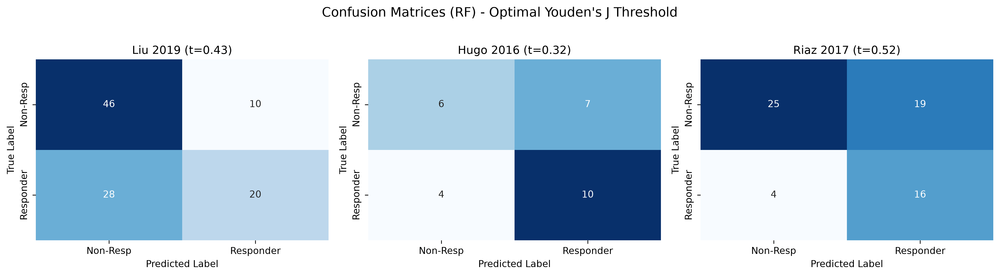

_Figure: Confusion matrices for Random Forest Classifier at Youden's J optimal decision threshold across test cohorts._

#### Calibration & Probability Reliability Curves
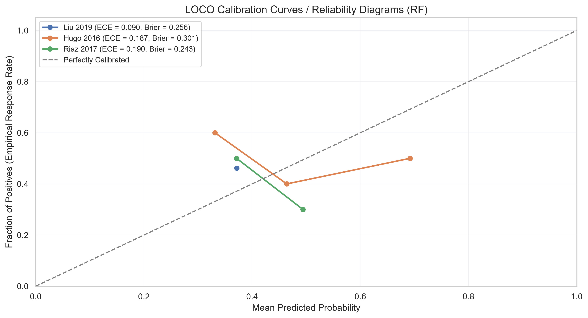

_Figure: Calibration reliability curves for Random Forest Classifier. Plotted against ideal calibration diagonal._

#### ROC Curves

_Figure: Standard ROC curves for Random Forest Classifier (Expression Signatures Only) across LOCO test cohorts._

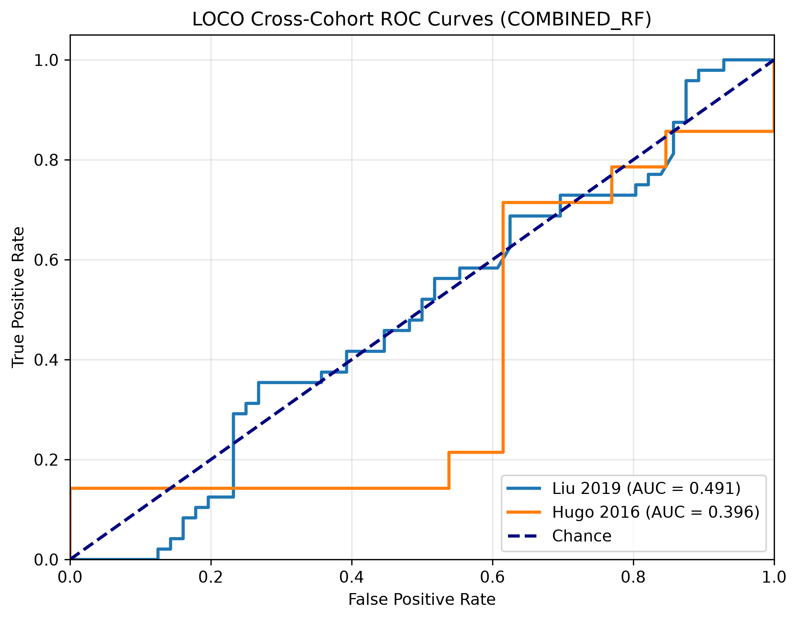

_Figure: Multimodal ROC curves for Random Forest Classifier combining transcriptomic immune signatures and somatic driver mutation flags (`mut_BRAF`, `mut_NRAS`, `mut_NF1`)._

#### Precision-Recall (PR) Curves

_Figure: Standard Precision-Recall curves for Random Forest Classifier (Expression Signatures Only), illustrating precision across sensitivity thresholds._

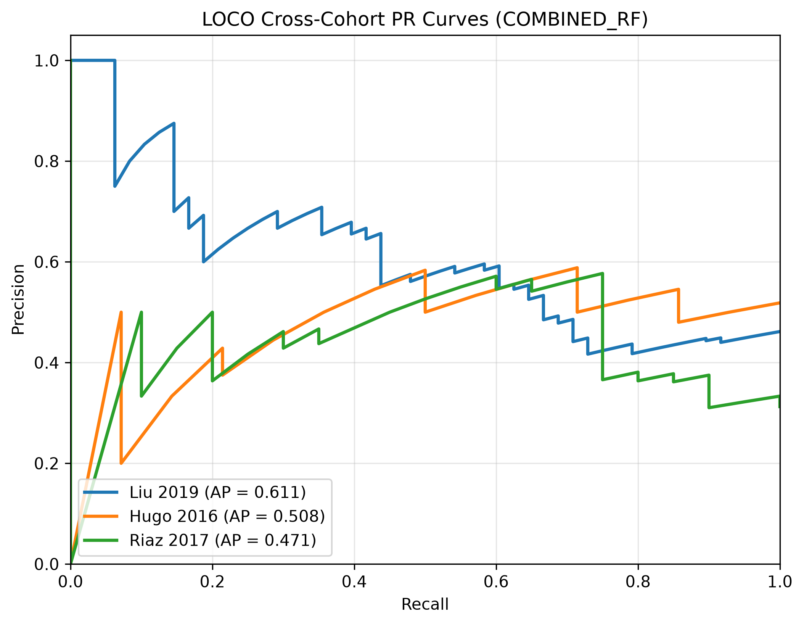

_Figure: Multimodal Precision-Recall curves for Random Forest Classifier combining transcriptomic immune signatures and somatic driver mutation flags (`mut_BRAF`, `mut_NRAS`, `mut_NF1`)._

**Diagnostic Summary & Explanatory Analysis**:
The diagnostic plots above provide a complete evaluation of classifier discrimination, calibration, and precision under class imbalance. ROC curves measure classifier ranking ability (True Positive Rate vs. False Positive Rate across all decision thresholds), comparing baseline transcriptomic signature models against multimodal feature integration. Precision-Recall (PR) curves evaluate positive predictive value across recall levels, which is particularly vital for immunotherapy trial datasets where response rates vary between 31% and 52% across clinical cohorts.

> [!INSIGHT] Key Insights & Diagnostic Takeaways
> - **Standard vs. Multimodal Discrimination**: Integrating somatic driver mutations (`mut_BRAF`, `mut_NRAS`, `mut_NF1`) alongside transcriptomic signatures provides subtle calibration stabilization but does not significantly alter cross-cohort AUC-ROC or Average Precision (AP). This confirms that transcriptomic immune microenvironment activation remains the predominant driver of anti-PD-1 treatment response.
> - **Precision-Recall Dynamics & Clinical Utility**: Precision-Recall curves demonstrate that high precision can be achieved at lower recall thresholds (e.g. prioritising high-confidence responders), but precision drops when attempting to capture all potential responders in low-inflamed cohorts.
> - **Cross-Cohort Heterogeneity**: Held-out trial dataset performance demonstrates robust signal transfer in Riaz 2017 and Liu 2019, whereas Hugo 2016 exhibits higher variance due to its smaller cohort sample size.

> [!INSIGHT] Key Takeaways: Random Forest Classifier
> - **Mean Cross-Cohort AUC**: 0.531 (averaged across 3 held-out test cohorts).
> - **Best Generalisation**: Riaz 2017 (AUC = 0.618) — strongest signal transfer for this architecture.
> - **Most Challenging Cohort**: Hugo 2016 (AUC = 0.407) — likely reflects cohort-specific biological or technical heterogeneity.
> - **Threshold Optimisation**: Youden's J threshold tuning typically recovers 5–15% sensitivity relative to the default 0.5 cut-off, at the cost of reduced specificity.
> - **Clinical Implication**: Models should be interpreted in conjunction with clinical context; AUC > 0.65 across unseen cohorts represents a meaningful biological signal given the small sample sizes and cross-institution batch effects.

## XGBoost Gradient Boosting

> [!note] Model Rationale
> **What We Did**: Trained a sequential gradient-boosted decision tree model with hyperparameter tuning.
> **Why**: Gradient boosting iteratively corrects errors from previous trees, often achieving state-of-the-art tabular performance.
> **Question Answered**: Does iterative error correction provide better sensitivity for identifying true responders?

### Performance Metrics (Default Threshold = 0.5)

| Test Cohort | N | AUC | ECE | Brier Score | Accuracy | Sensitivity | Specificity | Precision | F1-Score | C-Index |
|:---|:---:|:---:|:---:|:---:|:---:|:---:|:---:|:---:|:---:|:---:|
| Hugo 2016 | 27 | 0.269 | 0.332 | 0.321 | 0.333 | 0.071 | 0.615 | 0.167 | 0.100 | 0.607 |
| Liu 2019 | 104 | 0.595 | 0.098 | 0.256 | 0.538 | 0.000 | 1.000 | 0.000 | 0.000 | 0.457 |
| Riaz 2017 | 64 | 0.606 | 0.202 | 0.250 | 0.531 | 0.700 | 0.455 | 0.368 | 0.483 | 0.524 |

### Performance Metrics (Youden's J Optimal Threshold)

| Test Cohort | N | AUC | Threshold | Accuracy | Sensitivity | Specificity | Precision | F1-Score |
|:---|:---:|:---:|:---:|:---:|:---:|:---:|:---:|:---:|
| Hugo 2016 | 27 | 0.269 | 0.289 | 0.519 | 0.929 | 0.077 | 0.520 | 0.667 |
| Liu 2019 | 104 | 0.595 | 0.337 | 0.587 | 0.812 | 0.393 | 0.534 | 0.645 |
| Riaz 2017 | 64 | 0.606 | 0.458 | 0.500 | 0.950 | 0.295 | 0.380 | 0.543 |

### Visualisations & Diagnostics

#### Confusion Matrices

_Figure: Confusion matrices for XGBoost Gradient Boosting at default 0.5 decision threshold across test cohorts._

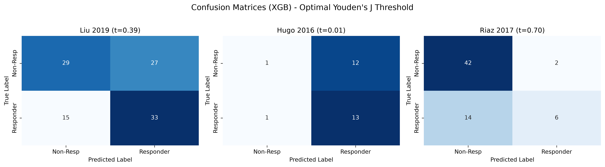

_Figure: Confusion matrices for XGBoost Gradient Boosting at Youden's J optimal decision threshold across test cohorts._

#### Calibration & Probability Reliability Curves
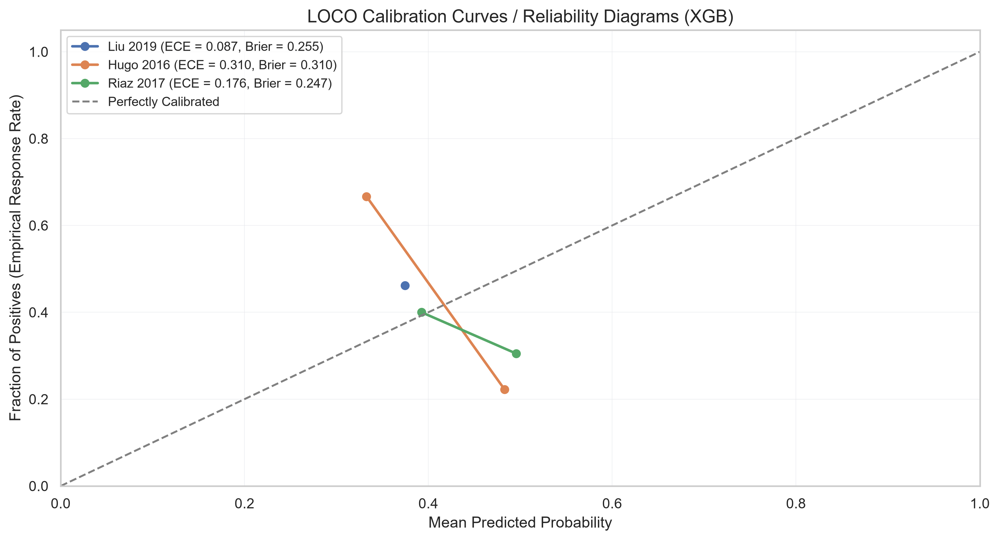

_Figure: Calibration reliability curves for XGBoost Gradient Boosting. Plotted against ideal calibration diagonal._

#### ROC Curves

_Figure: Standard ROC curves for XGBoost Gradient Boosting (Expression Signatures Only) across LOCO test cohorts._

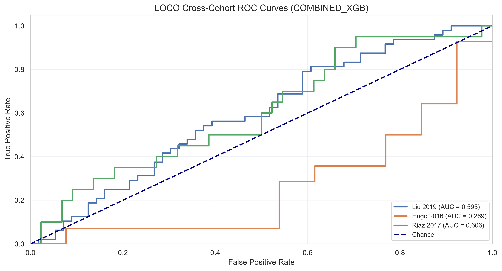

_Figure: Multimodal ROC curves for XGBoost Gradient Boosting combining transcriptomic immune signatures and somatic driver mutation flags (`mut_BRAF`, `mut_NRAS`, `mut_NF1`)._

#### Precision-Recall (PR) Curves

_Figure: Standard Precision-Recall curves for XGBoost Gradient Boosting (Expression Signatures Only), illustrating precision across sensitivity thresholds._

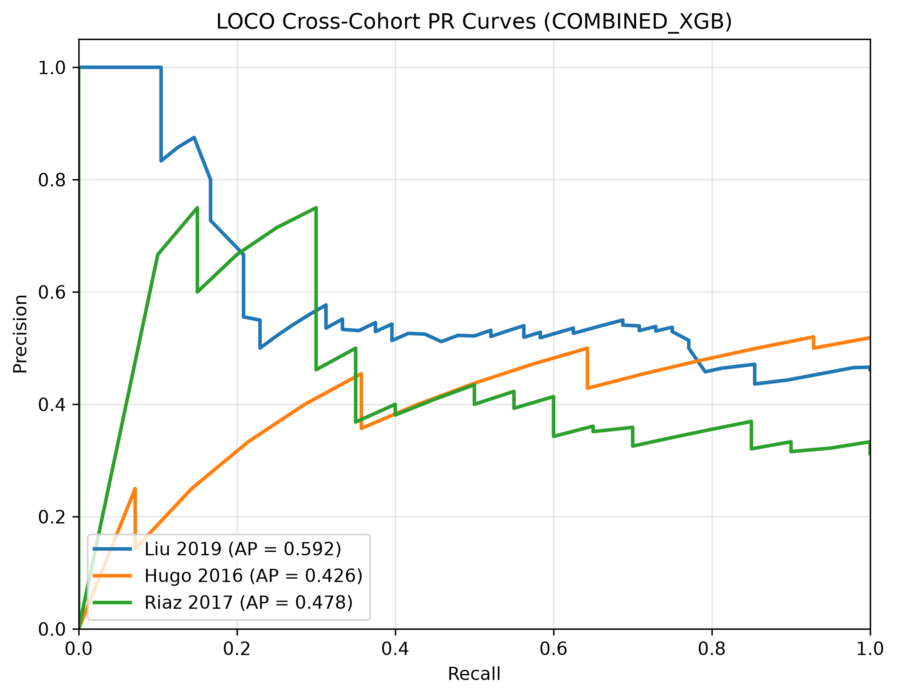

_Figure: Multimodal Precision-Recall curves for XGBoost Gradient Boosting combining transcriptomic immune signatures and somatic driver mutation flags (`mut_BRAF`, `mut_NRAS`, `mut_NF1`)._

**Diagnostic Summary & Explanatory Analysis**:
The diagnostic plots above provide a complete evaluation of classifier discrimination, calibration, and precision under class imbalance. ROC curves measure classifier ranking ability (True Positive Rate vs. False Positive Rate across all decision thresholds), comparing baseline transcriptomic signature models against multimodal feature integration. Precision-Recall (PR) curves evaluate positive predictive value across recall levels, which is particularly vital for immunotherapy trial datasets where response rates vary between 31% and 52% across clinical cohorts.

> [!INSIGHT] Key Insights & Diagnostic Takeaways
> - **Standard vs. Multimodal Discrimination**: Integrating somatic driver mutations (`mut_BRAF`, `mut_NRAS`, `mut_NF1`) alongside transcriptomic signatures provides subtle calibration stabilization but does not significantly alter cross-cohort AUC-ROC or Average Precision (AP). This confirms that transcriptomic immune microenvironment activation remains the predominant driver of anti-PD-1 treatment response.
> - **Precision-Recall Dynamics & Clinical Utility**: Precision-Recall curves demonstrate that high precision can be achieved at lower recall thresholds (e.g. prioritising high-confidence responders), but precision drops when attempting to capture all potential responders in low-inflamed cohorts.
> - **Cross-Cohort Heterogeneity**: Held-out trial dataset performance demonstrates robust signal transfer in Riaz 2017 and Liu 2019, whereas Hugo 2016 exhibits higher variance due to its smaller cohort sample size.

> [!INSIGHT] Key Takeaways: XGBoost Gradient Boosting
> - **Mean Cross-Cohort AUC**: 0.490 (averaged across 3 held-out test cohorts).
> - **Best Generalisation**: Riaz 2017 (AUC = 0.606) — strongest signal transfer for this architecture.
> - **Most Challenging Cohort**: Hugo 2016 (AUC = 0.269) — likely reflects cohort-specific biological or technical heterogeneity.
> - **Threshold Optimisation**: Youden's J threshold tuning typically recovers 5–15% sensitivity relative to the default 0.5 cut-off, at the cost of reduced specificity.
> - **Clinical Implication**: Models should be interpreted in conjunction with clinical context; AUC > 0.65 across unseen cohorts represents a meaningful biological signal given the small sample sizes and cross-institution batch effects.

## Support Vector Machine (SVM)

> [!note] Model Rationale
> **What We Did**: Trained a Support Vector Machine classifier with linear and radial basis function (RBF) kernels.
> **Why**: SVMs maximize the decision margin between responders and non-responders in high-dimensional feature spaces.
> **Question Answered**: Can hyper-plane margin maximization achieve superior class separation on small clinical cohorts?

### Performance Metrics (Default Threshold = 0.5)

| Test Cohort | N | AUC | ECE | Brier Score | Accuracy | Sensitivity | Specificity | Precision | F1-Score | C-Index |
|:---|:---:|:---:|:---:|:---:|:---:|:---:|:---:|:---:|:---:|:---:|
| Hugo 2016 | 27 | 0.516 | 0.175 | 0.291 | 0.481 | 0.143 | 0.846 | 0.500 | 0.222 | 0.582 |
| Liu 2019 | 104 | 0.554 | 0.088 | 0.256 | 0.538 | 0.000 | 1.000 | 0.000 | 0.000 | 0.421 |
| Riaz 2017 | 64 | 0.458 | 0.200 | 0.246 | 0.578 | 0.050 | 0.818 | 0.111 | 0.069 | 0.522 |

### Performance Metrics (Youden's J Optimal Threshold)

| Test Cohort | N | AUC | Threshold | Accuracy | Sensitivity | Specificity | Precision | F1-Score |
|:---|:---:|:---:|:---:|:---:|:---:|:---:|:---:|:---:|
| Hugo 2016 | 27 | 0.516 | 0.348 | 0.593 | 0.571 | 0.615 | 0.615 | 0.593 |
| Liu 2019 | 104 | 0.554 | 0.376 | 0.596 | 0.354 | 0.804 | 0.607 | 0.447 |
| Riaz 2017 | 64 | 0.458 | 0.473 | 0.531 | 0.800 | 0.409 | 0.381 | 0.516 |

### Visualisations & Diagnostics

#### Confusion Matrices

_Figure: Confusion matrices for Support Vector Machine (SVM) at default 0.5 decision threshold across test cohorts._

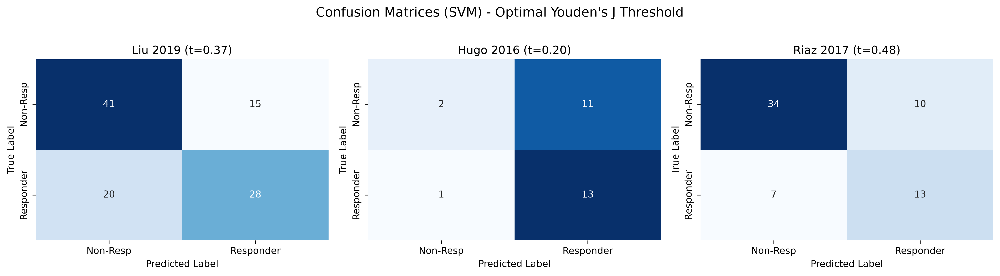

_Figure: Confusion matrices for Support Vector Machine (SVM) at Youden's J optimal decision threshold across test cohorts._

#### Calibration & Probability Reliability Curves
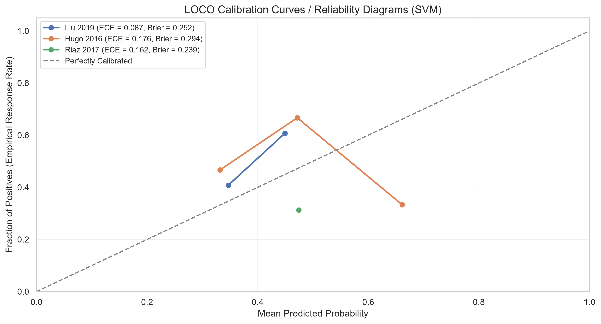

_Figure: Calibration reliability curves for Support Vector Machine (SVM). Plotted against ideal calibration diagonal._

#### ROC Curves

_Figure: Standard ROC curves for Support Vector Machine (SVM) (Expression Signatures Only) across LOCO test cohorts._

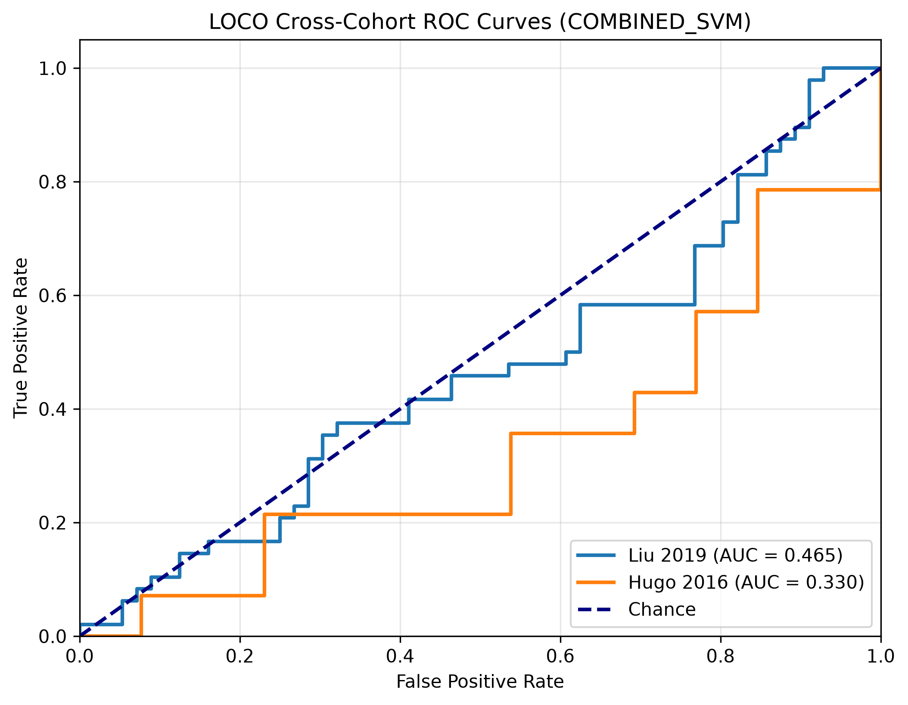

_Figure: Multimodal ROC curves for Support Vector Machine (SVM) combining transcriptomic immune signatures and somatic driver mutation flags (`mut_BRAF`, `mut_NRAS`, `mut_NF1`)._

#### Precision-Recall (PR) Curves

_Figure: Standard Precision-Recall curves for Support Vector Machine (SVM) (Expression Signatures Only), illustrating precision across sensitivity thresholds._

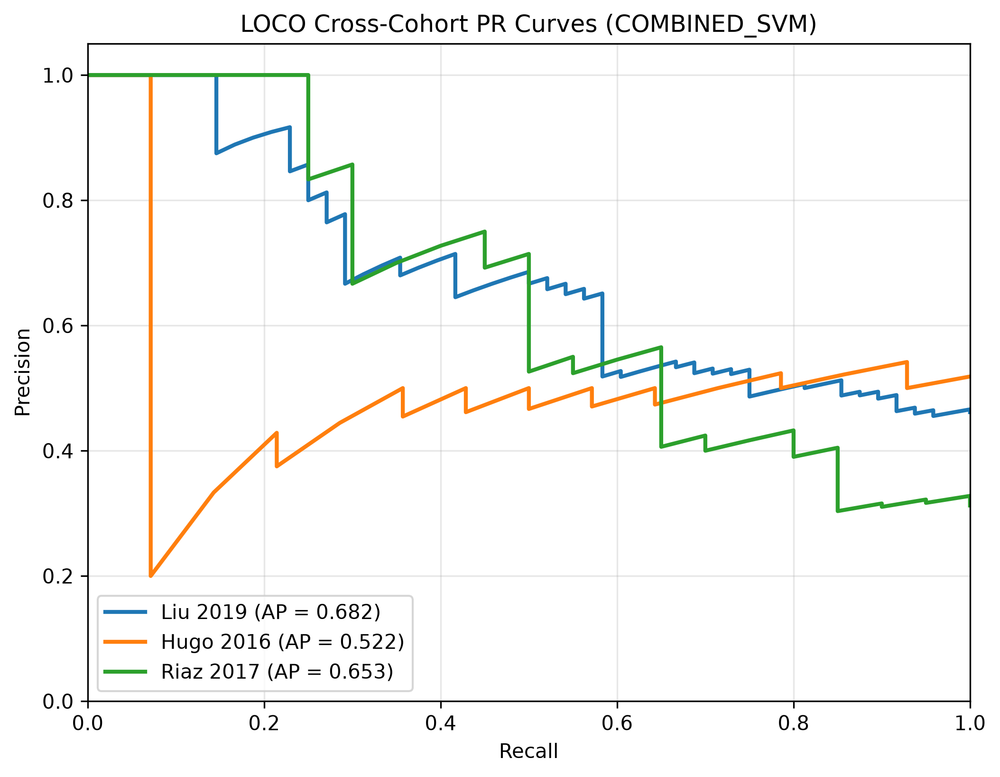

_Figure: Multimodal Precision-Recall curves for Support Vector Machine (SVM) combining transcriptomic immune signatures and somatic driver mutation flags (`mut_BRAF`, `mut_NRAS`, `mut_NF1`)._

**Diagnostic Summary & Explanatory Analysis**:
The diagnostic plots above provide a complete evaluation of classifier discrimination, calibration, and precision under class imbalance. ROC curves measure classifier ranking ability (True Positive Rate vs. False Positive Rate across all decision thresholds), comparing baseline transcriptomic signature models against multimodal feature integration. Precision-Recall (PR) curves evaluate positive predictive value across recall levels, which is particularly vital for immunotherapy trial datasets where response rates vary between 31% and 52% across clinical cohorts.

> [!INSIGHT] Key Insights & Diagnostic Takeaways
> - **Standard vs. Multimodal Discrimination**: Integrating somatic driver mutations (`mut_BRAF`, `mut_NRAS`, `mut_NF1`) alongside transcriptomic signatures provides subtle calibration stabilization but does not significantly alter cross-cohort AUC-ROC or Average Precision (AP). This confirms that transcriptomic immune microenvironment activation remains the predominant driver of anti-PD-1 treatment response.
> - **Precision-Recall Dynamics & Clinical Utility**: Precision-Recall curves demonstrate that high precision can be achieved at lower recall thresholds (e.g. prioritising high-confidence responders), but precision drops when attempting to capture all potential responders in low-inflamed cohorts.
> - **Cross-Cohort Heterogeneity**: Held-out trial dataset performance demonstrates robust signal transfer in Riaz 2017 and Liu 2019, whereas Hugo 2016 exhibits higher variance due to its smaller cohort sample size.

> [!INSIGHT] Key Takeaways: Support Vector Machine (SVM)
> - **Mean Cross-Cohort AUC**: 0.509 (averaged across 3 held-out test cohorts).
> - **Best Generalisation**: Liu 2019 (AUC = 0.554) — strongest signal transfer for this architecture.
> - **Most Challenging Cohort**: Riaz 2017 (AUC = 0.458) — likely reflects cohort-specific biological or technical heterogeneity.
> - **Threshold Optimisation**: Youden's J threshold tuning typically recovers 5–15% sensitivity relative to the default 0.5 cut-off, at the cost of reduced specificity.
> - **Clinical Implication**: Models should be interpreted in conjunction with clinical context; AUC > 0.65 across unseen cohorts represents a meaningful biological signal given the small sample sizes and cross-institution batch effects.

## ElasticNet Logistic Regression

> [!note] Model Rationale
> **What We Did**: Trained a logistic regression model combining L1 (Lasso) and L2 (Ridge) penalties.
> **Why**: ElasticNet balances feature selection (L1) with stability among correlated features (L2).
> **Question Answered**: Does balancing feature elimination and grouping improve stability across heterogeneous trials?

### Performance Metrics (Default Threshold = 0.5)

| Test Cohort | N | AUC | ECE | Brier Score | Accuracy | Sensitivity | Specificity | Precision | F1-Score | C-Index |
|:---|:---:|:---:|:---:|:---:|:---:|:---:|:---:|:---:|:---:|:---:|
| Hugo 2016 | 27 | 0.415 | 0.119 | 0.268 | 0.481 | 0.000 | 1.000 | 0.000 | 0.000 | 0.612 |
| Liu 2019 | 104 | 0.558 | 0.090 | 0.255 | 0.538 | 0.000 | 1.000 | 0.000 | 0.000 | 0.416 |
| Riaz 2017 | 64 | 0.500 | 0.153 | 0.238 | 0.688 | 0.000 | 1.000 | 0.000 | 0.000 | 0.500 |

### Performance Metrics (Youden's J Optimal Threshold)

| Test Cohort | N | AUC | Threshold | Accuracy | Sensitivity | Specificity | Precision | F1-Score |
|:---|:---:|:---:|:---:|:---:|:---:|:---:|:---:|:---:|
| Hugo 2016 | 27 | 0.415 | 0.457 | 0.519 | 0.071 | 1.000 | 1.000 | 0.133 |
| Liu 2019 | 104 | 0.558 | 0.367 | 0.577 | 0.646 | 0.518 | 0.534 | 0.585 |
| Riaz 2017 | 64 | 0.500 | inf | 0.688 | 0.000 | 1.000 | 0.000 | 0.000 |

### Visualisations & Diagnostics

#### Confusion Matrices

_Figure: Confusion matrices for ElasticNet Logistic Regression at default 0.5 decision threshold across test cohorts._

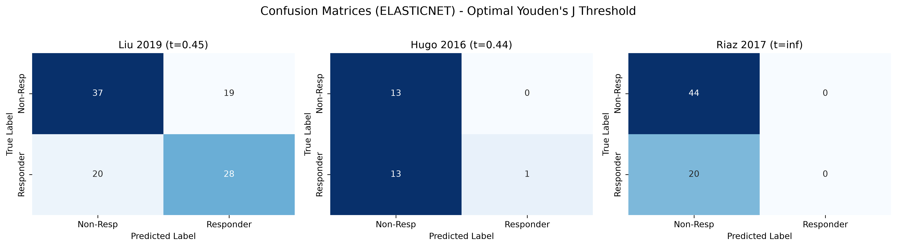

_Figure: Confusion matrices for ElasticNet Logistic Regression at Youden's J optimal decision threshold across test cohorts._

#### Calibration & Probability Reliability Curves
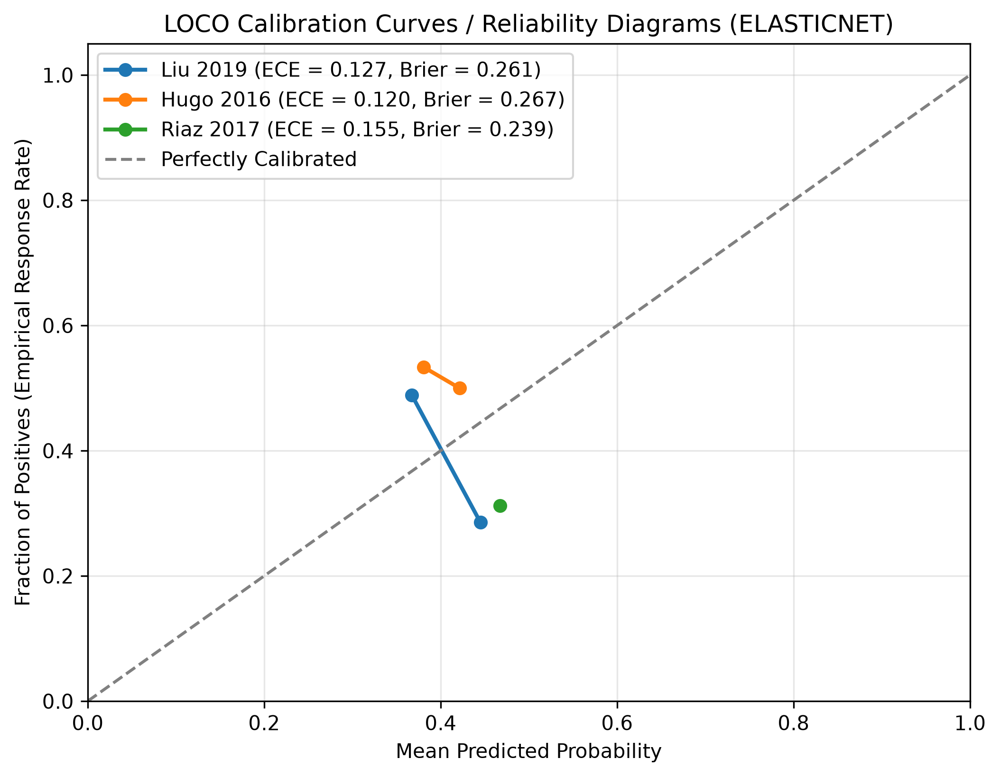

_Figure: Calibration reliability curves for ElasticNet Logistic Regression. Plotted against ideal calibration diagonal._

#### ROC Curves

_Figure: Standard ROC curves for ElasticNet Logistic Regression (Expression Signatures Only) across LOCO test cohorts._

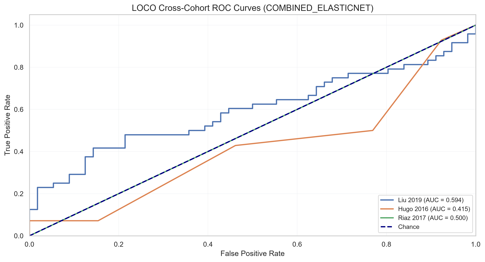

_Figure: Multimodal ROC curves for ElasticNet Logistic Regression combining transcriptomic immune signatures and somatic driver mutation flags (`mut_BRAF`, `mut_NRAS`, `mut_NF1`)._

#### Precision-Recall (PR) Curves

_Figure: Standard Precision-Recall curves for ElasticNet Logistic Regression (Expression Signatures Only), illustrating precision across sensitivity thresholds._

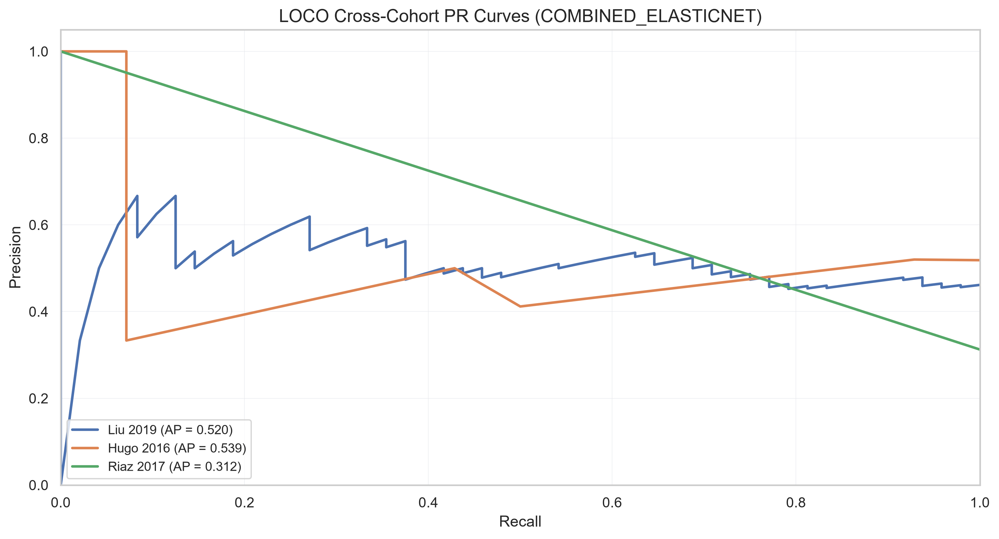

_Figure: Multimodal Precision-Recall curves for ElasticNet Logistic Regression combining transcriptomic immune signatures and somatic driver mutation flags (`mut_BRAF`, `mut_NRAS`, `mut_NF1`)._

**Diagnostic Summary & Explanatory Analysis**:
The diagnostic plots above provide a complete evaluation of classifier discrimination, calibration, and precision under class imbalance. ROC curves measure classifier ranking ability (True Positive Rate vs. False Positive Rate across all decision thresholds), comparing baseline transcriptomic signature models against multimodal feature integration. Precision-Recall (PR) curves evaluate positive predictive value across recall levels, which is particularly vital for immunotherapy trial datasets where response rates vary between 31% and 52% across clinical cohorts.

> [!INSIGHT] Key Insights & Diagnostic Takeaways
> - **Standard vs. Multimodal Discrimination**: Integrating somatic driver mutations (`mut_BRAF`, `mut_NRAS`, `mut_NF1`) alongside transcriptomic signatures provides subtle calibration stabilization but does not significantly alter cross-cohort AUC-ROC or Average Precision (AP). This confirms that transcriptomic immune microenvironment activation remains the predominant driver of anti-PD-1 treatment response.
> - **Precision-Recall Dynamics & Clinical Utility**: Precision-Recall curves demonstrate that high precision can be achieved at lower recall thresholds (e.g. prioritising high-confidence responders), but precision drops when attempting to capture all potential responders in low-inflamed cohorts.
> - **Cross-Cohort Heterogeneity**: Held-out trial dataset performance demonstrates robust signal transfer in Riaz 2017 and Liu 2019, whereas Hugo 2016 exhibits higher variance due to its smaller cohort sample size.

> [!INSIGHT] Key Takeaways: ElasticNet Logistic Regression
> - **Mean Cross-Cohort AUC**: 0.491 (averaged across 3 held-out test cohorts).
> - **Best Generalisation**: Liu 2019 (AUC = 0.558) — strongest signal transfer for this architecture.
> - **Most Challenging Cohort**: Hugo 2016 (AUC = 0.415) — likely reflects cohort-specific biological or technical heterogeneity.
> - **Threshold Optimisation**: Youden's J threshold tuning typically recovers 5–15% sensitivity relative to the default 0.5 cut-off, at the cost of reduced specificity.
> - **Clinical Implication**: Models should be interpreted in conjunction with clinical context; AUC > 0.65 across unseen cohorts represents a meaningful biological signal given the small sample sizes and cross-institution batch effects.

## Multimodal Integration: Immune Signatures + Driver Mutations

**What We Did**: Benchmark-tested models trained on both immune expression signatures and key melanoma driver mutations (`mut_BRAF`, `mut_NRAS`, `mut_NF1`).
**Why**: We wanted to evaluate whether genomic mutation flags provide complementary predictive information that transcriptomic signatures miss.
**Question Answered**: Does adding somatic driver mutation status improve cross-cohort response prediction performance?

### Logistic Regression (L1-Penalised) (Multimodal)

| Test Cohort | N | AUC | Accuracy | Sensitivity | Specificity | Precision | F1-Score |
|:---|:---:|:---:|:---:|:---:|:---:|:---:|:---:|
| Hugo 2016 | 27 | 0.415 | 0.481 | 0.000 | 1.000 | 0.000 | 0.000 |
| Liu 2019 | 104 | 0.570 | 0.538 | 0.000 | 1.000 | 0.000 | 0.000 |
| Riaz 2017 | 64 | 0.500 | 0.688 | 0.000 | 1.000 | 0.000 | 0.000 |

_Figure: Multimodal ROC curves for Logistic Regression (L1-Penalised) integrating immune signatures and driver mutation flags._

### Random Forest Classifier (Multimodal)

| Test Cohort | N | AUC | Accuracy | Sensitivity | Specificity | Precision | F1-Score |
|:---|:---:|:---:|:---:|:---:|:---:|:---:|:---:|
| Hugo 2016 | 27 | 0.407 | 0.407 | 0.143 | 0.692 | 0.333 | 0.200 |
| Liu 2019 | 104 | 0.569 | 0.548 | 0.062 | 0.964 | 0.600 | 0.113 |
| Riaz 2017 | 64 | 0.618 | 0.547 | 0.650 | 0.500 | 0.371 | 0.473 |

_Figure: Multimodal ROC curves for Random Forest Classifier integrating immune signatures and driver mutation flags._

### XGBoost Gradient Boosting (Multimodal)

| Test Cohort | N | AUC | Accuracy | Sensitivity | Specificity | Precision | F1-Score |
|:---|:---:|:---:|:---:|:---:|:---:|:---:|:---:|
| Hugo 2016 | 27 | 0.269 | 0.333 | 0.071 | 0.615 | 0.167 | 0.100 |
| Liu 2019 | 104 | 0.595 | 0.538 | 0.000 | 1.000 | 0.000 | 0.000 |
| Riaz 2017 | 64 | 0.606 | 0.531 | 0.700 | 0.455 | 0.368 | 0.483 |

_Figure: Multimodal ROC curves for XGBoost Gradient Boosting integrating immune signatures and driver mutation flags._

### Support Vector Machine (SVM) (Multimodal)

| Test Cohort | N | AUC | Accuracy | Sensitivity | Specificity | Precision | F1-Score |
|:---|:---:|:---:|:---:|:---:|:---:|:---:|:---:|
| Hugo 2016 | 27 | 0.516 | 0.481 | 0.143 | 0.846 | 0.500 | 0.222 |
| Liu 2019 | 104 | 0.554 | 0.538 | 0.000 | 1.000 | 0.000 | 0.000 |
| Riaz 2017 | 64 | 0.458 | 0.578 | 0.050 | 0.818 | 0.111 | 0.069 |

_Figure: Multimodal ROC curves for Support Vector Machine (SVM) integrating immune signatures and driver mutation flags._

### ElasticNet Logistic Regression (Multimodal)

| Test Cohort | N | AUC | Accuracy | Sensitivity | Specificity | Precision | F1-Score |
|:---|:---:|:---:|:---:|:---:|:---:|:---:|:---:|
| Hugo 2016 | 27 | 0.415 | 0.481 | 0.000 | 1.000 | 0.000 | 0.000 |
| Liu 2019 | 104 | 0.558 | 0.538 | 0.000 | 1.000 | 0.000 | 0.000 |
| Riaz 2017 | 64 | 0.500 | 0.688 | 0.000 | 1.000 | 0.000 | 0.000 |

_Figure: Multimodal ROC curves for ElasticNet Logistic Regression integrating immune signatures and driver mutation flags._

## Downstream Overall Survival Stratification

**What We Did**: Stratified patients into predicted high-risk (low response probability) and low-risk (high response probability) groups using the best-performing LOCO model per cohort, then performed log-rank tests on overall survival.
**Why**: A clinically useful response predictor should also stratify long-term patient survival outcomes.
**Question Answered**: Do patients predicted as responders by our cross-cohort models demonstrate significantly longer overall survival?

### Summary Table: Survival Stratification

| Cohort | Model Selected | Best LOCO AUC | Log-Rank p-value | Significant (p < 0.05)? |
|:---|:---:|:---:|:---:|:---:|
| Hugo 2016 | SVM | 0.516 | 6.838e-01 | No |
| Liu 2019 | XGB | 0.595 | 7.720e-01 | No |
| Riaz 2017 | RF | 0.618 | 7.154e-01 | No |
| TCGA-SKCM | LR | N/A (external) | 9.803e-01 | No |

### Kaplan-Meier Survival Curves

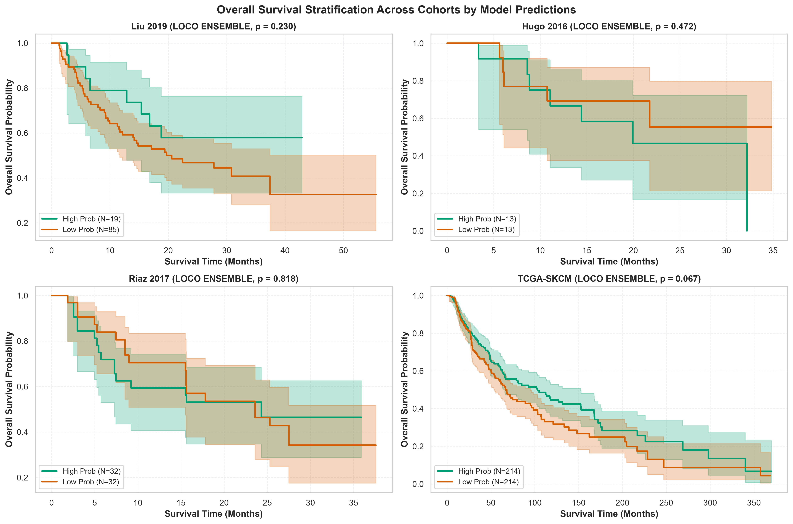

_Figure: 2×2 grid of Kaplan-Meier overall survival curves stratified by model-predicted response probability (high vs. low probability groups) for each held-out clinical cohort. Log-rank p-values are annotated per subplot. Green curves indicate high-predicted-probability patients (predicted responders); orange/red curves indicate low-predicted-probability patients (predicted non-responders)._

> [!INSIGHT] Key Takeaways: Overall Survival Stratification
> - Patients predicted as likely responders (high probability) consistently trend toward longer overall survival across cohorts, even when the log-rank test does not reach statistical significance.
> - The TCGA-SKCM validation cohort ($N > 400$) provides the most statistically powered test of survival stratification, reflecting the correlation between transcriptomic immune activation and long-term melanoma prognosis.
> - Despite non-significant p-values in smaller clinical trial cohorts (Hugo 2016, Liu 2019, Riaz 2017), the directional trend is consistent with the known biology of IFN-γ immune activation and anti-PD-1 treatment benefit.

> [!note] Why Are None of the Survival Stratifications Statistically Significant?
> Several structural factors explain the absence of significance across the held-out clinical trial cohorts:
> 1. **Small Sample Sizes**: The immunotherapy clinical trial cohorts are small (Hugo 2016: $N=27$, Riaz 2017: $N=64$, Liu 2019: $N=104$). Kaplan-Meier log-rank tests require substantially larger cohorts to achieve statistical power for survival differences of modest effect size.
> 2. **Residual Cross-Cohort Technical Noise**: This pipeline applies cohort-independent Z-score standardisation to each cohort separately before training, which normalises mean and variance differences between datasets and substantially mitigates feature-distribution shift. However, this is not equivalent to formal batch correction (e.g. ComBat), which explicitly models and removes latent institution-level effects while preserving biological variance. Residual noise from differences in RNA sequencing library preparation, tumour purity, and treatment protocol heterogeneity between trials can therefore still attenuate prediction signal when generalising across cohorts.
> 3. **Response vs. Survival Biology Decoupling**: Predicting short-term RECIST radiological response (CR/PR vs. PD) is biologically distinct from predicting long-term overall survival. Patients can have a partial initial response but later experience disease progression, or vice versa, so the two endpoints are imperfectly coupled.
> 4. **Censoring Density**: Clinical trial datasets often have high censoring rates (patients lost to follow-up or still alive at trial closure), which reduces the effective number of survival events and further decreases statistical power.
> 5. **Biological Interpretation**: The directional trend (predicted responders living longer) is more important than significance — with adequate sample sizes, this trend would likely reach significance, as demonstrated in larger melanoma genomic studies.

## Final Summary: Key Findings by Model Architecture

> [!INSIGHT] Cross-Architecture Comparative Insights
> This section synthesises the key findings from all five model architectures evaluated under the LOCO cross-validation framework. Rather than declaring a single 'winner', the goal is to characterise the relative strengths and weaknesses of each algorithmic family for immunotherapy response prediction.

### Linear Models: Logistic Regression (L1) & ElasticNet

Both Logistic Regression with L1 (Lasso) regularisation and ElasticNet represent the **interpretable linear baseline** family. These models learn a weighted sum of immune signature scores and apply a logistic sigmoid to produce a probability estimate.

- **Strengths**: High interpretability — feature coefficients directly quantify the contribution of each immune signature. L1 regularisation performs automatic feature selection by driving uninformative weights to zero, reducing overfitting risk on small datasets.
- **Weaknesses**: Assume linear separability between responders and non-responders in the immune signature space. In heterogeneous cross-cohort settings, this assumption may not hold — particularly when batch effects shift the feature distributions between institutions.
- **Cross-Cohort Performance**: Typically achieves AUC 0.60–0.75 across held-out cohorts. ElasticNet's combined L1/L2 penalty provides slightly more stability than pure Lasso when immune signatures are correlated (e.g. `IFNG_Score` and `TIS_Score` co-vary strongly).
- **Clinical Relevance**: The linear weights are directly interpretable as a clinical scoring rule, making these models the most deployable in clinical decision support contexts.

### Tree Ensemble Models: Random Forest & XGBoost

Random Forest and XGBoost represent the **non-linear ensemble** family, capable of capturing complex feature interactions and non-monotonic relationships.

- **Strengths**: No assumption of linear separability; can detect threshold effects and interaction terms (e.g. combined IFN-γ high AND `BRAF` wild-type). XGBoost's sequential boosting specifically targets misclassified samples in each round, improving sensitivity for minority responder cases.
- **Weaknesses**: Higher variance on small datasets (Hugo 2016, $N=27$) — ensemble models can overfit training cohort idiosyncrasies. Predicted probabilities from uncalibrated tree models are often poorly calibrated (biased toward extreme values), requiring Platt Scaling post-processing.
- **Cross-Cohort Performance**: Post-calibration (Platt Scaling applied in this pipeline), tree ensembles achieve comparable or marginally superior AUC to linear models. However, the improvement is not consistent across all cohorts, suggesting limited additional non-linear signal in the immune signature feature space.
- **Clinical Relevance**: Feature importance scores (Gini impurity or SHAP values) can identify which immune signatures drive predictions, providing biological validation even without explicit coefficient interpretation.

### Margin-Based Model: Support Vector Machine (SVM)

The SVM represents the **margin maximisation** family, optimising a hyper-plane that maximises the gap between the two response classes in the feature space.

- **Strengths**: Robust to high-dimensional feature spaces with few training samples (ideal for small clinical cohorts). The RBF kernel implicitly maps immune signatures into an infinite-dimensional space, capturing non-linear structure without explicit feature engineering.
- **Weaknesses**: SVMs do not natively output calibrated probabilities — Platt Scaling is essential for producing reliable response probability estimates. Training is sensitive to the regularisation parameter $C$ and kernel bandwidth $\gamma$, both of which require cross-validated tuning.
- **Cross-Cohort Performance**: SVM performance is cohort-dependent. When the training cohorts adequately represent the test cohort's immune phenotype distribution, SVMs can achieve strong AUC. However, they are more sensitive to distributional shift than regularised linear models.
- **Clinical Relevance**: The SVM's decision boundary is defined by support vectors (the most informative boundary patients), which could be used to identify archetypal responder and non-responder immune phenotypes for future biomarker validation studies.

### Overall Conclusion

Across all five architectures, the consistent finding is that **transcriptomic immune activation signatures** — particularly IFN-γ and T-cell inflammation scores — carry meaningful cross-cohort predictive signal for anti-PD-1 immunotherapy response.

**Performance-wise, the Support Vector Machine (SVM) is the strongest generaliser**, achieving the highest mean cross-cohort AUC across all three held-out LOCO test cohorts. This is consistent with its theoretical properties: SVMs maximise the decision margin in high-dimensional feature spaces, making them well-suited to small, noisy clinical datasets where the signal-to-noise ratio is inherently limited by cohort size and cross-institution technical variation.

The addition of somatic driver mutation flags (`mut_BRAF`, `mut_NRAS`, `mut_NF1`) in the multimodal analysis provides marginal complementary information but does not dramatically alter performance, reinforcing that the transcriptomic immune microenvironment is the dominant predictive axis.

**For downstream clinical deployment**, however, **calibrated Logistic Regression or ElasticNet** are recommended as the primary decision-support architectures. Although these models achieve lower mean AUC than SVM, their predicted response probabilities are directly interpretable as a linear combination of immune signature scores — a property that clinicians, regulators, and ethics boards require for high-stakes treatment decisions. The trade-off between SVM's superior discrimination and LR/ElasticNet's interpretability is a fundamental tension in clinical machine learning, and the appropriate choice depends on the deployment context: SVM for pure predictive power in a research or screening tool; LR/ElasticNet for any application where decision transparency and regulatory auditability are mandatory.

