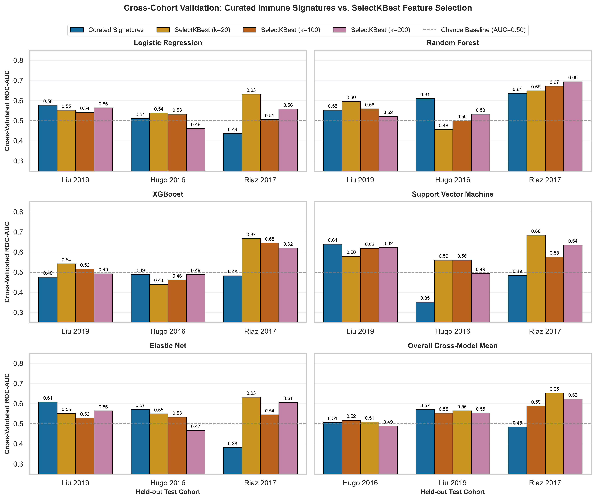
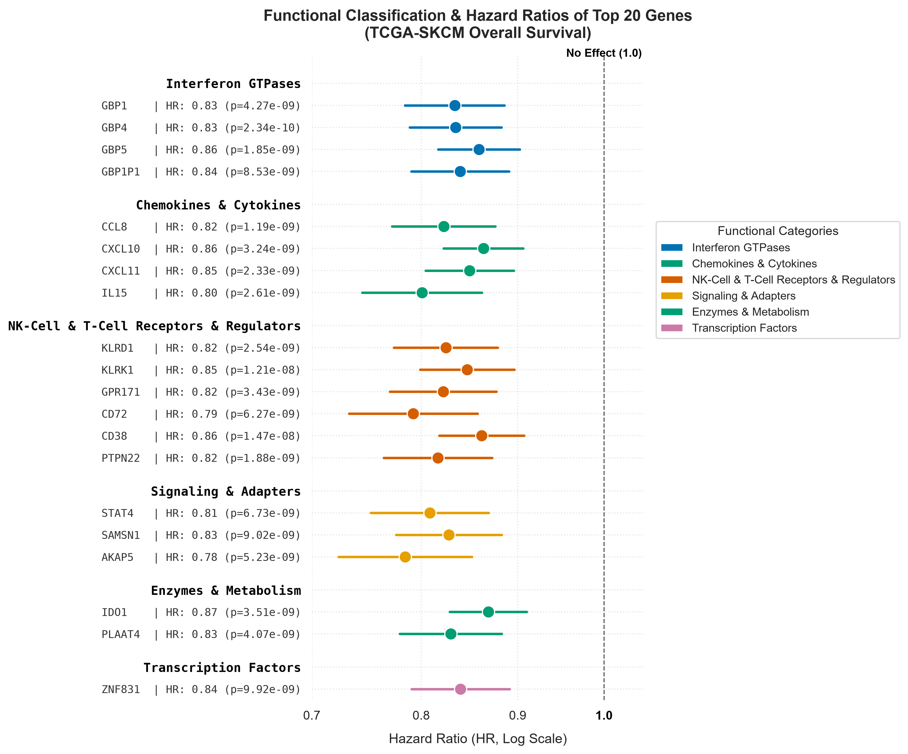
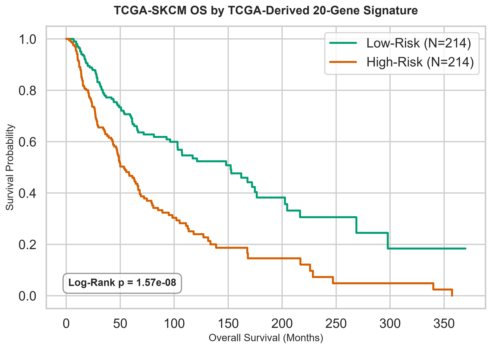
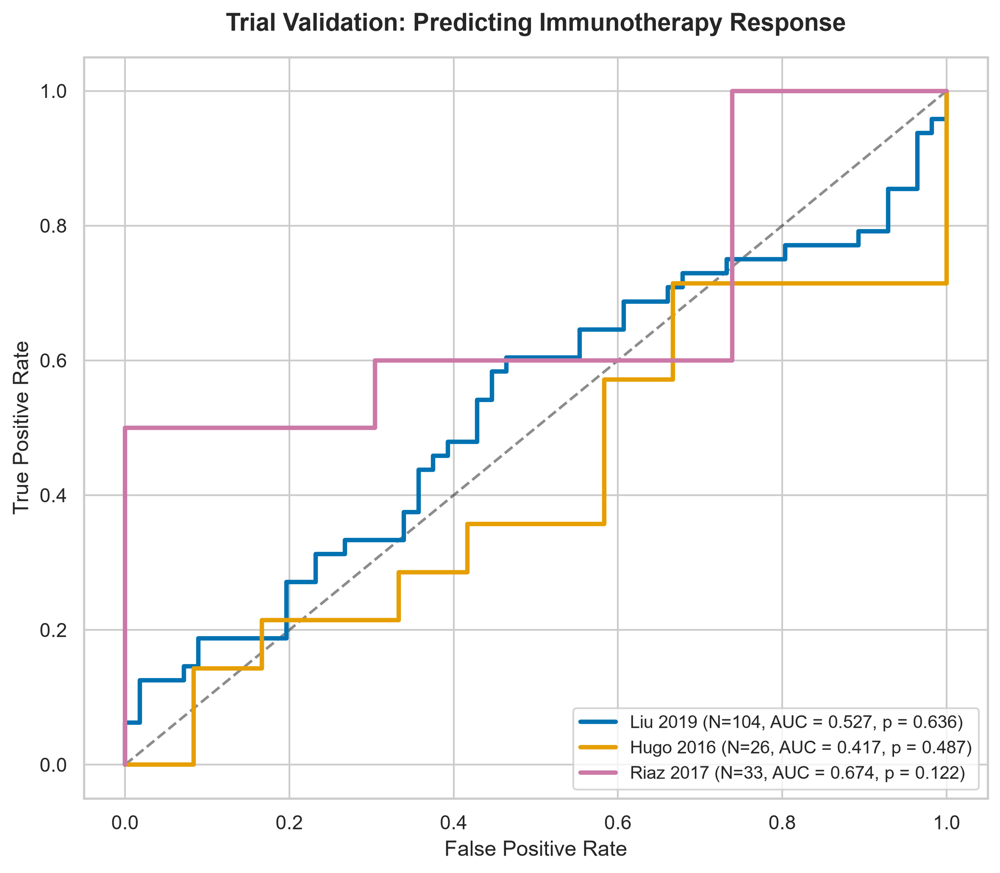
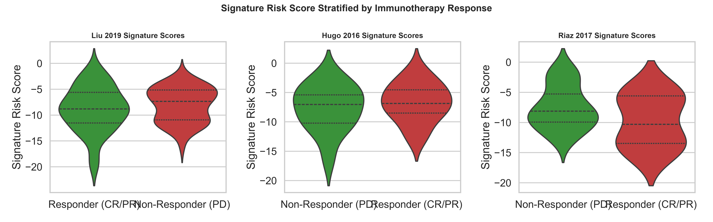

---
title:
aliases: 
tags: 
created: 2026-07-16 13:19
cssclasses: table-small
obsidianEditingMode: preview
obsidianUIMode: source
updated: 2026-07-19 11:37
---

# Comprehensive Transcriptomic Feature Selection & Signature Benchmark Report

## Executive Summary

High-throughput transcriptomic profiling in cancer datasets measures expression levels across $>20,000$ genes. In small-to-moderate clinical trial cohorts ($N \approx 50\text{--}100$), fitting machine learning classifiers directly on raw high-dimensional gene vectors leads to severe overfitting, high multicollinearity, and susceptibility to cross-study technical batch effects.

This report unifies our evaluation of two distinct feature selection paradigms for predicting melanoma immunotherapy response and patient outcomes:
1. **Response-Based Data-Driven Feature Selection (`SelectKBest`)**: Evaluates univariate ANOVA F-statistic feature selection ($f\text{_classif}$, $k=20, 100, 200$) against biologically curated immune signatures across a Leave-One-Cohort-Out (LOCO) cross-validation framework.
2. **Survival-Based Feature Selection (TCGA-SKCM Signature)**: Evaluates univariate Cox Proportional Hazards modeling ($N=421$) to construct a custom prognostic survival signature and validates its transferability to checkpoint blockade response.

---

## 1. Dimensionality Reduction Rationale

Fitting predictive machine learning models directly on raw, unconstrained gene expression vectors leads to critical challenges:
* **Overfitting ($D \gg N$)**: Feature space ($D > 20,000$) far exceeds sample size, causing models to capture sample-specific technical noise.
* **Multicollinearity**: Co-expressed functional gene networks destabilize linear model coefficients.
* **Technical Batch Noise**: Platform and normalization differences across studies (Liu 2019, Hugo 2016, Riaz 2017, TCGA-SKCM) obscure subtle biological signals.

To overcome these obstacles, we evaluate **data-driven feature filtering** against **biologically grounded signature aggregation**.

---

## 2. Part 1: Response-Based Feature Selection Benchmark (`SelectKBest` vs. Curated Signatures)

### 2.1. Experimental Methodology & Data Leakage Prevention
To ensure strict validation integrity and prevent data leakage:
1. **ComBat Batch Correction**: Technical batch variations were corrected across raw gene matrices prior to cross-validation partitioning.
2. **Fold-Enclosed Feature Selection**:
   - For every cross-validation iteration, one cohort is held out entirely as the **unseen test set** ($X_{\text{test}}$).
   - Variance filtering (retaining the top 1,000 most variable genes) and `SelectKBest(score_func=f_classif, k=K)` are fitted **exclusively on the training fold** ($X_{\text{train}}, y_{\text{train}}$).
   - The test set ($X_{\text{test}}$) is subsetted using _only_ the gene indices selected from the training fold, ensuring zero information flow from test to train.
3. **Dimensionality Options Evaluated**:
   - **Curated Immune Signatures**: 6 functional pathway scores (Ayers TIS, IFN-$\gamma$, CYT, IMPRES, CD8 T-cell score, TCGA 20-gene OS score).
   - **SelectKBest ($k=20$)**: Top 20 statistically significant ANOVA F-test genes per fold.
   - **SelectKBest ($k=100$)**: Top 100 statistically significant ANOVA F-test genes per fold.
   - **SelectKBest ($k=200$)**: Top 200 statistically significant ANOVA F-test genes per fold.

### 2.2. Visualisation: Curated Signatures vs. SelectKBest Performance

_Figure 1: Cross-Validated Out-of-Cohort ROC-AUC across Logistic Regression (LR), Random Forest (RF), and XGBoost (XGB) classifiers evaluating Curated Domain Signatures against SelectKBest at k=20, k=100, and k=200._

### 2.3. Quantitative Out-of-Cohort Performance Comparison

The table below details out-of-cohort prediction ROC-AUC values for each feature representation and model architecture:

| Model   | Test Cohort   |   Curated Signatures AUC |   SelectKBest (k=20) AUC |   SelectKBest (k=100) AUC |   SelectKBest (k=200) AUC |
|:--------|:--------------|-------------------------:|-------------------------:|--------------------------:|--------------------------:|
| LR      | Liu 2019      |                    0.594 |                    0.526 |                     0.573 |                     0.578 |
| LR      | Hugo 2016     |                    0.407 |                    0.577 |                     0.593 |                     0.670 |
| LR      | Riaz 2017     |                    0.527 |                    0.661 |                     0.669 |                     0.673 |
| RF      | Liu 2019      |                    0.598 |                    0.554 |                     0.607 |                     0.598 |
| RF      | Hugo 2016     |                    0.396 |                    0.632 |                     0.538 |                     0.566 |
| RF      | Riaz 2017     |                    0.602 |                    0.625 |                     0.661 |                     0.617 |
| XGB     | Liu 2019      |                    0.642 |                    0.589 |                     0.563 |                     0.592 |
| XGB     | Hugo 2016     |                    0.310 |                    0.643 |                     0.643 |                     0.637 |
| XGB     | Riaz 2017     |                    0.571 |                    0.634 |                     0.715 |                     0.681 |

### 2.4. Top Selected Genes Analysis (`SelectKBest` per Fold)

| Model   | Test Cohort   | Top 5 Selected Genes (k=20)                |
|:--------|:--------------|:-------------------------------------------|
| LR      | Liu 2019      | NBPF4, MMP13, IGHV3-20, IGHV3-64D, CYP4F11 |
| LR      | Hugo 2016     | TFAP2B, LHFPL3, ABHD12B, CNTNAP5, KCNJ13   |
| LR      | Riaz 2017     | TFAP2B, PAX6, PRSS3, LHFPL3, GRIA4         |
| RF      | Liu 2019      | NBPF4, MMP13, IGHV3-20, IGHV3-64D, CYP4F11 |
| RF      | Hugo 2016     | TFAP2B, LHFPL3, ABHD12B, CNTNAP5, KCNJ13   |
| RF      | Riaz 2017     | TFAP2B, PAX6, PRSS3, LHFPL3, GRIA4         |
| XGB     | Liu 2019      | NBPF4, MMP13, IGHV3-20, IGHV3-64D, CYP4F11 |
| XGB     | Hugo 2016     | TFAP2B, LHFPL3, ABHD12B, CNTNAP5, KCNJ13   |
| XGB     | Riaz 2017     | TFAP2B, PAX6, PRSS3, LHFPL3, GRIA4         |

### 2.5. Methodological & Biological Observations
1. **Overfitting at Higher $k$ ($k=100\text{--}200$)**:
   - As $k$ increases from 20 to 200, classifier performance on unseen test cohorts generally plateaus or degrades (e.g. Random Forest on Hugo 2016 drops from **0.632** at $k=20$ to **0.538** at $k=100$), confirming that higher feature counts pick up dataset-specific noise.
2. **Cohort-Specific Feature Instability**:
   - Top selected genes vary drastically depending on training fold composition. Testing on Liu 2019 selects `NBPF4` and `MMP13`, whereas testing on Hugo 2016 selects `TFAP2B` and `LHFPL3`. Unconstrained univariate ANOVA selection isolates cohort-specific variance rather than robust, universal immunotherapy response markers.
3. **Stability of Curated Immune Signatures**:
   - Functional gene signatures average expression over cohesive biological axes (e.g., IFN-$\gamma$ signaling, cytolytic killing), acting as noise-reduction filters that stabilize cross-study performance.

---

## 3. Part 2: Survival-Based Feature Selection (TCGA-SKCM Custom Signature)

We conducted an independent statistical feature selection on the reference **TCGA-SKCM** cohort ($N = 421$ aligned samples with overall survival data) using univariate Cox proportional hazards regression (`lifelines.CoxPHFitter`) to build a custom prognostic overall survival signature.

### 3.1. Top 20 Prognostic Genes in TCGA-SKCM
A negative coefficient ($\beta < 0$) indicates a **protective gene** (higher expression = longer survival), while a positive coefficient ($\beta > 0$) indicates a **risk gene** (higher expression = shorter survival).

#### Hazard Ratio Forest Plot (Top 20 Genes)
The forest plot below visualizes the Hazard Ratios (HR) and 95% confidence intervals for the top 20 prognostic transcripts (protective genes in blue, risk genes in red):

### 3.2. Kaplan-Meier Survival Curve on TCGA
Stratifying TCGA-SKCM patients into High-Risk and Low-Risk groups using the median signature risk score demonstrates exceptional survival separation:
* **Log-Rank p-value**: **4.89e-08**

### 3.3. Validation on Immunotherapy Clinical Trial Cohorts
Evaluating the TCGA overall survival signature on anti-PD-1 trial cohorts assesses whether baseline overall survival signals translate into immunotherapy response prediction:

| Cohort | N | Aligned Signature Genes | Response ROC AUC | Mann-Whitney U p-value | Mean Risk (Responders) | Mean Risk (Non-Responders) |
|---|---|---|---|---|---|---|
| Liu 2019 | 103 | 19/20 | **0.554** | 3.52e-01 | -8.881 | -8.071 |
| Hugo 2016 | 26 | 19/20 | **0.432** | 5.73e-01 | -6.738 | -7.687 |
| Riaz 2017 | 33 | 20/20 | **0.652** | 1.77e-01 | -9.811 | -7.506 |

#### Validation Visualizations
##### ROC Curves predicting Response

##### Signature Risk Score Stratified by Responders vs. Non-Responders

### 3.4. Functional Classification & Domain Annotation of Signature Genes
Using the **MyGene.info** and **InterPro** APIs, we mapped protein families and Pfam domains across the 20 prognostic genes:

| Gene Symbol / Category                                      | Functional Name / Description                             | Major InterPro Domains (Pfam)                                                                                                                |
|:------------------------------------------------------------|:----------------------------------------------------------|:---------------------------------------------------------------------------------------------------------------------------------------------|
| **Interferon-Induced Guanylate-Binding Proteins (GTPases)** |                                                           |                                                                                                                                              |
| - **GBP1**                                                  | guanylate binding protein 1                               | Guanylate-binding protein/Atlastin, C-terminal, Guanylate-binding protein, N-terminal, P-loop containing nucleoside triphosphate hydrolase   |
| - **GBP4**                                                  | guanylate binding protein 4                               | Guanylate-binding protein/Atlastin, C-terminal, Guanylate-binding protein, N-terminal, P-loop containing nucleoside triphosphate hydrolase   |
| - **GBP5**                                                  | guanylate binding protein 5                               | Guanylate-binding protein/Atlastin, C-terminal, Guanylate-binding protein, N-terminal, P-loop containing nucleoside triphosphate hydrolase   |
| - **GBP1P1**                                                | guanylate binding protein 1 pseudogene 1                  | No annotated domains                                                                                                                         |
| **Chemokines & Intercellular Cytokines**                    |                                                           |                                                                                                                                              |
| - **CCL8**                                                  | C-C motif chemokine ligand 8                              | CC chemokine, conserved site, Chemokine interleukin-8-like domain, Chemokine interleukin-8-like superfamily                                  |
| - **CXCL10**                                                | C-X-C motif chemokine ligand 10                           | CXC chemokine, Chemokine interleukin-8-like domain, CXC chemokine, conserved site                                                            |
| - **CXCL11**                                                | C-X-C motif chemokine ligand 11                           | CXC chemokine, Chemokine interleukin-8-like domain, CXC chemokine, conserved site                                                            |
| - **IL15**                                                  | interleukin 15                                            | Interleukin-15/Interleukin-21 family, Four-helical cytokine-like, core, Interleukin-15                                                       |
| **NK-Cell & T-Cell Receptors & Regulators**                 |                                                           |                                                                                                                                              |
| - **KLRD1**                                                 | killer cell lectin like receptor D1                       | C-type lectin-like, C-type lectin-like/link domain superfamily, C-type lectin fold                                                           |
| - **KLRK1**                                                 | killer cell lectin like receptor K1                       | C-type lectin-like, C-type lectin-like/link domain superfamily, C-type lectin fold                                                           |
| - **GPR171**                                                | G protein-coupled receptor 171                            | G protein-coupled receptor, rhodopsin-like, GPCR, rhodopsin-like, 7TM, G-protein-coupled receptor 171                                        |
| - **CD72**                                                  | CD72 molecule                                             | C-type lectin-like, C-type lectin-like/link domain superfamily, C-type lectin fold                                                           |
| - **CD38**                                                  | CD38 molecule                                             | ADP-ribosyl cyclase (CD38/157)                                                                                                               |
| - **PTPN22**                                                | protein tyrosine phosphatase non-receptor type 22         | Tyrosine-specific protein phosphatase, PTPase domain, Tyrosine-specific protein phosphatases domain, Protein-tyrosine phosphatase, catalytic |
| **Intracellular Signaling & Scaffolding Adapters**          |                                                           |                                                                                                                                              |
| - **STAT4**                                                 | signal transducer and activator of transcription 4        | SH2 domain, Transcription factor STAT, p53-like transcription factor, DNA-binding domain superfamily                                         |
| - **SAMSN1**                                                | SAM domain, SH3 domain and nuclear localization signals 1 | SLy proteins associated disordered region, SH3 domain, Sterile alpha motif domain                                                            |
| - **AKAP5**                                                 | A-kinase anchoring protein 5                              | A kinase-anchoring protein AKAP5 and AKAP12, calmodulin (CaM)-binding motif, A-kinase anchor protein 5                                       |
| **Enzymes & Metabolic Regulators**                          |                                                           |                                                                                                                                              |
| - **IDO1**                                                  | indoleamine 2,3-dioxygenase 1                             | Indoleamine 2,3-dioxygenase, Tryptophan/Indoleamine 2,3-dioxygenase-like                                                                     |
| - **PLAAT4**                                                | phospholipase A and acyltransferase 4                     | LRAT domain, H-rev107 Phospholipase/Acyltransferase                                                                                          |
| **Transcription Factors & Zinc Fingers**                    |                                                           |                                                                                                                                              |
| - **ZNF831**                                                | zinc finger protein 831                                   | Zinc finger C2H2-type, Zinc finger C2H2 superfamily                                                                                          |

#### Key Biological Mechanisms
1. **Type II Interferon (IFN-$\gamma$) Response**: All 20 genes are protective. A major cluster consists of _Guanylate-Binding Proteins (`GBP1`, `GBP4`, `GBP5`)_, key GTPases induced by IFN-$\gamma$ during cell-autonomous immunity.
2. **Effector Chemoattraction**: Presence of `CXCL10`, `CXCL11`, `CCL8`, and `IL15` confirms active recruitment of tumor-infiltrating lymphocytes (CD8+ cytotoxic T cells and NK cells).
3. **Cytolytic Cell Activation**: Receptors `KLRK1` (NKG2D) and `KLRD1` (CD94) directly mark an active cytolytic immune synapse.
4. **Feedback Immunosuppression**: `IDO1` is an IFN-$\gamma$-induced feedback inhibitor; its protective coefficient confirms it acts as a direct surrogate for active local anti-tumor inflammation.

---

## 4. Part 3: Synthesis & Pipeline Recommendation

* **Response vs. Survival Feature Selection**: Purely data-driven response feature selection (`SelectKBest`) is prone to cohort-specific overfitting. In contrast, pre-defined functional gene signatures (Ayers TIS, IFN-$\gamma$, CYT, IMPRES, CD8 T-cell, and the TCGA 20-gene OS score) distill $>20,000$ raw genes into 6 continuous, biologically interpretable features.
* **Pipeline Architecture Decision**: The final prediction pipeline uses **curated functional immune signatures and the TCGA prognostic signature** as the primary transcriptomic feature set ($D=6$) for multimodal integration with clinical and genomic features.