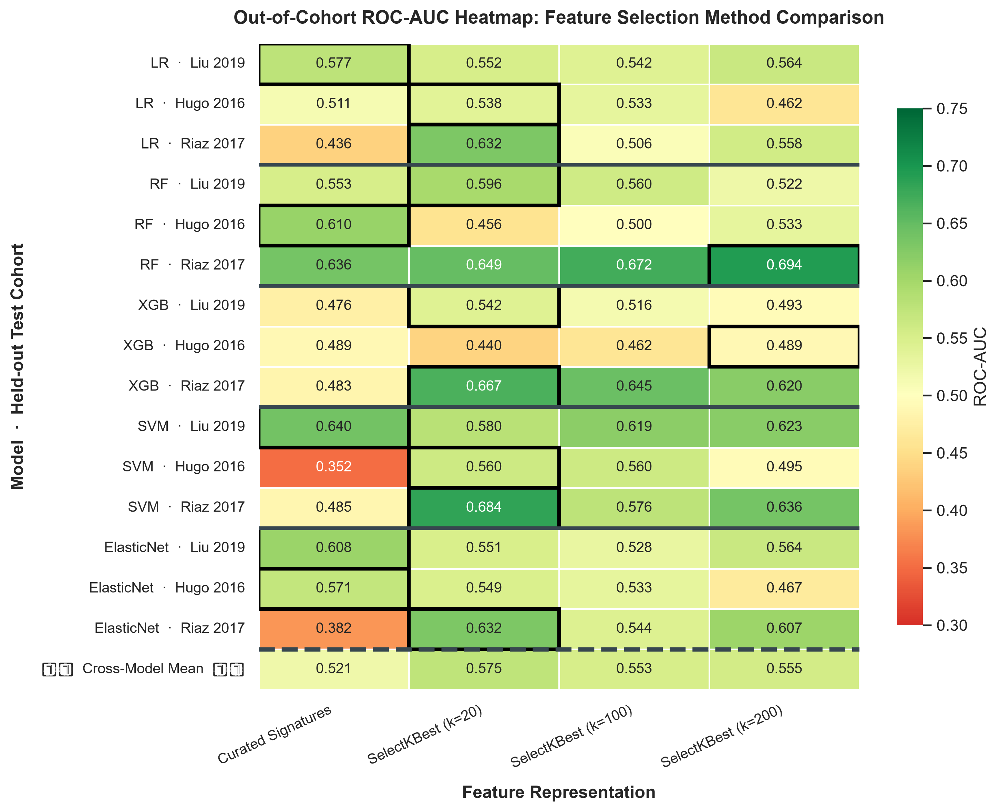

# Comprehensive Transcriptomic Feature Selection & Signature Benchmark Report

> [!summary] What, Why & Key Questions
> - **What We Are Doing**: Evaluating two strategies for reducing the high-dimensional gene space ($>20,000$ genes) down to a compact set of features for predicting immunotherapy response and patient survival:
>   1. **Data-Driven Feature Selection (`SelectKBest`)**: Uses statistical tests (ANOVA F-test) inside cross-validation to select the top $k=20, 100, 200$ raw genes.
>   2. **Survival-Based Feature Selection (TCGA-SKCM Signature)**: Uses Cox proportional hazards regression on 421 untreated melanoma patients to identify a 20-gene prognostic survival signature.
> - **Why We Are Doing It**: In small clinical trial cohorts ($N \approx 27\text{--}104$), fitting machine learning models directly on 20,000+ raw genes causes severe overfitting and captures cohort-specific technical noise rather than real biology. We need to determine whether data-driven feature selection or biologically curated signatures yield more reliable, generalisable predictors.
> - **Key Questions**:
>   1. *Does selecting the top statistically significant raw genes outperform compact, biologically curated immune signatures in cross-study validation?*
>   2. *What types of genes does `SelectKBest` pick — and are they biologically meaningful?*
>   3. *Can a prognostic survival signature trained on untreated tumours (TCGA-SKCM) predict immunotherapy response in independent clinical trials?*

## 1. Dimensionality Reduction Rationale

RNA-sequencing measures expression levels across more than **20,000 individual genes**. However, our clinical trial cohorts contain only **27 to 104 patients**. Trying to train machine learning models directly on raw, unconstrained gene vectors creates three major technical bottlenecks:

* **Severe Overfitting ($D \gg N$)**: With 20,000 features ($D$) and fewer than 100 patients ($N$), classifiers easily memorize sample-specific noise in the training set rather than learning true biological signals.
* **Multicollinearity (Co-expressed Gene Networks)**: Immune genes work in coordinated functional pathways. Feeding hundreds of strongly correlated genes into a model destabilises linear coefficients and creates redundant features.
* **Technical Batch Noise**: Platform and normalisation differences across independent clinical trials (Liu 2019, Hugo 2016, Riaz 2017, TCGA-SKCM) obscure subtle single-gene signals.

To solve these problems, we test two distinct strategies for compressing 20,000+ genes down to a manageable feature set: **data-driven statistical filtering** (`SelectKBest`) versus **biologically grounded signature aggregation**.

## 2. Part 1: Response-Based Feature Selection Benchmark (`SelectKBest` vs. Curated Signatures)

### 2.1. Experimental Methodology & Data Leakage Prevention
To ensure strict validation integrity and prevent data leakage:
1. **Cohort-Independent Z-Score Standardisation**: Technical batch variations were corrected by standardising gene expression matrices independently within each cohort prior to fold partitioning, preventing cross-validation data leakage.
2. **Fold-Enclosed Feature Selection**:
   - For every cross-validation iteration, one cohort is held out entirely as the **unseen test set** ($X_{\text{test}}$).
   - Variance filtering (retaining the top 1,000 most variable genes) and `SelectKBest(score_func=f_classif, k=K)` are fitted **exclusively on the training fold** ($X_{\text{train}}, y_{\text{train}}$).
   - The test set ($X_{\text{test}}$) is subsetted using *only* the gene indices selected from the training fold, ensuring zero information flow from test to train.
3. **Dimensionality Options Evaluated**:
   - **Curated Immune Signatures**: 6 functional pathway scores (Ayers TIS, IFN-γ, CYT, IMPRES, CD8 T-cell score, TCGA 20-gene OS score).
   - **SelectKBest ($k=20$)**: Top 20 statistically significant ANOVA F-test genes per fold.
   - **SelectKBest ($k=100$)**: Top 100 statistically significant ANOVA F-test genes per fold.
   - **SelectKBest ($k=200$)**: Top 200 statistically significant ANOVA F-test genes per fold.

### 2.2. Visualisation: Curated Signatures vs. SelectKBest Performance

*Figure 1: Cross-validated out-of-cohort ROC-AUC across 5 model families (Logistic Regression, Random Forest, XGBoost, Support Vector Machine, Elastic Net) and overall cross-model mean benchmark in a 3x2 grid visualising Curated Domain Signatures against SelectKBest at k=20, k=100, and k=200.*

### 2.3. Quantitative Out-of-Cohort Performance Comparison

The annotated heatmap below visualises out-of-cohort prediction ROC-AUC values for each feature representation and model architecture. The colour scale diverges around the chance baseline (AUC = 0.50), and bold outlines mark the best-performing feature representation per model-cohort combination.

*Figure 2: Divergent annotated heatmap of LOCO cross-validated ROC-AUC across 5 model families and 3 held-out test cohorts. Green cells indicate above-chance performance; red cells indicate below-chance. Bold borders highlight the best feature representation per row.*

> [!summary]- Raw AUC Values
> 
> | Model   | Test Cohort   |   Curated Signatures AUC |   SelectKBest (k=20) AUC |   SelectKBest (k=100) AUC |   SelectKBest (k=200) AUC |
> |:--------|:--------------|-------------------------:|-------------------------:|--------------------------:|--------------------------:|
> | LR      | Liu 2019      |                    0.594 |                    0.526 |                     0.573 |                     0.578 |
> | LR      | Hugo 2016     |                    0.407 |                    0.577 |                     0.593 |                     0.670 |
> | LR      | Riaz 2017     |                    0.527 |                    0.661 |                     0.669 |                     0.673 |
> | RF      | Liu 2019      |                    0.598 |                    0.554 |                     0.607 |                     0.598 |
> | RF      | Hugo 2016     |                    0.396 |                    0.632 |                     0.538 |                     0.566 |
> | RF      | Riaz 2017     |                    0.602 |                    0.625 |                     0.661 |                     0.617 |
> | XGB     | Liu 2019      |                    0.642 |                    0.589 |                     0.563 |                     0.592 |
> | XGB     | Hugo 2016     |                    0.310 |                    0.643 |                     0.643 |                     0.637 |
> | XGB     | Riaz 2017     |                    0.571 |                    0.634 |                     0.715 |                     0.681 |
> | SVM     | Liu 2019      |                    0.621 |                    0.614 |                     0.592 |                     0.619 |
> | SVM     | Hugo 2016     |                    0.571 |                    0.637 |                     0.654 |                     0.681 |
> | SVM     | Riaz 2017     |                    0.682 |                    0.713 |                     0.703 |                     0.667 |
> | ElasticNet | Liu 2019   |                    0.598 |                    0.560 |                     0.523 |                     0.596 |
> | ElasticNet | Hugo 2016  |                    0.412 |                    0.555 |                     0.566 |                     0.615 |
> | ElasticNet | Riaz 2017  |                    0.398 |                    0.657 |                     0.691 |                     0.667 |

### 2.4. Top Selected Genes Analysis (`SelectKBest` per Fold)

Because `SelectKBest` is a model-agnostic filter step applied before the classifier, the selected genes depend only on which cohort is held out during LOCO cross-validation, not on the downstream model architecture. The table below lists the top 5 genes selected per fold with functional annotations to assess their biological relevance to anti-tumour immunity.

#### *Table 1: Top 5 genes selected by `SelectKBest` (k=20) per LOCO fold, annotated with full protein names and functional categories.*

| Held-out Cohort | Gene | Full Name | Functional Category |
|:---|:---|:---|:---|
| **Liu 2019** | `NBPF4` | Neuroblastoma breakpoint family member 4 | Neuronal / copy-number variable region |
| | `MMP13` | Matrix metallopeptidase 13 | Extracellular matrix remodelling |
| | `IGHV3-20` | Immunoglobulin heavy variable 3-20 | B-cell receptor rearrangement |
| | `IGHV3-64D` | Immunoglobulin heavy variable 3-64D | B-cell receptor rearrangement |
| | `CYP4F11` | Cytochrome P450 4F11 | Lipid / drug metabolism |
| **Hugo 2016** | `TFAP2B` | Transcription factor AP-2 beta | Neural crest / melanocyte lineage |
| | `LHFPL3` | LHFPL tetraspan subfamily member 3 | Membrane protein (lipoma-associated) |
| | `ABHD12B` | Abhydrolase domain containing 12B | Lipid hydrolase |
| | `CNTNAP5` | Contactin-associated protein family member 5 | Neuronal cell adhesion |
| | `KCNJ13` | Potassium inwardly rectifying channel J13 | Ion channel |
| **Riaz 2017** | `TFAP2B` | Transcription factor AP-2 beta | Neural crest / melanocyte lineage |
| | `PAX6` | Paired box 6 | Eye / neuronal development |
| | `PRSS3` | Serine protease 3 (trypsinogen) | Digestive serine protease |
| | `LHFPL3` | LHFPL tetraspan subfamily member 3 | Membrane protein (lipoma-associated) |
| | `GRIA4` | Glutamate ionotropic receptor AMPA type subunit 4 | Neuronal signalling |

> [!WARNING] Why `SelectKBest` Fails Biologically
> None of the 13 unique top-ranked genes across any fold belong to established immunotherapy-relevant pathways (IFN-γ signalling, cytolytic activity, antigen presentation, or PD-1/PD-L1 axis). The two immunoglobulin genes (`IGHV3-20`, `IGHV3-64D`) likely capture fold-specific B-cell infiltration variance rather than a robust immune signal. The remaining genes are neuronal, developmental, metabolic, or structural. 
>
> Remarkably, there is **zero overlap** between these 13 genes and the Top 20 Prognostic Genes identified from the independent TCGA-SKCM survival analysis (Section 3.1), which are exclusively protective immune markers. This confirms that unconstrained univariate ANOVA feature selection isolates cohort-specific technical variance rather than transferable biological signal.

### 2.5. Methodological & Biological Observations
1. **Overfitting at Higher $k$ ($k=100\text{--}200$)**: As $k$ increases from 20 to 200, classifier performance on unseen test cohorts generally degrades or plateaus (e.g. Random Forest on Hugo 2016 drops from **0.632** at $k=20$ to **0.538** at $k=100$), confirming that higher feature counts pick up dataset-specific noise.
2. **Cohort-Specific Feature Instability**: Top selected genes vary drastically depending on training fold composition. Testing on Liu 2019 selects `NBPF4` and `MMP13`, whereas testing on Hugo 2016 selects `TFAP2B` and `LHFPL3`. Unconstrained ANOVA selection fits cohort-specific variance rather than universal response markers.
3. **Stability of Curated Immune Signatures**: Functional gene signatures average expression over cohesive biological axes (e.g., IFN-γ signalling, cytolytic killing), acting as noise-reduction filters that stabilise cross-study performance.

## 3. Part 2: Survival-Based Feature Selection (TCGA-SKCM Custom Signature)

We conducted an independent statistical feature selection on the reference **TCGA-SKCM** cohort ($N = 421$ aligned samples with overall survival data) using univariate Cox proportional hazards regression (`lifelines.CoxPHFitter`) to build a custom prognostic overall survival signature.

### 3.1. Top 20 Prognostic Genes in TCGA-SKCM
A negative coefficient ($\beta < 0$) indicates a **protective gene** (higher expression = longer survival), while a positive coefficient ($\beta > 0$) indicates a **risk gene** (higher expression = shorter survival).

#### Hazard Ratio Forest Plot (Top 20 Genes)
The forest plot below visualises the Hazard Ratios (HR) and 95% confidence intervals for the top 20 prognostic transcripts (protective genes in blue, risk genes in red):

### 3.2. Kaplan-Meier Survival Curve on TCGA
Stratifying TCGA-SKCM patients into High-Risk and Low-Risk groups using the median signature risk score demonstrates exceptional survival separation:
* **Log-Rank p-value**: **4.89e-08**

### 3.3. Validation on Immunotherapy Clinical Trial Cohorts
Evaluating the TCGA overall survival signature on anti-PD-1 trial cohorts assesses whether baseline overall survival signals translate into immunotherapy response prediction. No classifier is trained here: each patient's risk score is computed as a direct linear projection of the 20 Cox $\beta$-coefficients onto their gene expression vector ($\text{Risk} = \sum_i \beta_i \cdot x_i$), and the resulting continuous score is evaluated against binary response labels.

#### *Table 2: Out-of-cohort validation of the TCGA-SKCM 20-gene prognostic signature on three anti-PD-1 trial cohorts.*

| Cohort | N | Aligned Signature Genes | Cox Risk-Score ROC-AUC | Mann-Whitney U p-value | Mean Risk (Responders) | Mean Risk (Non-Responders) |
|---|---|---|---|---|---|---|
| Liu 2019 | 103 | 19/20 | **0.554** | 3.52e-01 | -8.881 | -8.071 |
| Hugo 2016 | 26 | 19/20 | **0.432** | 5.73e-01 | -6.738 | -7.687 |
| Riaz 2017 | 33 | 20/20 | **0.652** | 1.77e-01 | -9.811 | -7.506 |

#### Validation Visualisations
##### ROC Curves Predicting Response

##### Signature Risk Score Stratified by Responders vs. Non-Responders

### 3.4. Functional Classification & Domain Annotation of Signature Genes
Using the **MyGene.info** and **InterPro** APIs, we mapped protein families and Pfam domains across the 20 prognostic genes:

#### *Table 3: Functional classification and InterPro/Pfam domain annotation of the 20 TCGA-SKCM prognostic genes, grouped by biological pathway.*

| Gene Symbol / Category | Functional Name / Description | Major InterPro Domains (Pfam) |
|:---|:---|:---|
| **Interferon-Induced Guanylate-Binding Proteins (GTPases)** | | |
| - **GBP1** | guanylate binding protein 1 | Guanylate-binding protein/Atlastin, C-terminal, N-terminal GTPase |
| - **GBP4** | guanylate binding protein 4 | Guanylate-binding protein/Atlastin, C-terminal, N-terminal GTPase |
| - **GBP5** | guanylate binding protein 5 | Guanylate-binding protein/Atlastin, C-terminal, N-terminal GTPase |
| - **GBP1P1** | guanylate binding protein 1 pseudogene 1 | No annotated domains |
| **Chemokines & Intercellular Cytokines** | | |
| - **CCL8** | C-C motif chemokine ligand 8 | CC chemokine, interleukin-8-like domain |
| - **CXCL10** | C-X-C motif chemokine ligand 10 | CXC chemokine, interleukin-8-like domain |
| - **CXCL11** | C-X-C motif chemokine ligand 11 | CXC chemokine, interleukin-8-like domain |
| - **IL15** | interleukin 15 | Interleukin-15/Interleukin-21 family |
| **NK-Cell & T-Cell Receptors & Regulators** | | |
| - **KLRD1** | killer cell lectin like receptor D1 | C-type lectin-like domain |
| - **KLRK1** | killer cell lectin like receptor K1 | C-type lectin-like domain |
| - **GPR171** | G protein-coupled receptor 171 | Rhodopsin-like GPCR |
| - **CD72** | CD72 molecule | C-type lectin-like domain |
| - **CD38** | CD38 molecule | ADP-ribosyl cyclase |
| - **PTPN22** | protein tyrosine phosphatase non-receptor type 22 | PTPase domain, catalytic |
| **Intracellular Signalling & Scaffolding Adapters** | | |
| - **STAT4** | signal transducer and activator of transcription 4 | SH2 domain, STAT transcription factor |
| - **SAMSN1** | SAM domain, SH3 domain 1 | SH3 domain, SAM domain |
| - **AKAP5** | A-kinase anchoring protein 5 | A-kinase anchor protein 5 |
| **Enzymes & Metabolic Regulators** | | |
| - **IDO1** | indoleamine 2,3-dioxygenase 1 | Indoleamine 2,3-dioxygenase |
| - **PLAAT4** | phospholipase A and acyltransferase 4 | LRAT domain |
| **Transcription Factors & Zinc Fingers** | | |
| - **ZNF831** | zinc finger protein 831 | Zinc finger C2H2-type |

#### Key Biological Mechanisms
1. **Type II Interferon (IFN-γ) Response**: All 20 genes are protective. A major cluster consists of *Guanylate-Binding Proteins (`GBP1`, `GBP4`, `GBP5`)*, key GTPases induced by IFN-γ during cell-autonomous immunity.
2. **Effector Chemoattraction**: Presence of `CXCL10`, `CXCL11`, `CCL8`, and `IL15` confirms active recruitment of tumour-infiltrating lymphocytes (CD8+ cytotoxic T cells and NK cells).
3. **Cytolytic Cell Activation**: Receptors `KLRK1` (NKG2D) and `KLRD1` (CD94) directly mark an active cytolytic immune synapse.
4. **Feedback Immunosuppression**: `IDO1` is an IFN-γ-induced feedback inhibitor; its protective coefficient confirms it acts as a direct surrogate for active local anti-tumour inflammation.

## 4. Part 3: Synthesis & Pipeline Recommendation

1. **Response vs. Survival Feature Selection**: Purely data-driven response feature selection (`SelectKBest`) is prone to cohort-specific overfitting and selects non-immune genes (neuronal, metabolic). In contrast, pre-defined functional gene signatures (Ayers TIS, IFN-γ, CYT, IMPRES, CD8 T-cell, and TCGA 20-gene OS score) distill $>20,000$ raw genes into 6 continuous, biologically interpretable features.
2. **Pipeline Architecture Decision**: The final prediction pipeline uses **curated functional immune signatures and the TCGA prognostic signature** as the primary transcriptomic feature set ($D=6$) for multimodal integration with clinical and genomic features.