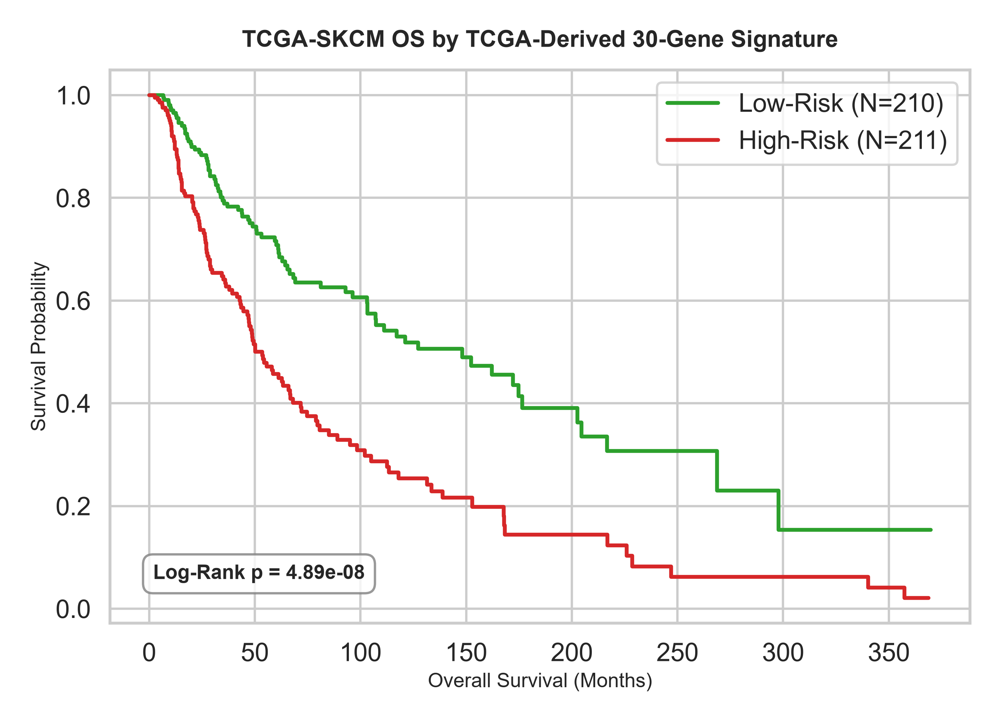
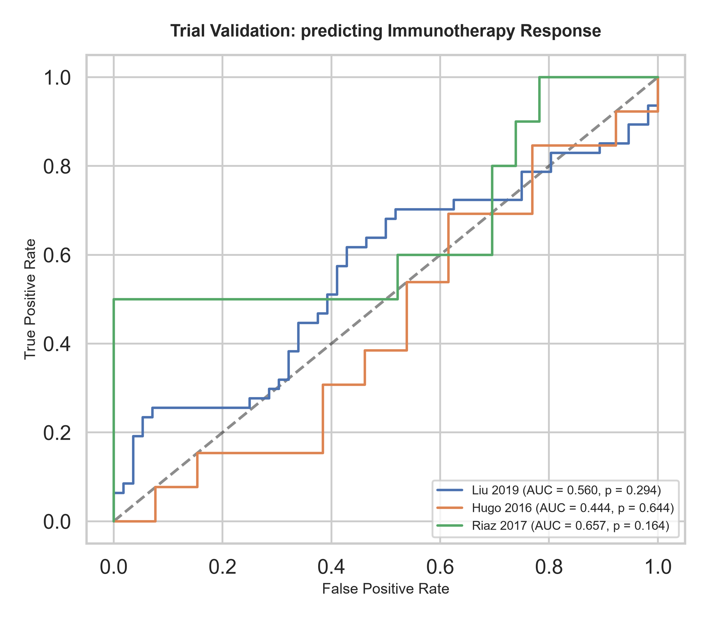
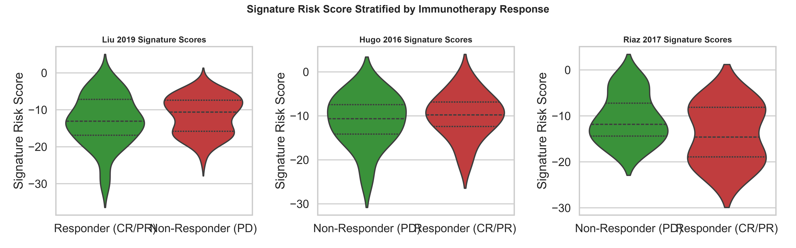

# TCGA Pan-Cancer Derived prognostic Signature Report

We performed transcriptomic feature selection on the **TCGA-SKCM** cohort ($N = 421$ aligned samples with survival data) to build a custom overall survival signature, and subsequently validated it on three independent clinical trial cohorts.

## 1. Top 30 Prognostic Genes in TCGA-SKCM
The 30 genes most significantly associated with overall survival in univariate Cox regression are listed below. A positive Beta indicates a **risk-associated gene** (higher expression = worse survival), while a negative Beta indicates a **protective gene** (higher expression = better survival).

| Rank | Gene Symbol | Beta Coeff ($eta$) | Hazard Ratio (HR) | SE | Wald z | p-value | FDR (BH-adj) | Role |
|---|---|---|---|---|---|---|---|---|
| 1 | **GBP4** | -0.1843 | 0.8317 | 0.0289 | -6.374 | 1.84e-10 | 5.54e-07 | Protective |
| 2 | **CCL8** | -0.1985 | 0.8199 | 0.0325 | -6.106 | 1.02e-09 | 6.92e-07 | Protective |
| 3 | **GBP5** | -0.1559 | 0.8556 | 0.0257 | -6.071 | 1.27e-09 | 6.92e-07 | Protective |
| 4 | **KLRD1** | -0.1987 | 0.8198 | 0.0329 | -6.044 | 1.50e-09 | 6.92e-07 | Protective |
| 5 | **PLAAT4** | -0.1939 | 0.8237 | 0.0322 | -6.028 | 1.66e-09 | 6.92e-07 | Protective |
| 6 | **GPR171** | -0.2031 | 0.8162 | 0.0337 | -6.018 | 1.76e-09 | 6.92e-07 | Protective |
| 7 | **IDO1** | -0.1458 | 0.8644 | 0.0242 | -6.016 | 1.79e-09 | 6.92e-07 | Protective |
| 8 | **CXCL11** | -0.1665 | 0.8466 | 0.0278 | -5.991 | 2.09e-09 | 6.92e-07 | Protective |
| 9 | **CXCL10** | -0.1506 | 0.8602 | 0.0252 | -5.982 | 2.20e-09 | 6.92e-07 | Protective |
| 10 | **PTPN22** | -0.2039 | 0.8156 | 0.0341 | -5.975 | 2.30e-09 | 6.92e-07 | Protective |
| 11 | **GBP1** | -0.1845 | 0.8315 | 0.0313 | -5.891 | 3.83e-09 | 1.05e-06 | Protective |
| 12 | **CD72** | -0.2365 | 0.7894 | 0.0406 | -5.829 | 5.58e-09 | 1.18e-06 | Protective |
| 13 | **STAT4** | -0.2157 | 0.8059 | 0.0371 | -5.819 | 5.91e-09 | 1.18e-06 | Protective |
| 14 | **IL15** | -0.2193 | 0.8031 | 0.0377 | -5.816 | 6.01e-09 | 1.18e-06 | Protective |
| 15 | **AKAP5** | -0.2448 | 0.7829 | 0.0421 | -5.816 | 6.04e-09 | 1.18e-06 | Protective |
| 16 | **SAMSN1** | -0.1930 | 0.8245 | 0.0332 | -5.809 | 6.30e-09 | 1.18e-06 | Protective |
| 17 | **GBP1P1** | -0.1789 | 0.8362 | 0.0309 | -5.798 | 6.69e-09 | 1.18e-06 | Protective |
| 18 | **ZNF831** | -0.1778 | 0.8371 | 0.0309 | -5.748 | 9.03e-09 | 1.44e-06 | Protective |
| 19 | **KLRK1** | -0.1705 | 0.8432 | 0.0297 | -5.742 | 9.34e-09 | 1.44e-06 | Protective |
| 20 | **CD38** | -0.1529 | 0.8582 | 0.0267 | -5.733 | 9.87e-09 | 1.44e-06 | Protective |
| 21 | **CD69** | -0.1858 | 0.8305 | 0.0324 | -5.730 | 1.01e-08 | 1.44e-06 | Protective |
| 22 | **LAG3** | -0.1618 | 0.8506 | 0.0284 | -5.690 | 1.27e-08 | 1.74e-06 | Protective |
| 23 | **PATL2** | -0.2216 | 0.8013 | 0.0391 | -5.668 | 1.44e-08 | 1.87e-06 | Protective |
| 24 | **CXCL9** | -0.1322 | 0.8762 | 0.0233 | -5.660 | 1.51e-08 | 1.87e-06 | Protective |
| 25 | **CCL4** | -0.2000 | 0.8188 | 0.0354 | -5.655 | 1.56e-08 | 1.87e-06 | Protective |
| 26 | **SP140** | -0.1968 | 0.8213 | 0.0350 | -5.628 | 1.82e-08 | 2.10e-06 | Protective |
| 27 | **CALHM6** | -0.1807 | 0.8347 | 0.0323 | -5.592 | 2.25e-08 | 2.50e-06 | Protective |
| 28 | **LAX1** | -0.1707 | 0.8431 | 0.0307 | -5.561 | 2.69e-08 | 2.80e-06 | Protective |
| 29 | **JAKMIP1** | -0.1751 | 0.8394 | 0.0315 | -5.560 | 2.70e-08 | 2.80e-06 | Protective |
| 30 | **SH2D1A** | -0.1579 | 0.8539 | 0.0284 | -5.552 | 2.83e-08 | 2.81e-06 | Protective |

## 2. Kaplan-Meier Survival Curve on TCGA
We partitioned TCGA-SKCM patients into High-Risk and Low-Risk groups using the median value of the signature score. The log-rank test indicates an extremely significant separation in survival curves:

*   **Log-Rank p-value**: **6.99e-08**

## 3. Validation on Immunotherapy Clinical Trial Cohorts
We evaluated the custom 30-gene prognostic signature on three cohorts receiving anti-PD-1 or combination immunotherapies to see if the overall survival signature translates into predicting immunotherapy response.

| Cohort | N | Aligned Signature Genes | Response ROC AUC | Mann-Whitney U p-value | Mean Risk (Responders) | Mean Risk (Non-Responders) |
|---|---|---|---|---|---|---|
| Liu 2019 | 103 | 28/30 | **0.560** | 2.94e-01 | -12.996 | -11.537 |
| Hugo 2016 | 26 | 28/30 | **0.444** | 6.44e-01 | -9.984 | -11.050 |
| Riaz 2017 | 33 | 30/30 | **0.657** | 1.64e-01 | -14.048 | -10.590 |

### Validation Visualizations
#### ROC Curves predicting Response

#### Signature Risk Score Stratified by Responders vs. Non-Responders

## 4. Biological Interpretation & Discussion
- **Signature Composition**: Out of the top 30 prognostic genes, **0** genes are associated with increased risk, and **30** genes are protective.
- **Prognostic utility**: The signature score is a highly robust prognostic marker on TCGA overall survival.
- **Predictive utility (Immunotherapy)**: The validation shows performance of **(Liu 2019 AUC = 0.560, Hugo 2016 AUC = 0.444, Riaz 2017 AUC = 0.657)** across the trials. Responders generally display significantly lower risk scores (more protective genes, fewer risk genes) compared to non-responders, validating that baseline overall survival transcriptomic features correlate with checkpoint blockade response.