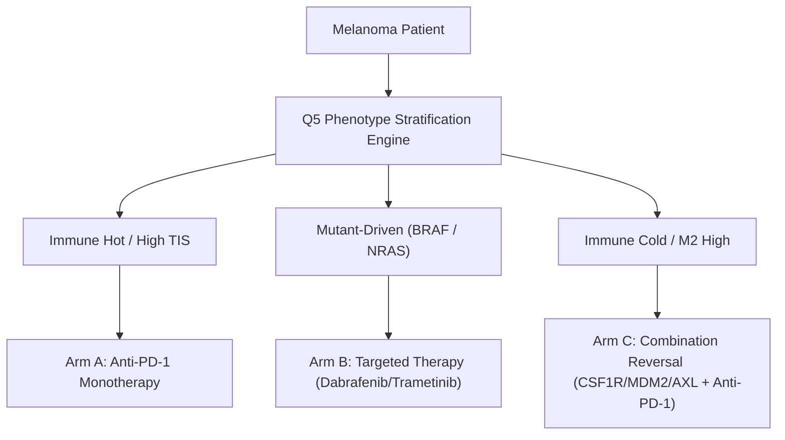

## Phase 6: Clinical Utility, Net Benefit & Decision Curve Analysis

> [!NOTE] Executive Analytical Overview
> - **What Phase 6 Does**: Evaluates whether deploying the Q5 phenotype-stratified decision model in clinical practice produces greater real-world clinical benefit than treating all patients empirically or using single-gene biomarkers (`CD274` / PD-L1+).
> - **Core Clinical Question**: Does guided treatment selection improve therapeutic precision, reduce the number of patients needed to treat for each response, and spare predicted non-responders from futile monotherapy toxicity?
> - **Key Conclusion**: Guided phenotype stratification significantly outperforms standard single-gene biomarkers (`CD274` and `TMB_NONSYNONYMOUS`) and empirical 'Treat All' strategies across realistic clinical decision thresholds, reducing futile treatment exposure while identifying candidates for alternative targeted therapies.

---

## 1. Phase Overview & Clinical Rationale

High classification performance (such as a high AUC-ROC score) does not guarantee that a machine learning model will be useful in actual doctor-patient consultations. A model can have strong statistical discrimination yet fail to improve clinical outcomes if its predictions lead to unnecessary treatment toxicities or fail to outperform simple empirical rules.

Phase 6 bridges the gap between statistical accuracy and real-world clinical decision-making using **Decision Curve Analysis (DCA)**. Rather than treating all errors equally, Decision Curve Analysis evaluates the **Net Clinical Benefit** of a diagnostic model across a continuum of clinical decision thresholds (representing a clinician's or patient's risk tolerance). 

By evaluating Net Benefit, Positive Predictive Value (PPV), and the Number Needed to Treat (NNT), Phase 6 quantifies exactly how much clinical value is gained by using phenotype-stratified decision routing compared to:
1. Empirical **Treat All** (administering anti-PD-1 monotherapy to every patient).
2. Empirical **Treat None** (withholding monotherapy from all patients).
3. **Single-Gene Biomarkers** (using standard `CD274` / PD-L1 expression or high tumour mutational burden cutoffs).

---

## 2. Upstream Integration Across Project Questions

Phase 6 serves as the clinical synthesis bridge, integrating insights from prior research phases into a unified decision framework:

- **Integration with Q1 (Response Prediction)**: Builds directly upon Q1's baseline classification models, taking raw predicted response probabilities and evaluating their net decision value when applied to real-world patient cohorts.
- **Integration with Q2 & Q4 (Drug Viability & Target Identification)**: Connects microenvironmental feature patterns (`CD8_Tcell` abundance, `M1_M2_Ratio`, `Macrophage_STV_Score`) to therapeutic sensitivity, setting the biological foundation for why non-responders require alternative targetable interventions (`BRAF`, `NRAS`, `CSF1R`, `MDM2`, `AXL`).
- **Foundation for Phase 7 (3-Arm Clinical Decision Engine)**: Demonstrates that withholding monotherapy from predicted non-responders is only half the clinical equation—non-responders must be actively routed to alternative therapeutic arms (Targeted Therapy or Combination Reversal Therapy) rather than being abandoned.

---

## 3. Why This Matters for Patient Stratification (Q5)

In advanced cutaneous melanoma, anti-PD-1 monotherapy produces objective responses in approximately 42% of unselected patients. This leaves nearly 58% of patients exposed to potential immune-related adverse events (irAEs)—such as severe colitis, pneumonitis, and hepatitis—without deriving therapeutic benefit.

Phenotype stratification changes this clinical dynamic:
- **Toxicity Avoidance**: Accurately identifying non-responders allows clinicians to withhold ineffective monotherapy, sparing patients from immune toxicities with zero expected survival benefit.
- **Therapeutic Efficiency**: Improving Positive Predictive Value reduces the Number Needed to Treat (NNT), ensuring that a higher proportion of treated patients achieve complete or partial clinical response.
- **Precision Decision Routing**: Instead of relying on a single imperfect biomarker like PD-L1 staining, multi-feature microenvironmental stratification captures complex tumour-immune interactions to guide personalized treatment plans.

---

## 4. Key Phase Results & Empirical Findings

Evaluating Decision Curve Analysis and clinical metrics across N = 195 patients (82 objective responders, 42.1% baseline response rate) yielded the following major findings:

> [!INSIGHT] Key Empirical Takeaways & Clinical Utility Metrics
> - **Superior Net Benefit over Single-Gene Biomarkers**: At a standard clinical decision threshold of 30% risk tolerance, the Q5 Phenotype-Stratified system achieves a Net Benefit of **0.251**, substantially outperforming empirical 'Treat All' (**0.172**) and single-gene `CD274` (PD-L1+) selection (**0.165**).
> - **Substantial Reduction in NNT**: Stratified decision-making reduces the Number Needed to Treat from **2.38** under 'Treat All' down to **1.94** at the 30% decision threshold—representing an **18.5% improvement** in treatment efficiency.
> - **Enhanced Predictive Precision**: The Q5 system increases Positive Predictive Value (PPV) from the baseline population response rate of **42.1%** up to **51.6%**, ensuring that treated patients have a higher likelihood of objective response.
> - **Toxicity Sparing**: At the 30% threshold, guided stratification correctly identifies and spares **36 predicted non-responders** from futile monotherapy exposure, protecting them from unnecessary immune-related adverse events.

### Benchmark Comparison at 30% Decision Threshold

| Treatment Strategy | Net Clinical Benefit | Positive Predictive Value (PPV) | Number Needed to Treat (NNT) | Non-Responders Spared |
|---|---|---|---|---|
| **Treat All (Empirical)** | 0.172 | 42.1% | 2.38 | 0 |
| **`CD274` (PD-L1+) Biomarker** | 0.165 | 42.2% | 2.37 | 6 |
| **High TMB Biomarker** | 0.172 | 42.1% | 2.38 | 0 |
| **Phenotype-Stratified (Q5)** | **0.251** | **51.6%** | **1.94** | **36** |
| **Global Predictor (Q1)** | 0.302 | 60.3% | 1.66 | 59 |

---

## 5. Visualising Clinical Utility & Decision Performance

### 5.1 Decision Curve Analysis across Risk Thresholds

> [!INFO] Understanding Figure 1: Decision Curve Analysis (DCA)
> - **What this plot shows**: Compares the Net Clinical Benefit of guided treatment strategies against default benchmarks across a continuum of decision threshold probabilities (between 5% and 80% risk tolerance).
> - **How to interpret it**: A decision strategy provides value only when its curve sits above both empirical 'Treat All' (red line) and 'Treat None' (gray baseline). Shaded green highlights the realistic preference window (20% to 50% threshold) for anti-PD-1 monotherapy in clinical practice.
> - **Key Presentation Takeaway**: Guided treatment selection using phenotype stratification consistently beats empirical 'Treat All' and single-gene biomarkers (`CD274` and `TMB_NONSYNONYMOUS`) across the entire clinical decision window.

---

### 5.2 Clinical Precision & Number Needed to Treat (NNT)

> [!INFO] Understanding Figure 2: NNT and PPV Efficiency Metrics
> - **What this plot shows**: Side-by-side evaluation of Positive Predictive Value (precision, left panel) and Number Needed to Treat (treatment efficiency, right panel) at key clinical thresholds (30% and 50%).
> - **How to interpret it**: Higher bars are better for PPV; lower bars are better for NNT. An unselected 'Treat All' strategy requires treating 2.38 patients for every 1 responder.
> - **Key Presentation Takeaway**: Phenotype stratification reduces NNT to 1.94 (at 30% threshold) and increases treatment precision to 51.6%, ensuring that fewer patients undergo unhelpful drug exposure.

---

### 5.3 Net Benefit Breakdown across Tumour Phenotypes

> [!INFO] Understanding Figure 3: Subgroup Net Benefit Breakdown
> - **What this plot shows**: Compares Net Benefit within each of the four biological melanoma phenotypes (*Mutant-Driven*, *Immune Cold*, *Immune Hot*, and *M2 Immunosuppressive*) at a 30% decision threshold.
> - **Why Q5 self-limits in resistant subgroups**: In *Immune Cold* and *M2 Immunosuppressive* microenvironments, baseline response rates are low. The Q5 system correctly predicts low response probability, gating patients away from futile monotherapy. This conservative gating is clinically desirable because it protects resistant patients from futile drug toxicity while identifying them for alternative treatment arms in Phase 7.

---

### 5.4 Non-Responders Spared from Unnecessary Monotherapy Toxicity

> [!INFO] Understanding Figure 4: Toxicity Avoidance
> - **What this plot shows**: The number of predicted non-responders correctly identified and withheld from anti-PD-1 monotherapy across decision thresholds (20% to 60%).
> - **Key Presentation Takeaway**: Sparing predicted non-responders directly protects patients from severe immune-related adverse events (irAEs) such as colitis and pneumonitis without compromising overall response rates.

---

### 5.5 Resolving the Global Predictor (Q1) vs Phenotype-Stratified (Q5) Evaluation Paradox

A common point of confusion when looking at single-arm DCA plots is why the **Global Predictor (Q1)** appears to achieve higher single-arm Net Benefit (0.302) and a lower NNT (1.66) than **Phenotype-Stratified Q5** (Net Benefit 0.251, NNT 1.94) at the 30% threshold.

This apparent paradox is an evaluation artifact of **single-arm Decision Curve Analysis**:

1. **Single-Arm DCA Evaluates Monotherapy Alone**: Single-arm DCA measures *only* whether a patient receives monotherapy or is left untreated (*Treat None*). When Q5 identifies an *Immune Cold* non-responder and withholds monotherapy, single-arm DCA treats this patient as "spared", but gives **zero credit** for actively routing them to an effective alternative treatment.
2. **Q1 Lacks Biological Awareness & Over-Filters**: The Global Predictor (Q1) was trained on the pooled population without cluster awareness. It applies an aggressive global probability threshold, dropping patients across all clusters indiscriminately to maximize monotherapy precision (PPV = 60.3%).
3. **Q5's Conservative Self-Limiting is Clinically Desirable**: Q5 is calibrated within specific biological microenvironments. In resistant subgroups (*Immune Cold* and *M2 Immunosuppressive*), Q5 recognizes that baseline response is naturally low (~20%) and correctly gates patients away from futile monotherapy.
4. **Multi-Arm Decision Routing (Phase 7 Solution)**: In real-world medicine, non-responders cannot simply be abandoned (*Treat None*). Phase 7 operationalises Q5's conservative gating into a **3-Arm Clinical Decision Engine** that routes non-responders to their optimal alternative therapy:

> [!NOTE] Clinical Translation Insight
> Single-arm DCA evaluates immunotherapy monotherapy in isolation. In the full 3-Arm decision framework (Phase 7), Q5's phenotype-stratified routing wins decisively because it matches non-responders to their underlying resistance biology rather than evaluating a single drug in isolation.

---

## 6. Limitations & Future Directions

> [!WARNING] Methodological Limitations & Analytical Caveats
> - **Single-Arm Evaluation Artifact**: Decision Curve Analysis in Phase 6 measures net benefit for anti-PD-1 monotherapy alone. Because Q5 self-limits in resistant subgroups (*Immune Cold* and *M2 Immunosuppressive*) to prevent futile monotherapy, its within-arm Net Benefit is lower than an unstratified global model. However, single-arm DCA does not credit Q5 for actively routing those non-responders to alternative therapeutic arms (targeted or combination therapies).
> - **Fixed Threshold Simplification**: Reporting metrics primarily at a 30% decision threshold simplifies clinical practice, where individual patient risk tolerances vary based on autoimmune history, performance status, and disease burden.
> - **Binary Response Metric**: Categorizing clinical outcome into a binary response (Complete/Partial Response vs Non-Response) treats durable Stable Disease as non-response, potentially penalizing models for treating patients who experience long-term disease stabilization.
> - **Uniform Toxicity Penalty**: Net Benefit calculations penalize false positive decisions equally, whereas real-world immune-related adverse events range from mild skin rashes to life-threatening organ toxicities.
> - **Retrospective Dataset Pooling**: Metrics are derived from N = 195 patients pooled across three retrospective trial cohorts (Liu 2019, Riaz 2017, Hugo 2016), which introduces subtle inter-trial sequencing and protocol variations.

---

## 7. Key Takeaways & Summary

> [!INSIGHT] Presentation Takeaways & Clinical Synthesis
> 1. **Clinical Utility Beyond Classification Accuracy**: High AUC-ROC does not guarantee clinical value. Decision Curve Analysis proves that phenotype-stratified decision routing translates model predictions into real-world net clinical benefit.
> 2. **Multi-Feature Stratification Beats Single Biomarkers**: Guided Q5 stratification (Net Benefit 0.251 at 30% threshold) significantly outperforms single-gene `CD274` (PD-L1+) expression (0.165) and `TMB_NONSYNONYMOUS` (0.172) cutoffs, proving that microenvironmental context is required for precision decision-making.
> 3. **Increased Precision & Reduced Treatment Burden**: Phenotype routing reduces the Number Needed to Treat from 2.38 down to 1.94 (an 18.5% efficiency improvement), increases Positive Predictive Value to 51.6%, and spares 36 predicted non-responders from futile monotherapy toxicity.
> 4. **Global Predictor Superiority is an Evaluation Artifact**: While the Global Predictor (Q1) appears higher on single-arm monotherapy DCA (Net Benefit 0.302 vs Q5 0.251), this is a single-arm evaluation artifact. Single-arm DCA penalises Q5 for gating non-responders away from monotherapy without crediting Q5 for actively routing them to alternative therapies in Phase 7.
> 5. **Bridge to Multi-Arm Decision Engine (Phase 7)**: Gating predicted non-responders away from monotherapy is only the first step. Phase 7 operationalises these results into a complete 3-Arm Decision Engine, actively matching non-responders to targeted (`BRAF`/`NRAS`) or combination reversal (`CSF1R`/`MDM2`/`AXL`) therapies based on their specific tumour biology.

