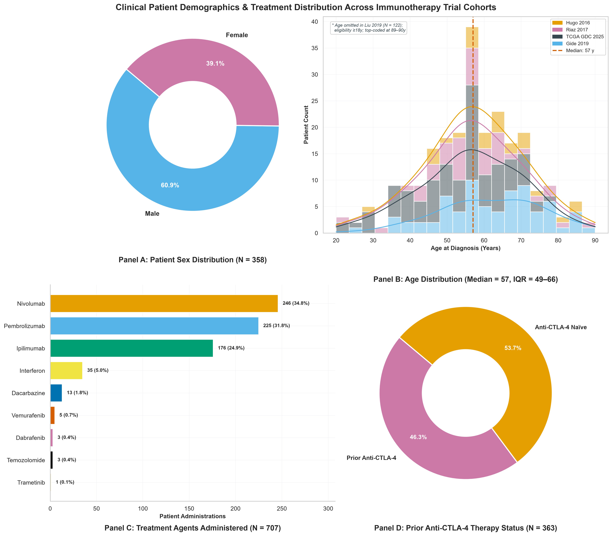
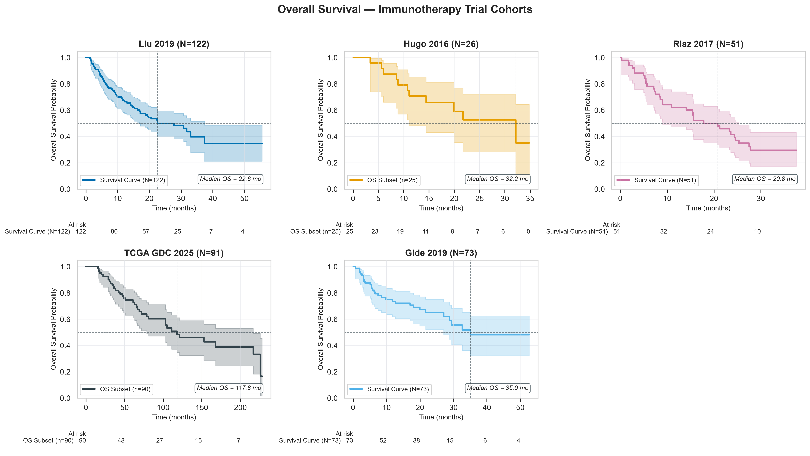
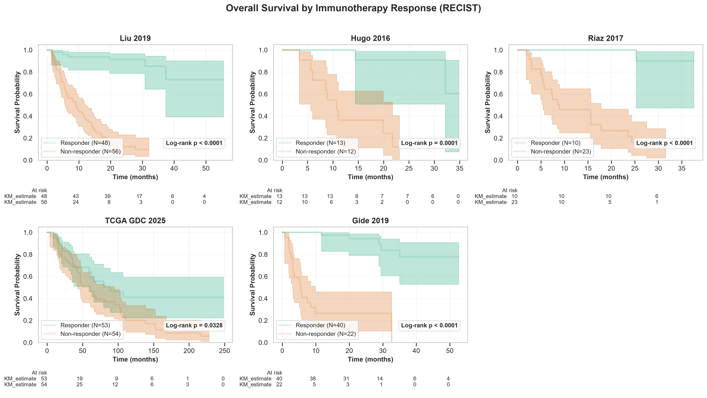

# Clinical Characteristics of Immunotherapy Data Cohorts

## 1. Baseline Patient and Disease Characteristics

> [!INFO] Why We Are Doing This
> - **What**: Compare patient demographics and survival across 5 trial cohorts.
> - **Why**: Identify potential demographic confounders before predictive modeling.
> - **Questions**: Are patient populations comparable across cohorts?

This report compares patient demographics across active trial cohorts:
- **[Liu 2019](https://www.cbioportal.org/study/summary?id=mel_iatlas_liu_2019)**: Anti-PD-1 (pembrolizumab / nivolumab) ($N = 122$).
- **[Hugo 2016](https://www.cbioportal.org/study/summary?id=mel_iatlas_hugo_ucla_2016)**: Anti-PD-1 (pembrolizumab) ($N = 26$).
- **[Riaz 2017](https://www.cbioportal.org/study/summary?id=mel_iatlas_riaz_nivolumab_2017)**: Anti-PD-1 (nivolumab) ($N = 51$).
- **[TCGA GDC 2025](https://www.cbioportal.org/study/summary?id=skcm_tcga_gdc)**: Heterogeneous IT-treated cohort (ipilimumab, vaccines, interferon +/- chemotherapy) ($N = 91$).
- **[Gide 2019](https://www.cbioportal.org/study/summary?id=mel_iatlas_gide_2019)**: Anti-PD-1 +/- anti-CTLA-4 (pembrolizumab / nivolumab +/- ipilimumab) ($N = 73$).

### 1.1 Clinical Demographics & Treatment Distributions

_**Figure 1: 2×2 Grid of Clinical Demographics and Treatment Histories.**_

#### Key Demographics & Treatment Insights

- **Panel A: Sex Distribution ($N = 358$)**: The overall trial cohort shows a male predominance (**60.9% Male** [$N = 218$] vs. **39.1% Female** [$N = 140$]), reflecting real-world melanoma incidence.
- **Panel B: Age Distribution across Studies**: Evaluated patient ages span from 20 to 90 years with a **median age of 57.0 years** (IQR: 48.8–66.2 years). Trial cohorts (`Hugo 2016`: median 61.5; `Riaz 2017`: median 56.0; `TCGA GDC 2025`: median 55.0; `Gide 2019`: median 62.0) display consistent age distributions.
- **Panel C: Treatment Agents Administered ($N = 707$)**: Most frequent agents are **Pembrolizumab** (225 [31.8%]), **Nivolumab** (246 [34.8%]), **Ipilimumab** (176 [24.9%]), **Vemurafenib** (5 [0.7%]).
- **Panel D: Prior Anti-CTLA-4 Therapy Status ($N = 363$)**: Across all patients, **46.3%** [$N = 168$] received prior ipilimumab, while **53.7%** [$N = 195$] were anti-CTLA-4 naïve.

_**Table 1: Baseline Patient Characteristics**_

| Characteristic                  | Liu 2019     | Hugo 2016        | Riaz 2017        | TCGA GDC 2025    | Gide 2019        | Total            |
|:--------------------------------|:-------------|:-----------------|:-----------------|:-----------------|:-----------------|:-----------------|
| **N**                           | 122          | 26               | 51               | 91               | 73               | 363              |
|                                 |              |                  |                  |                  |                  |                  |
| **Demographics**                |              |                  |                  |                  |                  |                  |
| Age, median (IQR)               | N/A          | 61.5 (55.0-68.8) | 56.0 (49.0-62.8) | 55.0 (44.5-62.5) | 62.0 (52.0-71.0) | 57.0 (48.8-66.2) |
| Female sex, n (%)               | 51 (41.8%)   | 8 (30.8%)        | 25 (54.3%)       | 30 (33.0%)       | 26 (35.6%)       | 140 (39.1%)      |
|                                 |              |                  |                  |                  |                  |                  |
| **Treatment Agents & Exposure** |              |                  |                  |                  |                  |                  |
| Agent — Pembrolizumab           | 122 (100.0%) | 26 (100.0%)      | 0 (0.0%)         | 4 (4.4%)         | 73 (100.0%)      | 225 (62.0%)      |
| Agent — Nivolumab               | 122 (100.0%) | 0 (0.0%)         | 51 (100.0%)      | 0 (0.0%)         | 73 (100.0%)      | 246 (67.8%)      |
| Agent — Ipilimumab              | 56 (45.9%)   | 0 (0.0%)         | 26 (51.0%)       | 21 (23.1%)       | 73 (100.0%)      | 176 (48.5%)      |
| Agent — Vemurafenib             | 0 (0.0%)     | 0 (0.0%)         | 0 (0.0%)         | 5 (5.5%)         | 0 (0.0%)         | 5 (1.4%)         |
| Agent — Dabrafenib              | 0 (0.0%)     | 0 (0.0%)         | 0 (0.0%)         | 3 (3.3%)         | 0 (0.0%)         | 3 (0.8%)         |
| Agent — Trametinib              | 0 (0.0%)     | 0 (0.0%)         | 0 (0.0%)         | 1 (1.1%)         | 0 (0.0%)         | 1 (0.3%)         |
| Agent — Dacarbazine             | 0 (0.0%)     | 0 (0.0%)         | 0 (0.0%)         | 13 (14.3%)       | 0 (0.0%)         | 13 (3.6%)        |
| Agent — Temozolomide            | 0 (0.0%)     | 0 (0.0%)         | 0 (0.0%)         | 3 (3.3%)         | 0 (0.0%)         | 3 (0.8%)         |
| Agent — Interferon              | 0 (0.0%)     | 0 (0.0%)         | 0 (0.0%)         | 35 (38.5%)       | 0 (0.0%)         | 35 (9.6%)        |
| Prior anti-CTLA-4 therapy       | 48 (39.3%)   | 0 (0.0%)         | 26 (51.0%)       | 21 (23.1%)       | 73 (100.0%)      | 168 (46.3%)      |
|                                 |              |                  |                  |                  |                  |                  |
| **Survival Outcomes**           |              |                  |                  |                  |                  |                  |
| Median OS, months (95% CI)      | 22.6         | 32.2             | 20.8             | 117.8            | 35.0             | 44.1             |
| OS events, n (%)                | 62 (50.8%)   | 11 (44.0%)       | 34 (66.7%)       | 37 (41.1%)       | 29 (39.7%)       | 173 (47.9%)      |
| Median follow-up, months        | 17.5         | 14.4             | 15.9             | 54.2             | 20.5             | 21.8             |

## 2. Sample Preprocessing Attrition

> [!INFO] Why We Are Doing This
> - **What**: We track sample retention through quality control across $N = 820$ initial records.
> - **Why**: Documenting attrition at each step verifies data integrity.
> - **Questions**: How many patients are retained for downstream analysis?

_**Table 2: Sample Attrition Across Preprocessing Steps**_

| Cohort        | Preprocessing Step           |   N Initial |   N Retained |   N Removed | Rationale                                                                                              |
|:--------------|:-----------------------------|------------:|-------------:|------------:|:-------------------------------------------------------------------------------------------------------|
| Liu 2019      | Clinical data loaded         |         122 |          122 |           0 | Merged patient-level and sample-level clinical records.                                                |
| Liu 2019      | Clinical data harmonised     |         122 |          122 |           0 | Applied identifier standardisation, clinical cleaning, baseline filtering, and variable harmonisation. |
| Liu 2019      | Expression data availability |         122 |          122 |           0 | Identified samples with matching RNA-seq gene expression data.                                         |
| Hugo 2016     | Clinical data loaded         |          27 |           27 |           0 | Merged patient-level and sample-level clinical records.                                                |
| Hugo 2016     | Clinical data harmonised     |          27 |           26 |           1 | Applied identifier standardisation, clinical cleaning, baseline filtering, and variable harmonisation. |
| Hugo 2016     | Expression data availability |          26 |           26 |           0 | Identified samples with matching RNA-seq gene expression data.                                         |
| Riaz 2017     | Clinical data loaded         |         107 |          107 |           0 | Merged patient-level and sample-level clinical records.                                                |
| Riaz 2017     | Clinical data harmonised     |         107 |           51 |          56 | Applied identifier standardisation, clinical cleaning, baseline filtering, and variable harmonisation. |
| Riaz 2017     | Expression data availability |          51 |           51 |           0 | Identified samples with matching RNA-seq gene expression data.                                         |
| TCGA GDC 2025 | Clinical data loaded         |         473 |          473 |           0 | Merged patient-level and sample-level clinical records.                                                |
| TCGA GDC 2025 | Clinical data harmonised     |         473 |          473 |           0 | Applied identifier standardisation and clinical data cleaning.                                         |
| TCGA GDC 2025 | Expression data availability |         473 |          472 |           1 | Identified samples with matching RNA-seq gene expression data.                                         |
| Gide 2019     | Clinical data loaded         |          91 |           91 |           0 | Merged patient-level and sample-level clinical records.                                                |
| Gide 2019     | Clinical data harmonised     |          91 |           73 |          18 | Applied identifier standardisation, clinical cleaning, baseline filtering, and variable harmonisation. |
| Gide 2019     | Expression data availability |          73 |           73 |           0 | Identified samples with matching RNA-seq gene expression data.                                         |

### Key Observations
1. **Overall Cohort Size ($N = 363$)**: Largest dataset is **Liu 2019** ($N = 122$). Combined across all 5 cohorts, **$N = 744$** cleaned records were harmonised.
2. **Sample Attrition (90.7% Retention)**: Across all 820 initial records, ****Liu 2019** retained 100% of samples (N = 122); **Hugo 2016** lost **1** sample(s) (27 → 26); **Riaz 2017** lost **56** sample(s) (107 → 51); **TCGA GDC 2025** lost **1** sample(s) (473 → 472); **Gide 2019** lost **18** sample(s) (91 → 73)**.
3. **Follow-up Duration**: **TCGA GDC 2025** displays median follow-up of **54.2 months**.
4. **Treatment History**: Enrolled cohorts represent diverse treatment contexts across Liu 2019, Hugo 2016, Riaz 2017, TCGA GDC 2025, Gide 2019.

## 3. Overall Survival Curves (KM Plots)

> [!INFO] Why We Are Doing This
> - **What**: We plot unstratified Kaplan-Meier OS curves for each of the 5 active trial cohorts.
> - **Why**: Visualising baseline mortality rates establishes the clinical context for each dataset.
> - **Questions**: How does overall survival compare across independent immunotherapy trial cohorts?

_**Figure 2: Unstratified Overall Survival KM Curves across All 5 Immunotherapy Trial Cohorts.**_

## 4. Overall Survival Stratified by Immunotherapy Response

> [!INFO] Why We Are Doing This
> - **What**: We stratify KM overall survival curves by RECIST response status ($N = 363$).
> - **Why**: Confirming that responders experience significantly longer OS validates RECIST response as a surrogate endpoint.
> - **Questions**: Does RECIST response reliably distinguish durable long-term benefit?

_**Figure 3: Overall Survival Stratified by RECIST Response Status.**_

> [!INSIGHT] Key Insights: Survival Stratification by Response
> 1. **Survival Benefit**: Responders (CR/PR) achieve significantly longer OS vs non-responders (PD) (Liu 2019, Hugo 2016, Riaz 2017, TCGA GDC 2025, Gide 2019; Log-rank $p < 0.0001$).
> 2. **Surrogate Validation**: Objective RECIST response is a robust surrogate endpoint for overall survival.

## 5. Technical Analysis Notes

> [!WARNING] Methodological Limitations & Analytical Scope
> - **Unstratified Analysis**: All KM curves are unstratified and descriptive.
> - **Exclusion Criteria**: Excluded missing survival time, missing event status, or survival time ≤ 0.
> - **Median OS Reporting**: Median OS is reported as **NR (not reached)** where survival probability remained above 50%.

---

> [!formula]+ Clinical Analysis Script Execution & Software Module Architecture
>
> - [`run_clinical_analysis.py`](../../scripts/pillar_1_cohort_preprocessing/run_clinical_analysis.py): Generates baseline demographic grids, attrition metrics, cohort characteristics tables, Kaplan-Meier OS curves, and writes `cohort_characteristics_clinical.md`.
> - [`clean_data.py`](../../scripts/pillar_1_cohort_preprocessing/clean_data.py): Preprocesses raw cohort clinical metadata and RNA-seq expression profiles into cleaned CSV matrices.
> - [`merge_datasets.py`](../../scripts/pillar_1_cohort_preprocessing/merge_datasets.py): Merges processed expression matrices across cohorts into harmonised pooled matrices (`expr_merged.csv`, `clin_merged.csv`).
> - [`data_loaders.py`](../../src/data_loaders.py): Provides `load_cohort_by_name` (canonical dynamic entry point — resolves any cohort from `datasets.yaml` without code changes), `load_dataset_by_config`, `load_all_active_cohorts`, and `load_merged_immunotherapy`. Legacy per-cohort shims are retained for backwards compatibility.
> - [`styles.py`](../../../src/styles.py): Single source of truth for Okabe-Ito colour palettes (`COHORT_PALETTE`, `RESPONSE_PALETTE`) and visualisation presentation style.
