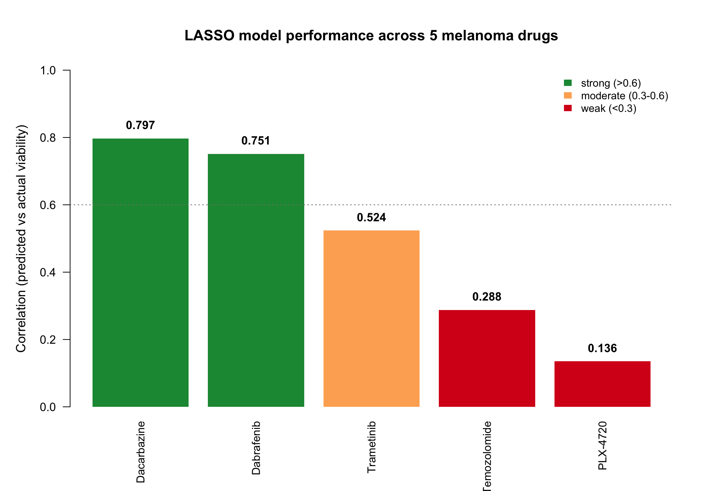
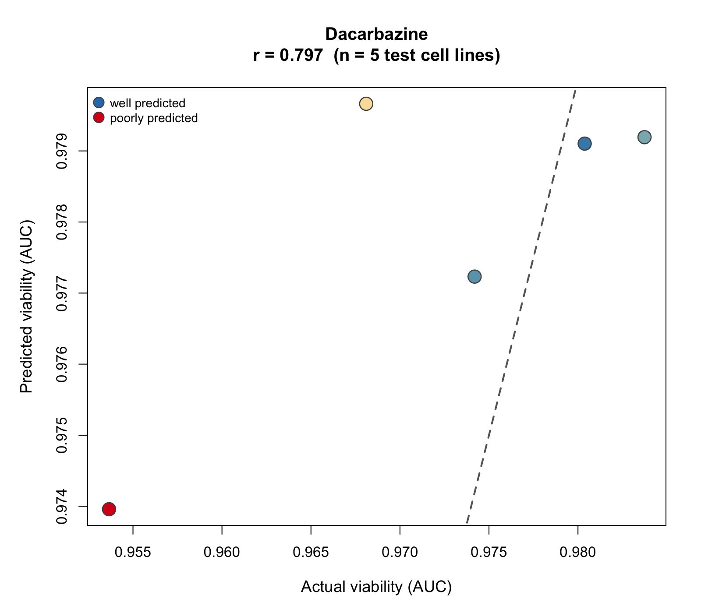
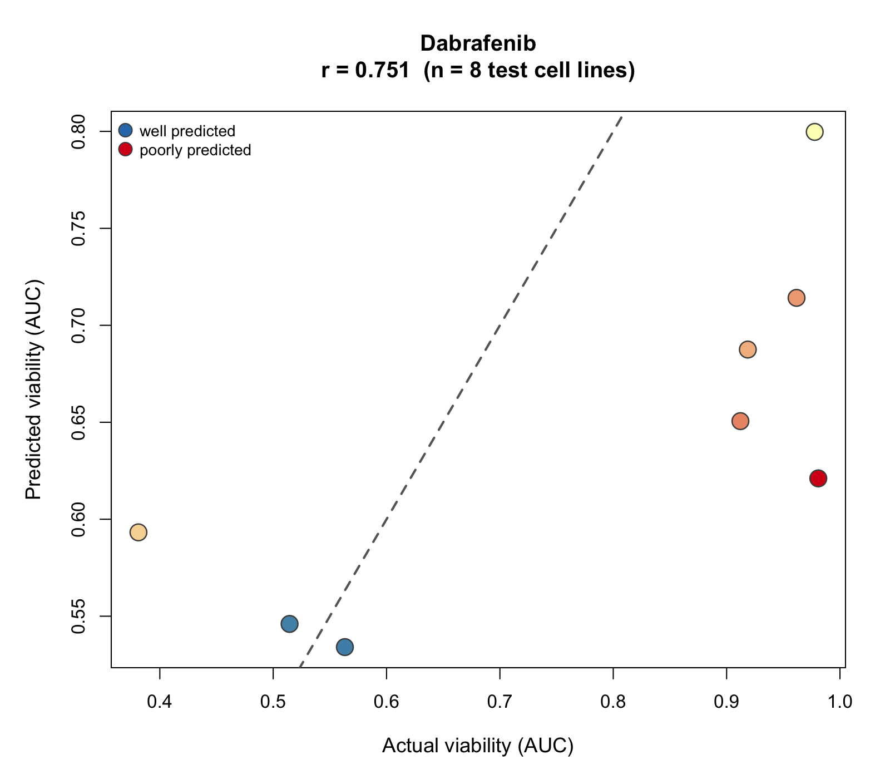
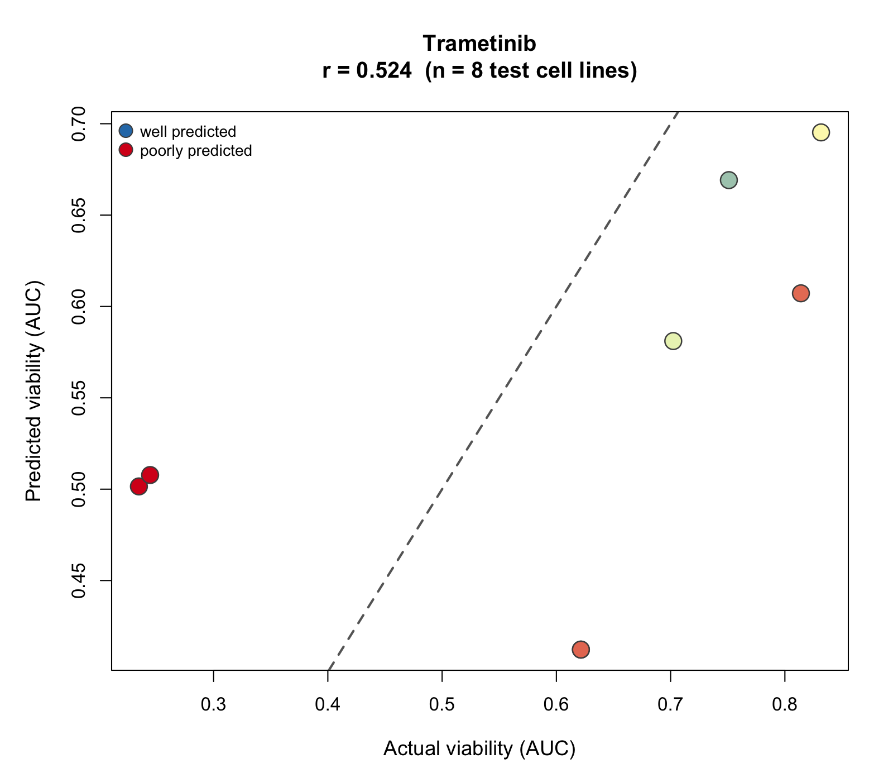
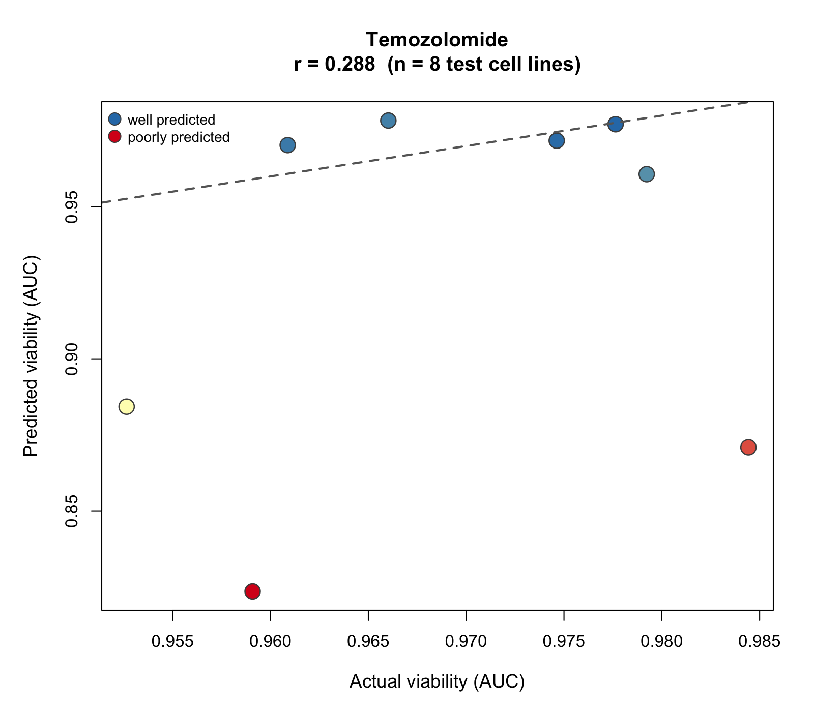
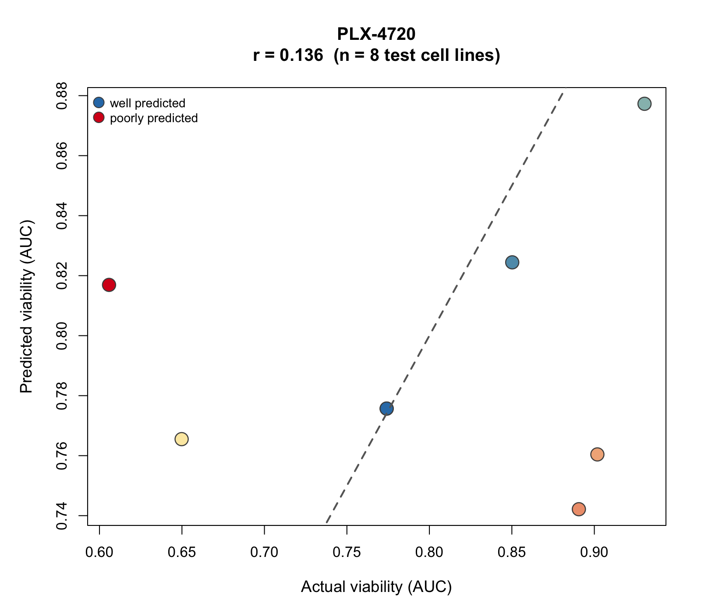

# Question 2 — Cell Viability Predictor: Results and Interpretation

## What this question asked

Question 2 asked whether a predictor of cell viability under standard-of-care drug treatment could be built, and whether that predictor correlates with the immunotherapy response predictor from Question 1.

## Approach

I used drug response data (AUC) from GDSC2 alongside gene expression data (log2(TPM+1)) from DepMap, restricted to melanoma cell lines. For each drug, a LASSO regression model (`glmnet`, alpha = 1) was trained to predict viability from gene expression, using an 80/20 train/test split. LASSO was chosen because it performs variable selection as well as regression — with roughly 19,000 candidate genes and fewer than 40 cell lines per drug, a method that shrinks most coefficients to zero is essential.

Dabrafenib and PLX-4720 were used as the two BRAF-inhibitor proxies for the core analysis. Dabrafenib is an FDA-approved clinical BRAF inhibitor; PLX-4720 is a research-grade preclinical analogue of vemurafenib, included because vemurafenib itself was not present in GDSC2. The panel was later expanded to three further drugs available in the same dataset — Trametinib (MEK inhibitor), and Temozolomide and Dacarbazine (chemotherapy agents).

## Model performance across five drugs

| Drug | Drug class | Cell lines | Correlation (predicted vs actual viability) |
|---|---|---|---|
| Dacarbazine | Chemotherapy | 24 | 0.797 |
| Dabrafenib | BRAF inhibitor | 37 | 0.751 |
## Model performance across five drugs

| Drug | Drug class | Cell lines | Test-set actual viability range | Correlation (r) |
|---|---|---|---|---|
| Dacarbazine | Chemotherapy | 24 | 0.954 – 0.984 (0.03) | 0.797 |
| Dabrafenib | BRAF inhibitor | 37 | 0.38 – 0.98 (0.60) | 0.751 |
| Trametinib | MEK inhibitor | 39 | 0.23 – 0.83 (0.60) | 0.524 |
| Temozolomide | Chemotherapy | 39 | 0.953 – 0.985 (0.03) | 0.288 |
| PLX-4720 | BRAF inhibitor | 39 | 0.61 – 0.93 (0.33) | 0.136 |

Correlation alone gives a misleading ranking here, and the scatter plots make clear why. The final column reports how much the actual viability values varied within each drug's test set — and this varies by a factor of twenty across drugs.

**The two chemotherapy agents have almost no variation to predict.** For Dacarbazine and Temozolomide, every test cell line has an AUC of roughly 0.97, meaning the drug killed almost none of them. A correlation calculated across a range of 0.03 AUC units is measuring the ordering of near-identical values, not genuine predictive ability. Dacarbazine's headline 0.797 — nominally the best result in the panel — is produced from only five test cell lines within that compressed range, and inspection of Figure 2 shows a single low-lying point contributing most of the apparent relationship. It should not be interpreted as the strongest model.

**This pattern is biologically expected.** Melanoma is well known to respond poorly to dacarbazine and temozolomide in vitro, so AUC values cluster near 1.0 with little between-line variation. The targeted agents behave differently: BRAF and MEK inhibitors produce genuinely differential response across cell lines, largely reflecting BRAF mutation status, which is why Dabrafenib and Trametinib show a viability range of 0.60 AUC units.

**On this basis Dabrafenib is the most trustworthy model in the panel.** Its correlation of 0.751 is earned across a wide spread of real outcomes, making it the only result that supports a claim about predictive ability with reasonable confidence. Trametinib (0.524, same wide range) is a credible moderate result. PLX-4720 performs poorly (0.136) despite an intermediate outcome range, so its weakness is a genuine model failure rather than a range artifact — notable given that it targets the same pathway as Dabrafenib, and most likely reflecting inconsistency in the underlying screening data for this research-grade compound rather than a real biological difference between the two drugs.

*Figure 1. LASSO model performance across five melanoma drugs, ordered by correlation. Bars are colour-coded by performance band (green ≥0.6, amber 0.3–0.6, red <0.3). Note that this ordering reflects correlation only and does not account for differences in outcome range between drugs — see discussion above.*

Individual model behaviour is shown in **Figures 2–6**, which plot predicted against actual viability for each drug's held-out test set. Points are colour-coded by prediction error and the dashed diagonal marks perfect prediction. Two features are visible across the panel. First, the compressed x-axis ranges for Dacarbazine and Temozolomide (Figures 2 and 5) relative to the targeted agents. Second, predicted values consistently span a narrower range than actual values, leaving points systematically off the diagonal — this is the expected effect of LASSO shrinkage, which pulls coefficients toward zero and therefore pulls predictions toward the training mean. The models capture relative ordering better than absolute magnitude.

*Figure 2. Predicted vs actual viability, Dacarbazine (r = 0.797, n = 5). Note the narrow x-axis range: all test cell lines fall between 0.954 and 0.984 AUC. The apparent correlation rests largely on the single low point at bottom left.*

*Figure 3. Predicted vs actual viability, Dabrafenib (r = 0.751, n = 8). Actual viability spans 0.38–0.98, giving the model genuine variation to predict. Predictions rise with actual viability but are compressed toward the mean, sitting below the diagonal at the high end.*

*Figure 4. Predicted vs actual viability, Trametinib (r = 0.524, n = 8). The two resistant cell lines at bottom left are correctly identified as low-viability; the scatter among the more sensitive lines accounts for the moderate correlation.*

*Figure 5. Predicted vs actual viability, Temozolomide (r = 0.288, n = 8, fitted with seed 456). As with Dacarbazine, actual viability is confined to a narrow band near 0.97.*

*Figure 6. Predicted vs actual viability, PLX-4720 (r = 0.136, n = 8). Despite a reasonable spread in actual viability (0.61–0.93), predicted values show no consistent relationship with it — the model has not learned a usable signal.*

## Applying the models to real patients

The two BRAF-inhibitor models were applied to 70 TCGA-SKCM patients. TCGA-SKCM was chosen because, unlike the Liu (2019), Hugo (2016) and Riaz (2017) cohorts, it does not carry formal immunotherapy trial response data — making it the appropriate comparison group. Patients were selected at cohort level rather than by individual treatment history, for reasons set out in the limitations below.

Applying the models required aligning two datasets that were not directly compatible: the TCGA expression file is arranged with genes as rows and patients as columns (the opposite of the model's expected input), and reports raw RSEM values rather than the log2(TPM+1) scale the models were trained on. Both were corrected before scoring. Gene naming also differed between sources — DepMap appends Entrez IDs to gene symbols, and one selected gene (CEP104) appears in TCGA under its older symbol, KIAA0562. After these corrections, all model genes matched successfully (24/24 for Dabrafenib, 11/11 for PLX-4720).

## Correlation with the Question 1 predictor

Predicted viability scores were then correlated against the predicted immunotherapy response scores from Question 1, across the same 70 patients:

| Comparison | Correlation |
|---|---|
| Dabrafenib predicted viability vs predicted immunotherapy response | -0.178 |
| PLX-4720 predicted viability vs predicted immunotherapy response | -0.004 |

The Dabrafenib comparison shows a weak negative correlation. Because higher AUC indicates greater cell survival (i.e. poorer drug response), a negative correlation means patients predicted to respond well to BRAF inhibition also tended to be predicted as better immunotherapy responders. The effect is weak, however, and should not be over-interpreted. The PLX-4720 comparison shows essentially no relationship, which is consistent with how poorly its underlying model performed — an unreliable predictor cannot be expected to correlate meaningfully with anything.

The most cautious reading is the correct one: this is a comparison between two sets of *predictions*, not between measured clinical outcomes. A weak correlation here indicates that the two models are drawing on largely independent gene signals, which is unsurprising given that BRAF-inhibitor sensitivity and immunotherapy response operate through different biological mechanisms.

## Stability of gene selection

Because LASSO selection can be unstable when predictors vastly outnumber samples, the Dabrafenib model was refit across five random train/test splits. Test-set correlation ranged from -0.293 to 0.751 (mean 0.276), confirming that performance is highly sensitive to which cell lines land in the training set. Four genes — ABRA, NINL, PTER and TRPM3 — were selected in at least three of the five splits, making them the most consistently informative features and the most plausible candidates for real signal rather than noise.

One split returned an undefined correlation because the model predicted an identical value for every test-set cell line, leaving no variance for the correlation to measure. The same occurred for Temozolomide under the default split; a different random seed was used for that drug to obtain a valid estimate. Both cases are consequences of very small test sets rather than errors in the pipeline.

## Limitations

- **Sample size.** Between 24 and 39 cell lines per drug against roughly 19,000 candidate genes, leaving test sets of only 5–8 lines. This is the dominant constraint on everything above, and the direct cause of the unstable gene selection, the wide correlation range across seeds, and the undefined correlations described above.
- **Outcome range differs substantially between drugs.** Correlation is not comparable across drugs whose outcomes vary by very different amounts. For Dacarbazine and Temozolomide, test-set viability spans only about 0.03 AUC units, so their correlations are not meaningful measures of predictive ability regardless of the value obtained. Any cross-drug comparison of model performance must take this into account, and the bar chart in Figure 1 should not be read on its own.
- **Predictions are compressed toward the mean.** LASSO shrinkage pulls coefficients toward zero, so predicted viability spans a narrower range than actual viability in every model (visible in Figures 2–6 as points sitting systematically off the diagonal). The models are therefore more informative about relative ordering of cell lines than about absolute viability values.
- **Cohort definition.** Patients were selected at cohort level — all TCGA-SKCM patients with available expression data (n=70) — rather than by individual treatment history. This was necessary because the two available clinical fields disagreed: the Question 1 response-score file lists `ACTUAL_RESPONSE` as "N/A (Untreated Cohort)" for every TCGA-SKCM patient, while `TREATMENT_RECEIVED` indicates that some of those same patients did receive immunotherapy. The merged clinical file was also of limited help here, as its `IMMUNOTHERAPY` column is set to 1 for all patients uniformly. This inconsistency could not be resolved within the timeframe of the analysis, so the cohort-level filter was applied as the more transparent option. Two duplicate patient records were also identified and removed before merging. Any conclusions drawn about this cohort should be read with that ambiguity in mind.
- **Predictions, not outcomes.** The correlation with Question 1 compares two model outputs. Neither has been validated against measured drug response in patients.
- **Cell lines are an imperfect proxy.** Cultured melanoma lines lack the immune infiltrate, stromal context and tumour heterogeneity that shape real treatment response — particularly relevant when comparing against an immunotherapy predictor, since immunotherapy acts through the immune microenvironment that cell-line models by definition do not have.
- **Cross-validation warnings.** Several models produced `grouped=FALSE enforced` warnings from `cv.glmnet`, reflecting folds containing fewer than three observations. In these cases glmnet pools predictions across folds instead of averaging within-fold errors. This is an automatic adjustment and does not invalidate the fitted models.
- **Expanded panel is exploratory.** Trametinib, Temozolomide and Dacarbazine have cell-line models only; they were not applied to patient data or correlated with Question 1, as this fell outside the scope of the question.

## Conclusion

A predictor of cell viability was successfully built for standard-of-care melanoma drugs. Correlations ranged from 0.797 down to 0.136, but the more important finding is that raw correlation is a poor basis for comparing these models. Once the range of actual viability within each test set is taken into account, the two chemotherapy agents (Dacarbazine, Temozolomide) drop out of contention entirely — their test cell lines are almost uniformly resistant, leaving virtually no variation to predict, so their correlations are artifacts of a compressed outcome range rather than evidence of predictive skill. This is consistent with the known in vitro resistance of melanoma to these agents.

The defensible result is Dabrafenib (r = 0.751), obtained across a viability range of 0.60 AUC units, with Trametinib (0.524) as a credible secondary result. PLX-4720's poor performance (0.136) appears to be a genuine model failure rather than a range artifact.

Applied to 70 TCGA-SKCM patients, predicted BRAF-inhibitor viability showed only a weak negative correlation with predicted immunotherapy response (-0.178 for Dabrafenib), and none for PLX-4720.

The answer to the question as posed is therefore a qualified one: yes, viability can be predicted from gene expression, and reasonably well for BRAF- and MEK-targeted agents where genuine differential response exists — but the resulting predictions do not correlate strongly with predicted immunotherapy response. Given that the two treatment modalities act through distinct mechanisms, this is a plausible result rather than a failure of the method. The main constraint throughout is sample size: with test sets of five to eight cell lines, any future extension of this work would benefit far more from additional cell lines than from further methodological refinement.

## Figures

All figure image files are in `plots/`. In Figures 2–6, each point is one held-out test cell line; point colour indicates prediction error (blue = accurate, red = inaccurate) and the dashed diagonal marks perfect prediction.

## Output files

| File | Contents |
|---|---|
| `q2_model_coefficients.csv` | Gene coefficients for all five models (Drug_Name, Gene_Symbol, Lasso_Weight), 71 rows |
| `important_genes_<drug>.csv` | Per-drug gene coefficients as saved directly by the model |
| `q2_patient_drug_predictions.csv` | Predicted Dabrafenib and PLX-4720 viability scores for the 70 TCGA-SKCM patients |
| `q2_correlation_results.csv` | Merged predicted viability and Question 1 response scores, as used for the correlation analysis |
